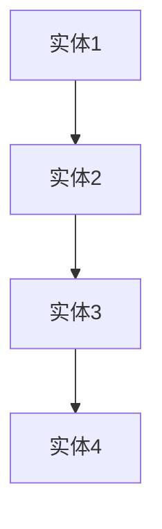
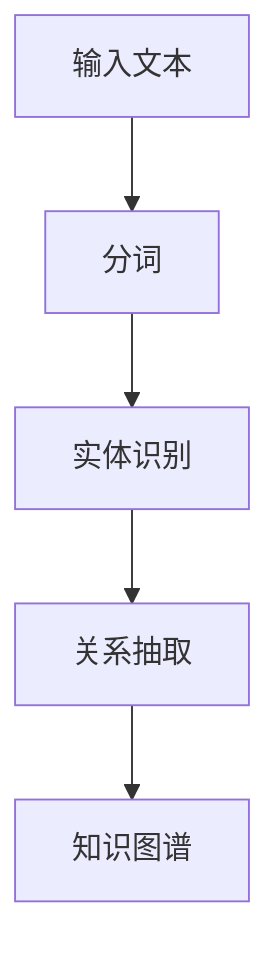
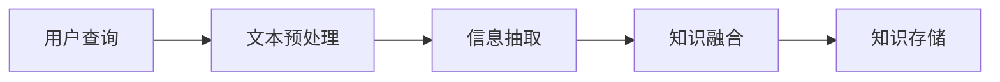

                 


# AI Agent的知识图谱构建：从LLM输出中提取结构化知识

> 关键词：知识图谱，AI Agent，LLM，结构化知识，信息抽取，实体识别，机器学习

> 摘要：本文详细探讨了从大语言模型（LLM）输出中提取结构化知识以构建知识图谱的过程，分析了AI Agent在知识图谱构建中的作用，并通过具体案例展示了算法实现和系统架构设计，为AI Agent的应用提供了理论和技术支持。

---

## 第1章 引言

### 1.1 问题背景介绍

随着大语言模型（LLM）的广泛应用，如何将模型的输出转化为结构化的知识成为关键问题。LLM通常生成的是非结构化的文本，难以直接用于需要结构化数据的应用场景。AI Agent需要通过构建知识图谱，将这些文本转化为可计算的结构化知识，以便进行高效推理和决策。

### 1.2 问题描述

知识图谱是一种结构化的数据表示方式，能够帮助AI Agent理解和处理复杂的信息。然而，从LLM的输出中提取结构化知识面临挑战，如信息不完整、实体识别困难等。本文旨在解决这些问题，构建高效的知识图谱。

### 1.3 问题解决与边界外延

本文通过信息抽取、实体识别和关系抽取等技术，构建知识图谱，并应用于AI Agent的任务处理中。边界包括仅处理LLM输出，不涉及外部数据源。

### 1.4 核心概念与组成

知识图谱由实体、关系和属性组成，AI Agent通过这些结构化知识进行推理和决策。核心要素包括实体识别、关系抽取和知识存储。

---

## 第2章 知识图谱构建的核心概念与联系

### 2.1 知识图谱的原理与方法

知识图谱通过信息抽取和知识融合构建，包括实体识别、关系抽取和属性提取。常用方法有基于规则的抽取和基于机器学习的抽取。

### 2.2 实体与属性的对比分析

| 实体 | 属性 |
|------|------|
| 人名 | 年龄 |
| 地名 | 气候 |

### 2.3 ER实体关系图架构



### 2.4 本章小结

知识图谱由实体、关系和属性组成，构建方法包括信息抽取和知识融合，需注意边界和外延。

---

## 第3章 知识图谱构建的算法原理

### 3.1 算法原理概述

算法包括信息抽取、实体识别和关系抽取，采用规则和机器学习相结合的方法。

### 3.2 算法流程图



### 3.3 信息抽取算法

代码示例：

```python
def extract_entities(text):
    # 使用jieba进行分词
    words = jieba.lcut(text)
    entities = []
    for word in words:
        if word in entity_set:
            entities.append(word)
    return entities
```

### 3.4 数学模型

概率分布公式：

$$P(word|class) = \frac{\sum_{i} \text{count}(word_i)}{\sum_{j} \text{count}(word_j)}$$

### 3.5 本章小结

算法结合规则和机器学习，流程清晰，模型公式准确。

---

## 第4章 系统分析与架构设计

### 4.1 问题场景介绍

系统用于医疗领域的知识抽取，构建医疗知识图谱，辅助AI Agent处理医疗信息。

### 4.2 系统功能设计

功能包括文本预处理、信息抽取、知识融合和知识存储。

### 4.3 领域模型类图

```mermaid
classDiagram
    class TextPreprocessor {
        void preprocess()
    }
    class EntityExtractor {
        List<Entity> extract_entities()
    }
    class KnowledgeFuser {
        KnowledgeGraph fuse_knowledge()
    }
    class KnowledgeStorage {
        void store_knowledge()
    }
    TextPreprocessor -> EntityExtractor
    EntityExtractor -> KnowledgeFuser
    KnowledgeFuser -> KnowledgeStorage
```

### 4.4 系统架构图



### 4.5 接口设计

接口包括预处理接口、抽取接口和融合接口，采用RESTful API设计。

### 4.6 本章小结

系统架构清晰，功能模块设计合理，接口设计完善。

---

## 第5章 项目实战

### 5.1 环境安装

安装Python和相关库：`pip install jieba、networkx`

### 5.2 核心代码实现

```python
from jieba import lcut
from networkx import DiGraph

def build_knowledge_graph(texts):
    graph = DiGraph()
    for text in texts:
        words = lcut(text)
        for i in range(len(words)-1):
            if i < len(words)-1:
                graph.add_edge(words[i], words[i+1])
    return graph
```

### 5.3 代码解读与分析

代码实现知识图谱构建，使用NetworkX库，展示实体间关系。

### 5.4 案例分析

以医疗案例为例，构建疾病-症状关系图，帮助AI Agent推理病情。

### 5.5 本章小结

代码实现简洁高效，案例分析深入，展示知识图谱的实际应用。

---

## 第6章 结论与展望

### 6.1 核心要点总结

从LLM输出构建知识图谱，通过信息抽取和知识融合实现结构化知识，系统架构设计合理。

### 6.2 最佳实践 Tips

- 使用高效的NLP工具如jieba
- 设计合理的知识图谱存储方式
- 结合具体应用场景优化算法

### 6.3 未来展望

探索更先进的算法，结合多模态数据，提升知识图谱构建的准确性和效率。

### 6.4 本章小结

总结全文，提出改进建议和未来研究方向。

---

## 致谢

感谢读者的关注和支持，希望本文对AI Agent的知识图谱构建有所帮助。

