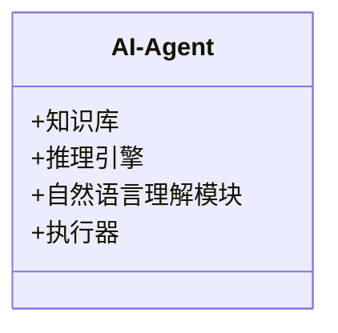
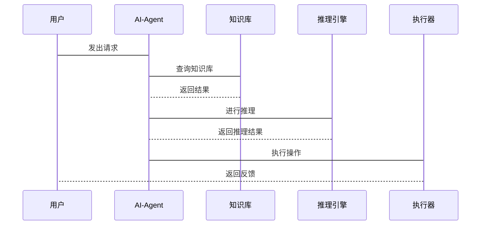

                 


# AI Agent的知识整合：融合LLM与专家系统

> 关键词：AI Agent，知识整合，LLM，专家系统，大语言模型，知识图谱，符号逻辑推理

> 摘要：本文探讨了AI Agent的知识整合问题，重点分析了如何将大语言模型（LLM）与专家系统相结合，以提升AI Agent的性能和可解释性。通过详细阐述两者的融合原理、系统架构设计和实际应用案例，本文为构建更加智能和可靠的AI Agent提供了理论支持和实践指导。

---

## 第1章 AI Agent的基本概念与背景

### 1.1 AI Agent的定义与特点

#### 1.1.1 AI Agent的定义
AI Agent（人工智能代理）是指能够感知环境、自主决策并执行任务的智能实体。它通过传感器获取信息，利用推理能力做出决策，并通过执行器与环境交互。AI Agent可以是软件程序，也可以是机器人等物理实体。

#### 1.1.2 AI Agent的核心特点
1. **自主性**：能够在没有外部干预的情况下自主运行。
2. **反应性**：能够实时感知环境变化并做出相应反应。
3. **主动性**：能够主动采取行动以实现目标。
4. **社会性**：能够与其他AI Agent或人类进行协作或竞争。

#### 1.1.3 AI Agent与传统AI的区别
传统的AI系统通常专注于单一任务，而AI Agent具备更强的自主性和适应性，能够应对复杂多变的环境。

### 1.2 问题背景与应用前景

#### 1.2.1 当前AI技术的局限性
- **知识孤岛问题**：传统AI系统往往局限于特定领域，难以跨领域应用。
- **可解释性不足**：复杂的模型（如深度学习模型）通常缺乏可解释性，难以满足某些场景的需求。
- **动态环境适应性差**：AI系统在动态变化的环境中往往难以快速调整策略。

#### 1.2.2 知识整合的需求
为了应对上述挑战，AI Agent需要整合多种技术，例如将大语言模型（LLM）的自然语言处理能力与专家系统的知识推理能力相结合。

#### 1.2.3 AI Agent在企业级应用中的潜力
AI Agent可以在企业级应用中发挥重要作用，例如智能客服、自动化运维、智能决策支持等。

### 1.3 LLM与专家系统的核心概念

#### 1.3.1 大语言模型（LLM）的定义
大语言模型是指基于深度学习技术训练的大型语言模型，例如GPT系列、BERT系列等。这些模型能够理解和生成自然语言文本，具备强大的文本处理能力。

#### 1.3.2 专家系统的定义与特点
专家系统是一种基于知识规则的AI系统，通过预定义的知识库和推理引擎来模拟专家的决策过程。其特点是知识表示清晰、推理过程可解释性强。

#### 1.3.3 LLM与专家系统的优缺点对比
| 特性                | LLM                          | 专家系统                    |
|---------------------|------------------------------|-----------------------------|
| 知识表示方式          | 基于概率和统计               | 基于符号逻辑和规则         |
| 可解释性              | 较低                         | 较高                       |
| 适应性                | 高                           | 较低                       |
| 学习能力              | 强大                         | 较弱                       |

---

## 第2章 LLM的核心原理

### 2.1 大语言模型的数学模型

#### 2.1.1 概率图模型
大语言模型通常基于概率图模型构建，例如马尔可夫链、贝叶斯网络等。模型通过计算条件概率来预测下一个词的概率分布。

#### 2.1.2 变量关系与条件概率
变量之间的关系可以通过条件概率公式表示：
$$ P(y|x) = \frac{P(x,y)}{P(x)} $$

#### 2.1.3 模型训练的数学公式
大语言模型的训练目标是最小化预测错误，通常采用交叉熵损失函数：
$$ \mathcal{L} = -\sum_{i=1}^{n} \log P(y_i|x_i) $$

### 2.2 LLM的算法实现

#### 2.2.1 基于Transformer的架构
Transformer模型由编码器和解码器组成，通过自注意力机制捕捉文本中的长程依赖关系。

#### 2.2.2 注意力机制的数学公式
自注意力机制的计算公式为：
$$ \text{Attention}(Q,K,V) = \text{softmax}\left(\frac{QK^T}{\sqrt{d_k}}\right)V $$

#### 2.2.3 梯度下降与优化算法
常用的优化算法包括随机梯度下降（SGD）、Adam优化器等。

### 2.3 LLM的局限性与改进方向

#### 2.3.1 知识整合的挑战
- LLM的知识表示不够结构化，难以与专家系统的规则库直接融合。
- LLM的推理能力有限，难以处理复杂的逻辑推理问题。

#### 2.3.2 模型的可解释性问题
- LLM的决策过程通常难以解释，影响其在高风险场景中的应用。

#### 2.3.3 性能优化的方向
- 优化模型的计算效率，例如通过并行计算、模型剪枝等技术。
- 提升模型的可解释性，例如通过可视化工具分析模型的决策过程。

---

## 第3章 专家系统的原理与实现

### 3.1 专家系统的知识表示

#### 3.1.1 知识库的构建
专家系统的核心是知识库，通常包括事实、规则和案例库。

#### 3.1.2 规则表示法
规则通常采用逻辑表达式表示，例如：
$$ \text{如果 } P \text{ 且 } Q \text{，则 } R $$

#### 3.1.3 框架表示法
框架表示法通过预定义的框架描述知识，例如：
$$ \text{患者}(张三, \text{年龄}=30) $$

### 3.2 专家系统的推理机制

#### 3.2.1 基于规则的推理
基于规则的推理通过匹配事实和规则库中的规则来推导结论。

#### 3.2.2 基于概率的推理
概率推理通常采用贝叶斯网络计算条件概率。

#### 3.2.3 基于逻辑的推理
逻辑推理通过谓词逻辑和规则库推导出结论。

### 3.3 专家系统的实现步骤

#### 3.3.1 知识获取
通过专家访谈、文献分析等方式获取领域知识。

#### 3.3.2 推理机设计
设计推理算法，例如基于规则的推理引擎。

#### 3.3.3 用户界面设计
开发友好的用户界面，方便用户与系统交互。

---

## 第4章 LLM与专家系统的融合方法

### 4.1 融合的必要性与目标

#### 4.1.1 LLM与专家系统的互补性
- LLM擅长自然语言处理和模式识别。
- 专家系统擅长逻辑推理和知识表示。

#### 4.1.2 融合的目标与意义
通过融合两种技术，可以实现自然语言处理与逻辑推理的结合，提升AI Agent的综合能力。

### 4.2 融合方法的具体实现

#### 4.2.1 知识表示的融合
将专家系统的规则库嵌入到LLM的知识图谱中。

#### 4.2.2 推理机制的结合
在LLM的基础上引入专家系统的推理引擎，增强系统的推理能力。

#### 4.2.3 交互界面的统一
设计统一的交互界面，方便用户与AI Agent进行交互。

### 4.3 融合的优势

#### 4.3.1 提高可解释性
通过引入专家系统的规则，提升AI Agent的决策透明度。

#### 4.3.2 增强推理能力
结合LLM的自然语言处理能力和专家系统的逻辑推理能力，提升系统的综合推理能力。

#### 4.3.3 适应复杂场景
融合后的系统能够更好地应对复杂多变的环境。

---

## 第5章 系统分析与架构设计

### 5.1 问题场景介绍

#### 5.1.1 需求分析
设计一个具备自然语言理解和逻辑推理能力的AI Agent。

#### 5.1.2 功能需求
- 自然语言理解
- 逻辑推理
- 知识库管理
- 用户交互

### 5.2 系统功能设计

#### 5.2.1 领域模型设计
使用Mermaid图展示领域模型，例如：



#### 5.2.2 系统架构设计
使用Mermaid图展示系统架构，例如：

```mermaid
container 容器 {
    AI-Agent
    知识库
    推理引擎
    自然语言理解模块
    执行器
}
```

#### 5.2.3 系统接口设计
定义系统接口，例如：
- 接收用户输入
- 返回处理结果

#### 5.2.4 系统交互设计
使用Mermaid图展示系统交互流程，例如：



---

## 第6章 项目实战

### 6.1 环境安装

#### 6.1.1 安装Python
```bash
python --version
pip install --upgrade pip
```

#### 6.1.2 安装必要的库
```bash
pip install numpy
pip install pandas
pip install transformers
```

### 6.2 系统核心实现源代码

#### 6.2.1 知识库的构建
```python
class KnowledgeBase:
    def __init__(self):
        self.knowledge = {}

    def add_fact(self, fact):
        self.knowledge[fact] = True
```

#### 6.2.2 推理引擎的设计
```python
class ReasoningEngine:
    def __init__(self, knowledge_base):
        self.knowledge_base = knowledge_base

    def infer(self, premises):
        # 简单的逻辑推理示例
        if all(p in self.knowledge_base.knowledge for p in premises):
            return True
        else:
            return False
```

#### 6.2.3 自然语言理解模块的实现
```python
from transformers import pipeline

nlp = pipeline("text-classification", model="bert-base")
```

### 6.3 代码应用解读与分析

#### 6.3.1 知识库的构建
通过`KnowledgeBase`类实现知识库的构建，支持添加事实和查询知识。

#### 6.3.2 推理引擎的设计
`ReasoningEngine`类通过预定义的前提进行逻辑推理，返回推理结果。

#### 6.3.3 自然语言理解模块的实现
使用预训练的BERT模型实现文本分类任务。

### 6.4 实际案例分析

#### 6.4.1 案例背景
设计一个智能客服系统，帮助用户解答技术问题。

#### 6.4.2 系统实现
结合上述代码，构建一个智能客服系统。

#### 6.4.3 详细分析
分析系统的各个模块，解释它们如何协同工作。

### 6.5 项目小结

#### 6.5.1 项目总结
通过本项目，我们实现了将LLM与专家系统相结合的AI Agent。

#### 6.5.2 项目收获
掌握了AI Agent的知识整合方法，提升了系统的综合能力。

---

## 第7章 总结与展望

### 7.1 总结

#### 7.1.1 核心内容回顾
本文详细探讨了AI Agent的知识整合问题，分析了LLM与专家系统的融合方法。

#### 7.1.2 本文的主要结论
通过将LLM与专家系统相结合，可以显著提升AI Agent的性能和可解释性。

### 7.2 未来展望

#### 7.2.1 技术发展趋势
未来，AI Agent将朝着更加智能化、个性化和可解释性的方向发展。

#### 7.2.2 挑战与机遇
尽管当前技术已经取得了一定的进展，但如何进一步提升系统的推理能力和可解释性仍是一个重要的研究方向。

---

## 参考文献

（此处列出相关的技术文献、书籍和在线资源）

---

## 附录

（此处可以放置一些补充材料，例如代码示例、数据集链接等）

---

通过本文的详细探讨，我们希望能够为读者提供一个清晰的知识整合框架，帮助他们在实际项目中更好地应用这些技术。

