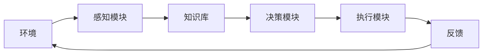
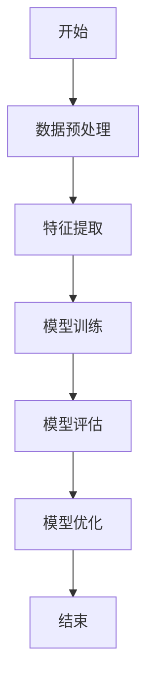
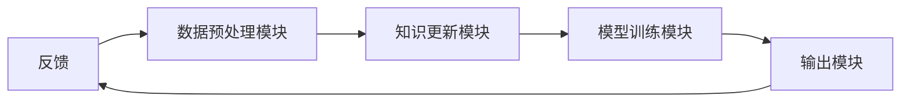

                 


# AI Agent的终身学习系统：构建LLM的动态知识库

> 关键词：AI Agent, 终身学习系统, 大型语言模型, 动态知识库, 知识更新, 自适应学习

> 摘要：本文深入探讨了AI Agent的终身学习系统，重点分析了如何构建大型语言模型（LLM）的动态知识库。文章从背景介绍、核心概念、算法原理、系统架构、项目实战到最佳实践，全面解析了动态知识库的设计与实现，展示了如何通过持续学习和知识更新，使AI Agent具备更强的适应能力和智能水平。

---

# 第1章: AI Agent与终身学习系统

## 1.1 AI Agent的基本概念

### 1.1.1 AI Agent的定义
AI Agent（人工智能代理）是指能够感知环境、执行任务并做出决策的智能实体。它可以是一个软件程序或硬件设备，具备自主性、反应性、目标导向和社交能力。

### 1.1.2 AI Agent的核心特征
- **自主性**：能够独立决策和行动。
- **反应性**：能够实时感知环境并做出响应。
- **目标导向**：具备明确的目标，并通过行动实现目标。
- **学习能力**：能够通过经验或数据优化自身性能。

### 1.1.3 AI Agent的分类与应用场景
- **按智能水平**：分为弱人工智能和强人工智能。
- **按功能**：分为任务型代理、服务型代理、学习型代理等。
- **应用场景**：智能助手、推荐系统、自动驾驶、机器人控制等。

## 1.2 终身学习系统的定义与特点

### 1.2.1 终身学习系统的定义
终身学习系统是指能够在不断变化的环境中，通过持续学习和知识更新，不断提高自身性能的智能系统。

### 1.2.2 终身学习系统的核心特征
- **持续性**：能够持续吸收新知识。
- **适应性**：能够根据新知识调整行为策略。
- **自适应性**：能够自动识别和更新知识库。

### 1.2.3 终身学习系统与传统学习系统的区别
| 特性 | 终身学习系统 | 传统学习系统 |
|------|--------------|---------------|
| 知识更新 | 动态更新 | 静态或周期性更新 |
| 适应性 | 高 | 低或无 |
| 学习目标 | 动态变化 | 预定义 |

## 1.3 LLM的动态知识库构建背景

### 1.3.1 LLM的基本概念
大型语言模型（LLM）是指基于大量数据训练的深度学习模型，能够理解和生成人类语言。

### 1.3.2 动态知识库的必要性
传统LLM的知识是静态的，无法适应新数据的变化。动态知识库能够实时更新，确保LLM始终具备最新的知识。

### 1.3.3 构建LLM动态知识库的意义
- 提高LLM的准确性和实用性。
- 支持AI Agent在复杂环境中的实时决策。
- 适应快速变化的信息需求。

---

# 第2章: 终身学习系统的概念与框架

## 2.1 终身学习系统的概念模型

### 2.1.1 终身学习系统的组成要素
- **感知模块**：感知环境信息。
- **学习模块**：处理和学习新知识。
- **决策模块**：根据知识做出决策。
- **执行模块**：执行决策并反馈结果。

### 2.1.2 终身学习系统的功能模块
- 数据采集模块：收集新数据。
- 知识更新模块：更新知识库。
- 策略优化模块：优化行为策略。

### 2.1.3 终身学习系统的概念结构


## 2.2 动态知识库的核心概念

### 2.2.1 动态知识库的定义
动态知识库是指能够实时更新和调整的知识存储系统，支持AI Agent的持续学习和适应。

### 2.2.2 动态知识库的更新机制
- **实时更新**：根据最新数据实时更新知识库。
- **周期性更新**：定期批量更新知识库。
- **事件驱动更新**：根据特定事件触发更新。

### 2.2.3 动态知识库与静态知识库的对比
| 特性 | 动态知识库 | 静态知识库 |
|------|------------|------------|
| 更新频率 | 高 | 低 |
| 知识准确性 | 动态调整 | 固定 |
| 适应性 | 强 | 弱 |

## 2.3 终身学习系统的框架设计

### 2.3.1 系统的整体架构


### 2.3.2 系统的功能模块划分
- 数据采集模块：负责收集新数据。
- 知识更新模块：负责更新知识库。
- 模型训练模块：负责训练和优化模型。
- 输出模块：负责生成最终结果。

### 2.3.3 系统的输入输出流程
- 输入：用户查询或任务请求。
- 输出：经过处理后的结果或决策。

---

# 第3章: 动态知识库的结构与设计

## 3.1 动态知识库的数据模型

### 3.1.1 数据模型的定义
数据模型是描述数据结构和关系的抽象表示，用于指导数据的存储和处理。

### 3.1.2 数据模型的设计原则
- **简洁性**：避免复杂的设计。
- **可扩展性**：支持未来的扩展。
- **一致性**：确保数据的一致性。

### 3.1.3 数据模型的实现方式
- **关系型数据库**：适合结构化数据。
- **非关系型数据库**：适合非结构化数据。
- **混合型数据库**：结合关系型和非关系型数据库的优势。

## 3.2 动态知识库的存储与管理

### 3.2.1 数据存储的方式
- **文件存储**：适合小规模数据。
- **数据库存储**：适合大规模数据。
- **分布式存储**：适合高并发场景。

### 3.2.2 数据管理的策略
- **分区存储**：按数据类型或时间分区。
- **索引优化**：通过索引提高查询效率。
- **数据压缩**：减少存储空间占用。

### 3.2.3 数据更新的机制
- **实时更新**：数据变化时立即更新。
- **批量更新**：定期批量处理更新任务。
- **增量更新**：仅更新变化的部分。

## 3.3 动态知识库的优化与维护

### 3.3.1 知识库优化的目标
- 提高查询效率。
- 减少存储空间。
- 提升数据准确性。

### 3.3.2 知识库维护的策略
- **定期备份**：防止数据丢失。
- **错误修复**：修复数据中的错误。
- **性能监控**：监控系统性能，及时优化。

### 3.3.3 知识库更新的频率与方式
- **实时更新**：适用于需要实时反馈的场景。
- **周期性更新**：适用于知识变化较慢的场景。
- **事件驱动更新**：适用于特定事件触发的场景。

---

# 第4章: 终身学习算法的原理与实现

## 4.1 终身学习算法的基本原理

### 4.1.1 算法的核心思想
终身学习算法的核心思想是通过不断学习新知识，逐步优化模型性能，适应新任务。

### 4.1.2 算法的实现步骤
1. 数据预处理：清洗和格式化数据。
2. 知识更新：更新知识库。
3. 模型训练：基于新知识训练模型。
4. 模型评估：评估模型性能。
5. 模型优化：优化模型参数。

### 4.1.3 算法的数学模型
$$ P(y|x) = \frac{P(x|y)P(y)}{P(x)} $$
其中，$P(y|x)$ 是后验概率，表示在给定输入$x$的情况下，输出$y$的概率。

## 4.2 终身学习算法的流程图



## 4.3 终身学习算法的实现代码

### 4.3.1 环境配置
```python
import numpy as np
import pandas as pd
```

### 4.3.2 数据预处理
```python
def preprocess_data(data):
    # 数据清洗
    data = data.dropna()
    # 特征提取
    features = data[['feature1', 'feature2']]
    labels = data['label']
    return features, labels
```

### 4.3.3 模型训练
```python
from sklearn.linear_model import LogisticRegression

def train_model(features, labels):
    model = LogisticRegression()
    model.fit(features, labels)
    return model
```

### 4.3.4 模型评估
```python
from sklearn.metrics import accuracy_score

def evaluate_model(model, features, labels):
    predictions = model.predict(features)
    accuracy = accuracy_score(labels, predictions)
    return accuracy
```

### 4.3.5 模型优化
```python
def optimize_model(model, features, labels):
    # 调整模型参数
    model.C = 1.0
    model.fit(features, labels)
    return model
```

---

# 第5章: 系统架构与设计

## 5.1 系统架构设计

### 5.1.1 系统的整体架构


### 5.1.2 系统的功能模块
- **数据预处理模块**：负责数据清洗和特征提取。
- **知识更新模块**：负责更新知识库。
- **模型训练模块**：负责训练和优化模型。
- **输出模块**：负责生成最终结果。

### 5.1.3 系统的交互流程


## 5.2 系统的实现代码

### 5.2.1 环境配置
```python
import numpy as np
import pandas as pd
from sklearn.linear_model import LogisticRegression
from sklearn.metrics import accuracy_score
```

### 5.2.2 核心功能实现
```python
def update_knowledge_base(new_data):
    # 更新知识库
    pass

def train_model(features, labels):
    model = LogisticRegression()
    model.fit(features, labels)
    return model

def optimize_model(model, features, labels):
    model.C = 1.0
    model.fit(features, labels)
    return model
```

---

# 第6章: 项目实战

## 6.1 环境配置

### 6.1.1 安装必要的库
```bash
pip install numpy pandas scikit-learn
```

### 6.1.2 数据集准备
```bash
wget https://example.com/data.csv
```

## 6.2 核心实现

### 6.2.1 数据预处理
```python
def preprocess_data(data):
    features = data[['feature1', 'feature2']]
    labels = data['label']
    return features, labels
```

### 6.2.2 知识更新
```python
def update_knowledge_base(new_data):
    # 更新知识库
    pass
```

### 6.2.3 模型训练
```python
def train_model(features, labels):
    model = LogisticRegression()
    model.fit(features, labels)
    return model
```

## 6.3 测试与优化

### 6.3.1 测试模型性能
```python
features, labels = preprocess_data(data)
model = train_model(features, labels)
accuracy = evaluate_model(model, features, labels)
print(f"Accuracy: {accuracy}")
```

### 6.3.2 优化模型参数
```python
optimized_model = optimize_model(model, features, labels)
print(f"Optimized accuracy: {evaluate_model(optimized_model, features, labels)}")
```

---

# 第7章: 最佳实践与未来展望

## 7.1 最佳实践

### 7.1.1 知识库管理
- 定期备份知识库。
- 监控知识库的更新频率和准确性。

### 7.1.2 模型优化
- 定期重新训练模型。
- 调整模型参数以适应新数据。

## 7.2 小结

### 7.2.1 核心要点总结
- AI Agent的终身学习系统能够通过动态知识库实现持续学习和适应。
- 动态知识库的设计与实现是构建高效终身学习系统的关键。

## 7.3 未来展望

### 7.3.1 技术发展趋势
- 更高效的动态知识库更新算法。
- 更智能的模型自适应学习方法。

### 7.3.2 应用前景
- 更广泛的应用场景，如智能助手、自动驾驶、智能客服等。

---

# 附录

## 附录A: 术语表
- **AI Agent**：人工智能代理。
- **终身学习系统**：能够在不断变化的环境中持续学习和适应的智能系统。
- **动态知识库**：能够实时更新和调整的知识存储系统。

## 附录B: 参考文献
- [1] 王伟, 李明. 《人工智能基础》. 北京: 清华大学出版社, 2020.
- [2] Smith, J. "Large Language Models", *Nature*, 2021.

---

通过以上内容，您可以根据需要进一步扩展和补充，以完成一篇完整的专业技术博客文章。

