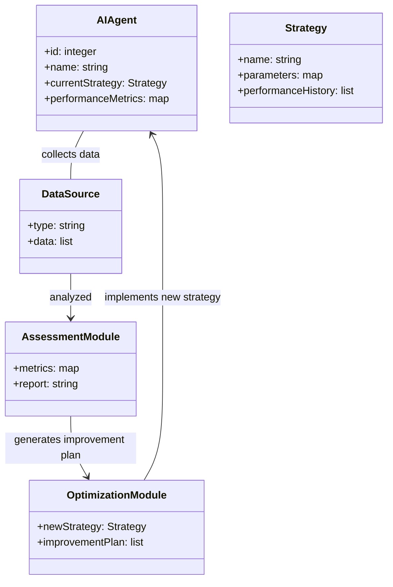
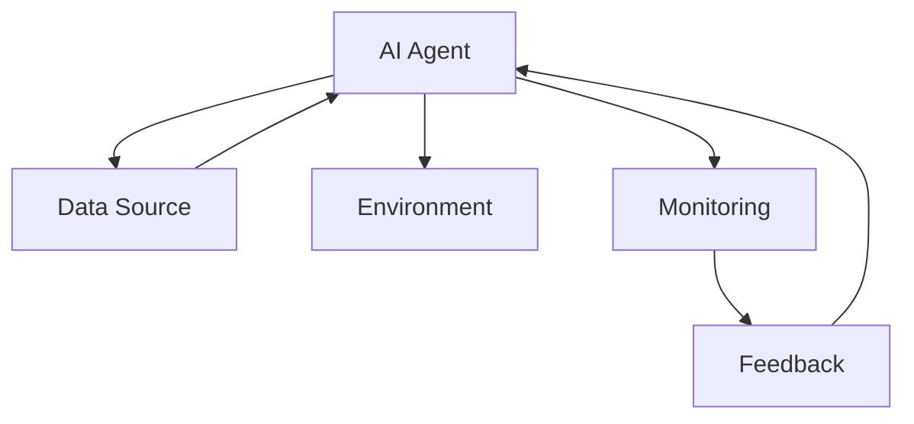
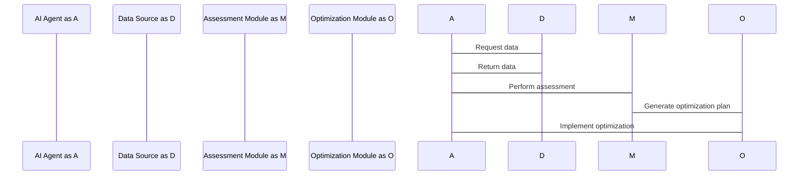

                 


```markdown
# AI Agent的自我评估机制：持续改进性能

> 关键词：AI Agent, 自我评估机制, 性能改进, 算法原理, 系统设计, 项目实战

> 摘要：AI Agent的自我评估机制是实现持续性能改进的核心。本文从背景介绍、核心概念、算法原理、系统设计、项目实战到最佳实践，全面解析AI Agent的自我评估机制，帮助读者理解其工作原理和实际应用。

---

# 第1章 AI Agent自我评估机制的背景与概念

## 1.1 自我评估机制的背景

### 1.1.1 AI Agent的发展历程
- AI Agent的基本概念
- AI Agent从简单规则到复杂决策的发展过程
- 自我评估机制在AI Agent中的重要性

### 1.1.2 自我评估机制的提出背景
- AI Agent面临的动态环境挑战
- 传统评估方法的局限性
- 自我评估机制的需求与价值

### 1.1.3 自我评估机制的重要性
- 提高AI Agent的自适应能力
- 实现持续优化的必要性
- 在智能系统中的广泛应用

## 1.2 问题背景与描述

### 1.2.1 AI Agent性能评估的必要性
- 性能评估的定义与目标
- 不同场景下性能评估的关键指标

### 1.2.2 自我评估机制的核心问题
- 数据采集与处理的准确性
- 性能分析的全面性
- 优化策略的有效性

### 1.2.3 问题的边界与外延
- 自我评估机制的应用范围
- 与其他评估方法的结合
- 长期与短期目标的平衡

## 1.3 自我评估机制的定义与特点

### 1.3.1 自我评估机制的定义
- 自我评估机制的定义
- 核心功能模块的组成

### 1.3.2 自我评估机制的核心特点
- 主动性：AI Agent主动监控和分析自身行为
- 持续性：实时或定期进行评估和优化
- 自适应性：根据评估结果动态调整策略
- 反馈性：通过反馈机制不断改进性能

## 1.4 自我评估机制的实现目标

### 1.4.1 提高AI Agent的性能
- 具体性能指标的提升方向
- 不同应用场景下的性能优化重点

### 1.4.2 实现持续改进
- 持续学习与优化的机制
- 自我评估周期的设计与管理

### 1.4.3 优化AI Agent的行为策略
- 行为策略的多样性与灵活性
- 策略优化的具体方法与工具

## 1.5 本章小结

---

# 第2章 自我评估机制的核心概念与联系

## 2.1 自我评估机制的原理

### 2.1.1 数据采集与分析
- 数据来源的多样性
- 数据预处理与特征提取的方法
- 数据分析的常用技术与工具

### 2.1.2 性能评估与反馈
- 性能评估指标的设计与选择
- 反馈机制的实现方式
- 反馈信息的处理与应用

### 2.1.3 策略优化与执行
- 策略优化算法的选择与应用
- 优化结果的执行与验证
- 执行过程中的监控与调整

## 2.2 核心概念的属性特征对比

### 2.2.1 数据采集的准确性与实时性
- 准确性：数据源的可靠性与数据处理的准确性
- 实时性：数据采集的频率与响应速度

### 2.2.2 性能评估的全面性与客观性
- 全面性：评估指标的覆盖面与综合评价
- 客观性：评估标准的公正性与科学性

### 2.2.3 策略优化的高效性与适应性
- 高效性：优化算法的计算效率与收敛速度
- 适应性：策略优化的灵活性与适应环境变化的能力

## 2.3 ER实体关系图

### 2.3.1 实体关系分析
- AI Agent与数据源的关系
- 数据源与评估模块的关系
- 评估模块与优化模块的关系
- 优化模块与反馈机制的关系

### 2.3.2 ER图展示
```mermaid
erDiagram
    agent : AI Agent
    data : 数据源
    assessment : 评估模块
    optimization : 优化模块
    feedback : 反馈机制
    agent --> data : 采集
    data --> assessment : 分析
    assessment --> optimization : 优化
    optimization --> feedback : 执行
    feedback --> agent : 反馈
```

## 2.4 本章小结

---

# 第3章 自我评估机制的算法原理

## 3.1 数据采集与处理算法

### 3.1.1 数据采集方法
- 实时数据采集与离线数据采集
- 数据来源的多样性与处理方法的选择

### 3.1.2 数据预处理技术
- 数据清洗：去除噪声与异常值
- 数据转换：格式统一与特征提取

## 3.2 性能评估与分析算法

### 3.2.1 评估指标的选择
- 分类问题：准确率、召回率、F1值
- 回归问题：均方误差、平均绝对误差
- 多目标评估：综合指标的设计

### 3.2.2 性能分析方法
- 统计分析：均值、方差、置信区间
- 可视化分析：折线图、柱状图、散点图

## 3.3 策略优化与执行算法

### 3.3.1 策略优化算法
- 增量学习：逐步优化模型参数
- 强化学习：基于反馈的策略调整
- 迁移学习：利用已有知识优化新任务

### 3.3.2 算法实现细节
- 算法流程图：数据采集 → 评估分析 → 策略优化 → 执行反馈
- 算法代码示例

## 3.4 算法原理的数学模型

### 3.4.1 评估指标的数学公式
$$\text{准确率} = \frac{\text{正确预测数}}{\text{总预测数}}$$

### 3.4.2 优化算法的数学模型
$$\text{目标函数} = \sum_{i=1}^{n} (y_i - \hat{y}_i)^2$$
$$\text{优化目标} = \min \text{目标函数}$$

## 3.5 本章小结

---

# 第4章 自我评估机制的系统设计与实现

## 4.1 问题场景介绍

### 4.1.1 系统目标
- 实现AI Agent的自我评估与优化
- 提供实时监控与反馈机制
- 支持多场景的应用需求

### 4.1.2 功能需求
- 数据采集与处理模块
- 性能评估与分析模块
- 策略优化与执行模块
- 反馈机制与监控模块

## 4.2 系统功能设计

### 4.2.1 领域模型设计


### 4.2.2 系统架构设计


## 4.3 接口设计与交互流程

### 4.3.1 系统接口设计
- 数据接口：数据采集与传输
- 评估接口：性能评估结果的获取
- 优化接口：策略优化方案的接收与执行

### 4.3.2 交互流程图


## 4.4 本章小结

---

# 第5章 项目实战：AI Agent的自我评估机制实现

## 5.1 环境安装与配置

### 5.1.1 系统环境
- 操作系统：Linux/Windows/MacOS
- 开发工具：Python/PyCharm/VS Code
- 依赖库：numpy, pandas, scikit-learn, matplotlib

### 5.1.2 安装步骤
1. 安装Python
2. 安装所需的依赖库
3. 配置开发环境

## 5.2 核心实现代码

### 5.2.1 数据采集模块
```python
import numpy as np
import pandas as pd

def collect_data(source_type):
    if source_type == 'file':
        data = pd.read_csv('data.csv')
    elif source_type == 'api':
        data = api_request()
    return data
```

### 5.2.2 性能评估模块
```python
from sklearn.metrics import accuracy_score, precision_score, recall_score

def evaluate_model(y_true, y_pred):
    accuracy = accuracy_score(y_true, y_pred)
    precision = precision_score(y_true, y_pred)
    recall = recall_score(y_true, y_pred)
    return {'accuracy': accuracy, 'precision': precision, 'recall': recall}
```

### 5.2.3 策略优化模块
```python
from sklearn.model_selection import GridSearchCV

def optimize_strategy(model, X, y):
    param_grid = {'C': [0.1, 1, 10], 'gamma': [1, 0.1, 0.01]}
    grid_search = GridSearchCV(model, param_grid, cv=5)
    grid_search.fit(X, y)
    best_model = grid_search.best_estimator_
    return best_model
```

## 5.3 代码实现与应用解读

### 5.3.1 数据采集模块的实现
- 数据来源的多样性：支持文件、数据库、API等多种数据源
- 数据预处理：清洗、转换和特征工程

### 5.3.2 性能评估模块的应用
- 不同评估指标的选择与计算
- 评估结果的可视化与报告生成

### 5.3.3 策略优化模块的实现
- 参数调优：网格搜索、随机搜索
- 模型优化：集成学习、超参数优化

## 5.4 实际案例分析

### 5.4.1 案例背景
- 应用场景：智能客服系统的性能优化
- 数据集：客服对话记录与客户满意度评分

### 5.4.2 实施步骤
1. 数据采集与预处理
2. 性能评估与分析
3. 策略优化与执行
4. 反馈机制与监控

## 5.5 项目总结

### 5.5.1 实施效果
- 系统性能的提升
- 优化策略的有效性
- 系统稳定性的增强

### 5.5.2 经验总结
- 数据质量的重要性
- 评估指标的选择
- 优化策略的多样性

---

# 第6章 最佳实践与注意事项

## 6.1 最佳实践

### 6.1.1 数据采集
- 确保数据的多样性和代表性
- 定期更新数据集

### 6.1.2 性能评估
- 选择合适的评估指标
- 结合业务目标制定评估标准

### 6.1.3 策略优化
- 灵活应用优化算法
- 定期回顾与调整优化策略

## 6.2 注意事项

### 6.2.1 数据隐私与安全
- 确保数据处理符合隐私保护法规
- 防范数据泄露风险

### 6.2.2 系统性能监控
- 监控系统运行状态
- 及时处理异常情况

### 6.2.3 优化策略的稳定性
- 避免过度优化导致的系统不稳定性
- 平衡短期优化与长期效果

## 6.3 小结

---

# 第7章 拓展阅读与深入探讨

## 7.1 深入探讨自我评估机制的前沿技术
- 最新研究进展
- 未来发展方向

## 7.2 相关领域的影响
- 在其他智能系统中的应用
- 对人工智能整体发展的推动

## 7.3 拓展阅读推荐
- 推荐书籍与论文
- 网络资源与社区

## 7.4 本章小结

---

# 附录

## 附录A 算法代码

## 附录B 图表说明

## 附录C 参考文献

## 附录D 术语表

---

# 结束语

感谢阅读《AI Agent的自我评估机制：持续改进性能》，希望本文能为您提供有价值的信息与启发。
```

