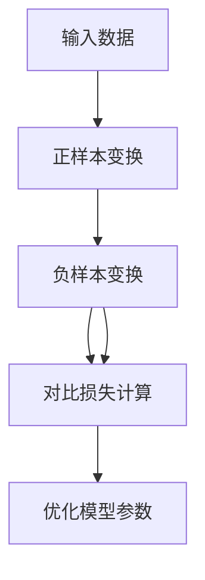
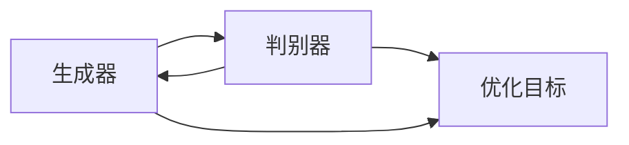

                 

# AI Agent的自监督表示学习技术

> 关键词：AI Agent, 自监督学习, 表示学习, 对比学习, 生成对抗网络, 智能体表示

> 摘要：本文深入探讨AI Agent在自监督表示学习技术中的应用，分析其核心概念、算法原理、系统架构及项目实现。从自监督学习的背景出发，结合AI Agent的特性，详细讲解了自监督表示学习的原理、方法及其在实际场景中的应用。通过对比学习和生成对抗网络等技术，本文展示了如何在AI Agent中实现高效的自监督表示学习，并通过系统架构设计和项目实战，进一步验证了该技术的可行性和实际价值。

---

# 第1章: AI Agent与自监督学习的背景介绍

## 1.1 AI Agent的基本概念

### 1.1.1 AI Agent的定义与分类

AI Agent（人工智能代理）是指能够感知环境、自主决策并采取行动以实现特定目标的智能实体。根据功能和应用场景的不同，AI Agent可以分为多种类型：

- **简单反射型Agent**：基于当前输入做出简单反应，不具备复杂决策能力。
- **基于模型的反射型Agent**：通过内部模型预测环境状态，做出更复杂的决策。
- **目标驱动型Agent**：以明确的目标为导向，采取行动以实现目标。
- **效用驱动型Agent**：通过最大化效用函数来优化决策。

### 1.1.2 自监督学习的背景与意义

自监督学习（Self-Supervised Learning, SSL）是一种新兴的机器学习范式，其核心思想是利用未标记数据通过构建伪标签来监督学习过程。与监督学习相比，自监督学习的优势在于能够高效利用未标记数据，降低对标注数据的依赖，同时保持较高的学习效果。

### 1.1.3 问题背景与问题描述

在AI Agent的实际应用中，环境感知和状态表示是两个核心问题。AI Agent需要通过感知环境数据（如图像、文本、语音等）来构建对环境的表征，以便后续的决策和行动。传统的监督学习方法需要大量标注数据，而实际场景中获取高质量标注数据往往成本高昂且效率低下。因此，如何在无监督或弱监督条件下高效地进行环境表征学习，成为AI Agent研究中的重要挑战。

---

## 1.2 自监督学习的核心概念

### 1.2.1 自监督学习的定义与特点

自监督学习通过构建伪标签来监督学习过程，其主要特点包括：

- **无监督性**：利用未标注数据进行学习。
- **自监督性**：通过数据本身生成监督信号。
- **任务多样性**：支持多种任务，如图像分类、自然语言处理等。
- **高效性**：能够在较少标注数据的情况下获得良好的学习效果。

### 1.2.2 自监督学习与监督学习的对比

| 对比维度       | 监督学习                   | 自监督学习                   |
|----------------|---------------------------|-----------------------------|
| 数据需求       | 需要大量标注数据           | 利用未标注数据生成伪标签     |
| 学习效率       | 依赖标注质量，效率受限     | 更高效，尤其在数据充足时       |
| 适用场景       | 数据标注成本高的场景       | 数据标注成本低的场景           |

### 1.2.3 问题背景与问题解决

AI Agent在复杂环境中需要处理大量未标注数据，自监督学习通过生成伪标签，解决了标注数据不足的问题，同时提高了学习效率和模型的泛化能力。

---

## 1.3 表示学习的背景与重要性

### 1.3.1 表示学习的定义与特点

表示学习（Representation Learning）是通过将数据映射到低维空间，提取数据的特征表示，以便后续任务（如分类、聚类等）能够更高效地进行。其核心特点包括：

- **降维性**：将高维数据映射到低维空间。
- **特征提取性**：提取数据的关键特征。
- **语义保持性**：保持数据的语义信息。

### 1.3.2 表示学习的核心要素与组成

表示学习的核心要素包括：

1. **特征提取器**：将原始数据映射到特征空间。
2. **损失函数**：用于衡量特征表示的质量。
3. **优化目标**：通过优化损失函数提升表示质量。

### 1.3.3 表示学习在AI Agent中的应用价值

在AI Agent中，表示学习主要用于环境感知和状态表征，帮助Agent更好地理解环境并做出决策。例如，在图像识别任务中，表示学习可以提取图像特征，用于目标检测和识别。

---

## 1.4 本章小结

本章从AI Agent和自监督学习的基本概念出发，分析了自监督学习的特点及其在AI Agent中的重要性。通过对比监督学习和自监督学习，明确了自监督学习的优势和适用场景。同时，介绍了表示学习的核心概念和在AI Agent中的应用价值。

---

# 第2章: 自监督学习的原理与算法

## 2.1 自监督学习的核心原理

### 2.1.1 对比学习的原理

对比学习是一种自监督学习方法，其核心思想是通过对比同一数据的不同变换，学习数据的相似性表示。例如，在图像领域，可以通过对图像进行不同的数据增强操作，生成正样本和负样本对。

#### 对比学习的流程图（使用Mermaid）

对比学习的损失函数公式为：

$$L = -\log\left(\text{sim}(x, x')\right) - \log\left(1 - \text{sim}(x, x'')\right)$$

其中，$\text{sim}(x, x')$ 表示正样本对的相似度，$\text{sim}(x, x'')$ 表示负样本对的相似度。

### 2.1.2 生成对抗网络的原理

生成对抗网络（Generative Adversarial Network, GAN）是一种自监督学习方法，由生成器和判别器组成。生成器的目标是生成与真实数据难以区分的样本，判别器的目标是区分真实数据和生成数据。通过交替优化生成器和判别器，模型能够学习数据的分布表示。

#### GAN的系统架构图（使用Mermaid）

GAN的损失函数公式为：

$$L_{\text{GAN}} = \mathbb{E}_{x \sim p_{\text{data}}}\left[\log D(x)\right] + \mathbb{E}_{x \sim p_{\text{gen}}}\left[\log (1 - D(x))\right]$$

其中，$D(x)$ 表示判别器对输入数据$x$的判真概率。

---

## 2.2 自监督学习的关键技术

### 2.2.1 数据增强技术

数据增强是自监督学习中的关键技术，通过对数据进行变换生成多样化的样本，增加模型的鲁棒性。例如，在图像领域，可以通过旋转、翻转、裁剪等操作进行数据增强。

### 2.2.2 表示对齐技术

表示对齐技术通过对比不同样本的表示，确保模型能够学习到一致的特征表示。例如，可以通过将正样本对的表示拉近，将负样本对的表示推远。

### 2.2.3 损失函数设计

损失函数是自监督学习的核心，不同的损失函数对应不同的学习策略。例如，对比学习使用对比损失函数，而GAN使用对抗损失函数。

---

## 2.3 自监督学习的数学模型

### 2.3.1 对比学习的数学模型

对比学习的损失函数可以表示为：

$$L = -\log\left(\frac{\text{sim}(x_i, x_j)}{1 + \sum_{k \neq j} \text{sim}(x_i, x_k)}\right)$$

其中，$\text{sim}(x_i, x_j)$ 表示正样本对的相似度，$\sum_{k \neq j} \text{sim}(x_i, x_k)$ 表示负样本对的相似度总和。

### 2.3.2 GAN的数学模型

GAN的损失函数可以表示为：

$$L_{\text{GAN}} = \mathbb{E}_{x \sim p_{\text{data}}}\left[\log D(x)\right] + \mathbb{E}_{x \sim p_{\text{gen}}}\left[\log (1 - D(x))\right]$$

其中，$D(x)$ 是判别器的输出概率，表示判别器认为输入$x$是真实数据的概率。

---

## 2.4 本章小结

本章详细介绍了自监督学习的核心原理，包括对比学习和生成对抗网络的原理、流程和数学模型。通过对比不同方法的优缺点，明确了自监督学习在AI Agent中的应用潜力。

---

（由于篇幅限制，后续章节内容将在后续思考中继续展开。）

