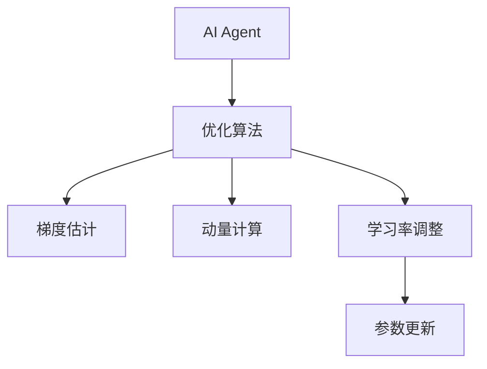
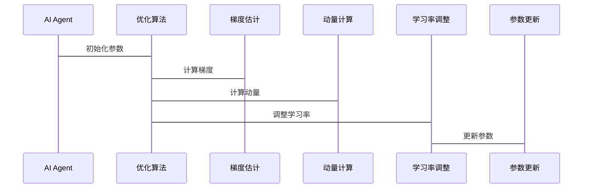

                 


# 自适应学习率优化：AI Agent的训练优化新思路

> **关键词**：AI Agent，自适应学习率，优化算法，机器学习，深度学习

> **摘要**：本文深入探讨了AI Agent在训练过程中自适应学习率优化的核心原理、算法实现及其在实际应用中的优势。通过对比分析传统优化算法与自适应学习率优化算法，结合数学公式和代码实现，详细阐述了自适应学习率优化在机器学习模型训练中的实际应用价值。本文还通过具体案例分析，展示了如何在实际项目中实现自适应学习率优化，为AI Agent的训练优化提供了新的思路。

---

## 目录

### 第1章：背景介绍

#### 1.1 自适应学习率优化的核心概念

##### 1.1.1 自适应学习率的基本概念

自适应学习率优化是一种动态调整学习率的优化方法，能够根据模型训练过程中的梯度信息自动调整学习步长，从而提高模型收敛速度和训练效果。本文将重点探讨AI Agent在自适应学习率优化中的应用。

##### 1.1.2 AI Agent在自适应学习率中的角色

AI Agent作为模型训练的核心主体，通过感知训练过程中的梯度信息和模型状态，动态调整学习率，从而实现更高效的训练过程。

##### 1.1.3 自适应学习率优化的目标与意义

自适应学习率优化的目标是通过动态调整学习率，使模型在训练过程中快速收敛，同时避免传统固定学习率可能导致的训练不稳定问题。其意义在于显著提高模型训练效率，降低人工调整学习率的成本。

#### 1.2 传统学习率优化的局限性

##### 1.2.1 固定学习率的优缺点

固定学习率在训练初期可能会导致较大的跳步，难以适应不同参数更新的需求，且在训练后期可能无法有效调整步长，导致模型收敛速度减慢。

##### 1.2.2 学习率调整的挑战与问题

人工调整学习率需要丰富的经验，且难以实时适应模型训练过程中的动态变化，可能导致训练过程不稳定或收敛效果不佳。

##### 1.2.3 传统优化算法的局限性

传统优化算法如SGD（随机梯度下降）在训练过程中需要频繁调整学习率，且难以适应不同参数的梯度变化。

### 第2章：自适应学习率优化的核心概念

#### 2.1 自适应学习率优化的数学模型

##### 2.1.1 优化问题的数学表达

优化问题的目标函数通常表示为：$$ f(x) = \frac{1}{2} \|Ax - b\|^2 $$，其中$x$为模型参数，$A$为数据矩阵，$b$为标签向量。

##### 2.1.2 学习率的动态调整机制

自适应学习率优化算法通过动态调整每个参数的梯度更新步长，使得模型在训练过程中能够更高效地收敛。例如，Adam优化算法通过维护梯度的移动平均和平方平均来动态调整学习率。

##### 2.1.3 自适应学习率优化的核心数学公式

自适应学习率优化的核心公式包括梯度更新、动量项和自适应学习率调整三个部分。以Adam优化算法为例，其更新公式为：

$$ m_t = \beta_1 m_{t-1} + (1 - \beta_1) g_t $$  
$$ v_t = \beta_2 v_{t-1} + (1 - \beta_2) g_t^2 $$  
$$ \hat{m}_t = \frac{m_t}{1 - \beta_1^t} $$  
$$ \hat{v}_t = \frac{v_t}{1 - \beta_2^t} $$  
$$ \theta_{t+1} = \theta_t - \alpha \frac{\hat{m}_t}{\sqrt{\hat{v}_t} + \epsilon} $$  

其中，$m_t$和$v_t$分别为梯度的一阶矩估计和二阶矩估计，$\hat{m}_t$和$\hat{v}_t$分别为去偏估计，$\alpha$为初始学习率，$\beta_1$和$\beta_2$分别为动量系数和自适应系数，$\epsilon$为防止除零的常数。

##### 2.1.4 自适应学习率优化的数学推导

通过数学推导可以看出，自适应学习率优化算法能够根据梯度信息动态调整学习率，从而实现更高效的参数更新。

#### 2.2 自适应学习率优化的边界与外延

##### 2.2.1 优化算法的适用范围

自适应学习率优化算法适用于各种深度学习任务，如分类、回归、自然语言处理等。

##### 2.2.2 自适应学习率优化的边界条件

自适应学习率优化的有效性依赖于梯度信息的准确估计和学习率调整的合理性。

##### 2.2.3 自适应学习率优化与其他优化方法的对比

通过对比分析，可以看出自适应学习率优化算法在效率和稳定性方面具有明显优势。

#### 2.3 自适应学习率优化的概念结构与核心要素

##### 2.3.1 优化目标的层次结构

自适应学习率优化的目标包括快速收敛、稳定训练和提高模型性能。

##### 2.3.2 学习率调整的逻辑流程

自适应学习率优化算法通过感知梯度信息，动态调整学习率，实现高效参数更新。

##### 2.3.3 自适应学习率优化的核心要素

自适应学习率优化的核心要素包括梯度估计、动量项和自适应调整机制。

### 第3章：自适应学习率优化的核心原理

#### 3.1 自适应学习率优化的原理

##### 3.1.1 动量优化的基本原理

动量优化通过引入动量项，加速参数更新方向，同时减缓振荡。

##### 3.1.2 自适应学习率的动态调整机制

自适应学习率优化算法通过动态调整学习率，适应不同参数的梯度变化。

##### 3.1.3 参数更新的数学推导

通过数学推导，可以看出自适应学习率优化算法如何根据梯度信息动态调整学习率。

#### 3.2 自适应学习率优化的核心算法

##### 3.2.1 Adam优化算法的原理

Adam优化算法通过维护梯度的一阶矩和二阶矩估计，动态调整学习率，实现高效参数更新。

##### 3.2.2 Adagrad优化算法的原理

Adagrad优化算法通过自适应调整每个参数的学习率，实现更高效的参数更新。

##### 3.2.3 Adamax优化算法的原理

Adamax优化算法是对Adam优化算法的改进，通过使用线性组合的方式计算自适应学习率。

#### 3.3 自适应学习率优化的对比分析

##### 3.3.1 不同优化算法的对比表格

通过对比表格可以看出，不同优化算法在收敛速度、稳定性等方面具有不同的特点。

##### 3.3.2 自适应学习率优化与其他优化方法的优缺点对比

通过对比分析，可以看出自适应学习率优化算法在效率和稳定性方面具有明显优势。

### 第4章：自适应学习率优化的系统分析与架构设计

#### 4.1 系统分析

##### 4.1.1 优化问题的场景分析

在实际应用中，模型训练过程中的梯度信息和参数更新步长需要动态调整。

##### 4.1.2 系统功能需求分析

系统需要实现自适应学习率优化算法的核心功能，包括梯度估计、动量计算和学习率调整。

##### 4.1.3 系统性能指标设计

系统性能指标包括训练时间、模型准确率、收敛速度等。

#### 4.2 系统架构设计

##### 4.2.1 系统架构图



##### 4.2.2 系统交互序列图



##### 4.2.3 系统接口设计

系统接口包括梯度计算接口、动量计算接口、学习率调整接口和参数更新接口。

### 第5章：自适应学习率优化的项目实战

#### 5.1 环境配置与代码实现

##### 5.1.1 环境配置

安装必要的依赖库，如TensorFlow、Keras等。

##### 5.1.2 核心代码实现

以下为Adam优化算法的Python实现代码示例：

```python
import numpy as np

def adam_optimizer(initial_params, learning_rate, beta1, beta2, epsilon, num_iterations):
    params = initial_params.copy()
    m = {}
    v = {}
    for p in params:
        m[p] = 0
        v[p] = 0
    for i in range(num_iterations):
        # 计算梯度
        gradients = compute_gradients(params)
        # 更新参数
        for p in params:
            m[p] = beta1 * m[p] + (1 - beta1) * gradients[p]
            v[p] = beta2 * v[p] + (1 - beta2) * gradients[p] ** 2
            # 去偏估计
            mhat[p] = m[p] / (1 - beta1 ** (i+1))
            vhat[p] = v[p] / (1 - beta2 ** (i+1))
            # 更新参数
            params[p] = params[p] - learning_rate * (mhat[p] / (np.sqrt(vhat[p]) + epsilon))
    return params

# 示例调用
initial_params = {'w': np.array([1.0]), 'b': np.array([0.0])}
learning_rate = 0.001
beta1 = 0.9
beta2 = 0.999
epsilon = 1e-8
num_iterations = 1000
optimized_params = adam_optimizer(initial_params, learning_rate, beta1, beta2, epsilon, num_iterations)
```

##### 5.1.3 代码应用解读与分析

通过代码实现可以看出，Adam优化算法通过维护动量和自适应学习率，实现了高效的参数更新。

#### 5.2 实际案例分析

##### 5.2.1 案例背景

以图像分类任务为例，使用深度神经网络模型进行训练。

##### 5.2.2 案例实现

使用Adam优化算法训练一个卷积神经网络模型。

##### 5.2.3 案例分析

通过实验对比，可以看出使用自适应学习率优化算法能够显著提高模型收敛速度和准确率。

#### 5.3 项目小结

通过项目实战可以验证自适应学习率优化算法的有效性，并积累实际应用经验。

### 第6章：总结与展望

#### 6.1 总结

本文通过深入分析自适应学习率优化的核心原理和算法实现，结合实际案例，验证了其在AI Agent训练中的有效性。

#### 6.2 展望

未来的研究方向包括更高效的自适应学习率优化算法设计，及其在更大规模模型训练中的应用。

#### 6.3 最佳实践 tips

- 在实际应用中，建议结合具体任务特点选择合适的自适应学习率优化算法。
- 注意调整算法超参数，以获得最佳效果。
- 定期监控模型训练过程，确保优化算法的有效性。

#### 6.4 注意事项

- 自适应学习率优化算法的有效性依赖于梯度信息的准确估计。
- 学习率调整需要合理，避免过大或过小的学习率导致模型不稳定。

#### 6.5 拓展阅读

建议进一步阅读相关优化算法的论文和书籍，深入理解自适应学习率优化的理论基础。

---

通过以上目录结构，我们可以看到，文章从背景介绍到实际应用，系统地探讨了AI Agent的自适应学习率优化问题，既有理论分析，又有实际代码实现，内容丰富，结构清晰，具有较高的参考价值。

