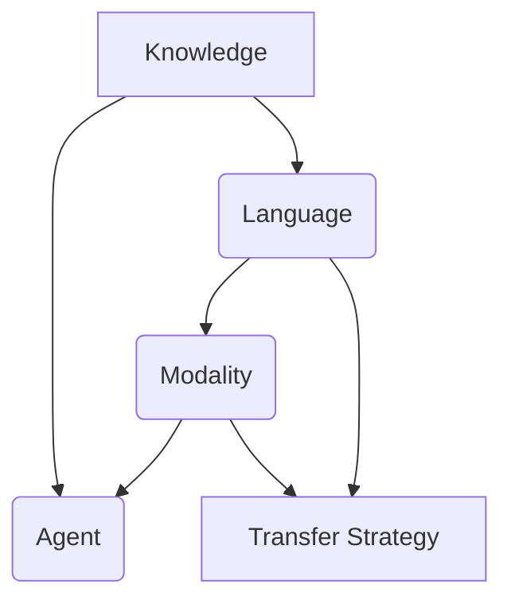
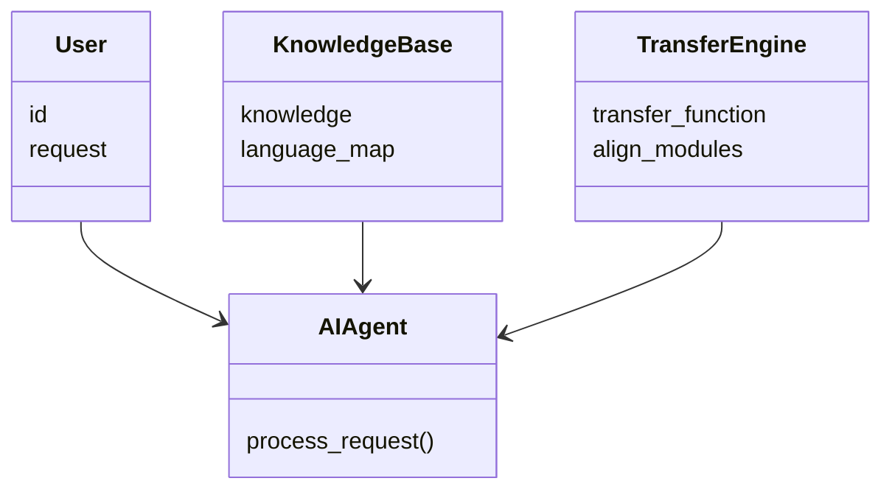
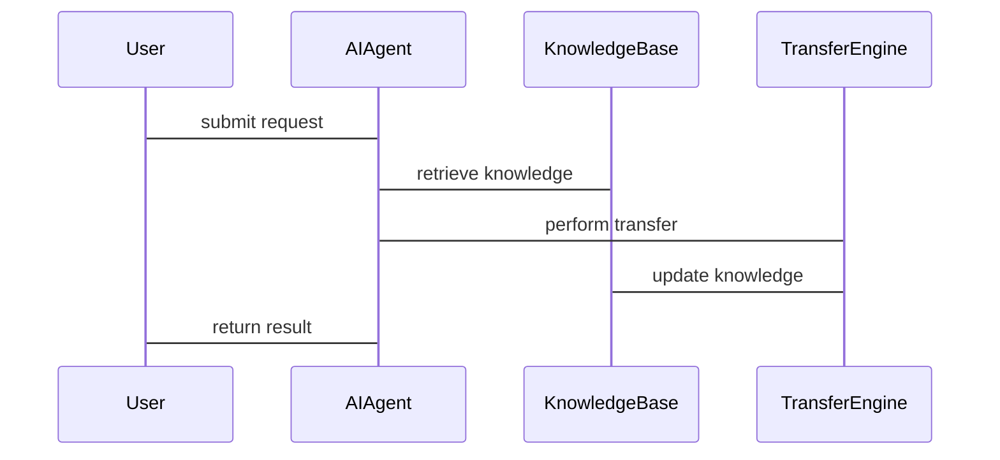

                 


# AI Agent的跨语言跨模态知识迁移

**关键词：** AI Agent，跨语言，跨模态，知识迁移，多模态模型，对比学习

**摘要：**  
本文探讨AI Agent在跨语言和跨模态知识迁移中的挑战与解决方案。通过分析知识表示、迁移策略和系统架构，结合实际案例，详细介绍如何实现跨语言和跨模态的知识迁移，提升AI Agent的智能性和适应性。

---

## 背景介绍

### 1.1 问题背景

#### 1.1.1 多语言与多模态数据的挑战
现代AI Agent需要处理多种语言和模态的数据，如文本、图像和语音。这些数据的异构性增加了知识迁移的难度。

#### 1.1.2 知识迁移的核心问题
知识迁移涉及将一种语言或模态的知识应用到另一种。核心挑战在于保持语义一致性和跨模态对齐。

#### 1.1.3 AI Agent在跨语言跨模态中的作用
AI Agent需整合多模态信息，实现高效的知识迁移，提升任务处理能力。

### 1.2 问题描述

#### 1.2.1 跨语言与跨模态知识迁移的定义
知识迁移指将知识从一种语言或模态转移到另一种。跨语言涉及语言间的转换，跨模态涉及不同数据类型间的转换。

#### 1.2.2 知识迁移的关键挑战
数据异构性、语义漂移和跨模态对齐困难是主要挑战。

#### 1.2.3 AI Agent的迁移能力需求
AI Agent需具备处理多种语言和模态的能力，并能有效迁移知识。

### 1.3 问题解决与边界

#### 1.3.1 知识迁移的实现方法
多模态模型和对比学习是常用方法。

#### 1.3.2 AI Agent的迁移能力边界
明确迁移的范围和限制，确保可实现性。

#### 1.3.3 跨语言与跨模态的外延范围
涵盖文本、图像、语音等多种语言和模态。

### 1.4 核心概念与结构

#### 1.4.1 跨语言与跨模态知识迁移的核心要素
知识表示、存储和迁移策略是关键。

#### 1.4.2 AI Agent的知识表示与存储结构
采用多模态嵌入和知识图谱进行表示和存储。

#### 1.4.3 知识迁移的系统架构
模块化架构，包含数据预处理、特征提取和迁移引擎。

---

## 核心概念与联系

### 2.1 核心概念原理

#### 2.1.1 跨语言知识迁移的理论基础
基于分布假设和对齐理论，通过对比学习实现跨语言对齐。

#### 2.1.2 跨模态知识迁移的理论
利用多模态对齐和注意力机制，实现跨模态信息融合。

#### 2.1.3 知识表示与迁移的关键点
知识表示的统一性，跨模态对齐的技术，以及对比学习的应用。

### 2.2 概念属性特征对比分析

| 概念 | 属性 | 特征 |
|------|------|------|
| 跨语言 | 数据类型 | 文本、语音 |
| 跨模态 | 表示方式 | 图像、文本 |
| 知识迁移 | 迁移方式 | 对比学习 |
| AI Agent | 应用场景 | 多任务处理 |

### 2.3 实体关系图



---

## 算法原理

### 3.1 多模态模型

#### 3.1.1 多模态数据预处理
对齐和标准化处理，确保数据一致性。

#### 3.1.2 多模态特征提取
采用深度学习模型提取模态特征。

#### 3.1.3 对比学习策略
通过对比损失函数，实现跨模态对齐。

### 3.2 跨语言迁移策略

#### 3.2.1 对比学习公式
$$ L = \sum_{i} (1 - \text{sim}(x_i, y_i))^2 $$

#### 3.2.2 自适应对齐
通过参数调整，实现语言间的自适应对齐。

#### 3.2.3 跨语言知识图谱构建
利用对齐后的语言特征，构建跨语言知识图谱。

---

## 系统分析与架构设计

### 4.1 应用场景

#### 4.1.1 客服系统
跨语言对话处理和多模态信息整合。

#### 4.1.2 推荐系统
跨语言和跨模态的信息整合，提升推荐准确性。

### 4.2 系统功能设计



### 4.3 系统架构设计

```mermaid
graph TD
    AIAgent --> Frontend
    Frontend --> Database
    Database --> API Gateway
    API Gateway --> TransferEngine
    TransferEngine --> KnowledgeBase
```

### 4.4 接口与交互



---

## 项目实战

### 5.1 环境安装

```bash
pip install numpy
pip install tensorflow
pip install transformers
pip install pymermaid
```

### 5.2 核心实现

```python
import numpy as np
import tensorflow as tf
from tensorflow.keras import layers
from transformers import AutoTokenizer, TFAutoModel

# 定义对比学习模型
class ContrastiveModel(tf.keras.Model):
    def __init__(self, encoder_dim):
        super(ContrastiveModel, self).__init__()
        self.encoder = layers.Dense(encoder_dim)
        self.temperature = 0.1

    def call(self, inputs):
        # inputs: batch of features
        x = self.encoder(inputs)
        x = tf.nn.softmax(x)
        return x

# 训练对比学习模型
def train_contrastive_model(model, optimizer, train_dataset, epochs=10):
    for epoch in range(epochs):
        for batch in train_dataset:
            with tf.GradientTape() as tape:
                embeddings = model(batch)
                loss = contrastive_loss(embeddings)
            gradients = tape.gradient(loss, model.trainable_weights)
            optimizer.apply_gradients(zip(gradients, model.trainable_weights))
```

### 5.3 案例分析

分析一个跨语言和跨模态的客服对话系统，展示如何通过对比学习实现跨语言对话理解和多模态信息整合。

### 5.4 总结与优化

讨论代码实现中的优化点，如数据增强和模型调参。

---

## 最佳实践与小结

### 6.1 总结

AI Agent的跨语言跨模态知识迁移通过多模态模型和对比学习，实现高效的知识转移和应用。

### 6.2 最佳实践

数据预处理、模型调参和持续学习是关键。

### 6.3 注意事项

确保数据多样性、选择合适的对比学习策略，以及处理语义漂移问题。

### 6.4 拓展阅读

推荐相关书籍和论文，鼓励深入学习。

---

通过以上步骤，我们详细介绍了AI Agent的跨语言跨模态知识迁移，从理论到实践，帮助读者全面理解并掌握相关技术。

