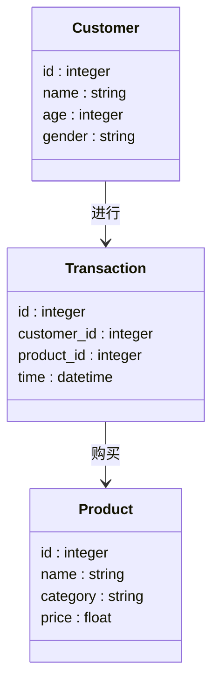
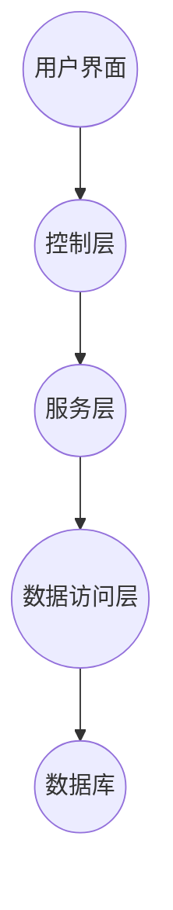
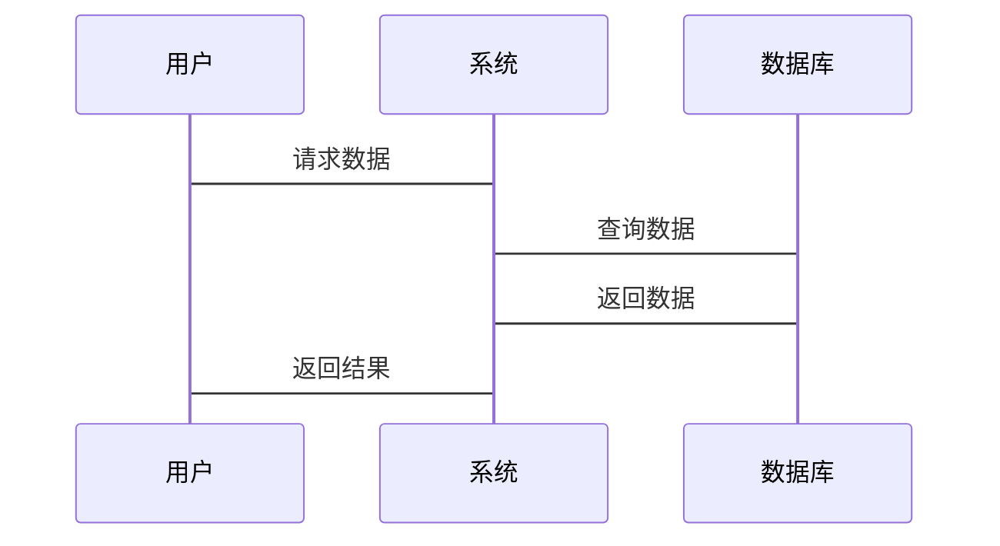

                 


# AI Agent辅助企业客户细分与精准营销

## 关键词：AI Agent, 客户细分, 精准营销, 数据分析, 机器学习, 系统架构

## 摘要：  
随着人工智能技术的快速发展，AI Agent（人工智能代理）在企业客户细分与精准营销中的应用越来越广泛。本文从AI Agent的基本原理出发，详细探讨了其在客户细分和精准营销中的应用价值，结合实际案例，分析了AI Agent在数据处理、模型训练和结果输出中的具体实现。通过系统架构设计和项目实战，本文展示了如何利用AI Agent实现高效客户细分与精准营销。本文适合企业决策者、市场营销人员以及技术开发人员阅读，为他们提供理论支持和实践指导。

---

# 第一部分: AI Agent辅助企业客户细分与精准营销背景介绍

## 第1章: AI Agent与客户细分概述

### 1.1 问题背景

#### 1.1.1 传统客户细分的局限性
传统的客户细分方法依赖于人工分析和统计方法，存在以下问题：
- 数据处理效率低，难以应对海量数据。
- 细分结果主观性强，缺乏数据支持。
- 精准营销效果有限，难以满足个性化需求。

#### 1.1.2 数据驱动的客户细分需求
随着大数据技术的发展，企业需要更高效、更精准的客户细分方法，以满足以下需求：
- 提高客户细分的效率和准确性。
- 实现客户分层，制定差异化营销策略。
- 优化资源配置，提升营销效果。

#### 1.1.3 AI Agent在客户细分中的优势
AI Agent通过自动化数据处理和智能分析，为客户细分提供了以下优势：
- 自动化数据采集与处理能力。
- 高精度的客户分群能力。
- 实时反馈与动态调整能力。

### 1.2 问题描述

#### 1.2.1 客户细分的核心目标
客户细分的核心目标是将客户按特征分成若干子群体，以便制定针对性的营销策略。

#### 1.2.2 精准营销的关键挑战
精准营销面临以下关键挑战：
- 数据多样性与复杂性。
- 算法选择与优化。
- 实时性与动态调整能力。

#### 1.2.3 AI Agent在精准营销中的定位
AI Agent在精准营销中的定位是通过数据处理、模型训练和结果输出，辅助企业实现客户细分与精准营销。

### 1.3 问题解决

#### 1.3.1 AI Agent的核心功能
AI Agent的核心功能包括：
- 数据采集与预处理。
- 特征提取与模型训练。
- 群组划分与结果输出。

#### 1.3.2 数据处理与特征提取
数据处理包括数据清洗和特征工程，特征提取是将数据转化为可用于模型训练的特征向量。

#### 1.3.3 模型训练与结果输出
模型训练是利用机器学习算法对数据进行训练，结果输出是将模型输出的客户分组结果进行可视化或应用于实际业务。

### 1.4 边界与外延

#### 1.4.1 客户细分的边界条件
客户细分的边界条件包括数据质量和数据量。

#### 1.4.2 精准营销的外延范围
精准营销的外延范围包括个性化推荐和动态调整。

#### 1.4.3 AI Agent的应用场景
AI Agent的应用场景包括客户分群、精准推荐和动态调整。

### 1.5 概念结构与核心要素

#### 1.5.1 客户细分的层次结构
客户细分的层次结构包括客户分群、客户画像和客户行为分析。

#### 1.5.2 AI Agent的功能模块
AI Agent的功能模块包括数据采集模块、特征提取模块、模型训练模块和结果输出模块。

#### 1.5.3 数据、模型与结果的关系
数据是模型训练的基础，模型是数据处理的核心，结果是模型输出的最终目标。

## 1.6 本章小结
本章介绍了AI Agent在客户细分与精准营销中的背景、问题、解决方案及边界条件，为后续章节奠定了基础。

---

# 第二部分: AI Agent的核心概念与联系

## 第2章: AI Agent的原理与机制

### 2.1 核心概念原理

#### 2.1.1 AI Agent的基本原理
AI Agent通过数据处理、特征提取和模型训练，实现客户细分和精准营销。

#### 2.1.2 客户细分的核心算法
客户细分的核心算法包括聚类算法和分类算法。

#### 2.1.3 精准营销的实现机制
精准营销的实现机制包括数据驱动和模型优化。

### 2.2 核心概念对比表

| 对比维度 | 传统客户细分 | AI Agent客户细分 |
|----------|--------------|------------------|
| 数据来源 | 结构化数据    | 结构化+非结构化数据 |
| 数据处理 | 人工处理      | 自动化处理       |
| 精度     | 低           | 高               |

### 2.3 ER实体关系图

```mermaid
erDiagram
    customer[客户] {
        id : integer
        name : string
        age : integer
        gender : string
        purchase_history : string
    }
    transaction[交易] {
        id : integer
        customer_id : integer
        product_id : integer
        time : datetime
    }
    product[产品] {
        id : integer
        name : string
        category : string
        price : float
    }
    customer --> transaction : 进行
    transaction --> product : 购买
```

## 2.4 本章小结
本章详细讲解了AI Agent的核心原理和实现机制，并通过对比表和ER图展示了其在客户细分中的应用。

---

# 第三部分: AI Agent的算法原理讲解

## 第3章: 算法原理与实现

### 3.1 算法原理

#### 3.1.1 聚类算法
聚类算法包括K-means算法和DBSCAN算法。

#### 3.1.2 分类算法
分类算法包括决策树和随机森林。

### 3.1.3 算法选择
根据数据特征选择合适的算法，如高维数据选择聚类算法。

### 3.2 算法实现

```python
from sklearn.cluster import KMeans
from sklearn.metrics import silhouette_score
from sklearn.preprocessing import StandardScaler

# 数据预处理
data = StandardScaler().fit_transform(customers_data)

# 聚类算法实现
kmeans = KMeans(n_clusters=3, random_state=42)
clusters = kmeans.fit_predict(data)

# 评估模型
score = silhouette_score(data, clusters)
print(f"Silhouette Score: {score}")
```

### 3.3 算法的数学模型

#### 3.3.1 K-means算法公式
$$
\text{目标函数} = \sum_{i=1}^{k} \sum_{j=1}^{n_i} \|x_j - c_i\|^2
$$

其中，\(k\) 是聚类数，\(n_i\) 是第 \(i\) 个聚类的样本数，\(x_j\) 是样本，\(c_i\) 是第 \(i\) 个聚类的中心。

#### 3.3.2 DBSCAN算法公式
$$
\text{核心距离} = \text{min}(\text{distance}(x_i, x_j))
$$

### 3.4 算法实现步骤
1. 数据预处理：标准化或归一化。
2. 算法选择：根据数据特征选择合适的算法。
3. 模型训练：训练模型并预测结果。
4. 模型评估：评估模型性能，调整参数。

## 3.5 本章小结
本章详细讲解了AI Agent中的聚类和分类算法，并通过代码实现和公式推导展示了算法的实现过程。

---

# 第四部分: AI Agent的系统分析与架构设计

## 第4章: 系统分析与架构设计

### 4.1 问题场景介绍
客户细分与精准营销的系统需要处理大量数据，实现客户分群和精准推荐。

### 4.2 项目介绍
AI Agent辅助企业客户细分与精准营销系统，旨在帮助企业实现客户分群和精准推荐。

### 4.3 系统功能设计

#### 4.3.1 领域模型


#### 4.3.2 系统架构


### 4.4 系统接口设计
系统接口包括数据接口和API接口。

### 4.5 系统交互设计



## 4.6 本章小结
本章详细设计了AI Agent辅助企业客户细分与精准营销系统的架构和交互流程。

---

# 第五部分: AI Agent的项目实战

## 第5章: 项目实战

### 5.1 环境安装
安装Python和必要的库，如scikit-learn和pandas。

### 5.2 系统核心实现

```python
import pandas as pd
from sklearn.cluster import KMeans
from sklearn.metrics import silhouette_score
from sklearn.preprocessing import StandardScaler

# 数据加载
df = pd.read_csv('customers.csv')

# 数据预处理
data = df[['age', 'income', 'purchase_frequency']].values

# 标准化处理
data标准化 = StandardScaler().fit_transform(data)

# 聚类算法实现
kmeans = KMeans(n_clusters=3, random_state=42)
clusters = kmeans.fit_predict(数据标准化)

# 评估模型
score = silhouette_score(数据标准化, clusters)
print(f"Silhouette Score: {score}")
```

### 5.3 代码功能解读
代码实现数据加载、数据预处理、模型训练和结果输出。

### 5.4 实际案例分析
通过实际数据集分析，展示AI Agent在客户细分中的应用效果。

### 5.5 项目小结
本章通过实际项目展示了AI Agent在客户细分与精准营销中的具体实现。

---

# 第六部分: AI Agent的最佳实践

## 第6章: 最佳实践

### 6.1 小结
AI Agent在客户细分与精准营销中的优势和应用。

### 6.2 注意事项
- 数据质量的重要性
- 模型调优的必要性
- 实际应用中的动态调整

### 6.3 拓展阅读
推荐相关书籍和论文，供读者进一步学习。

---

# 附录

## 附录A: 算法实现代码
完整的AI Agent算法实现代码。

## 附录B: 系统架构图
AI Agent辅助企业客户细分与精准营销系统的详细架构图。

---

# 结语

通过本文的详细讲解，读者可以全面了解AI Agent在客户细分与精准营销中的应用，掌握其实现原理和系统设计方法，为企业实现高效客户细分与精准营销提供理论支持和实践指导。

