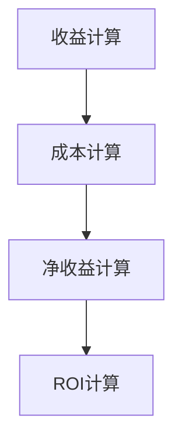
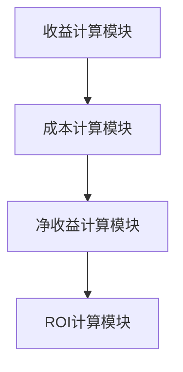

                 


# AI Agent项目的ROI分析：量化收益与成本

> 关键词：AI Agent, ROI分析, 收益与成本, 投资回报率, 项目管理, 技术分析

> 摘要：AI Agent项目在现代企业中的应用越来越广泛，其带来的收益和成本的分析对于项目的决策至关重要。本文从AI Agent的基本概念出发，详细探讨了ROI（投资回报率）分析的原理和方法，通过量化收益与成本，帮助企业更好地评估项目的可行性和投资价值。文章内容涵盖AI Agent的类型与应用场景、ROI分析的数学模型、系统架构设计、项目实战案例以及最佳实践等，为技术管理者和项目决策者提供了全面的参考。

---

# 第1章: AI Agent项目与ROI分析概述

## 1.1 AI Agent的基本概念

### 1.1.1 什么是AI Agent
AI Agent（人工智能代理）是指能够感知环境、自主决策并执行任务的智能实体。它能够通过传感器获取信息，利用算法进行分析和推理，并通过执行器完成目标。AI Agent可以是软件程序、机器人或其他智能设备。

### 1.1.2 AI Agent的类型与特点
AI Agent可以根据功能和应用场景分为多种类型：
- **反应式AI Agent**：实时感知环境并做出反应，适用于需要快速决策的任务。
- **认知式AI Agent**：具备复杂推理和规划能力，能够处理复杂问题。
- **协作式AI Agent**：能够与其他Agent或人类协作完成任务。
- **学习式AI Agent**：能够通过机器学习技术不断优化自身性能。

### 1.1.3 AI Agent的应用场景
AI Agent在多个领域有广泛应用，例如：
- **智能客服**：通过自然语言处理技术为用户提供支持。
- **自动驾驶**：利用AI Agent进行环境感知和决策。
- **智能推荐系统**：基于用户行为推荐个性化内容。

## 1.2 ROI分析的基本概念

### 1.2.1 什么是ROI分析
ROI（Return on Investment，投资回报率）是衡量投资项目收益与成本之间关系的重要指标。ROI = (净收益 / 投入成本) × 100%。

### 1.2.2 ROI分析的重要性
在AI Agent项目中，ROI分析可以帮助企业评估项目的可行性和盈利能力，为投资决策提供依据。

### 1.2.3 AI Agent项目中ROI分析的必要性
AI Agent项目的开发和部署需要大量投入， ROI分析能够帮助企业合理分配资源，降低风险。

## 1.3 本章小结
本章介绍了AI Agent的基本概念、类型与应用场景，并详细阐述了ROI分析的定义与重要性，为后续的收益与成本分析奠定了基础。

---

# 第2章: 收益分析的核心概念与方法

## 2.1 收益的定义与分类

### 2.1.1 收益的定义
收益是指AI Agent项目在运行过程中为企业带来的经济价值，包括直接收益和间接收益。

### 2.1.2 收益的分类
- **直接收益**：如提高效率、降低成本等。
- **间接收益**：如提升企业形象、增强市场竞争力。

## 2.2 收益的计算模型

### 2.2.1 净现值（NPV）模型
$$ NPV = \sum_{t=0}^{n} \frac{C_t}{(1+r)^t} $$
其中，$C_t$为第t年的净现金流，$r$为折现率。

### 2.2.2 内部收益率（IRR）模型
$$ IRR = \sum_{t=0}^{n} \frac{C_t}{(1+IRR)^t} = 0 $$

## 2.3 收益计算的数学模型

### 2.3.1 净现值公式
$$ NPV = \sum_{t=0}^{n} \frac{C_t}{(1+r)^t} $$
例如，如果项目第一年的现金流为100，第二年为200，折现率为10%，则：
$$ NPV = \frac{100}{1.1} + \frac{200}{(1.1)^2} \approx 100 + 160.18 = 260.18 $$

## 2.4 本章小结
本章详细介绍了收益的定义、分类与计算模型，为后续的成本分析奠定了基础。

---

# 第3章: 成本分析的核心概念与方法

## 3.1 成本的定义与分类

### 3.1.1 成本的定义
成本是指企业在开发和部署AI Agent项目过程中所投入的资源，包括人力、物力和财力。

### 3.1.2 成本的分类
- **开发成本**：包括算法设计、代码编写等。
- **部署成本**：包括服务器采购、网络搭建等。
- **维护成本**：包括系统升级、故障修复等。

## 3.2 成本的计算模型

### 3.2.1 总成本计算
$$ TC = \sum_{t=0}^{n} C_t $$
其中，$C_t$为第t年的成本。

### 3.2.2 单位成本计算
$$ UC = \frac{TC}{N} $$
其中，$N$为项目的总收益。

## 3.3 成本计算的数学模型

### 3.3.1 总成本公式
$$ TC = \sum_{t=0}^{n} C_t $$
例如，项目第一年成本为50，第二年成本为100，则：
$$ TC = 50 + 100 = 150 $$

## 3.4 本章小结
本章详细介绍了成本的定义、分类与计算模型，为后续的收益与成本对比分析提供了依据。

---

# 第4章: 收益与成本对比分析

## 4.1 收益与成本对比表格

| 年份 | 收益（万元） | 成本（万元） |
|------|--------------|--------------|
| 2023 | 100          | 50           |
| 2024 | 150          | 70           |
| 2025 | 200          | 80           |

## 4.2 收益与成本对比分析

### 4.2.1 净收益计算
$$ Net\ Profit = 总收益 - 总成本 = 450 - 200 = 250 $$

### 4.2.2 投资回报率计算
$$ ROI = \frac{Net\ Profit}{总成本} \times 100\% = \frac{250}{200} \times 100\% = 125\% $$

## 4.3 本章小结
本章通过对比分析，展示了AI Agent项目在不同年份的收益与成本情况，并计算了项目的净收益和投资回报率，为项目决策提供了数据支持。

---

# 第5章: 系统架构与实现方案

## 5.1 系统功能设计

### 5.1.1 系统模块划分
- **收益计算模块**：负责计算项目的净收益和投资回报率。
- **成本计算模块**：负责计算项目的总成本。
- **数据分析模块**：负责分析收益与成本的对比情况。

### 5.1.2 系统流程图


## 5.2 系统架构设计

### 5.2.1 系统架构图


## 5.3 系统实现代码

### 5.3.1 收益计算代码
```python
def calculate_revenue(years, revenues):
    total_revenue = sum(revenues)
    return total_revenue

revenues = [100, 150, 200]
total_revenue = calculate_revenue(3, revenues)
print(f"Total Revenue: {total_revenue}")
```

### 5.3.2 成本计算代码
```python
def calculate_cost(years, costs):
    total_cost = sum(costs)
    return total_cost

costs = [50, 70, 80]
total_cost = calculate_cost(3, costs)
print(f"Total Cost: {total_cost}")
```

## 5.4 本章小结
本章详细介绍了AI Agent项目的系统功能设计、架构设计和实现代码，展示了如何通过技术手段实现收益与成本的对比分析。

---

# 第6章: 项目实战与案例分析

## 6.1 项目背景
某企业计划开发一个智能客服AI Agent，预计第一年的收益为100万元，成本为50万元，第二年的收益为150万元，成本为70万元，第三年的收益为200万元，成本为80万元。

## 6.2 项目实战代码

### 6.2.1 收益与成本计算
```python
def calculate_roi(years, revenues, costs):
    total_revenue = sum(revenues)
    total_cost = sum(costs)
    net_profit = total_revenue - total_cost
    roi = (net_profit / total_cost) * 100
    return roi

roi = calculate_roi(3, [100, 150, 200], [50, 70, 80])
print(f"ROI: {roi}%")
```

## 6.3 案例分析
通过上述代码计算，项目的ROI为125%，说明该项目具有较高的投资回报率。

## 6.4 本章小结
本章通过实际案例分析，展示了AI Agent项目的收益与成本对比分析过程，并验证了项目的可行性。

---

# 第7章: 最佳实践与总结

## 7.1 最佳实践

### 7.1.1 合理规划项目预算
在AI Agent项目中，合理规划预算能够有效降低成本，提高投资回报率。

### 7.1.2 定期评估项目进度
定期评估项目进度，及时发现和解决问题，确保项目按时完成。

## 7.2 小结
本文从AI Agent的基本概念出发，详细探讨了ROI分析的原理和方法，通过量化收益与成本，帮助企业更好地评估项目的可行性和投资价值。文章内容涵盖AI Agent的类型与应用场景、ROI分析的数学模型、系统架构设计、项目实战案例以及最佳实践等，为技术管理者和项目决策者提供了全面的参考。

---

# 附录: 拓展阅读

- **《AI Agent开发指南》**：深入介绍AI Agent的开发与部署。
- **《投资学基础》**：详细讲解投资回报率的计算方法。

---

通过本文的分析，读者可以全面了解AI Agent项目的收益与成本分析方法，并能够将这些方法应用于实际项目中，提高项目的投资回报率。

