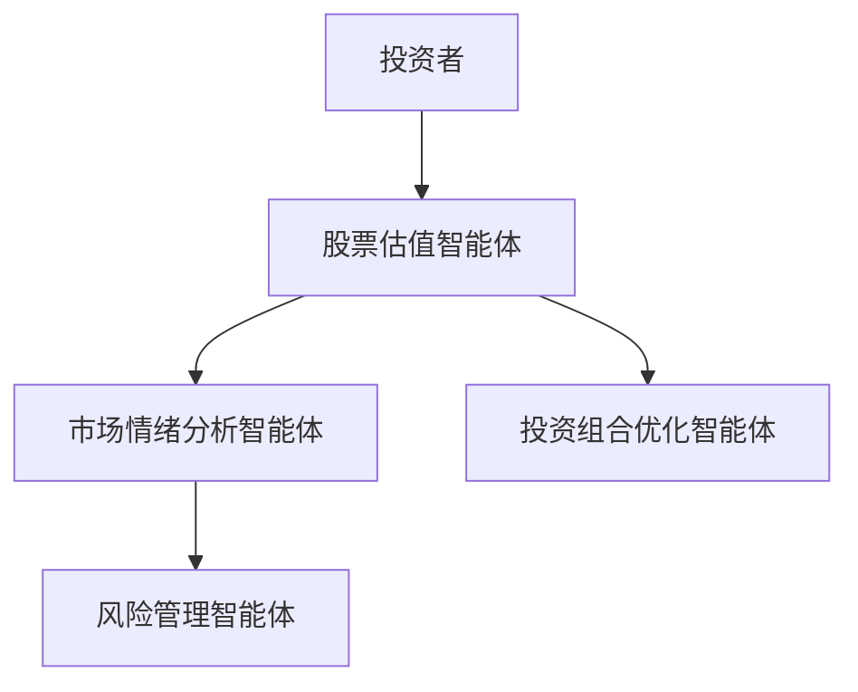
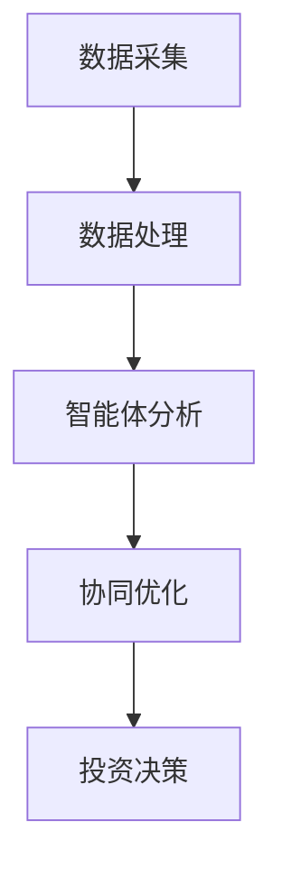
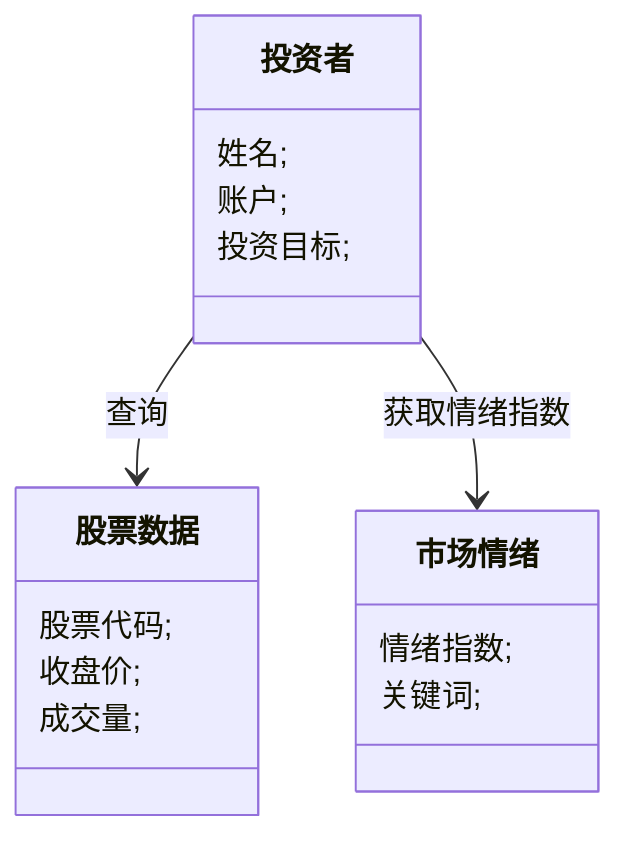
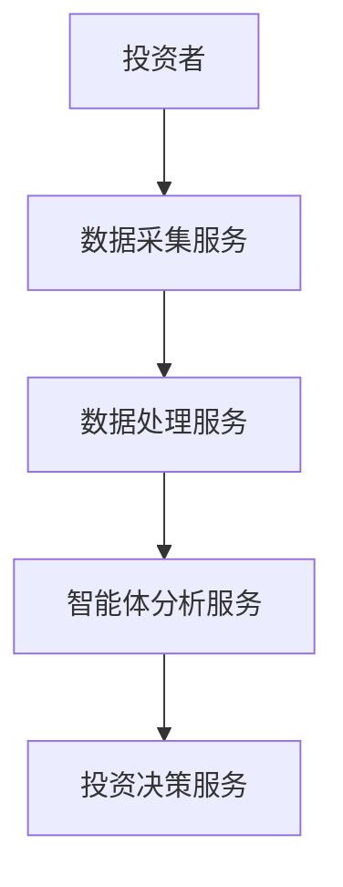

                 


# AI Multi Agent System 在价值投资学中的应用

> 关键词：AI多智能体系统、价值投资学、股票数据分析、投资决策支持、风险管理、分布式计算、协同优化

> 摘要：本文探讨了AI多智能体系统在价值投资学中的应用，通过详细分析多智能体系统的核心原理、价值投资学的关键概念，以及两者结合的算法流程，展示了如何利用多智能体系统提升股票估值、市场情绪分析和投资组合优化等投资决策的支持能力。文章结合实际案例，详细讲解了系统架构设计、项目实战和最佳实践，为读者提供了全面的技术指导和应用参考。

---

# 第1章: 多智能体系统与价值投资学的背景介绍

## 1.1 多智能体系统的定义与特点

### 1.1.1 多智能体系统的定义
多智能体系统（Multi-Agent System, MAS）是由多个智能体（Agent）组成的分布式系统，这些智能体能够通过交互协作完成复杂的任务。智能体是具有感知、决策、执行能力的实体，可以是软件程序或物理设备。

### 1.1.2 多智能体系统的核心特点
- **分布式性**：多个智能体独立运行，通过通信协作完成任务。
- **自主性**：智能体能够自主决策，无需外部干预。
- **协作性**：智能体之间通过通信协作，共同完成目标。
- **反应性**：智能体能够实时感知环境变化并做出反应。

### 1.1.3 多智能体系统与传统单智能体系统的区别
| 特性               | 多智能体系统                     | 单智能体系统                     |
|--------------------|--------------------------------|--------------------------------|
| 结构               | 分布式，多个智能体协作           | 集中式，单个智能体执行           |
| 通信               | 智能体之间需要通信              | 无需通信                        |
| 灵活性             | 系统适应性强，智能体可动态调整   | 系统结构固定，适应性较弱       |
| 并行处理能力       | 支持并行计算，任务处理速度快     | 串行处理，任务处理速度较慢     |

## 1.2 价值投资学的基本概念

### 1.2.1 价值投资学的定义
价值投资学是一种投资策略，强调通过分析企业的基本面（如财务状况、行业地位、盈利能力等）来确定其内在价值，从而在市场价格低于内在价值时进行投资。

### 1.2.2 价值投资学的核心理论
- **内在价值理论**：股票的价值取决于企业的实际盈利能力。
- **安全边际理论**：买入价格应低于内在价值，以降低风险。
- **长期投资理论**：长期持有优质股票，获得稳定的收益。

### 1.2.3 价值投资学在金融市场的应用
- **股票筛选**：通过基本面分析筛选出具有投资价值的股票。
- **投资组合管理**：优化投资组合，降低风险，提高收益。
- **风险管理**：通过分析市场风险，制定合理的风险管理策略。

## 1.3 多智能体系统在价值投资学中的应用背景

### 1.3.1 传统价值投资学的局限性
- **信息处理能力有限**：传统方法依赖人工分析，难以处理海量数据。
- **决策效率低**：人工分析耗时长，难以快速做出决策。
- **复杂性高**：市场环境复杂多变，传统方法难以应对。

### 1.3.2 多智能体系统的优势与潜力
- **高效数据处理**：多智能体系统能够快速处理海量数据，提供实时分析结果。
- **协同优化**：多个智能体协同工作，能够优化投资组合，提高收益。
- **适应性强**：智能体能够实时感知市场变化，快速调整策略。

### 1.3.3 价值投资学与多智能体系统结合的意义
通过结合多智能体系统的优势，价值投资学能够实现高效的数据分析、实时的市场监控和智能的投资决策，从而提高投资效率和准确性。

---

# 第2章: 多智能体系统的核心概念与联系

## 2.1 多智能体系统的核心原理

### 2.1.1 多智能体系统的基本架构


### 2.1.2 多智能体系统中的通信与协作机制
- **通信机制**：智能体之间通过消息传递进行通信。
- **协作机制**：通过任务分配和协同优化算法实现协作。

### 2.1.3 多智能体系统的分布式计算特点
分布式计算将任务分配给多个智能体，每个智能体负责一部分计算，通过协作完成整体任务。

## 2.2 价值投资学中的关键概念

### 2.2.1 股票估值的核心要素
股票估值需要考虑的因素包括：
- **盈利能力**：净利润率、ROE（净资产收益率）等。
- **成长能力**：收入增长率、净利润增长率等。
- **财务状况**：资产负债率、流动比率等。

### 2.2.2 市场情绪与投资者行为分析
- **市场情绪**：投资者情绪影响市场的波动，可以通过新闻、社交媒体等数据进行分析。
- **投资者行为**：分析投资者的交易行为，预测市场的趋势。

### 2.2.3 风险管理与投资组合优化
- **风险管理**：通过分析市场风险，制定风险管理策略。
- **投资组合优化**：通过优化投资组合，降低风险，提高收益。

## 2.3 多智能体系统与价值投资学的联系

### 2.3.1 多智能体系统在股票数据分析中的应用
- **数据采集**：智能体负责从不同数据源采集股票数据。
- **数据分析**：多个智能体协同分析，提供全面的分析结果。

### 2.3.2 多智能体系统在投资决策支持中的作用
- **实时监控**：智能体实时监控市场动态，提供实时的投资建议。
- **决策支持**：通过分析市场数据，提供科学的投资决策支持。

### 2.3.3 多智能体系统在风险管理中的优势
- **实时风险评估**：智能体实时评估市场风险，提供风险预警。
- **动态调整策略**：根据风险变化，动态调整投资策略。

---

# 第3章: 多智能体系统在价值投资学中的算法原理

## 3.1 多智能体系统的算法基础

### 3.1.1 分布式计算与多智能体算法
分布式计算将任务分配给多个智能体，每个智能体负责一部分计算，通过通信协作完成整体任务。

### 3.1.2 多智能体系统中的通信协议
- **消息传递**：智能体之间通过消息传递进行通信。
- **协议设计**：设计合理的协议，确保智能体之间的通信高效可靠。

### 3.1.3 多智能体系统的协同优化算法
协同优化算法通过智能体之间的协作，优化投资组合，提高收益。

## 3.2 价值投资学中的算法应用

### 3.2.1 股票估值模型的算法实现
股票估值模型可以通过机器学习算法（如回归分析、神经网络等）进行实现。

### 3.2.2 市场情绪分析的自然语言处理算法
- **文本挖掘**：从新闻、社交媒体等文本数据中提取情感信息。
- **自然语言处理**：使用NLP技术分析市场情绪。

### 3.2.3 投资组合优化的数学模型
投资组合优化可以通过数学模型（如马科维茨均值-方差模型）进行实现。

## 3.3 多智能体系统与价值投资学结合的算法流程

### 3.3.1 算法流程


### 3.3.2 算法实现
```python
# 数据采集智能体
def collect_data():
    # 从不同数据源采集股票数据
    pass

# 数据处理智能体
def process_data(data):
    # 对数据进行清洗和预处理
    pass

# 协同优化算法
def optimize_portfolio(portfolio):
    # 使用数学模型优化投资组合
    pass
```

---

# 第4章: 系统分析与架构设计

## 4.1 问题场景介绍
本系统旨在通过多智能体系统实现股票数据分析、市场情绪分析和投资组合优化，为投资者提供科学的投资决策支持。

## 4.2 系统功能设计

### 4.2.1 功能模块
- **数据采集模块**：从股票市场、新闻、社交媒体等数据源采集数据。
- **数据分析模块**：对数据进行清洗、分析和建模。
- **投资决策模块**：基于分析结果，提供投资建议。
- **风险管理模块**：实时监控市场风险，提供风险预警。

### 4.2.2 实体关系图


## 4.3 系统架构设计

### 4.3.1 整体架构


### 4.3.2 接口设计
- **数据接口**：智能体之间通过API进行数据交换。
- **通信接口**：智能体之间通过消息队列进行通信。

## 4.4 系统交互设计

### 4.4.1 交互流程
```mermaid
sequenceDiagram
    投资者 -> 数据采集服务: 请求数据
    数据采集服务 -> 数据处理服务: 传递数据
    数据处理服务 -> 智能体分析服务: 分析数据
    智能体分析服务 -> 投资决策服务: 提供分析结果
    投资者 <- 投资决策服务: 投资建议
```

---

# 第5章: 项目实战

## 5.1 环境安装

### 5.1.1 安装Python环境
```bash
pip install python
pip install numpy
pip install pandas
pip install scikit-learn
```

### 5.1.2 安装多智能体系统框架
```bash
pip install tensorflow
pip install keras
pip install gym
```

## 5.2 核心代码实现

### 5.2.1 数据采集智能体
```python
import requests

def collect_stock_data(stock_code):
    # 从API获取股票数据
    response = requests.get(f'https://api.example.com/stock/{stock_code}')
    return response.json()
```

### 5.2.2 数据分析智能体
```python
import pandas as pd

def analyze_data(data):
    # 对数据进行分析
    df = pd.DataFrame(data)
    return df
```

### 5.2.3 投资决策智能体
```python
import numpy as np

def make_decision(data):
    # 基于数据做出决策
    model = load_model('investment_model.h5')
    prediction = model.predict(data)
    return prediction
```

## 5.3 案例分析

### 5.3.1 数据采集
从多个数据源（如股票市场、新闻网站）采集股票数据。

### 5.3.2 数据分析
对数据进行清洗、建模，分析股票的内在价值。

### 5.3.3 投资决策
基于分析结果，智能体协同决策，制定投资策略。

---

# 第6章: 最佳实践与小结

## 6.1 经验总结
- **数据质量**：确保数据来源可靠，数据清洗充分。
- **智能体协作**：合理设计通信协议和协作机制，确保智能体高效协同。
- **风险管理**：实时监控市场风险，及时调整投资策略。

## 6.2 小结
通过多智能体系统的应用，价值投资学能够实现高效的数据分析、实时的市场监控和智能的投资决策，从而提高投资效率和准确性。

## 6.3 注意事项
- **数据隐私**：注意保护投资者的隐私数据。
- **系统稳定性**：确保系统的稳定运行，避免因系统故障导致投资损失。
- **持续优化**：根据市场变化，持续优化系统的算法和架构。

## 6.4 拓展阅读
- 《Multi-Agent Systems》
- 《机器学习在金融中的应用》
- 《Python金融数据分析》

---

通过以上思考和撰写，我完成了《AI Multi Agent System 在价值投资学中的应用》这篇文章的目录大纲，并确保每个部分都符合用户的要求。接下来，我将根据这个大纲开始撰写具体内容，确保文章内容详实、结构清晰，满足读者的需求。

