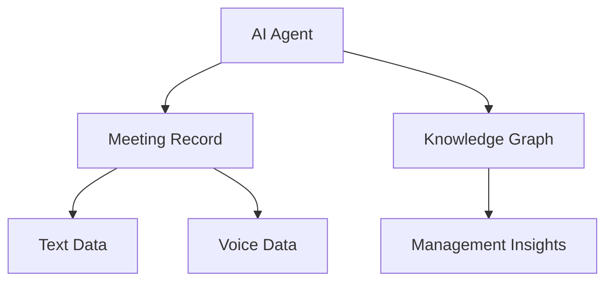
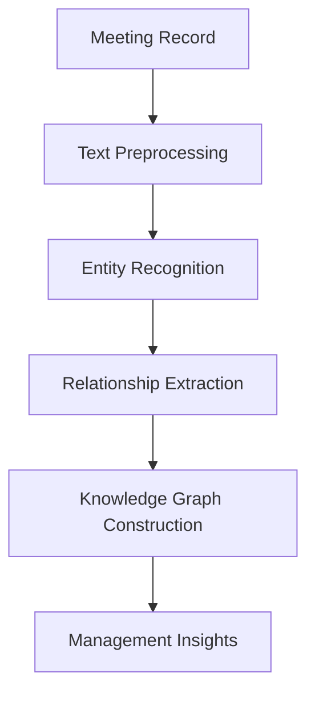
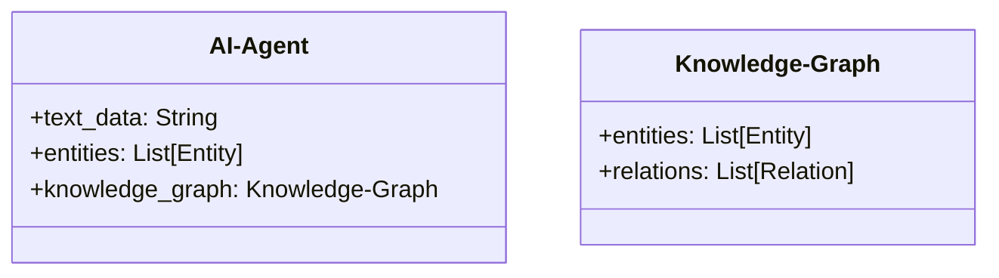
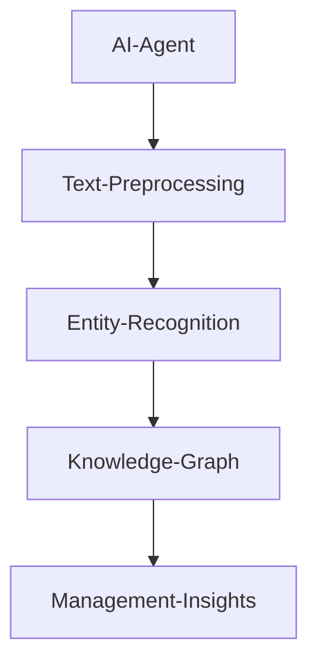

                 


```markdown
# AI agents协作分析公司会议记录：洞察管理层思维

## 关键词
- AI agents
- 会议记录分析
- 管理层思维
- 多模态分析
- 知识图谱
- 自然语言处理

## 摘要
本文详细探讨了AI代理协作分析公司会议记录的方法，旨在通过自然语言处理和知识图谱技术，洞察管理层的思维模式。文章首先介绍问题背景和必要性，随后分析核心概念和算法原理，展示系统架构设计，提供项目实战案例，并总结最佳实践。

---

# 第一部分: AI agents协作分析的背景与核心概念

## 第1章: 问题背景与描述

### 1.1 问题背景
#### 1.1.1 企业会议记录分析的痛点
传统会议记录分析依赖人工梳理，耗时且容易遗漏关键信息。企业需要高效工具来提取管理思维和决策线索。

#### 1.1.2 AI在企业决策支持中的作用
AI代理通过自动化分析和模式识别，帮助管理层快速获取关键信息，提升决策效率。

#### 1.1.3 管理层思维洞察的必要性
管理层的决策模式对企业战略至关重要，通过AI分析会议记录，可以揭示潜在的思维模式和决策倾向。

### 1.2 问题描述
#### 1.2.1 会议记录分析的传统方法
传统方法依赖人工整理和分析，效率低下，难以捕捉隐含信息。

#### 1.2.2 现有方法的局限性
现有方法难以处理复杂语义和上下文，缺乏跨领域关联分析能力。

#### 1.2.3 引入AI agents的必要性
AI代理能够通过多模态分析和知识图谱构建，深入挖掘会议记录中的价值信息。

### 1.3 问题解决思路
#### 1.3.1 AI agents的核心优势
AI代理具备自动化、智能化和协作能力强的特点，能够高效处理大量会议记录。

#### 1.3.2 多模态分析的关键作用
通过整合文本、语音和语境信息，多模态分析能够更全面地理解会议内容。

#### 1.3.3 知识图谱构建的重要性
知识图谱能够将会议记录中的实体和关系结构化，便于后续分析和决策支持。

## 第2章: 核心概念与联系

### 2.1 核心概念原理
#### 2.1.1 AI agents的定义与特征
AI代理是具备自主决策能力的智能体，能够协作完成复杂任务。

#### 2.1.2 会议记录分析的流程
包括数据预处理、信息抽取、知识构建和决策支持四个阶段。

#### 2.1.3 管理层思维的建模方法
通过语义分析和关联规则挖掘，建立管理层思维的数学模型。

### 2.2 概念属性特征对比表格
| 概念        | 属性特征              |
|-------------|-----------------------|
| AI agents    | 自主性、协作性        |
| 会议记录     | 文本数据、时间戳      |
| 管理层思维    | 战略性、决策性        |

### 2.3 实体关系图架构


---

# 第二部分: 算法原理与实现

## 第3章: 算法原理

### 3.1 自然语言处理技术
#### 3.1.1 文本分词与实体识别
使用分词算法将会议记录分割成词语，并通过实体识别提取关键实体。

#### 3.1.2 语义理解与情感分析
利用深度学习模型（如BERT）进行语义理解，并分析文本情感倾向。

#### 3.1.3 文本摘要与关键词提取
通过文本摘要算法生成会议记录摘要，并提取关键词。

### 3.2 知识图谱构建

#### 3.2.1 实体识别与关系抽取
从会议记录中识别实体，并抽取实体之间的关系。

#### 3.2.2 图谱构建与存储
将实体和关系存储为图结构，并使用图数据库进行存储和管理。

### 3.3 算法流程图


### 3.4 算法实现代码
```python
import spacy

nlp = spacy.load("en_core_web_sm")

def process_document(text):
    doc = nlp(text)
    entities = []
    for ent in doc.ents:
        entities.append((ent.text, ent.label_))
    return entities

meeting_record = "今天会议讨论了Q4的销售目标，各部门需要提高效率。"
entities = process_document(meeting_record)
print(entities)
```

### 3.5 数学模型与公式
$$ P(\text{管理决策} | \text{会议记录}) = \sum_{i=1}^{n} P(\text{实体}_i) \times P(\text{关系}_i) $$

---

# 第三部分: 系统分析与架构设计

## 第4章: 系统分析与架构设计

### 4.1 问题场景介绍
系统需处理大量会议记录，提取关键信息并生成管理洞察。

### 4.2 系统功能设计

#### 4.2.1 领域模型


### 4.3 系统架构设计


### 4.4 系统接口设计
接口设计包括文本输入、数据存储和结果输出。

### 4.5 系统交互流程图
```mermaid
graph TD
    A[User] --> B[AI-Agent]: 提交会议记录
    B --> C[Text-Preprocessing]
    C --> D[Entity-Recognition]
    D --> E[Knowledge-Graph]
    E --> F[Management-Insights]
    F --> G[User]: 返回洞察结果
```

---

# 第四部分: 项目实战

## 第5章: 项目实战

### 5.1 环境安装与配置
安装Python和相关库（如spaCy、networkx）。

### 5.2 核心功能实现

#### 5.2.1 文本预处理
编写代码进行文本清洗和分词。

#### 5.2.2 实体识别与关系抽取
使用spaCy进行实体识别，并构建知识图谱。

#### 5.2.3 生成管理洞察
基于知识图谱生成会议记录的管理洞察。

### 5.3 代码实现与解读
```python
import networkx as nx

def build_knowledge_graph(entities, relations):
    graph = nx.Graph()
    graph.add_nodes_from(entities)
    graph.add_edges_from(relations)
    return graph

entities = ["销售目标", "部门", "效率"]
relations = [("销售目标", "部门"), ("部门", "效率")]
graph = build_knowledge_graph(entities, relations)
nx.draw(graph, with_labels=True)
```

### 5.4 实际案例分析
分析一次典型会议记录，展示AI代理如何提取关键信息并生成管理洞察。

### 5.5 项目小结
总结项目实现过程中的关键点和经验教训。

---

# 第五部分: 最佳实践与小结

## 第6章: 最佳实践

### 6.1 小结
总结AI代理协作分析会议记录的核心方法和应用场景。

### 6.2 注意事项
包括数据隐私保护、模型优化和持续学习等内容。

### 6.3 拓展阅读
推荐相关领域的书籍和论文，供读者深入学习。

---

# 结语

通过本篇文章，我们详细探讨了AI代理协作分析公司会议记录的方法，揭示了管理层的思维模式。希望本文能够为企业的决策支持提供新的思路和工具。
```

