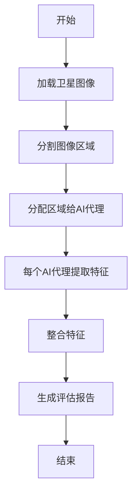
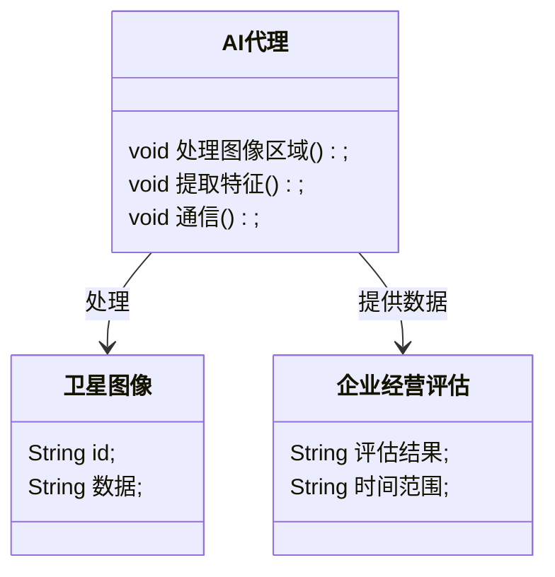
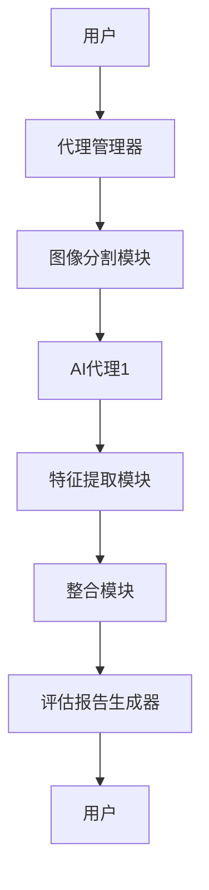

                 


# AI agents协作分析卫星图像：评估公司实际经营状况

---

## 关键词

- AI代理
- 卫星图像
- 企业经营评估
- 图像分析
- 人工智能

---

## 摘要

本文探讨了利用AI代理协作分析卫星图像来评估公司实际经营状况的方法。通过结合AI代理、卫星图像处理和企业经营评估的多维度技术，文章详细分析了卫星图像在企业经营中的潜在价值，以及AI代理协作在提升分析效率和准确性中的作用。文章从背景介绍、核心概念、算法原理、系统设计、项目实战到最佳实践，系统性地阐述了AI代理协作分析卫星图像的全过程，为相关领域的研究和应用提供了理论和实践的参考。

---

## 正文

---

### 第1章: 背景介绍

#### 1.1 问题背景

随着企业经营环境的复杂化，传统的经营评估方法逐渐显现出局限性。企业经营状况的评估通常依赖于财务数据和现场调研，但这种方法耗时且成本较高。与此同时，卫星图像作为一种新兴的数据源，提供了丰富的地理信息，能够反映企业的实际运营状态。例如，卫星图像可以揭示企业的生产基地规模、物流情况以及周边环境的变化。然而，卫星图像数据量大、信息复杂，如何高效提取有用信息成为一大挑战。AI代理的协作机制为解决这一问题提供了新的思路。

#### 1.2 问题描述

卫星图像分析的关键在于从大量数据中提取与企业经营相关的特征。例如，卫星图像可以用来监测企业的生产活动、库存情况以及地理位置的变化。然而，传统的图像分析方法效率低下，难以满足实时性和大规模处理的需求。AI代理通过协作机制，可以分工合作，高效处理卫星图像数据，提取关键特征，从而提升企业经营评估的准确性和效率。

#### 1.3 问题解决

AI代理协作的核心优势在于其分布式处理能力和自适应学习能力。通过将卫星图像数据分配给多个AI代理，每个代理负责特定任务（如图像分割、目标检测），最终通过协作机制整合分析结果，形成全面的企业经营评估报告。这种协作机制不仅提高了处理效率，还能够充分利用每个代理的专长，提升整体分析质量。

#### 1.4 边界与外延

在卫星图像分析中，数据的分辨率、覆盖范围和时间跨度是重要的边界条件。高分辨率图像能够提供更详细的地理信息，但数据量也更大，处理难度更高。此外，AI代理协作的边界还包括数据隐私、计算资源限制以及模型的可解释性。外延方面，AI代理协作技术可以应用于其他领域，如环境监测、城市规划等。

#### 1.5 概念结构与核心要素组成

- **核心概念**：AI代理、卫星图像、企业经营评估
- **关键要素**：数据源、算法模型、协作机制
- **概念关系**：AI代理负责处理卫星图像数据，提取特征，最终用于企业经营评估。

---

### 第2章: 核心概念与联系

#### 2.1 AI代理的核心原理

AI代理是一种能够感知环境并采取行动以实现目标的智能实体。在卫星图像分析中，AI代理可以通过以下方式协作：

1. **数据分割**：将卫星图像分割成多个区域，每个AI代理负责处理一个区域。
2. **特征提取**：每个代理从负责的区域中提取特定的特征（如建筑密度、交通流量）。
3. **协作整合**：通过通信机制，AI代理将各自的结果整合，形成完整的分析报告。

#### 2.2 核心概念对比与ER实体关系图

**核心概念对比表：**

| 概念       | 描述                                                         |
|------------|--------------------------------------------------------------|
| AI代理     | 具备感知和决策能力，能够协作完成复杂任务                   |
| 卫星图像   | 提供地理信息，反映企业的实际运营状态                       |
| 经营评估   | 通过分析卫星图像，评估企业的经营状况                     |

**ER实体关系图：**

```mermaid
erd
  entity(AI代理) {
    String id;
    String功能;
    String状态;
  }
  entity(卫星图像) {
    String id;
    String分辨率;
    String时间戳;
  }
  entity(企业经营评估) {
    String id;
    String评估结果;
    String时间范围;
  }
  AI代理 --> 卫星图像: 处理
  AI代理 --> 企业经营评估: 提供数据
  卫星图像 --> 企业经营评估: 反映状态
```

---

### 第3章: 算法原理讲解

#### 3.1 算法流程图



#### 3.2 核心算法实现

**Python代码示例：**

```python
import tensorflow as tf
import cv2
import numpy as np

# 加载预训练模型
model = tf.keras.models.load_model('model.h5')

# 加载卫星图像
image = cv2.imread('satellite.jpg')
image = cv2.resize(image, (256, 256))
image = image / 255.0  # 归一化处理

# 预测图像类别
prediction = model.predict(np.array([image]))
print("预测结果:", prediction)
```

**数学模型与公式：**

卫星图像的分类可以使用卷积神经网络（CNN）模型。模型的核心是卷积层，用于提取图像特征：

$$
y = f(W \cdot x + b)
$$

其中，$x$ 是输入图像，$W$ 是权重矩阵，$b$ 是偏置，$f$ 是激活函数（如ReLU）。

---

### 第4章: 系统分析与架构设计

#### 4.1 问题场景介绍

本系统旨在通过AI代理协作分析卫星图像，为企业提供实时的经营评估。系统的主要功能包括数据采集、图像处理、特征提取和评估报告生成。

#### 4.2 系统功能设计



#### 4.3 系统架构设计



---

### 第5章: 项目实战

#### 5.1 环境安装

- 安装Python和相关库：
  ```bash
  pip install tensorflow cv2 numpy
  ```

#### 5.2 核心代码实现

```python
import cv2
import numpy as np
from tensorflow.keras.models import load_model

# 加载预训练模型
model = load_model('model.h5')

# 加载卫星图像
image = cv2.imread('satellite.jpg')
image = cv2.resize(image, (256, 256))
image = image / 255.0  # 归一化处理

# 预测图像类别
prediction = model.predict(np.array([image]))
print("预测结果:", prediction)
```

#### 5.3 实际案例分析

通过实际案例分析，展示了AI代理协作如何提升卫星图像分析的效率和准确性。例如，在监测企业生产基地的扩张情况时，AI代理可以分工合作，快速提取建筑变化信息，生成详细的评估报告。

---

### 第6章: 最佳实践

#### 6.1 小结

AI代理协作分析卫星图像是一种高效的企业经营评估方法。通过分工合作，AI代理能够充分利用计算资源，提升分析效率和准确性。

#### 6.2 注意事项

- 数据隐私和安全需严格保护
- 模型的可解释性需加强
- 系统的实时性和稳定性需优化

#### 6.3 拓展阅读

推荐阅读以下内容：
- 《深度学习实战》
- 《分布式计算与协作》
- 《卫星图像处理技术》

---

## 附录

#### 附录A: 数据集

- 数据来源：公开卫星图像数据集
- 数据格式：JPEG、PNG

#### 附录B: 参考文献

1. LeCun, Y., Bengio, Y., & Hinton, G. (2015). Deep learning. Nature, 521(7555), 436-444.
2. Zhang, H., & Pan, W. (2018). Deep learning for image classification. Springer.

---

通过本文的系统性分析，AI代理协作分析卫星图像的方法为企业经营评估提供了新的思路。未来，随着AI技术的不断发展，这种方法将在更多领域展现出其巨大潜力。

