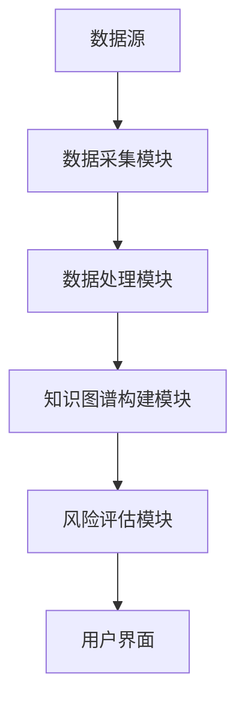
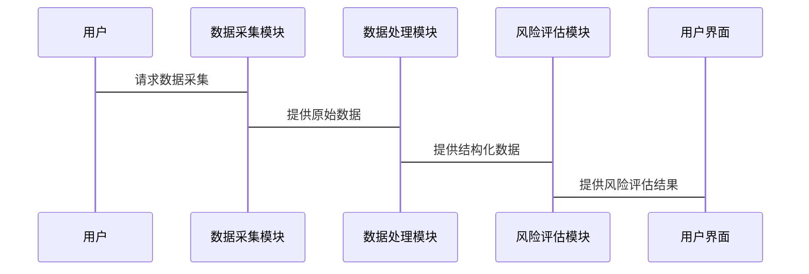

                 


# AI Agents 协作分析地缘政治风险：全球价值投资的必备工具

## 关键词：  
AI代理, 地缘政治风险, 全球价值投资, 自然语言处理, 知识图谱, 风险评估模型

## 摘要：  
地缘政治风险是全球价值投资中不可忽视的重要因素。随着人工智能技术的快速发展，AI代理（AI Agents）作为一种新兴的技术工具，正在成为分析地缘政治风险的关键手段。本文将从地缘政治风险的定义、特征及其对全球价值投资的影响入手，深入探讨AI代理协作的原理、算法、系统架构及实际应用。通过案例分析和实战演示，本文将为读者展示如何利用AI代理协作技术有效分析地缘政治风险，并为全球价值投资提供科学决策支持。

---

## 第一部分：地缘政治风险的背景与挑战

### 第1章：地缘政治风险的定义与特征

#### 1.1 地缘政治风险的定义与特征
地缘政治风险是指由于国家间的地理、政治、经济和文化等因素的变化，可能导致的投资损失风险。其主要特征包括：  
1. **复杂性**：涉及多方面的因素，如政治制度、国际关系、经济政策等。  
2. **不确定性**：难以准确预测，具有高度的不可控性。  
3. **全局性**：地缘政治风险往往影响多个地区和国家，具有全球性特征。  
4. **动态性**：随着国际形势的变化而不断调整和变化。  

#### 1.2 全球化背景下的地缘政治风险
全球化促进了经济和文化的交流，但也带来了新的地缘政治风险。例如，国际贸易摩擦、地区冲突、政策变化等都可能对全球投资产生重大影响。  

#### 1.3 地缘政治风险对全球价值投资的影响
地缘政治风险直接影响投资决策，可能导致资产损失或收益波动。投资者需要通过有效的工具和方法，提前识别和评估这些风险，以制定科学的投资策略。

---

## 第二部分：AI代理协作的核心概念

### 第2章：AI代理的基本概念

#### 2.1 AI代理的定义与类型
AI代理是一种能够感知环境、执行任务并做出决策的智能实体。根据功能和应用场景的不同，AI代理可以分为以下几种类型：  
- **简单反应式代理**：基于当前感知做出反应。  
- **基于模型的反射式代理**：利用内部模型进行推理和决策。  
- **目标驱动型代理**：根据预设目标执行任务。  

#### 2.2 AI代理协作的原理
AI代理协作是指多个AI代理通过协同工作，共同完成复杂任务的过程。其核心机制包括：  
- **任务分配**：根据代理的能力和当前任务需求分配任务。  
- **信息共享**：代理之间共享数据和知识，提高整体决策能力。  
- **协调与同步**：通过通信机制确保代理之间的协同工作。  

#### 2.3 地缘政治风险分析中的AI代理协作
在地缘政治风险分析中，AI代理可以通过协作实现以下目标：  
- **数据收集与整合**：从多源数据中提取相关信息。  
- **风险识别与评估**：通过分析数据识别潜在风险。  
- **预测与模拟**：基于历史数据和模型预测未来风险。  

---

## 第三部分：地缘政治风险分析的AI代理协作框架

### 第3章：地缘政治风险分析的框架结构

#### 3.1 分析框架的层次结构
地缘政治风险分析的框架可以分为以下层次：  
1. **数据层**：包括地理、政治、经济等多源数据。  
2. **知识层**：构建知识图谱，提取关键实体和关系。  
3. **模型层**：建立风险评估模型，进行预测和模拟。  

#### 3.2 AI代理协作在地缘政治风险分析中的应用
AI代理协作在地缘政治风险分析中的具体应用包括：  
- **数据处理**：代理通过自然语言处理技术提取文本数据中的信息。  
- **知识构建**：利用知识图谱技术构建地缘政治实体的关联关系。  
- **风险评估**：基于机器学习模型对风险进行量化评估。  

#### 3.3 地缘政治风险分析的AI代理协作模型
地缘政治风险分析的AI代理协作模型包括以下步骤：  
1. 数据采集与清洗：从新闻、政府报告等多源数据中提取相关信息。  
2. 知识图谱构建：将提取的信息转化为结构化的知识图谱。  
3. 风险评估：基于知识图谱构建风险评估模型，预测潜在风险。  

---

## 第四部分：地缘政治风险分析的AI代理协作算法原理

### 第4章：自然语言处理在地缘政治风险分析中的应用

#### 4.1 自然语言处理的基本原理
自然语言处理（NLP）是AI代理协作中重要的技术之一。其基本原理包括：  
- **文本分词**：将文本分割成词语或短语。  
- **实体识别**：识别文本中的实体（如人名、地名、组织名等）。  
- **关系抽取**：提取文本中的实体关系。  

#### 4.2 基于NLP的地缘政治风险分析
通过NLP技术，AI代理可以自动提取新闻、报告中的关键信息，构建地缘政治实体之间的关系网络。例如，可以通过分析某国政策变化对全球经济的影响，预测潜在的投资风险。  

#### 4.3 NLP技术的优缺点
NLP技术的优势在于能够处理大量非结构化数据，但其局限性在于对上下文的理解能力有限，可能导致误判。  

---

## 第五部分：系统架构与项目实战

### 第5章：系统架构设计

#### 5.1 系统功能设计
地缘政治风险分析系统的主要功能包括：  
- 数据采集与处理：从多源数据中提取相关信息。  
- 知识图谱构建：构建地缘政治实体的关系网络。  
- 风险评估：基于知识图谱进行风险预测。  

#### 5.2 系统架构图
以下是系统的架构设计图：



#### 5.3 系统交互流程
以下是系统的交互流程图：



---

## 第六部分：项目实战与案例分析

### 第6章：项目实战

#### 6.1 环境安装
要运行本系统，需要安装以下工具和库：  
- Python 3.8及以上版本  
- NLP库（如spaCy、NLTK）  
- 图数据库（如Neo4j）  
- 机器学习库（如Scikit-learn）  

#### 6.2 核心实现代码
以下是系统核心代码示例：

```python
import spacy
from spacy import displacy

# 加载NLP模型
nlp = spacy.load("en_core_web_sm")

# 示例文本
text = "The trade war between China and the US has significantly impacted global markets."

# 文本处理
doc = nlp(text)

# 实体识别
ents = [(ent.text, ent.label_) for ent in doc.ents]
print("实体识别结果：", ents)

# 可视化结果
displacy.render(doc, style="ent")
```

#### 6.3 案例分析：中美贸易摩擦
通过AI代理协作技术，我们可以分析中美贸易摩擦对全球市场的潜在影响。以下是具体步骤：  
1. 数据采集：收集相关新闻、政府报告等数据。  
2. 数据处理：提取关键实体（如“中国”、“美国”、“贸易政策”等）。  
3. 知识图谱构建：构建中美贸易摩擦相关的实体关系网络。  
4. 风险评估：基于知识图谱预测潜在的投资风险。  

---

## 第七部分：总结与展望

### 第7章：总结与展望

#### 7.1 最佳实践 tips
- 在实际应用中，建议结合多种技术手段（如NLP、知识图谱、机器学习）进行综合分析。  
- 数据质量和完整性对风险评估结果有重要影响，需确保数据来源可靠。  

#### 7.2 项目小结
本文通过AI代理协作技术，展示了如何有效分析地缘政治风险，并为全球价值投资提供科学决策支持。  

#### 7.3 注意事项
在实际应用中，需注意数据隐私和安全问题，避免数据泄露风险。  

#### 7.4 拓展阅读
- 推荐阅读《人工智能在金融领域的应用》  
- 推荐学习的知识图谱构建工具：Neo4j、OntoNotes  

---

通过以上内容，我们可以看到AI代理协作在地缘政治风险分析中的巨大潜力。随着技术的不断进步，AI代理将为全球价值投资提供更加精准和高效的支持。

