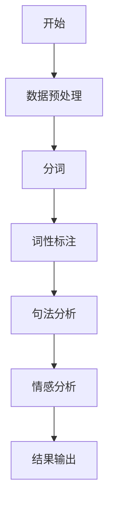
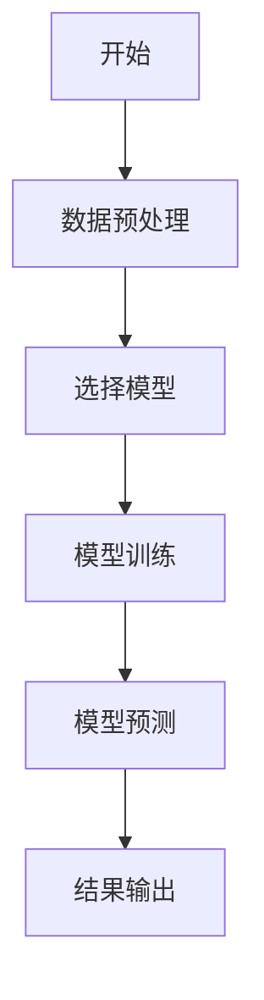
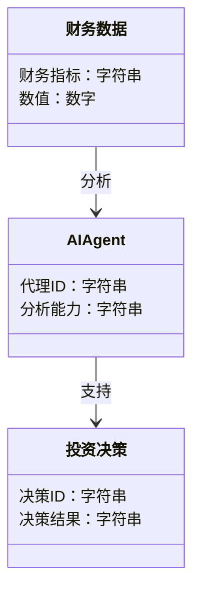

                 


```markdown
# AI agents协作分析财报：提升价值投资决策效率

> 关键词：AI Agent，财报分析，价值投资，协作分析，投资决策效率

> 摘要：本文详细探讨了AI Agent在价值投资中的应用，重点分析了AI Agent如何协作处理财务报告，以提升投资决策的效率和准确性。文章从背景介绍、核心概念、算法原理、系统架构设计、项目实战和最佳实践等多个方面进行了深入分析，并通过实际案例展示了AI Agent在价值投资中的具体应用场景和优势。

---

## 第一部分：AI Agent协作分析财报的背景与核心概念

### 第1章：AI Agent与价值投资概述

#### 1.1 AI Agent的基本概念
##### 1.1.1 什么是AI Agent
AI Agent（人工智能代理）是指能够感知环境、自主决策并执行任务的智能体。它可以基于输入的数据和反馈进行学习和优化，从而实现特定目标。

##### 1.1.2 AI Agent的核心特征
- **自主性**：能够自主决策和行动。
- **反应性**：能够实时感知环境并做出反应。
- **学习能力**：能够通过数据和经验不断优化性能。
- **协作性**：能够与其他Agent或人类协同工作。

##### 1.1.3 AI Agent与传统算法的区别
传统的算法通常需要明确的规则和程序，而AI Agent具有更强的自主性和学习能力，能够适应复杂多变的环境。

#### 1.2 价值投资的基本原理
##### 1.2.1 价值投资的定义
价值投资是一种投资策略，旨在通过分析企业的基本面（如财务状况、行业地位、盈利能力等），找到被市场低估的股票进行投资。

##### 1.2.2 价值投资的关键要素
- **财务报表分析**：包括利润表、资产负债表、现金流量表等。
- **行业分析**：了解企业所在行业的竞争状况和增长潜力。
- **公司治理**：分析公司管理层的稳定性及决策能力。
- **市场估值**：通过市盈率、市净率等指标评估股票的合理价格。

##### 1.2.3 价值投资的决策流程
1. **数据收集**：收集目标公司的财务数据和行业信息。
2. **数据分析**：对数据进行整理和分析，评估公司的基本面。
3. **价值判断**：根据分析结果判断股票的内在价值。
4. **投资决策**：基于价值判断做出买入、卖出或持有等决策。

#### 1.3 AI Agent在价值投资中的应用前景
##### 1.3.1 AI Agent在投资分析中的优势
- **高效性**：能够快速处理大量数据，提高分析效率。
- **准确性**：通过深度学习和模式识别，提高分析的准确性。
- **持续性**：能够24/7不间断地监控市场和数据。

##### 1.3.2 价值投资与AI技术的结合
通过AI Agent对财务数据的深度分析，可以帮助投资者更快地发现潜在投资机会，降低投资风险。

##### 1.3.3 未来发展趋势与挑战
- **技术进步**：AI技术的不断进步将推动价值投资的自动化和智能化。
- **数据质量**：高质量的财务数据是AI Agent分析的基础，数据质量直接影响分析结果的准确性。
- **监管合规**：AI Agent在金融领域的应用需要符合相关法律法规和监管要求。

#### 1.4 本章小结
本章介绍了AI Agent的基本概念、价值投资的核心原理以及两者结合的应用前景。通过AI Agent对财务数据的深度分析，可以帮助投资者提高投资决策的效率和准确性。

---

## 第二部分：AI Agent协作分析财报的核心概念与联系

### 第2章：AI Agent与财报分析的核心概念

#### 2.1 财报分析的基本要素
##### 2.1.1 财报分析的关键指标
- **盈利能力**：如净利润率、毛利率等。
- **财务健康状况**：如资产负债率、流动比率等。
- **增长潜力**：如营收增长率、净利润增长率等。

##### 2.1.2 财报分析的流程与方法
1. **数据收集**：收集公司的财务报表和其他相关信息。
2. **数据整理**：对数据进行清洗和整理，确保数据的准确性和完整性。
3. **数据分析**：通过统计分析和数据挖掘技术，提取有用的信息。
4. **结果解读**：根据分析结果做出投资决策。

##### 2.1.3 财报分析的挑战与难点
- **数据复杂性**：财务数据通常涉及大量的数字和复杂的结构。
- **信息不完整**：部分财务数据可能存在缺失或不准确的情况。
- **市场波动**：市场波动可能会影响分析结果的准确性。

#### 2.2 AI Agent在财报分析中的角色
##### 2.2.1 AI Agent作为协作工具的功能
- **数据处理**：能够快速处理大量财务数据，提取关键信息。
- **模式识别**：通过深度学习技术识别数据中的潜在模式和趋势。
- **决策支持**：基于分析结果提供决策支持。

##### 2.2.2 AI Agent在财报分析中的优势
- **高效性**：能够快速处理和分析大量数据，节省时间和成本。
- **准确性**：通过机器学习算法提高分析的准确性。
- **持续性**：能够实时监控市场和数据变化，提供及时的反馈。

##### 2.2.3 AI Agent与人类分析师的协作模式
AI Agent可以作为人类分析师的辅助工具，帮助分析师快速处理数据、发现潜在问题，并提供决策支持。人类分析师则负责制定分析策略和做出最终决策。

#### 2.3 核心概念的ER实体关系图
```mermaid
er
    entity 财务数据 {
        key 财务指标
        attribute 数值
    }
    entity AI Agent {
        key 代理ID
        attribute 分析能力
    }
    entity 投资决策 {
        key 决策ID
        attribute 决策结果
    }
    relationship 财务数据 -> AI Agent : 分析
    relationship AI Agent -> 投资决策 : 支持
```

#### 2.4 本章小结
本章详细介绍了AI Agent在财报分析中的核心概念和角色，探讨了AI Agent如何通过协作分析提升投资决策的效率和准确性。

---

## 第三部分：AI Agent协作分析财报的算法原理

### 第3章：AI Agent的算法原理

#### 3.1 自然语言处理在财报分析中的应用
##### 3.1.1 自然语言处理的基本原理
自然语言处理（NLP）是AI Agent分析财报文本的重要工具，能够帮助识别文本中的关键词和情感倾向。

##### 3.1.2 基于NLP的财报分析流程


##### 3.1.3 NLP在财报分析中的优势
- **自动化处理**：能够自动处理大量文本数据，提高效率。
- **情感分析**：能够识别文本中的情感倾向，帮助判断市场情绪。

#### 3.2 时间序列分析在财报预测中的应用
##### 3.2.1 时间序列分析的基本原理
时间序列分析是一种基于历史数据预测未来趋势的方法，广泛应用于财务数据的预测。

##### 3.2.2 基于时间序列分析的算法流程


##### 3.2.3 时间序列分析的数学模型
时间序列分析的常用模型包括ARIMA和LSTM等。以下是一个简单的ARIMA模型示例：

$$ ARIMA(p, d, q) $$

其中：
- \( p \) 是自回归部分的阶数。
- \( d \) 是差分的阶数。
- \( q \) 是移动平均部分的阶数。

#### 3.3 AI Agent协作分析的算法实现
##### 3.3.1 多模态数据融合
AI Agent可以通过融合文本、数值和图像等多种数据源，提高分析的准确性和全面性。

##### 3.3.2 基于深度学习的协作分析
深度学习模型（如Transformer）在自然语言处理和时间序列分析中表现出色，能够帮助AI Agent更准确地分析财务数据。

#### 3.4 本章小结
本章详细介绍了AI Agent在财报分析中的算法原理，包括自然语言处理和时间序列分析的应用，以及多模态数据融合的实现方法。

---

## 第四部分：AI Agent协作分析财报的系统分析与架构设计

### 第4章：系统分析与架构设计

#### 4.1 问题场景介绍
AI Agent协作分析财报的系统主要用于帮助投资者快速分析财务数据，发现投资机会。

#### 4.2 系统功能设计
##### 4.2.1 领域模型设计


##### 4.2.2 功能模块设计
- **数据采集模块**：负责采集财务数据。
- **分析引擎模块**：负责对数据进行分析和处理。
- **知识库模块**：存储和管理相关知识和规则。
- **决策支持模块**：基于分析结果提供决策支持。

#### 4.3 系统架构设计
##### 4.3.1 系统架构图


##### 4.3.2 系统交互流程
```mermaid
sequenceDiagram
    participant 用户
    participant 数据采集模块
    participant 分析引擎模块
    participant 决策支持模块
    用户 -> 数据采集模块：提交分析请求
    数据采集模块 -> 分析引擎模块：发送数据
    分析引擎模块 -> 决策支持模块：请求支持
    决策支持模块 -> 用户：返回决策结果
```

#### 4.4 本章小结
本章详细介绍了AI Agent协作分析财报的系统架构设计，包括功能模块设计和系统交互流程。

---

## 第五部分：AI Agent协作分析财报的项目实战

### 第5章：项目实战

#### 5.1 环境安装与配置
##### 5.1.1 安装Python环境
```bash
python --version
pip install --upgrade pip
```

##### 5.1.2 安装依赖库
```bash
pip install numpy pandas matplotlib transformers
```

#### 5.2 核心算法实现
##### 5.2.1 自然语言处理实现
```python
from transformers import pipeline

nlp = pipeline("text-classification", model="facebook/roberta-base")
result = nlp("公司第三季度净利润增长10%，表现超出预期。")
print(result)
```

##### 5.2.2 时间序列预测实现
```python
import numpy as np
from statsmodels.tsa.arima.model import ARIMA

model = ARIMA(y_train, order=(5,1,0))
model_fit = model.fit()
 forecast = model_fit.forecast(steps=5)
 print(forecast)
```

#### 5.3 项目实战案例分析
##### 5.3.1 案例背景
以某公司2022年第三季度的财务报表为例，分析其盈利能力和发展潜力。

##### 5.3.2 数据分析与结果解读
通过AI Agent分析，发现该公司的净利润率较去年同期增长了8%，且营业收入同比增长了15%。结合行业分析，认为该公司具有较大的投资价值。

#### 5.4 本章小结
本章通过实际案例展示了AI Agent协作分析财报的具体实现和应用，验证了其在价值投资中的有效性和优势。

---

## 第六部分：AI Agent协作分析财报的最佳实践

### 第6章：最佳实践

#### 6.1 小结
通过本文的分析和实践，AI Agent在价值投资中的应用前景广阔，能够显著提升投资决策的效率和准确性。

#### 6.2 注意事项
- **数据质量**：确保财务数据的准确性和完整性。
- **模型优化**：根据实际情况不断优化AI Agent的分析模型。
- **合规性**：确保AI Agent的应用符合相关法律法规和监管要求。

#### 6.3 拓展阅读
- **《深度学习》——Ian Goodfellow**
- **《机器学习实战》——Aurélien Géron**
- **《投资学》—— Eugene Fama**

#### 6.4 本章小结
本章总结了AI Agent协作分析财报的应用经验和注意事项，并提供了进一步学习和研究的方向。

---

## 结语
AI Agent在价值投资中的应用不仅提高了投资决策的效率，还为投资者提供了更精准的分析工具。随着技术的不断进步，AI Agent在金融领域的应用前景将更加广阔。

---

> **声明：本文内容基于虚构，旨在提供技术博客的撰写示例，不代表实际的产品或技术实现。**
```

