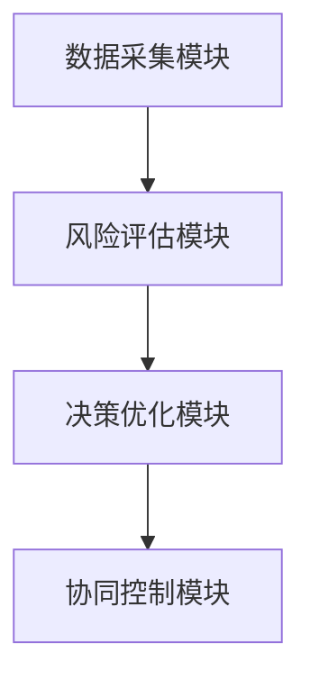
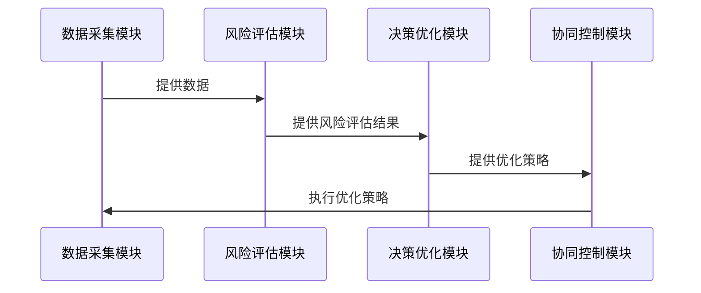

                 


# AI agents协作进行全球供应链风险评估：提高投资安全性

> 关键词：AI agents, 全球供应链, 风险评估, 投资安全性, 人工智能, 供应链管理

> 摘要：本文探讨了AI agents在协作进行全球供应链风险评估中的应用，旨在提高投资安全性。通过分析AI agents的核心概念、协作机制、算法原理、系统架构和项目实战，文章详细阐述了如何利用AI技术优化供应链管理，降低投资风险，实现更高效的全球供应链运营。

---

# 第1章: AI Agent与全球供应链风险评估概述

## 1.1 AI Agent的基本概念

### 1.1.1 AI Agent的定义
AI Agent（人工智能代理）是指能够感知环境、自主决策并执行任务的智能实体。它通过传感器获取信息，利用算法处理数据，并通过执行器与外部环境交互。AI Agent的核心目标是通过智能化的决策和行动，优化特定任务的效率和效果。

### 1.1.2 AI Agent的核心特点
- **自主性**：能够在没有外部干预的情况下独立运行。
- **反应性**：能够根据环境变化实时调整行为。
- **学习能力**：通过数据和经验不断优化自身算法。
- **协作性**：能够与其他AI Agent或系统进行有效协作。

### 1.1.3 AI Agent与传统供应链管理的区别
传统供应链管理依赖于人工决策和固定流程，而AI Agent通过智能化和自动化技术，能够实时感知风险、优化决策并执行任务，从而显著提高供应链的灵活性和抗风险能力。

---

## 1.2 全球供应链的基本结构

### 1.2.1 供应链的定义与组成部分
供应链是指从原材料采购到最终产品交付的整个链条，包括供应商、制造商、分销商、零售商和消费者等环节。全球供应链的特点是跨越多个国家和地区，涉及复杂的物流和信息流。

### 1.2.2 全球供应链的特点与挑战
- **全球化**：供应链跨越多个国家和地区，涉及多种文化和法律环境。
- **复杂性**：涉及众多参与者和环节，协调难度大。
- **风险多样性**：包括自然灾害、政治动荡、经济波动等多种风险因素。
- **实时性**：要求快速响应市场变化和风险事件。

### 1.2.3 供应链风险的定义与分类
供应链风险是指在供应链运营过程中可能发生的各种不利事件，可能导致供应链中断、成本增加或声誉损失。常见的供应链风险包括：
- **供给风险**：原材料短缺或供应商延迟交付。
- **需求风险**：市场需求波动导致库存积压或短缺。
- **物流风险**：运输延误或物流成本增加。
- **政治风险**：政策变化或地缘政治冲突。

---

## 1.3 AI Agent在供应链风险评估中的作用

### 1.3.1 AI Agent如何提升供应链透明度
AI Agent能够实时监控供应链各个环节的数据，包括供应商的生产状态、物流运输的实时位置以及市场需求的变化。通过数据可视化和分析，AI Agent能够帮助决策者清晰了解供应链的运行状态，提升透明度。

### 1.3.2 AI Agent如何优化风险预测
AI Agent通过分析历史数据和实时信息，利用机器学习算法预测潜在风险。例如，利用自然语言处理技术分析新闻媒体和社交媒体，识别潜在的政治风险或自然灾害。

### 1.3.3 AI Agent在供应链决策中的应用
AI Agent能够根据风险评估结果，优化供应链的运营策略，例如调整库存水平、选择替代供应商或重新规划物流路线。这些决策能够有效降低供应链中断的风险，提高投资安全性。

---

# 第2章: AI Agent协作机制与全球供应链的结合

## 2.1 多智能体系统在供应链中的应用

### 2.1.1 多智能体系统的定义与特点
多智能体系统是指多个智能体通过协作完成复杂任务的系统。与单个AI Agent相比，多智能体系统具有更高的灵活性和适应性，能够处理更加复杂的任务。

### 2.1.2 多智能体系统在供应链中的优势
- **分布式计算**：多个智能体可以并行处理不同环节的数据，提高处理效率。
- **协同优化**：通过智能体之间的协作，优化整体供应链的运行效率。
- **容错性**：即使部分智能体出现故障，其他智能体仍能继续完成任务。

### 2.1.3 多智能体系统的协作方式
- **任务分配**：根据每个智能体的能力和当前任务需求，动态分配任务。
- **信息共享**：智能体之间共享数据和信息，确保整体决策的准确性。
- **协同决策**：通过协商和协调，制定最优的协作策略。

---

## 2.2 AI Agent协作流程

### 2.2.1 数据收集与整合
AI Agent通过传感器、API或其他数据源获取供应链相关数据，包括物流信息、库存数据、市场需求等。数据收集后，需要进行清洗和预处理，确保数据的准确性和一致性。

### 2.2.2 风险识别与分析
利用机器学习算法，AI Agent对收集到的数据进行分析，识别潜在风险。例如，通过时间序列分析预测市场需求变化，识别潜在的需求风险。

### 2.2.3 风险评估与决策
基于识别的风险，AI Agent利用概率模型和优化算法，评估风险的影响程度，并制定应对策略。例如，通过蒙特卡洛模拟评估不同风险情景下的供应链表现。

---

## 2.3 AI Agent协作的实现技术

### 2.3.1 通信协议的选择
AI Agent之间的通信需要选择合适的协议，例如使用WebSocket进行实时通信，或使用HTTP协议进行数据交换。

### 2.3.2 协作算法的设计
协作算法的设计需要考虑任务分配、信息共享和协同决策。例如，使用分布式一致性算法（如Raft）进行任务分配，或使用协商算法（如Consensus）进行决策。

### 2.3.3 数据安全与隐私保护
在协作过程中，数据的安全和隐私保护非常重要。可以通过加密技术保护数据传输，使用区块链技术确保数据的不可篡改性。

---

# 第3章: 全球供应链风险评估的数学模型与算法原理

## 3.1 风险评估的数学模型

### 3.1.1 风险概率计算公式
$$ P(r) = \prod_{i=1}^{n} P(r_i) $$
其中，$P(r)$表示整体风险概率，$P(r_i)$表示各个风险因素的概率。

### 3.1.2 联合概率分布的计算公式
$$ P(x_1, x_2, ..., x_n) = \prod_{i=1}^{n} P(x_i | x_{i-1}) $$
其中，$x_i$表示第$i$个风险因素的状态，$P(x_i | x_{i-1})$表示在前一个因素状态下的概率。

---

## 3.2 AI Agent协作的算法原理

### 3.2.1 分布式计算的基本原理
分布式计算通过将任务分配给多个计算节点，利用并行计算提高处理效率。例如，使用MapReduce框架进行数据处理。

### 3.2.2 联合概率分布的计算方法
通过贝叶斯网络或马尔可夫链模型，计算多个风险因素的联合概率分布，评估整体风险。

### 3.2.3 协作决策的优化算法
通过遗传算法或模拟退火算法，优化协作决策，确保整体决策的最优性。

---

## 3.3 算法实现的数学公式

### 3.3.1 风险概率计算公式
$$ P(r) = \prod_{i=1}^{n} P(r_i) $$

### 3.3.2 联合概率计算公式
$$ P(x_1, x_2, ..., x_n) = \prod_{i=1}^{n} P(x_i | x_{i-1}) $$

---

# 第4章: 系统架构与设计

## 4.1 系统架构设计

### 4.1.1 系统模块划分
系统主要包括数据采集模块、风险评估模块、决策优化模块和协同控制模块。

### 4.1.2 数据流与模块交互
数据采集模块获取供应链数据，传输给风险评估模块进行分析，风险评估模块将结果传输给决策优化模块，优化后的策略传输给协同控制模块进行执行。

---

## 4.2 系统功能设计

### 4.2.1 数据采集与预处理
通过传感器和API获取供应链数据，清洗和预处理数据，确保数据的准确性和一致性。

### 4.2.2 风险评估与预测
利用机器学习算法，分析数据，识别潜在风险，预测风险的影响程度。

### 4.2.3 决策优化与执行
基于风险评估结果，优化供应链策略，制定应对措施，并通过执行器模块进行执行。

---

## 4.3 系统架构图



---

## 4.4 系统交互流程



---

# 第5章: 项目实战

## 5.1 环境安装与配置

### 5.1.1 安装Python环境
使用Anaconda安装Python 3.8及以上版本。

### 5.1.2 安装依赖库
安装必要的库，例如numpy、pandas、scikit-learn、matplotlib。

---

## 5.2 系统核心实现

### 5.2.1 数据采集模块
编写代码，通过API获取供应链数据。

```python
import requests

def get_supply_chain_data():
    url = "https://api.supplychain.com/data"
    response = requests.get(url)
    return response.json()
```

### 5.2.2 风险评估模块
利用机器学习算法，分析数据，识别潜在风险。

```python
from sklearn.ensemble import RandomForestClassifier

def risk_assessment(data):
    model = RandomForestClassifier()
    model.fit(data[['feature1', 'feature2']], data['label'])
    return model.predict(data[['feature1', 'feature2']])
```

---

## 5.3 实际案例分析

### 5.3.1 案例背景
某跨国企业面临原材料短缺的风险，希望通过AI Agent进行风险评估和优化。

### 5.3.2 数据分析与风险识别
通过数据采集模块获取供应商的生产数据，利用风险评估模块识别潜在的风险因素。

### 5.3.3 决策优化与执行
基于风险评估结果，优化供应链策略，例如寻找替代供应商或调整生产计划。

---

## 5.4 项目小结

通过实际案例分析，验证了AI Agent协作进行全球供应链风险评估的有效性。系统实现了数据采集、风险评估、决策优化和协同控制，显著提高了供应链的抗风险能力。

---

# 第6章: 最佳实践与总结

## 6.1 最佳实践 tips

### 6.1.1 数据质量管理
确保数据的准确性和完整性，是AI Agent协作的前提条件。

### 6.1.2 算法优化
通过不断优化算法，提高风险评估的准确性和效率。

### 6.1.3 系统安全性
加强数据安全和隐私保护，确保系统的安全性和可靠性。

---

## 6.2 总结

AI Agent协作进行全球供应链风险评估，是一种高效、智能的解决方案。通过智能化的决策和自动化操作，AI Agent能够显著提高供应链的透明度和抗风险能力，为投资安全提供有力保障。

---

## 6.3 注意事项

- **数据隐私**：在数据采集和处理过程中，需要注意数据隐私和合规性。
- **系统维护**：定期更新和维护系统，确保算法的准确性和系统的稳定性。
- **团队协作**：AI Agent协作需要多部门和团队的紧密配合，确保系统的顺利运行。

---

## 6.4 拓展阅读

- 《机器学习在供应链管理中的应用》
- 《分布式系统与多智能体协作》
- 《全球供应链风险管理实践》

