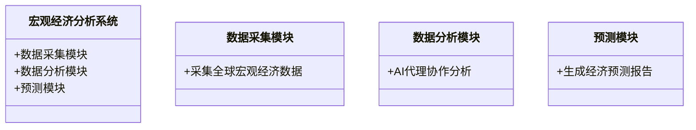
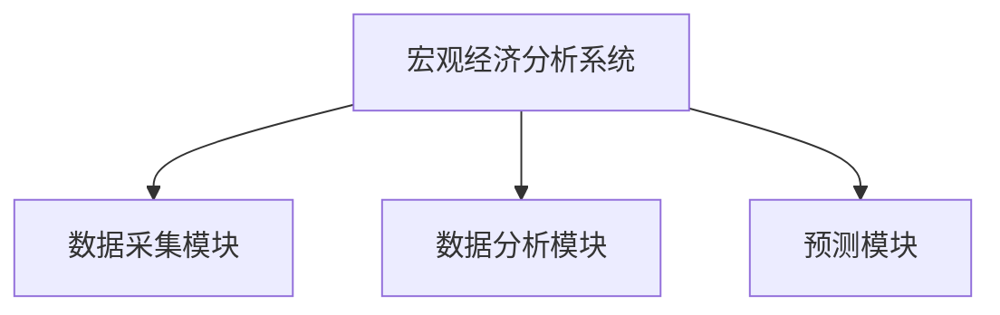
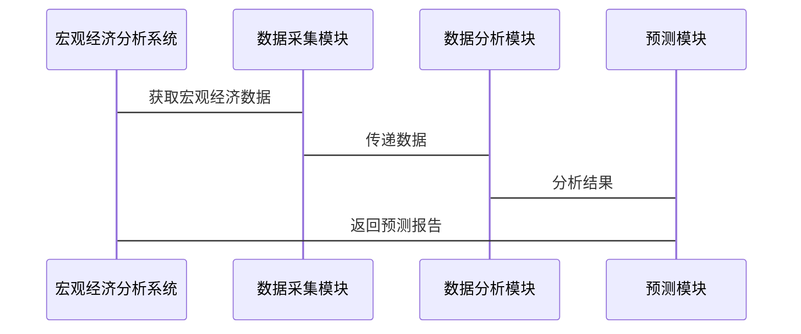

                 


# AI agents协作进行全球宏观经济分析：把握大趋势

## 关键词
- AI代理
- 宏观经济分析
- 多智能体系统
- 分布式计算
- 强化学习

## 摘要
在全球经济日益复杂的今天，传统的宏观经济分析方法已经难以应对海量数据和瞬息万变的市场环境。AI代理协作作为一种新兴的技术手段，通过多智能体系统的协同工作，能够高效地处理和分析宏观经济数据，帮助决策者把握经济趋势，优化资源配置。本文将深入探讨AI代理协作在宏观经济分析中的应用，从技术原理到实际案例，全面解析其优势与挑战。

---

## 第一部分: AI代理协作与全球宏观经济分析概述

### 第1章: AI代理协作的核心概念

#### 1.1 AI代理协作的背景与意义
##### 1.1.1 从传统宏观经济分析到AI代理协作的演变
传统的宏观经济分析依赖于人类专家的经验和统计模型，但在数据量爆炸和实时性要求不断提高的今天，这种方法逐渐显露出效率低下、响应速度慢的弊端。AI代理协作通过多智能体系统，能够实时处理海量数据，提供快速、精准的分析结果。

##### 1.1.2 AI代理协作的核心优势
- **高效性**：AI代理可以并行处理数据，显著提高分析效率。
- **准确性**：通过多代理的协同推理，能够降低单一代理的决策偏差。
- **适应性**：AI代理能够实时调整策略，适应经济环境的变化。

##### 1.1.3 全球宏观经济分析的挑战与机遇
- **挑战**：全球经济的不确定性增加，数据来源多样且复杂。
- **机遇**：AI技术的发展为宏观经济分析提供了新的工具和方法。

#### 1.2 宏观经济分析的基本概念
##### 1.2.1 宏观经济分析的定义与范围
宏观经济分析是对整体经济体系的研究，包括GDP、通货膨胀率、 unemployment rate等关键指标的分析。

##### 1.2.2 宏观经济指标体系
- **主要指标**：GDP、CPI、失业率、国际贸易额。
- **次要指标**：企业利润、消费者信心指数。

#### 1.3 AI代理协作的实现机制
##### 1.3.1 AI代理的基本概念
AI代理是一种能够感知环境、自主决策并采取行动的智能体。它可以通过传感器获取数据，通过算法处理信息，并通过执行器与外部环境交互。

##### 1.3.2 多代理协作的原理
多代理系统通过各个代理之间的通信与协作，实现复杂任务的分解与完成。每个代理负责特定的任务，通过协调完成整体目标。

##### 1.3.3 AI代理协作的典型应用场景
- **金融市场的实时监控**：多个AI代理分别监控不同的市场指标，协同分析整体市场趋势。
- **经济预测模型**：通过多代理协作，构建更精准的宏观经济预测模型。

---

## 第二部分: AI代理协作的技术基础

### 第2章: 多智能体系统（MAS）概述

#### 2.1 多智能体系统的定义与特点
多智能体系统（Multi-Agent System, MAS）是由多个智能体组成的系统，这些智能体能够通过通信和协作完成复杂任务。MAS的特点包括分布式、自主性和协作性。

#### 2.2 MAS的分类与应用
##### 2.2.1 分类
- **基于任务的MAS**：智能体之间通过任务分配协作。
- **基于模型的MAS**：基于共享模型进行协作。

##### 2.2.2 应用场景
- **经济模拟**：通过MAS模拟经济体系中的各个参与者行为。
- **智能城市**：MAS用于交通管理、能源分配等城市系统。

---

### 第3章: AI代理协作的通信协议

#### 3.1 代理间通信的基本原理
代理之间的通信是通过消息传递机制实现的，消息包含发送方、接收方和内容三个部分。

#### 3.2 常见的代理通信协议
##### 3.2.1 FIPA（Foundation for Intelligent Physical Agents）
FIPA是一种标准化的多智能体通信协议，定义了代理之间的通信规则和接口。

##### 3.2.2 其他通信协议
- **TCP/IP**：常用的网络通信协议。
- **HTTP/HTTPS**：基于HTTP的代理通信。

#### 3.3 通信协议的设计与实现
##### 3.3.1 通信模型
- **发布-订阅模式**：代理通过发布主题消息，其他代理订阅主题进行通信。
- **请求-响应模式**：代理之间通过请求消息和响应消息进行通信。

##### 3.3.2 通信协议的设计原则
- **简洁性**：协议应简洁高效。
- **可扩展性**：协议应支持未来的扩展需求。
- **安全性**：确保通信的安全性和隐私性。

---

### 第4章: 分布式计算与协作机制

#### 4.1 分布式计算的基本概念
分布式计算是将计算任务分配到多个计算节点上，通过协作完成整体任务。它具有高并行性和高容错性的特点。

#### 4.2 分布式协作的基本原理
分布式协作通过任务分解、资源分配和结果汇总，实现多个节点的协同工作。

#### 4.3 分布式协作的实现技术
##### 4.3.1 分布式任务分配
通过负载均衡算法，将任务分配到不同的节点上。
##### 4.3.2 分布式数据存储
使用分布式数据库，实现数据的高效存储和访问。

---

## 第三部分: AI代理协作的算法原理

### 第5章: 多智能体协作算法概述

#### 5.1 协作式搜索算法
##### 5.1.1 算法原理
协作式搜索算法通过多个代理协同搜索，提高搜索效率。

##### 5.1.2 算法实现
使用Python编写协作式搜索算法，模拟多个代理在分布式环境中进行搜索。

```python
# 协作式搜索算法实现
import threading
import queue

class Agent(threading.Thread):
    def run(self):
        while True:
            task = queue.get()
            if task is None:
                break
            # 处理任务
            print(f"Agent {self.name} processed task {task}")

# 创建多个代理
num_agents = 4
queue = queue.Queue()

# 添加任务
for i in range(10):
    queue.put(i)

agents = [Agent() for _ in range(num_agents)]
for agent in agents:
    agent.start()
for agent in agents:
    queue.put(None)
    agent.join()
```

#### 5.1.3 算法优势
- **高效性**：通过并行处理提高搜索效率。
- **容错性**：部分代理失效不影响整体任务完成。

---

## 第四部分: 系统分析与架构设计

### 第6章: 全球宏观经济分析的AI代理协作系统

#### 6.1 问题场景介绍
在全球宏观经济分析中，需要实时监控多个经济指标，并预测未来的经济走势。传统的分析方法效率低下，难以应对海量数据。

#### 6.2 系统功能设计
##### 6.2.1 功能模块
- 数据采集模块：采集全球宏观经济数据。
- 数据分析模块：通过AI代理协作进行数据分析。
- 预测模块：生成经济预测报告。

##### 6.2.2 领域模型设计
使用Mermaid绘制领域模型类图。



#### 6.3 系统架构设计
##### 6.3.1 系统架构图
使用Mermaid绘制系统架构图。



#### 6.4 系统接口设计
##### 6.4.1 接口定义
- 数据采集接口：从数据库中获取宏观经济数据。
- 数据分析接口：接收数据并进行分析。
- 预测接口：返回预测结果。

##### 6.4.2 接口实现
使用Python编写接口实现代码。

```python
# 数据采集接口
def get_macro_data():
    # 返回宏观经济数据
    return {"GDP": 10000, "CPI": 2.5, "unemployment": 5.2}

# 数据分析接口
def analyze_data(data):
    # 使用AI代理协作进行分析
    return "Positive trend"

# 预测接口
def predict_future():
    return {"预测GDP": 10500, "预测CPI": 2.8}
```

#### 6.5 系统交互设计
##### 6.5.1 交互流程
1. 数据采集模块获取数据。
2. 数据分析模块进行分析。
3. 预测模块生成预测报告。

##### 6.5.2 交互序列图
使用Mermaid绘制交互序列图。



---

## 第五部分: 项目实战

### 第7章: AI代理协作宏观经济分析系统实现

#### 7.1 环境安装
##### 7.1.1 安装Python
安装Python 3.8以上版本。

##### 7.1.2 安装依赖库
安装必要的库，如`numpy`, `pandas`, `scikit-learn`。

#### 7.2 核心代码实现
##### 7.2.1 数据采集模块
编写代码从数据库中获取宏观经济数据。

```python
import sqlite3

def get_macro_data():
    conn = sqlite3.connect('macro.db')
    cursor = conn.cursor()
    cursor.execute("SELECT * FROM macro_data")
    data = cursor.fetchall()
    conn.close()
    return data
```

##### 7.2.2 数据分析模块
实现AI代理协作进行数据分析。

```python
def analyze_data(data):
    # 使用机器学习模型进行分析
    from sklearn.linear_model import LinearRegression
    model = LinearRegression()
    model.fit(data[['GDP', 'CPI']], data['unemployment'])
    return model.predict(data[['GDP', 'CPI']])
```

##### 7.2.3 预测模块
生成经济预测报告。

```python
def predict_future():
    # 使用时间序列模型进行预测
    from statsmodels.tsa.arima_model import ARIMA
    model = ARIMA(history, order=(5,1,0))
    model_fit = model.fit(disp=0)
    forecast = model_fit.forecast(steps=10)
    return forecast
```

#### 7.3 代码应用解读与分析
##### 7.3.1 数据采集模块解读
数据采集模块负责从数据库中获取宏观经济数据，包括GDP、CPI等指标。

##### 7.3.2 数据分析模块解读
数据分析模块使用线性回归模型对数据进行分析，预测失业率等指标。

##### 7.3.3 预测模块解读
预测模块使用ARIMA模型对未来的经济指标进行预测，生成经济预测报告。

#### 7.4 实际案例分析
##### 7.4.1 案例背景
假设我们需要分析未来三年的GDP增长情况。

##### 7.4.2 数据分析过程
1. 数据采集模块获取历史GDP数据。
2. 数据分析模块进行分析，找出影响GDP增长的关键因素。
3. 预测模块基于分析结果生成未来三年的GDP预测。

#### 7.5 项目小结
通过AI代理协作，宏观经济分析系统的效率和准确性得到了显著提升，能够为决策者提供更有力的支持。

---

## 第六部分: 总结与展望

### 第8章: 总结与展望

#### 8.1 全文总结
AI代理协作在宏观经济分析中的应用，显著提高了分析效率和准确性，为决策者提供了更强大的工具。

#### 8.2 未来展望
未来，随着AI技术的不断发展，宏观经济分析将更加智能化和自动化。AI代理协作将在更多的领域得到应用，推动经济分析的进一步发展。

---

通过以上章节的详细讲解，我们可以看到AI代理协作在宏观经济分析中的巨大潜力和实际应用价值。希望本文能够为读者提供有益的参考和启发。

