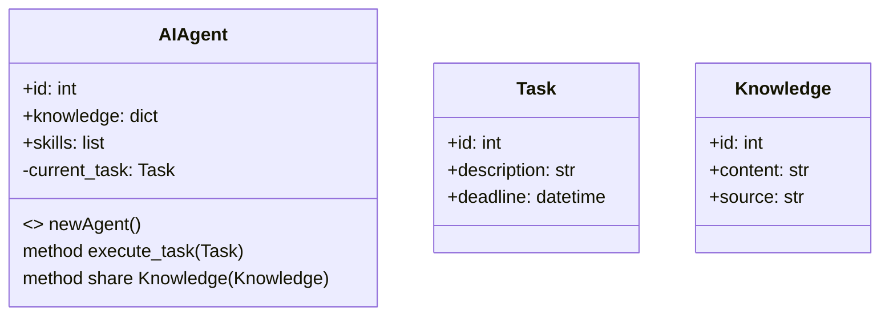
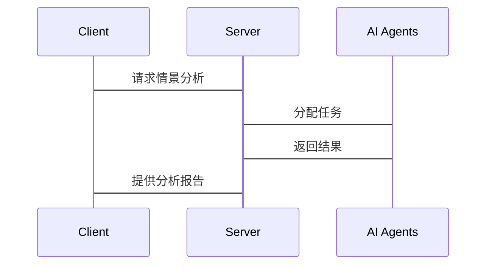

                 


# AI agents协作进行情景分析：增强价值投资的适应性

## 关键词：
- AI agents
- 情景分析
- 价值投资
- 适应性
- 投资分析

## 摘要：
本文探讨AI代理在情景分析中的协作应用，提升价值投资的适应性。通过背景介绍、核心概念分析、算法原理、系统设计和项目实战，系统阐述AI代理如何增强投资决策的智能化和适应性。

---

## 第1章：AI agents协作进行情景分析的背景与基础

### 1.1 问题背景

#### 1.1.1 传统投资分析的局限性
传统投资分析依赖人工经验和数据处理，存在主观性强、效率低、覆盖范围有限的问题。

#### 1.1.2 AI技术在金融领域的应用现状
AI技术在金融领域的应用日益广泛，尤其是在数据处理、预测模型和自动化交易方面。

#### 1.1.3 情景分析在价值投资中的重要性
情景分析通过模拟不同市场情况，帮助投资者评估投资组合的风险和收益。

### 1.2 问题描述

#### 1.2.1 传统情景分析的挑战
传统情景分析耗时且难以覆盖所有可能的市场情况。

#### 1.2.2 AI agents协作的优势
AI代理能够快速处理大量数据，提供多种情景分析，优化投资决策。

#### 1.2.3 价值投资适应性的提升目标
通过AI代理协作，提升投资策略的灵活性和适应性。

### 1.3 问题解决

#### 1.3.1 AI agents协作的核心机制
AI代理协作机制包括任务分配、信息共享和结果整合。

#### 1.3.2 情景分析的数字化转型
通过AI技术，情景分析从人工转向自动化和智能化。

#### 1.3.3 价值投资适应性的增强策略
利用AI代理生成多情景分析，优化投资组合。

### 1.4 边界与外延

#### 1.4.1 AI agents协作的适用范围
适用于复杂金融市场和多变市场环境。

#### 1.4.2 情景分析的边界条件
受限于数据质量和模型假设。

#### 1.4.3 价值投资适应性的评估标准
通过回测和风险调整收益评估。

### 1.5 概念结构与核心要素

#### 1.5.1 AI agents协作的核心要素
包括代理间通信、任务分配和结果整合。

#### 1.5.2 情景分析的关键因素
涉及市场数据、模型假设和结果解读。

#### 1.5.3 价值投资适应性的构成
包括收益预测、风险评估和策略调整。

---

## 第2章：AI agents协作的核心概念与联系

### 2.1 核心概念原理

#### 2.1.1 AI agents的定义与特征
AI代理是具备感知和决策能力的智能体，能够协作完成复杂任务。

#### 2.1.2 情景分析的数学模型
情景分析通过数学模型模拟不同市场情况。

#### 2.1.3 价值投资的适应性评估
评估投资策略在不同市场情况下的表现。

### 2.2 核心概念对比

#### 2.2.1 AI agents与传统算法的对比
AI代理更具灵活性和适应性，而传统算法则更稳定。

#### 2.2.2 情景分析与传统预测方法的对比
情景分析更具全面性，而传统预测方法更注重准确性。

#### 2.2.3 价值投资适应性与传统投资策略的对比
价值投资适应性更具灵活性，传统策略则更注重长期价值。

### 2.3 ER实体关系图

```mermaid
er
  actor(AI Agent)
  actor(情景分析系统)
  actor(价值投资者)
  relation(协作关系)
  re
```

---

## 第3章：AI agents协作的算法原理

### 3.1 多智能体协作算法

#### 3.1.1 算法流程
1. 任务分配
2. 信息共享
3. 协作决策
4. 结果整合

#### 3.1.2 Python代码示例
```python
def multi_agent Collaboration():
    agents = [agent1, agent2, agent3]
    tasks = distribute_tasks()
    results = [agent.act(task) for agent in agents]
    return combine_results(results)
```

#### 3.1.3 数学模型
$$ R = \sum_{i=1}^{n} \alpha_i x_i $$

### 3.2 情景生成算法

#### 3.2.1 算法流程
1. 数据采集
2. 情景生成
3. 情景评估

#### 3.2.2 Python代码示例
```python
def generate_scenario():
    data = collect_data()
    scenarios = generate_from_data(data)
    return evaluate(scenarios)
```

#### 3.2.3 数学模型
$$ P(s) = \prod_{i=1}^{m} p_i $$

### 3.3 价值评估模型

#### 3.3.1 模型结构
1. 数据输入
2. 特征提取
3. 模型预测
4. 结果输出

#### 3.3.2 Python代码示例
```python
def value_assessment():
    data = input_data()
    features = extract_features(data)
    prediction = model.predict(features)
    return prediction
```

#### 3.3.3 数学模型
$$ V = \beta R - \gamma r $$

---

## 第4章：AI agents协作系统的分析与架构设计

### 4.1 系统分析

#### 4.1.1 问题场景
复杂金融市场中的投资分析。

#### 4.1.2 项目介绍
开发一个基于AI代理的情景分析系统。

### 4.2 系统功能设计

#### 4.2.1 功能模块
- 数据采集
- 情景生成
- 价值评估
- 结果分析

#### 4.2.2 领域模型


### 4.3 系统架构设计

#### 4.3.1 架构图


#### 4.3.2 接口设计
- 数据接口
- 情景接口
- 评估接口

#### 4.3.3 交互流程


---

## 第5章：AI agents协作的项目实战

### 5.1 环境安装

#### 5.1.1 安装Python
```bash
pip install python3
```

#### 5.1.2 安装AI库
```bash
pip install numpy pandas scikit-learn
```

### 5.2 核心代码实现

#### 5.2.1 数据采集
```python
import pandas as pd

def collect_data():
    data = pd.read_csv('market_data.csv')
    return data
```

#### 5.2.2 情景生成
```python
def generate_scenario(data):
    scenarios = []
    for i in range(len(data)):
        scenario = data.iloc[i]
        scenarios.append(scenario)
    return scenarios
```

#### 5.2.3 价值评估
```python
def assess_value(scenarios):
    results = []
    for scenario in scenarios:
        result = model.predict(scenario)
        results.append(result)
    return results
```

### 5.3 案例分析

#### 5.3.1 股票市场分析
分析股票市场的不同情景，生成投资策略。

#### 5.3.2 案例结果
展示不同情景下的投资回报和风险评估。

---

## 第6章：总结与展望

### 6.1 内容回顾
总结AI代理在情景分析中的应用及其对价值投资的影响。

### 6.2 应用前景
展望AI代理在投资分析中的未来发展。

### 6.3 最佳实践
建议投资者在使用AI代理时注重数据质量、模型可解释性和风险管理。

---

## 附录

### 附录A：参考文献
列出相关文献和资源。

### 附录B：工具安装指南
详细说明环境安装步骤。

### 附录C：代码示例
提供完整的代码示例和使用说明。

---

## 小结
通过以上内容，我们系统地探讨了AI代理在情景分析中的协作应用，从背景介绍到项目实战，全面解析了其在价值投资中的适应性增强策略。希望读者能够通过本文，深入了解AI技术在投资分析中的潜力和应用。

