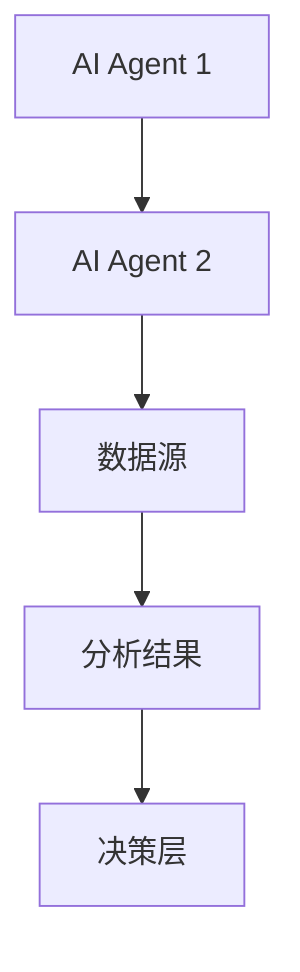
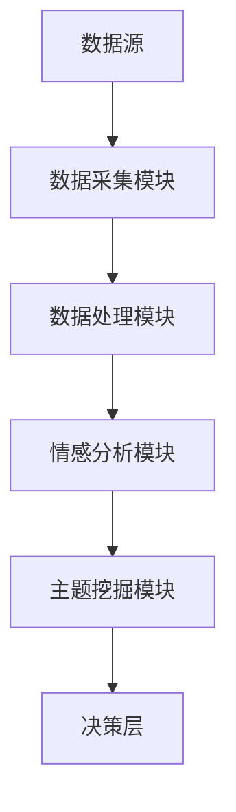
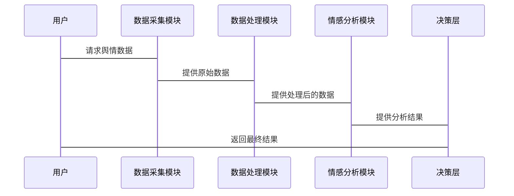

                 


# AI agents协作进行舆情分析：捕捉市场情绪拐点

## 关键词：
AI agents, 舆情分析, 市场情绪拐点, 协作机制, 自然语言处理, 情感分析, 实时数据处理

## 摘要：
本文探讨了如何利用AI agents协作进行舆情分析，捕捉市场情绪拐点。通过分析AI agents的协作机制、算法原理、系统架构设计，结合实际案例，展示了如何高效地进行舆情分析。文章详细讲解了从数据采集到实时处理的整个流程，并提供了具体的代码实现和数学模型。

---

# 第一部分: 背景介绍

## 第1章: 舆情分析的背景与意义

### 1.1 问题背景
#### 1.1.1 舆情分析的定义与作用
舆情分析是指对公众对某一事件、品牌或产品的情绪、态度和意见进行收集、分析和评估的过程。其作用包括帮助企业了解市场动态、优化决策、及时应对危机等。

#### 1.1.2 市场情绪拐点的重要性
市场情绪拐点是指市场情绪从一个阶段转向另一个阶段的关键点，通常是市场行为的重要转折点。捕捉拐点有助于企业提前做出反应，抓住市场机会或规避风险。

#### 1.1.3 当前舆情分析的挑战
- 数据量大且复杂：舆情数据来源广泛，包括社交媒体、新闻媒体等，数据量大且格式多样。
- 数据实时性要求高：市场情绪拐点往往出现在事件发生的关键时刻，需要实时分析数据。
- 情感分析的准确性：如何准确识别和分类复杂的情感信息是舆情分析的核心挑战。

### 1.2 AI Agent的概念与协作机制
#### 1.2.1 AI Agent的基本定义
AI Agent（智能体）是指能够感知环境、自主决策并执行任务的智能系统。它可以是一个软件程序，也可以是一个物理设备。

#### 1.2.2 多AI Agent协作的必要性
单个AI Agent的能力有限，通过协作可以实现更复杂的任务。例如，多个AI Agent可以分工合作，分别处理不同的数据源或任务模块。

#### 1.2.3 AI Agent在舆情分析中的应用
AI Agent可以用于数据采集、情感分析、主题挖掘等任务。通过协作，AI Agent可以更高效地处理海量数据，提高分析的准确性和效率。

### 1.3 本章小结
本章介绍了舆情分析的背景和意义，重点阐述了AI Agent的概念及其在舆情分析中的协作机制。通过协作，AI Agent能够更有效地捕捉市场情绪拐点，为企业提供及时准确的分析结果。

---

# 第二部分: 核心概念与联系

## 第2章: AI Agent协作的原理与模型

### 2.1 AI Agent的核心原理
#### 2.1.1 知识表示与推理
知识表示是将现实世界中的信息转化为计算机可以理解的形式，例如使用图结构表示实体之间的关系。推理是基于知识库进行逻辑推理，得出新的结论。

#### 2.1.2 多智能体协作机制
多智能体协作机制包括通信协议、任务分配、协同决策等。通过有效的协作机制，多个AI Agent可以分工合作，共同完成复杂任务。

#### 2.1.3 联合学习与分布式计算
联合学习是指多个智能体共同训练模型，共享知识和数据。分布式计算则利用多台设备的计算资源，提高处理效率。

### 2.2 舆情分析的模型构建
#### 2.2.1 数据流与信息处理流程
舆情分析的数据流包括数据采集、预处理、特征提取、模型训练和结果分析等步骤。通过数据流的合理设计，可以提高分析的效率和准确性。

#### 2.2.2 情感分析与主题挖掘
情感分析是对文本的情感倾向进行分类，例如正面、负面或中性。主题挖掘则是提取文本中的主要主题和关键词，帮助理解数据的主旨。

#### 2.2.3 实时数据处理与反馈机制
实时数据处理要求系统能够快速响应数据变化，及时更新分析结果。反馈机制则用于根据分析结果调整数据处理策略，优化分析效果。

### 2.3 AI Agent协作的实体关系图


### 2.4 本章小结
本章详细讲解了AI Agent协作的原理与模型，重点分析了知识表示、推理、协作机制和分布式计算在舆情分析中的应用。通过实体关系图展示了AI Agent协作的基本结构。

---

# 第三部分: 算法原理讲解

## 第3章: 情感分析算法与模型

### 3.1 情感分析的算法流程
#### 3.1.1 数据预处理
数据预处理包括文本清洗、分词、去除停用词等步骤。这些步骤有助于提高模型的准确性和效率。

#### 3.1.2 特征提取
特征提取是将文本数据转化为数值特征的过程，例如使用TF-IDF提取关键词特征，或使用词嵌入模型（如Word2Vec）生成词向量。

#### 3.1.3 模型训练
模型训练使用监督学习算法，如朴素贝叶斯、支持向量机（SVM）或深度学习模型（如LSTM、BERT）进行分类训练。

### 3.2 情感分析的数学模型
#### 3.2.1 朴素贝叶斯模型
朴素贝叶斯是一种基于概率论的分类方法，其核心公式为：
$$ P(y|x) = \frac{P(x|y)P(y)}{P(x)} $$
其中，$y$ 是情感类别，$x$ 是文本特征。

#### 3.2.2 支持向量机（SVM）
SVM是一种监督学习算法，用于分类和回归。其目标是最小化 hinge loss：
$$ \mathcal{L} = \sum_{i=1}^n \max(0, 1 - y_i \cdot (w \cdot x_i + b)) $$
其中，$y_i$ 是标签，$w$ 是权重向量，$b$ 是偏置项。

### 3.3 基于AI Agent的协作算法
#### 3.3.1 分布式计算与并行处理
AI Agent可以通过分布式计算框架（如Spark、Flink）进行数据处理和模型训练，提高计算效率。

#### 3.3.2 联合学习与模型融合
多个AI Agent可以分别训练模型，然后通过模型融合技术（如投票法、加权平均）生成最终的分析结果。

### 3.4 本章小结
本章详细讲解了情感分析的算法原理，包括数据预处理、特征提取和模型训练。同时，探讨了AI Agent协作在分布式计算和联合学习中的应用，为舆情分析提供了高效的方法。

---

# 第四部分: 系统分析与架构设计方案

## 第4章: 系统架构设计

### 4.1 舆情分析的场景介绍
舆情分析系统通常包括数据源、数据处理层、分析层和决策层。数据源包括社交媒体、新闻网站等，数据处理层负责数据清洗和特征提取，分析层进行情感分析和主题挖掘，决策层根据分析结果做出决策。

### 4.2 系统功能设计
#### 4.2.1 数据采集模块
数据采集模块负责从多个数据源采集舆情数据，包括API接口和网络爬虫。

#### 4.2.2 数据处理模块
数据处理模块包括文本清洗、分词和特征提取等步骤。

#### 4.2.3 情感分析模块
情感分析模块使用训练好的模型对文本进行情感分类。

#### 4.2.4 主题挖掘模块
主题挖掘模块提取文本的主题和关键词，帮助理解数据的主旨。

### 4.3 系统架构图


### 4.4 系统接口设计
系统接口设计包括数据接口、API接口和用户界面。数据接口用于连接数据源，API接口供其他系统调用分析结果，用户界面用于展示分析结果。

### 4.5 系统交互流程图


### 4.6 本章小结
本章详细介绍了舆情分析系统的架构设计，包括功能模块、系统架构图和交互流程图。通过合理的系统设计，可以提高舆情分析的效率和准确性。

---

# 第五部分: 项目实战

## 第5章: 项目实现与案例分析

### 5.1 环境安装与配置
#### 5.1.1 安装Python与相关库
需要安装Python 3.8及以上版本，并安装以下库：
- `numpy`
- `pandas`
- `scikit-learn`
- `spacy`
- `networkx`

#### 5.1.2 安装AI Agent框架
可以使用`multi-agent`库或其他多智能体协作框架。

### 5.2 核心代码实现
#### 5.2.1 数据预处理代码
```python
import pandas as pd
from sklearn.feature_extraction.text import TfidfVectorizer

# 加载数据
data = pd.read_csv('data.csv')

# 文本清洗
data['text'] = data['text'].str.lower()
data['text'] = data['text'].str.replace(r'[^\w\s]', '')

# 特征提取
vectorizer = TfidfVectorizer(max_features=1000)
X = vectorizer.fit_transform(data['text'])
```

#### 5.2.2 情感分析模型训练代码
```python
from sklearn.model_selection import train_test_split
from sklearn.naive_bayes import MultinomialNB

# 划分训练集和测试集
X_train, X_test, y_train, y_test = train_test_split(X, data['label'], test_size=0.2)

# 训练模型
model = MultinomialNB()
model.fit(X_train, y_train)

# 预测与评估
y_pred = model.predict(X_test)
print("准确率:", accuracy_score(y_test, y_pred))
```

#### 5.2.3 多智能体协作代码
```python
from multi_agent import Agent

# 定义AI Agent
class SentimentAgent(Agent):
    def __init__(self, name):
        super().__init__(name)
        self.sentiment_model = ...  # 加载情感分析模型

    def analyze_sentiment(self, text):
        return self.sentiment_model.predict(text)

# 初始化多个AI Agent
agent1 = SentimentAgent("Agent1")
agent2 = SentimentAgent("Agent2")

# 协作分析
texts = ["文本1", "文本2", "文本3"]
results = agent1.analyze_sentiment(texts)
results += agent2.analyze_sentiment(texts)
最终结果 = average(results)
```

### 5.3 实际案例分析
以某公司的产品舆情分析为例，展示如何利用AI Agent协作捕捉市场情绪拐点。通过实际数据的分析，验证系统的有效性和准确性。

### 5.4 本章小结
本章通过实际项目展示了AI Agent协作在舆情分析中的应用，详细讲解了数据预处理、模型训练和协作分析的实现步骤。通过案例分析，验证了系统的可行性和有效性。

---

# 第六部分: 总结与展望

## 第6章: 总结与展望

### 6.1 最佳实践
- 数据预处理是关键，确保数据质量和完整性。
- 模型选择要根据具体任务需求，合理选择算法和参数。
- 多智能体协作可以提高系统的处理能力，但需要注意通信和协调的效率。

### 6.2 小结
本文详细讲解了AI Agent协作在舆情分析中的应用，从背景介绍、核心概念、算法原理到系统设计和项目实战，全面探讨了如何利用AI技术捕捉市场情绪拐点。

### 6.3 注意事项
- 数据隐私和安全问题需要高度重视。
- 模型的准确性和实时性需要不断优化。
- 系统的可扩展性和可维护性需要在设计阶段充分考虑。

### 6.4 拓展阅读
建议读者进一步学习分布式计算、联合学习和深度学习在舆情分析中的应用，探索更多AI技术在实际问题中的应用。

### 6.5 本章小结
总结了全文内容，强调了AI Agent协作在舆情分析中的重要性，并提出了未来的研究方向和实践建议。

---

# 结语

通过本文的详细讲解，读者可以全面了解AI Agent协作在舆情分析中的应用。从理论到实践，从算法到系统设计，本文为读者提供了丰富的知识和实用的代码示例。未来，随着AI技术的不断发展，舆情分析将更加智能化和高效化，为企业决策提供更有力的支持。

