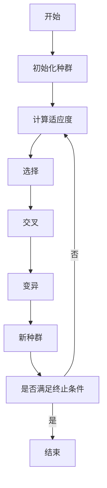
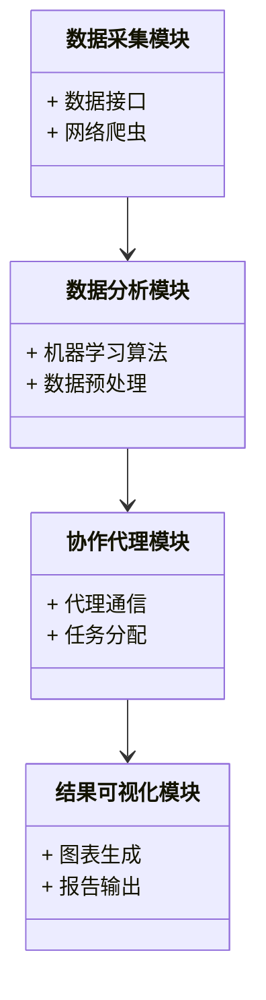

                 


# AI agents协作进行跨市场价值比较：发现全球机会

## 关键词：AI代理、跨市场价值比较、协作机制、数据标准化、全球机会、算法优化、系统架构设计

## 摘要：  
本文探讨AI代理协作在跨市场价值比较中的应用，通过多因素分析模型和优化算法，帮助发现全球商业机会。从背景到算法，从系统架构到项目实战，系统阐述AI代理如何协作进行跨市场价值分析。

---

# 第一部分: AI 代理协作与跨市场价值比较的背景

## 第1章: AI 代理协作的背景与意义

### 1.1 AI 代理协作的背景
#### 1.1.1 AI 代理的基本概念
AI代理（AI Agents）是具有感知环境、做出决策并执行操作的智能实体。它们可以是软件程序，能够通过数据输入完成特定任务，例如数据分析、信息检索和自动化决策。

#### 1.1.2 跨市場价值比较的定义与重要性
跨市場价值比较是指在多个市场中，对同一产品或服务的价值进行对比分析，以发现市场差异和机会。其重要性在于帮助企业识别价格差异、优化资源配置和制定全球化战略。

#### 1.1.3 AI 代理协作在跨市场中的作用
AI代理可以通过协作方式，整合多个市场的数据，进行实时分析和比较，帮助企业在全球化市场中快速发现价值差异和商业机会。

### 1.2 跨市場价值比较的背景
#### 1.2.1 全球化市场环境的复杂性
全球化使得企业需要面对不同国家和地区的市场环境，包括文化差异、法律法规和经济政策等因素，增加了跨市場价值比较的复杂性。

#### 1.2.2 不同市场的价值评估标准
不同市场对产品或服务的价值评估标准可能存在差异，例如价格敏感性、品牌影响力和消费习惯等，这些都需要通过AI代理进行数据分析和建模。

#### 1.2.3 价值比较在商业决策中的重要性
跨市場价值比较能够帮助企业制定更具竞争力的定价策略、优化产品组合和制定市场进入策略，从而提升企业的全球竞争力。

---

## 第2章: AI 代理协作的核心概念

### 2.1 AI 代理的协作机制
#### 2.1.1 代理间的通信与协调
AI代理通过通信协议进行信息交换，例如通过REST API或消息队列，实现数据共享和协同工作。

#### 2.1.2 分布式决策与协作
AI代理在分布式系统中进行协作，每个代理负责特定任务，例如数据收集、分析和决策支持，最终形成统一的分析结果。

#### 2.1.3 跨市場信息的整合与分析
AI代理将来自不同市场的数据进行整合，例如价格、供需和竞争信息，通过数据预处理和特征提取，形成统一的数据集。

### 2.2 跨市場价值比较的核心要素
#### 2.2.1 市场环境的多维分析
跨市場价值比较需要考虑多个维度，例如市场规模、竞争程度和消费者行为等，这些都需要通过AI代理进行多维度分析。

#### 2.2.2 价值评估的多维度指标
价值评估指标包括价格、利润、市场份额和品牌影响力等，AI代理需要对这些指标进行量化分析，形成综合评估结果。

#### 2.2.3 跨市場数据的标准化处理
跨市場数据可能存在格式和单位差异，例如货币单位和价格单位，AI代理需要进行数据标准化处理，确保数据的可比性。

---

## 第3章: AI 代理协作与跨市场价值比较的关系

### 3.1 AI 代理协作在价值比较中的应用
#### 3.1.1 数据收集与预处理
AI代理通过网络爬虫、API调用等方式，收集不同市场的数据，并进行数据清洗和特征提取，形成统一的数据集。

#### 3.1.2 数据分析与建模
AI代理利用机器学习算法，例如回归分析和聚类分析，建立多因素分析模型，评估不同市场的价值差异。

#### 3.1.3 结果解读与决策支持
AI代理将分析结果以可视化方式呈现，例如生成图表和报告，帮助商业决策者制定市场策略。

### 3.2 跨市場价值比较的复杂性与挑战
#### 3.2.1 数据异构性问题
不同市场数据可能存在格式和结构差异，例如数据字段和数据类型不同，需要通过数据转换和特征工程进行处理。

#### 3.2.2 市场动态变化的应对
市场环境具有动态性，例如价格波动和政策变化，AI代理需要实时更新数据和模型，以保持分析结果的准确性。

#### 3.2.3 跨文化与法律差异的影响
不同市场可能存在文化差异和法律差异，例如税收政策和消费者保护法，这些都需要在数据分析中进行考虑。

---

# 第二部分: 跨市場价值比较的AI代理协作模型

## 第4章: 跨市場价值比较的核心模型

### 4.1 跨市場价值比较的数学模型
#### 4.1.1 多因素分析模型
多因素分析模型用于评估多个市场变量对价值的影响，例如价格、供需和竞争强度等。模型可以通过回归分析确定各变量的权重。

$$ y = \beta_0 + \beta_1x_1 + \beta_2x_2 + \ldots + \beta_nx_n + \epsilon $$

其中，$y$ 是目标变量，$x_i$ 是自变量，$\beta_i$ 是回归系数，$\epsilon$ 是误差项。

#### 4.1.2 综合评价模型
综合评价模型基于多个指标对市场进行综合评价，例如使用层次分析法（AHP）确定各指标的权重，然后进行加权求和。

#### 4.1.3 动态调整模型
动态调整模型用于应对市场环境的变化，例如通过时间序列分析预测未来趋势，并动态调整分析结果。

---

## 第5章: AI 代理协作的算法优化

### 5.1 算法优化的核心思想
算法优化旨在提高AI代理协作的效率和准确性，例如通过分布式计算和并行处理减少计算时间。

### 5.2 遗传算法在跨市場分析中的应用
遗传算法用于优化多因素分析模型的参数，例如通过基因重组和选择操作，找到最优解。

#### 5.2.1 遗传算法流程图


### 5.3 算法优化的数学模型
遗传算法的目标是最优化适应度函数，例如最大化目标函数值。

$$ f(x) = \sum_{i=1}^{n} w_i x_i $$

其中，$w_i$ 是权重，$x_i$ 是变量。

---

# 第三部分: 系统架构与实现

## 第6章: 系统架构设计

### 6.1 系统功能设计
系统功能包括数据采集、数据分析、协作代理和结果可视化。

#### 6.1.1 数据采集模块
数据采集模块通过网络爬虫和API接口，获取不同市场的数据，例如价格和供需信息。

#### 6.1.2 数据分析模块
数据分析模块利用机器学习算法，对数据进行建模和分析，生成价值比较结果。

#### 6.1.3 协作代理模块
协作代理模块负责协调多个AI代理的工作，确保数据的实时更新和分析结果的准确性。

#### 6.1.4 结果可视化模块
结果可视化模块以图表和报告形式呈现分析结果，帮助用户制定决策。

### 6.2 系统架构图


---

## 第7章: 项目实战

### 7.1 项目背景
本项目旨在利用AI代理协作，分析不同国家的科技市场价格差异，发现潜在的商业机会。

### 7.2 环境配置
```python
# 安装依赖
pip install requests
pip install beautifulsoup4
pip install matplotlib
pip install numpy
pip install pandas
```

### 7.3 核心代码实现
```python
import requests
from bs4 import BeautifulSoup
import matplotlib.pyplot as plt
import pandas as pd
import numpy as np

# 数据采集
def fetch_data(url):
    response = requests.get(url)
    soup = BeautifulSoup(response.text, 'html.parser')
    data = []
    for item in soup.find_all('div', class_='price-item'):
        price = item.find('span', class_='price').text
        data.append({'price': float(price)})
    return data

# 数据分析
def analyze_data(data):
    df = pd.DataFrame(data)
    df['price'].plot.hist(bins=10, alpha=0.5)
    plt.show()

# 系统调用
if __name__ == '__main__':
    url = 'https://example.com/price'
    data = fetch_data(url)
    analyze_data(data)
```

### 7.4 结果解读
分析结果以直方图形式呈现，显示不同市场的价格分布情况，帮助企业发现价格差异和潜在机会。

### 7.5 案例分析
通过分析实际案例，例如科技行业的价格差异，帮助企业制定更具竞争力的定价策略。

---

## 第8章: 总结与展望

### 8.1 总结
本文系统阐述了AI代理协作在跨市场价值比较中的应用，通过多因素分析模型和算法优化，帮助企业发现全球商业机会。

### 8.2 展望
未来，随着AI技术的不断发展，AI代理将在跨市场价值比较中发挥更大的作用，例如实时数据分析和动态决策支持。

---

# 结语
通过AI代理协作进行跨市场价值比较，企业能够在全球化市场中发现新的机会，制定更具竞争力的市场策略，实现可持续发展。

