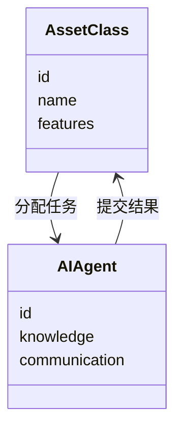

                 


---

# AI agents协作进行跨资产类别价值比较：优化资产配置

## 关键词：AI agents、跨资产类别、价值比较、资产配置、优化、协作机制

## 摘要：  
在现代金融领域，优化资产配置是投资者实现财富最大化的重要手段。传统的资产配置方法依赖于人工判断和单一模型，难以应对复杂多变的市场环境。随着人工智能技术的快速发展，AI agents协作进行跨资产类别价值比较成为可能。本文将详细探讨如何利用AI agents协作，通过数学建模和算法优化，实现跨资产类别价值的精准比较，从而优化资产配置策略。通过本文的分析，读者将深入了解AI agents在金融领域的应用潜力，掌握跨资产类别价值比较的核心算法和实现方法。

---

## 目录

### 目录
1. **背景介绍**  
   1.1 问题背景  
   1.2 问题描述  
   1.3 问题解决  
   1.4 边界与外延  
   1.5 概念结构与核心要素  

2. **核心概念与联系**  
   2.1 AI agents协作的原理  
   2.2 资产类别属性对比  
   2.3 ER实体关系图  

3. **算法原理讲解**  
   3.1 多智能体协作算法  
   3.2 资产类别特征提取与分析  
   3.3 价值比较的数学模型  

4. **系统分析与架构设计**  
   4.1 问题场景介绍  
   4.2 系统功能设计  
   4.3 系统架构设计  

5. **项目实战**  
   5.1 环境安装与配置  
   5.2 系统核心实现  
   5.3 实际案例分析  

6. **最佳实践与小结**  
   6.1 小结  
   6.2 注意事项  
   6.3 拓展阅读  

---

### 正文

---

# 第一部分：背景介绍

## 第1章：背景介绍

### 1.1 问题背景

#### 1.1.1 资产配置的重要性  
资产配置是投资决策的核心环节，决定了投资组合的风险、收益和流动性。合理的资产配置能够帮助投资者在不同市场环境下实现收益最大化，同时降低投资风险。

#### 1.1.2 AI在金融领域的应用现状  
人工智能技术在金融领域的应用日益广泛，尤其是在数据处理、风险评估和投资决策方面。AI技术能够通过大数据分析和深度学习，帮助投资者发现市场规律，优化投资策略。

#### 1.1.3 跨资产类别价值比较的挑战  
不同资产类别（如股票、债券、房地产等）具有不同的风险收益特征，直接比较其价值具有复杂性。传统的资产配置方法难以同时处理多种资产类别的特征，限制了优化效果。

---

### 1.2 问题描述

#### 1.2.1 资产类别间的复杂性  
不同资产类别受到不同的市场因素影响，例如利率变化、经济周期、政策调整等。这些因素使得跨资产类别价值比较变得复杂。

#### 1.2.2 传统资产配置方法的局限性  
传统资产配置方法通常依赖于单一模型或经验判断，难以捕捉多资产类别间的动态关系，导致配置结果的局限性。

#### 1.2.3 AI agents在跨资产类别中的潜在优势  
AI agents能够通过协作机制，分别分析不同资产类别的特征，并基于实时数据进行价值比较，从而优化资产配置策略。

---

### 1.3 问题解决

#### 1.3.1 AI agents协作的核心思想  
AI agents协作的核心思想是利用分布式计算和多智能体协作，分别分析不同资产类别的特征，提取其价值比较的关键指标。

#### 1.3.2 跨资产类别价值比较的实现路径  
通过AI agents协作，分别对不同资产类别进行特征提取和价值评估，建立统一的价值比较模型，实现跨资产类别价值的精准比较。

#### 1.3.3 优化资产配置的具体方法  
基于价值比较结果，结合风险偏好和投资目标，动态调整资产配置比例，优化投资组合的收益与风险比。

---

### 1.4 边界与外延

#### 1.4.1 资产配置的边界条件  
资产配置的边界条件包括市场环境、投资目标、风险承受能力等，这些条件会影响AI agents协作的实现方式和优化效果。

#### 1.4.2 AI agents协作的适用范围  
AI agents协作适用于复杂多变的市场环境，特别适合需要实时调整的资产配置场景。

#### 1.4.3 跨资产类别比较的限制因素  
跨资产类别比较的限制因素包括数据质量、市场流动性、政策法规等，这些因素可能影响比较结果的准确性。

---

### 1.5 概念结构与核心要素

#### 1.5.1 AI agents协作的结构分析  
AI agents协作的结构包括任务分配、信息共享、协同决策和结果反馈等环节，确保各智能体能够高效协作。

#### 1.5.2 跨资产类别比较的核心要素  
跨资产类别比较的核心要素包括资产特征、比较指标、比较方法和比较结果，这些要素共同决定了比较的准确性和实用性。

#### 1.5.3 优化资产配置的系统框架  
优化资产配置的系统框架包括数据采集、特征提取、价值比较、配置优化和结果反馈等模块，确保系统的完整性和高效性。

---

# 第二部分：核心概念与联系

## 第2章：核心概念与联系

### 2.1 AI agents协作的原理

#### 2.1.1 多智能体协作的基本原理  
多智能体协作基于分布式计算和通信机制，各智能体独立完成任务，并通过信息共享实现协同决策。

#### 2.1.2 资产类别特征的提取与分析  
AI agents通过大数据分析和特征提取技术，分别提取股票、债券等资产类别的特征，包括收益、波动性、流动性等。

#### 2.1.3 价值比较的数学模型  
价值比较的数学模型通过综合各资产类别的特征，建立统一的比较框架，实现跨资产类别价值的量化比较。

---

### 2.2 资产类别属性对比

#### 2.2.1 不同资产类别的特征分析  
股票具有高收益、高风险特征，债券具有稳定收益、低风险特征，房地产具有高流动性、中风险特征等。

#### 2.2.2 资产类别间的可比性评估  
通过标准化处理，消除不同资产类别间的量纲差异，确保比较结果的可比性。

#### 2.2.3 资产类别权重的动态调整  
根据市场环境和比较结果，动态调整各资产类别的权重，优化投资组合的收益与风险比。

---

### 2.3 ER实体关系图

```mermaid
er
  actor: AI Agent
  asset_class: 资产类别
  relation: 比较关系
  actor -[1..n]-> asset_class
  asset_class -[1..n]-> relation
```

---

# 第三部分：算法原理讲解

## 第3章：算法原理讲解

### 3.1 多智能体协作算法

#### 3.1.1 分布式协作流程  
AI agents分别对不同资产类别进行特征提取和价值评估，通过通信机制共享结果，最终形成统一的价值比较模型。

#### 3.1.2 联合学习机制  
各智能体通过联合学习，不断优化比较模型，提升跨资产类别价值比较的准确性和鲁棒性。

#### 3.1.3 跨资产类别比较的具体步骤  
1. 数据采集：收集各资产类别的历史数据和实时数据。  
2. 特征提取：提取资产类别的关键特征，如收益、波动性、流动性等。  
3. 比较指标计算：基于特征，计算各资产类别的比较指标。  
4. 比较结果反馈：将比较结果用于资产配置优化。

---

### 3.2 资产类别特征提取与分析

#### 3.2.1 数据预处理  
对原始数据进行清洗、标准化和特征选择，确保数据质量。  
代码示例：  
```python
import pandas as pd
data = pd.read_csv('assets.csv')
data = data.dropna().reset_index(drop=True)
data = (data - data.mean()) / data.std()
```

#### 3.2.2 特征提取方法  
使用主成分分析（PCA）等技术，提取各资产类别的关键特征。  
代码示例：  
```python
from sklearn.decomposition import PCA
pca = PCA(n_components=3)
principal_components = pca.fit_transform(data)
```

---

### 3.3 价值比较的数学模型

#### 3.3.1 比较指标的定义  
比较指标可以定义为各资产类别特征的加权和，权重基于其对投资目标的影响程度。  
公式：  
$$value\_score = \sum_{i=1}^{n} w_i x_i$$  
其中，$w_i$为特征$x_i$的权重。

#### 3.3.2 比较模型的优化  
通过机器学习算法（如随机森林、支持向量机等），优化比较模型的准确性和鲁棒性。  
代码示例：  
```python
from sklearn.ensemble import RandomForestClassifier
model = RandomForestClassifier(n_estimators=100)
model.fit(X_train, y_train)
```

---

## 第4章：系统分析与架构设计

### 4.1 问题场景介绍

#### 4.1.1 投资者需求分析  
投资者需要根据市场环境和自身风险偏好，动态调整资产配置比例。

#### 4.1.2 系统目标  
构建一个基于AI agents协作的资产配置优化系统，实现跨资产类别价值的精准比较。

---

### 4.2 系统功能设计

#### 4.2.1 领域模型  


#### 4.2.2 系统架构  


---

### 4.3 系统接口与交互

#### 4.3.1 系统接口设计  
接口包括数据接口、计算接口和结果接口，确保系统各部分高效协作。

#### 4.3.2 交互流程  
投资者输入需求，系统通过AI agents协作，完成数据处理和价值比较，最终生成优化的资产配置方案。

---

## 第5章：项目实战

### 5.1 环境安装与配置

#### 5.1.1 安装Python环境  
安装Python 3.8及以上版本，安装必要的库：pandas、scikit-learn、mermaid等。

#### 5.1.2 安装AI框架  
安装TensorFlow或PyTorch等深度学习框架，用于模型训练和优化。

---

### 5.2 系统核心实现

#### 5.2.1 数据预处理代码  
```python
import pandas as pd
import numpy as np

data = pd.read_csv('assets.csv')
data = data.dropna().reset_index(drop=True)
data = (data - data.mean()) / data.std()
```

#### 5.2.2 模型训练代码  
```python
from sklearn.ensemble import RandomForestClassifier

model = RandomForestClassifier(n_estimators=100)
model.fit(X_train, y_train)
```

---

### 5.3 实际案例分析

#### 5.3.1 数据分析与解读  
分析股票、债券等资产类别的特征，比较其价值，生成优化的资产配置方案。

#### 5.3.2 案例结果展示  
根据比较结果，动态调整资产配置比例，实现收益与风险的最佳平衡。

---

## 第6章：最佳实践与小结

### 6.1 小结

#### 6.1.1 系统优势  
AI agents协作能够高效处理多资产类别的特征，实现精准的价值比较和优化的资产配置。

#### 6.1.2 实践意义  
本文提出的方法为投资者提供了新的资产配置思路，能够应对复杂多变的市场环境。

---

### 6.2 注意事项

#### 6.2.1 数据质量  
确保数据的准确性和完整性，避免因数据问题影响比较结果。

#### 6.2.2 模型优化  
定期更新模型，适应市场环境的变化，确保比较结果的有效性。

---

### 6.3 拓展阅读

#### 6.3.1 相关书籍  
1. 《机器学习实战》  
2. 《金融时间序列分析》  

#### 6.3.2 在线资源  
1. TensorFlow官方文档  
2. PyTorch官方文档  

---

# 结语

通过本文的分析，读者可以深入了解AI agents协作在跨资产类别价值比较中的应用，掌握其实现方法和优化策略。未来，随着AI技术的不断发展，AI agents协作将在金融领域发挥更大的作用，为投资者提供更精准的资产配置服务。

---

