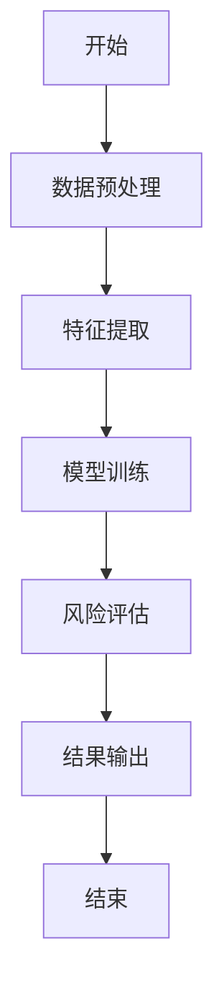
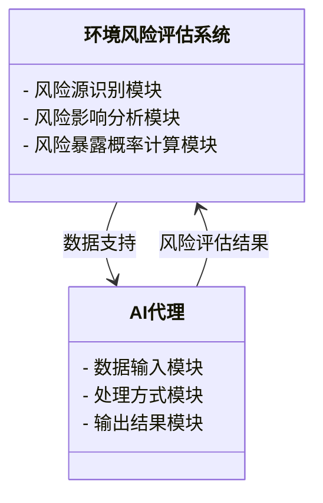
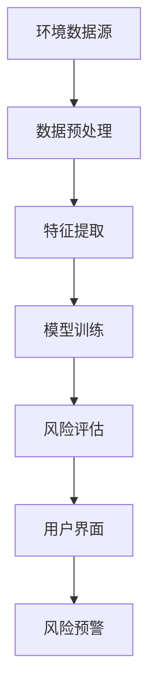
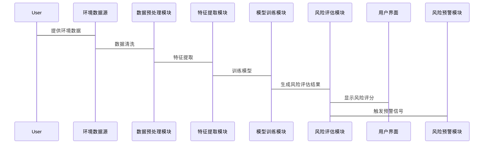

                 


# AI agents在公司环境风险暴露评估中的应用

**关键词：** AI代理，环境风险暴露评估，风险管理，机器学习，系统架构

**摘要：** 本文探讨了AI代理在公司环境风险暴露评估中的应用，分析了AI代理的核心概念、算法原理、系统架构设计，并通过项目实战和最佳实践提供了具体的实施方法和案例分析。文章旨在帮助读者理解如何利用AI技术提升企业环境风险管理的效率和准确性。

---

## 第一部分: AI代理与环境风险暴露评估的背景介绍

### 第1章: AI代理与环境风险暴露评估概述

#### 1.1 AI代理的基本概念
##### 1.1.1 什么是AI代理
AI代理（Artificial Intelligence Agents）是指能够感知环境、做出决策并采取行动的智能实体。它们可以是软件程序、机器人或其他智能系统，通过传感器和数据输入获取信息，利用算法进行分析和推理，最终执行预定的目标。

##### 1.1.2 AI代理的分类与特点
AI代理可以根据智能水平分为简单反射代理和基于模型的代理。简单反射代理基于固定的规则做出反应，而基于模型的代理则利用内部模型和知识进行复杂的推理和规划。AI代理的特点包括自主性、反应性、目标导向和学习能力。

##### 1.1.3 AI代理在企业中的应用场景
AI代理在企业中的应用广泛，包括客户关系管理、供应链优化、风险预警等领域。在环境风险暴露评估中，AI代理可以帮助企业实时监控环境数据、识别潜在风险并制定应对策略。

#### 1.2 环境风险暴露评估的基本概念
##### 1.2.1 环境风险的定义与分类
环境风险是指由于外部环境变化对企业造成的潜在威胁。常见的环境风险包括自然灾害、政策变化、市场波动等。环境风险暴露评估是对这些风险的影响程度进行量化的过程。

##### 1.2.2 风险暴露评估的必要性
企业需要通过环境风险暴露评估来识别潜在风险，制定应对策略，以降低风险对企业运营的影响。这种评估可以帮助企业在复杂多变的环境中保持竞争力。

##### 1.2.3 企业环境风险暴露评估的现状与挑战
传统的企业环境风险管理方法依赖于人工分析和经验判断，存在效率低、覆盖面窄的问题。随着数据量的增加和算法的进步，AI代理为企业环境风险管理提供了新的可能性。

### 第2章: AI代理在环境风险暴露评估中的应用背景

#### 2.1 企业环境风险管理的现状
##### 2.1.1 传统环境风险管理方法的局限性
传统方法依赖于人工分析，难以应对海量数据和复杂环境的变化。此外，传统方法通常缺乏实时性，无法快速响应潜在风险。

##### 2.1.2 数字化转型对企业环境风险管理的影响
数字化转型为企业提供了更多的数据和技术手段，使得环境风险管理更加智能化和高效。AI代理的应用正是数字化转型在环境风险管理领域的重要体现。

##### 2.1.3 AI技术在环境风险管理中的潜力
AI代理可以通过实时数据监控、预测分析和智能决策，显著提升环境风险管理的效率和准确性。AI代理可以帮助企业快速识别潜在风险，优化应对策略。

#### 2.2 AI代理在环境风险暴露评估中的优势
##### 2.2.1 提高风险识别的准确性
AI代理可以通过机器学习算法分析大量数据，识别潜在风险，提高风险识别的准确性。

##### 2.2.2 实时监控与预警机制
AI代理可以实时监控环境数据，通过预测模型生成预警信号，帮助企业及时应对潜在风险。

##### 2.2.3 数据驱动的决策支持
AI代理利用数据驱动的方法，为企业提供科学的决策支持，帮助企业在复杂环境中做出最优选择。

#### 2.3 本章小结
本章介绍了AI代理在环境风险暴露评估中的应用背景，分析了传统方法的局限性和AI技术的潜力，总结了AI代理在环境风险管理中的优势。

---

## 第二部分: AI代理与环境风险暴露评估的核心概念与联系

### 第3章: AI代理与环境风险暴露评估的核心概念

#### 3.1 AI代理的核心原理
##### 3.1.1 感知环境
AI代理通过传感器或数据接口获取环境信息，如市场数据、天气数据等。

##### 3.1.2 问题建模
AI代理将环境风险问题转化为数学模型，通过数据处理和特征提取，为风险评估提供基础。

##### 3.1.3 决策与行动
AI代理基于模型和算法，生成风险评估结果，并制定应对策略。

#### 3.2 环境风险暴露评估的核心要素
##### 3.2.1 风险源识别
识别可能导致环境风险的潜在因素，如自然灾害、政策变化等。

##### 3.2.2 风险影响分析
评估潜在风险对企业的影响程度，包括经济损失、声誉损失等。

##### 3.2.3 风险暴露概率计算
通过概率模型计算不同风险发生的可能性，为企业制定风险缓解策略提供依据。

#### 3.3 AI代理与环境风险暴露评估的关联性分析
##### 3.3.1 数据驱动的决策过程
AI代理利用大数据分析和机器学习算法，实现数据驱动的环境风险管理。

##### 3.3.2 实时监控与动态调整
AI代理实时监控环境数据，动态调整风险评估模型，确保风险评估的准确性。

##### 3.3.3 智能化风险预警机制
AI代理通过预测模型，提前预警潜在风险，帮助企业做好应对准备。

### 第4章: 核心概念的属性特征对比与ER实体关系图

#### 4.1 AI代理与环境风险暴露评估的属性特征对比
| 属性 | AI代理 | 环境风险暴露评估 |
|------|--------|-----------------|
| 数据输入 | 环境数据、历史数据 | 环境数据、历史风险数据 |
| 处理方式 | 机器学习、规则引擎 | 统计分析、概率模型 |
| 输出结果 | 风险评分、应对策略 | 风险概率、影响程度 |

#### 4.2 ER实体关系图

```mermaid
erd
    环境风险
    {
        id: string
        风险类型: string
        风险源: string
        风险影响: decimal
        风险概率: decimal
    }
    AI代理
    {
        id: string
        数据输入: string
        处理方式: string
        输出结果: string
    }
    环境风险 --> AI代理 : 提供数据支持
    AI代理 --> 环境风险 : 生成风险评估结果
```

---

## 第三部分: AI代理与环境风险暴露评估的算法原理讲解

### 第5章: 算法原理讲解

#### 5.1 算法流程图



#### 5.2 Python源代码实现

```python
# 数据预处理
import pandas as pd
import numpy as np

data = pd.read_csv('environment_risk.csv')
data = data.dropna()
data = pd.get_dummies(data)

# 特征提取
features = data.drop('risk_score', axis=1)
target = data['risk_score']

# 模型训练
from sklearn.ensemble import RandomForestRegressor
model = RandomForestRegressor(n_estimators=100, random_state=42)
model.fit(features, target)

# 风险评估
def assess_risk(features_new):
    prediction = model.predict(features_new)
    return prediction[0]

# 示例
sample_input = features.iloc[0]
print(assess_risk(sample_input))
```

#### 5.3 数学模型与公式
##### 5.3.1 风险评分模型
$$ \text{风险评分} = \sum_{i=1}^{n} w_i \cdot x_i $$
其中，\( w_i \) 是特征 \( x_i \) 的权重，通过机器学习模型训练得到。

##### 5.3.2 风险概率计算
$$ P(\text{风险发生}) = \frac{\text{历史风险发生次数}}{\text{总样本数}} $$

---

## 第四部分: AI代理与环境风险暴露评估的系统分析与架构设计方案

### 第6章: 系统分析与架构设计

#### 6.1 项目背景
企业希望通过AI代理实现环境风险暴露评估的自动化和智能化，提高风险管理效率。

#### 6.2 系统功能设计
##### 6.2.1 领域模型



#### 6.3 系统架构设计



#### 6.4 系统接口设计
- 数据输入接口：接收环境数据和历史数据。
- 风险评估接口：返回风险评分和应对策略。
- 风险预警接口：触发预警信号。

#### 6.5 系统交互流程图



---

## 第五部分: AI代理与环境风险暴露评估的项目实战

### 第7章: 项目实战

#### 7.1 环境安装
- 安装Python和必要的库（如Pandas、Scikit-learn、Mermaid）。
- 安装Jupyter Notebook用于代码开发和测试。

#### 7.2 核心代码实现
##### 7.2.1 数据预处理

```python
import pandas as pd
import numpy as np

# 读取数据
data = pd.read_csv('environment_risk.csv')

# 删除缺失值
data = data.dropna()

# 转换为虚拟变量
data = pd.get_dummies(data)
```

##### 7.2.2 特征提取与模型训练

```python
from sklearn.ensemble import RandomForestRegressor
from sklearn.metrics import mean_squared_error

# 提取特征和目标变量
features = data.drop('risk_score', axis=1)
target = data['risk_score']

# 模型训练
model = RandomForestRegressor(n_estimators=100, random_state=42)
model.fit(features, target)

# 预测与评估
predictions = model.predict(features)
print(mean_squared_error(target, predictions))
```

##### 7.2.3 风险评估与预警

```python
def assess_risk(features_new):
    prediction = model.predict(features_new)
    return prediction[0]

# 示例
sample_input = features.iloc[0]
print(assess_risk(sample_input))
```

#### 7.3 项目小结
通过项目实战，我们实现了AI代理在环境风险暴露评估中的应用，验证了算法的有效性和系统的可行性。

---

## 第六部分: AI代理与环境风险暴露评估的最佳实践

### 第8章: 最佳实践

#### 8.1 小贴士
- 数据质量是关键，确保数据的完整性和准确性。
- 定期更新模型，避免过时数据影响评估结果。
- 结合领域知识，优化模型性能。

#### 8.2 注意事项
- 确保数据隐私和合规性。
- 在实际应用中，考虑多模型集成以提高准确性。
- 定期进行系统维护和优化。

#### 8.3 拓展阅读
- 推荐阅读《机器学习实战》和《风险管理与决策分析》。

---

## 第七部分: 总结与展望

### 第9章: 总结与展望

#### 9.1 总结
本文详细探讨了AI代理在公司环境风险暴露评估中的应用，从背景介绍到算法实现，再到系统设计和项目实战，为读者提供了全面的视角。

#### 9.2 展望
随着AI技术的不断进步，AI代理在环境风险管理中的应用将更加广泛和深入。未来的研究方向包括模型优化、实时监控和多模态数据融合。

---

**结语：** 通过本文的介绍，读者可以全面了解AI代理在环境风险暴露评估中的应用价值，并掌握其实现方法。希望本文能为企业的环境风险管理提供新的思路和实践指导。

