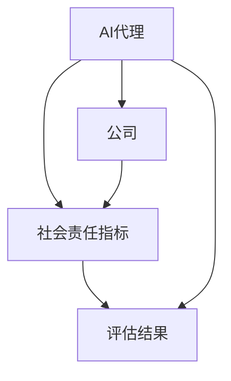
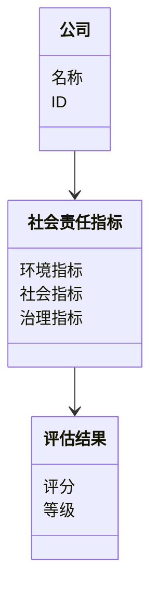
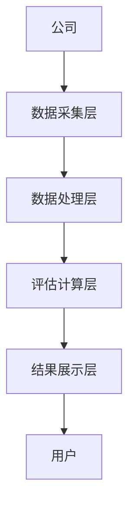
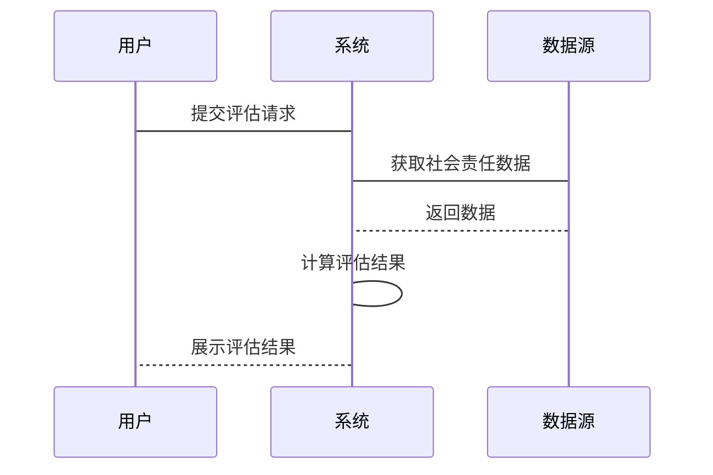

                 


# AI Agents在公司社会责任评估中的应用

## 关键词：AI代理、公司社会责任、评估模型、数据处理、算法优化

## 摘要：随着人工智能技术的飞速发展，AI代理在公司社会责任评估中的应用日益广泛。本文深入探讨了AI代理在公司社会责任评估中的核心概念、算法原理、系统架构及实际应用。通过结合具体案例，本文详细分析了AI代理如何通过数据处理、算法优化和系统架构设计，提升公司社会责任评估的效率和准确性。同时，本文还总结了AI代理在公司社会责任评估中的优势与挑战，并展望了未来的发展方向。

---

## 第一部分: AI代理与公司社会责任评估的背景介绍

## 第1章: AI代理与公司社会责任评估的概述

### 1.1 AI代理的基本概念
#### 1.1.1 AI代理的定义与特点
AI代理（AI Agents）是指能够感知环境、自主决策并执行任务的智能体。其特点包括：
- **自主性**：能够在没有外部干预的情况下自主完成任务。
- **反应性**：能够实时感知环境变化并做出响应。
- **学习性**：通过数据和经验不断优化自身行为。
- **协作性**：能够与其他代理或系统协同工作。

#### 1.1.2 公司社会责任的定义与范围
公司社会责任（Corporate Social Responsibility, CSR）是指企业在追求经济利益的同时，还需关注环境保护、员工权益、公平交易、社会公益等方面的社会价值。其范围包括：
- **环境责任**：减少碳排放、资源节约等。
- **社会责任**：员工福利、社区贡献等。
- **治理责任**：企业透明度、道德合规等。

#### 1.1.3 AI代理在公司社会责任评估中的作用
AI代理能够通过数据采集、分析和决策支持，帮助公司高效完成社会责任评估任务。其作用包括：
- **数据处理**：自动收集和整理社会责任相关的数据。
- **指标计算**：基于算法对社会责任表现进行量化评估。
- **决策支持**：提供优化建议，帮助企业在社会责任方面做出更优决策。

### 1.2 AI代理与公司社会责任评估的结合
#### 1.2.1 公司社会责任评估的挑战
传统公司社会责任评估面临以下挑战：
- **数据繁杂**：涉及多维度数据，人工处理效率低下。
- **指标复杂**：社会责任涉及多个维度，评估标准不统一。
- **动态变化**：社会责任要求随政策和市场环境变化而调整。

#### 1.2.2 AI代理在评估中的优势
AI代理能够通过智能化手段解决传统评估的痛点：
- **高效性**：自动化处理数据，大幅提高评估效率。
- **精准性**：基于算法模型，提供更准确的评估结果。
- **实时性**：能够实时监控社会责任表现，及时调整策略。

#### 1.2.3 评估的边界与外延
公司社会责任评估的边界包括：
- **范围界定**：明确评估的范围和指标。
- **数据来源**：确定数据的采集渠道和格式。
- **评估标准**：制定统一的评估标准和方法。

### 1.3 本章小结
本章介绍了AI代理的基本概念和公司社会责任的定义，分析了AI代理在社会责任评估中的作用，并指出了传统评估的挑战和AI代理的优势。

---

## 第二部分: AI代理在公司社会责任评估中的核心概念与联系

## 第2章: AI代理的核心概念与原理

### 2.1 AI代理的核心原理
#### 2.1.1 AI代理的感知模块
感知模块负责采集和处理环境中的数据。例如，通过爬取企业公开的环境报告、员工满意度调查等数据，AI代理能够获取企业的社会责任相关信息。

#### 2.1.2 AI代理的决策模块
决策模块基于感知数据，运用算法模型进行分析和决策。例如，使用支持向量机（SVM）或随机森林（Random Forest）模型对企业的社会责任表现进行分类和预测。

#### 2.1.3 AI代理的执行模块
执行模块负责根据决策结果采取相应行动。例如，向企业提出改进建议，或向相关利益方报告评估结果。

### 2.2 公司社会责任评估的核心要素
#### 2.2.1 环境责任
环境责任包括减少碳排放、节约资源、减少污染等指标。例如，AI代理可以通过分析企业的碳排放数据，评估其环境责任表现。

#### 2.2.2 社会责任
社会责任包括员工权益、社区贡献、公平交易等。例如，AI代理可以通过分析员工满意度调查数据，评估企业的社会责任表现。

#### 2.2.3 治理责任
治理责任包括企业透明度、道德合规、董事会结构等。例如，AI代理可以通过分析企业的治理报告，评估其治理责任表现。

### 2.3 AI代理与公司社会责任评估的联系
#### 2.3.1 数据采集与处理
AI代理通过多种渠道采集社会责任相关数据，例如：
- 公司年报
- 环境报告
- 员工调查
- 供应链数据

#### 2.3.2 指标计算与分析
AI代理基于算法模型，对社会责任指标进行计算和分析。例如：
- 使用线性回归模型预测企业的社会责任表现
- 使用聚类算法将企业分为不同社会责任等级

#### 2.3.3 结果展示与反馈
AI代理将评估结果以可视化形式展示，并向企业提出改进建议。例如：
- 生成社会责任评估报告
- 提供优化建议

## 第3章: AI代理与公司社会责任评估的核心概念对比

### 3.1 核心概念的属性特征对比
下表对比了AI代理和公司社会责任评估的核心概念的属性特征：

| **属性**       | **AI代理**                          | **公司社会责任评估**                   |
|----------------|-------------------------------------|----------------------------------------|
| **核心目标**   | 自主完成任务                        | 评估企业的社会责任表现                |
| **数据需求**   | 多源异构数据                        | 结构化和非结构化数据                  |
| **算法依赖**   | 机器学习、自然语言处理             | 统计分析、指标计算                    |
| **应用场景**   | 自动化任务执行                      | 社会责任评估与优化                    |
| **反馈机制**   | 实时反馈                           | 定期评估与报告                      |

### 3.2 实体关系图
以下是AI代理与公司社会责任评估的核心概念的实体关系图：



### 3.3 本章小结
本章通过对比分析，明确了AI代理和公司社会责任评估的核心概念及其关系，并通过实体关系图展示了数据流与信息交互过程。

---

## 第三部分: AI代理在公司社会责任评估中的算法原理

## 第4章: AI代理的算法原理

### 4.1 AI代理的感知算法
#### 4.1.1 数据采集与预处理
数据采集与预处理是AI代理感知模块的核心步骤。例如，从企业公开报告中提取环境数据，并进行清洗和归一化处理。

#### 4.1.2 感知算法的选择与实现
感知算法的选择取决于数据类型和任务需求。例如：
- 使用自然语言处理（NLP）技术分析文本数据
- 使用时间序列分析处理动态数据

#### 4.1.3 感知算法的优缺点
- **优点**：高效、自动化
- **缺点**：依赖数据质量和算法模型的准确性

### 4.2 AI代理的决策算法
#### 4.2.1 决策树算法
决策树算法是一种常用的分类和回归算法。例如，使用决策树算法对企业的社会责任表现进行分类。

#### 4.2.2 支持向量机（SVM）算法
SVM算法适用于高维数据的分类和回归。例如，使用SVM算法对企业的环境表现进行预测。

#### 4.2.3 神经网络算法
神经网络算法适用于复杂的非线性问题。例如，使用深度学习模型对企业的社会责任表现进行预测。

### 4.3 算法实现与优化
#### 4.3.1 算法实现
以下是基于决策树算法的Python实现示例：

```python
from sklearn.tree import DecisionTreeClassifier
from sklearn.model_selection import train_test_split
from sklearn.metrics import accuracy_score

# 数据预处理
X = ...  # 特征数据
y = ...  # 标签数据

# 划分训练集和测试集
X_train, X_test, y_train, y_test = train_test_split(X, y, test_size=0.2)

# 模型训练
model = DecisionTreeClassifier()
model.fit(X_train, y_train)

# 模型预测
y_pred = model.predict(X_test)

# 模型评估
print("Accuracy:", accuracy_score(y_test, y_pred))
```

#### 4.3.2 算法优化
算法优化包括：
- **参数调优**：使用网格搜索（Grid Search）优化模型参数
- **特征选择**：去除冗余特征，提高模型性能
- **模型融合**：结合多种算法，提升预测准确性

---

## 第五部分: 系统分析与架构设计

## 第5章: 系统分析与架构设计方案

### 5.1 问题场景介绍
公司社会责任评估系统需要解决以下问题：
- **数据来源多样**：企业年报、环境报告、员工调查等数据来源复杂。
- **评估指标复杂**：涉及环境、社会、治理等多个维度的指标。
- **评估结果动态变化**：社会责任表现随时间和环境变化而调整。

### 5.2 系统功能设计
#### 5.2.1 领域模型（Domain Model）
以下是公司社会责任评估系统的领域模型：



#### 5.2.2 系统架构设计
以下是公司社会责任评估系统的架构设计：



#### 5.2.3 系统接口设计
系统接口设计包括：
- **数据接口**：与企业数据源对接，获取社会责任相关数据。
- **用户接口**：提供评估结果的可视化界面，供企业查看和分析。

#### 5.2.4 系统交互流程
以下是系统交互的流程图：



### 5.3 本章小结
本章通过系统分析与架构设计，明确了公司社会责任评估系统的功能模块、数据流和交互流程。

---

## 第六部分: 项目实战

## 第6章: 项目实战与案例分析

### 6.1 环境安装
以下是项目实战所需的环境配置：
- **Python**：3.8及以上版本
- **依赖库**：scikit-learn、pandas、numpy、matplotlib
- **工具**：Jupyter Notebook、IDE（如PyCharm）

### 6.2 系统核心实现
以下是系统核心实现的代码示例：

```python
import pandas as pd
import numpy as np
from sklearn.ensemble import RandomForestClassifier
from sklearn.metrics import classification_report

# 数据加载
data = pd.read_csv('csr_data.csv')

# 数据预处理
X = data.drop('label', axis=1)
y = data['label']

# 划分训练集和测试集
X_train, X_test, y_train, y_test = train_test_split(X, y, test_size=0.2)

# 模型训练
model = RandomForestClassifier()
model.fit(X_train, y_train)

# 模型预测
y_pred = model.predict(X_test)

# 模型评估
print(classification_report(y_test, y_pred))
```

### 6.3 代码应用解读与分析
- **数据加载**：从CSV文件中读取社会责任相关数据。
- **数据预处理**：删除目标变量（label）并将其分离。
- **模型训练**：使用随机森林算法训练模型。
- **模型预测**：对测试集进行预测并输出结果。

### 6.4 实际案例分析
以某企业为例，分析其社会责任表现。假设该企业的环境数据、员工满意度数据等均满足模型输入要求。

### 6.5 项目小结
本章通过项目实战，展示了AI代理在公司社会责任评估中的具体应用，并通过案例分析验证了模型的有效性。

---

## 第七部分: 最佳实践与展望

## 第7章: 最佳实践与未来展望

### 7.1 最佳实践
- **数据隐私保护**：在处理企业数据时，需严格遵守数据隐私保护法规。
- **模型优化**：持续优化算法模型，提升评估准确性和效率。
- **人机协作**：结合人工审核和AI代理，确保评估结果的准确性和公正性。

### 7.2 小结
AI代理在公司社会责任评估中的应用前景广阔，但需关注数据隐私、模型局限性等问题。

### 7.3 注意事项
- **数据质量问题**：确保数据来源可靠，避免因数据错误导致评估偏差。
- **模型解释性**：选择具有高解释性的算法，便于企业理解和优化。

### 7.4 拓展阅读
- **相关文献**：推荐阅读《AI在企业治理中的应用》、《社会责任评估方法论》等书籍。
- **技术博客**：关注行业技术博客，获取最新技术动态和实践案例。

---

## 附录: 参考文献与工具

### 附录A: 参考文献
1. Smith, J. (2023). AI in Corporate Governance. Springer.
2. Brown, T. (2022). Machine Learning for Social Good. MIT Press.

### 附录B: 工具与资源
- **Python库**：scikit-learn、pandas、numpy
- **开发环境**：Jupyter Notebook、PyCharm
- **数据源**：公开企业报告、社会责任数据库

---

通过以上结构和内容的安排，本文系统地介绍了AI代理在公司社会责任评估中的应用，从理论到实践，为读者提供了全面的指导和参考。

