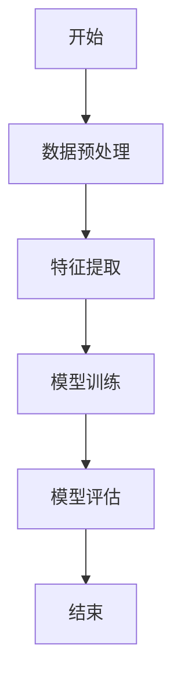
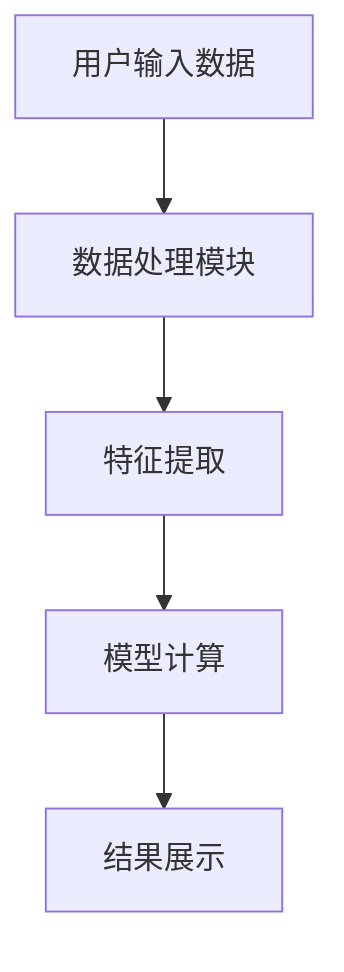
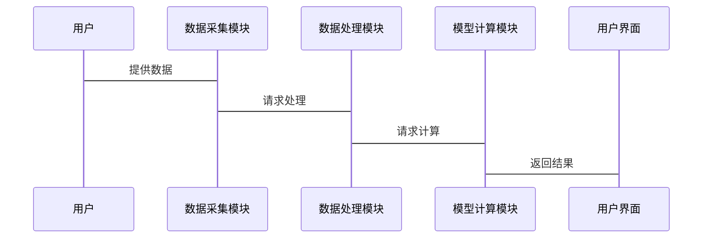

                 


# AI Agents在公司社会资本评估中的应用

## 关键词：
AI Agent，社会资本评估，企业关系管理，智能代理算法，社会资本指数

## 摘要：
本文探讨了AI Agents在公司社会资本评估中的应用，从理论到实践，详细分析了AI Agent的核心概念、算法原理、系统设计以及实际案例。文章旨在帮助企业利用AI技术优化社会资本评估流程，提升企业竞争力。

---

## 第1章: AI Agent的基本概念与功能

### 1.1 AI Agent的定义与类型

#### 1.1.1 什么是AI Agent
AI Agent（智能代理）是能够感知环境并采取行动以实现目标的实体。它可以是一个软件程序，通过传感器接收信息，利用算法处理数据，并执行动作以达成预定目标。

#### 1.1.2 AI Agent的分类
AI Agent可以分为以下几类：
- **简单反射型Agent**：基于当前感知直接行动，无内部状态。
- **基于模型的反射型Agent**：维护环境模型，根据模型推理行动。
- **目标驱动型Agent**：基于目标选择最优行动。
- **效用驱动型Agent**：通过最大化效用函数来决策。

#### 1.1.3 AI Agent的核心功能
- 数据感知与处理
- 智能决策
- 自动行动
- 学习与优化

---

## 第2章: 社会资本的定义与评估方法

### 2.1 社会资本的定义

#### 2.1.1 内部社会资本
内部社会资本指公司内部员工之间的信任、合作与知识共享。健康的内部社会资本能提升团队协作效率和创新能力。

#### 2.1.2 外部社会资本
外部社会资本指公司在外部建立的关系网络，包括供应商、客户、合作伙伴等。强大的外部社会资本能为企业带来更多的资源和机会。

### 2.2 社会资本的评估维度

#### 2.2.1 关系网络的广度与深度
- **广度**：关系网络覆盖的范围，包括直接和间接联系的个体或组织数量。
- **深度**：关系的质量，包括信任程度、合作紧密度等。

#### 2.2.2 合作能力与信任度
- 合作能力：共同完成目标的能力。
- 信任度：合作方之间的信任程度。

#### 2.2.3 资源获取能力
- 资源获取能力：通过社会资本获取所需资源的难易程度。

---

## 第3章: AI Agent在社会资本评估中的作用

### 3.1 AI Agent如何辅助社会资本评估

#### 3.1.1 数据收集与分析
AI Agent可以实时收集和分析来自CRM系统、社交媒体、邮件等渠道的数据，提取关键指标。

#### 3.1.2 关系网络的可视化
AI Agent能够将复杂的关系网络转化为可视化的图表，帮助企业管理者直观理解网络结构。

#### 3.1.3 预测与优化
通过分析历史数据，AI Agent可以预测未来的社会资本变化趋势，并提出优化建议。

### 3.2 AI Agent的优势与挑战

#### 3.2.1 AI Agent的优势
- **高效性**：快速处理大量数据，提高评估效率。
- **准确性**：基于算法分析，结果客观准确。
- **实时性**：实时监控社会资本变化。

#### 3.2.2 AI Agent的局限性
- 数据隐私问题
- 模型依赖高质量数据
- 算法的可解释性

---

## 第4章: 社会资本评估的核心概念与模型

### 4.1 社会资本的理论模型

#### 4.1.1 社会资本三层次模型
- **结构维度**：网络结构。
- **关系维度**：关系强度。
- **认知维度**：信任程度。

#### 4.1.2 网络分析模型
通过图论方法分析社会网络的结构特征。

### 4.2 AI Agent在社会资本评估中的理论框架

#### 4.2.1 理论基础
结合社会资本理论和AI Agent技术，构建评估框架。

#### 4.2.2 应用框架
AI Agent作为数据处理和分析工具，辅助社会资本评估的各个环节。

---

## 第5章: AI Agent评估社会资本的算法与模型

### 5.1 算法概述

#### 5.1.1 数据预处理
- 清洗数据：去除无效信息。
- 标准化：统一数据格式。

#### 5.1.2 特征提取
- 提取关键特征：如关系强度、合作频率等。
- 使用NLP技术分析文本数据。

#### 5.1.3 模型训练
- 使用机器学习算法（如随机森林、神经网络）训练模型。
- 评估模型性能，调整参数。

### 5.2 算法流程图



### 5.3 算法实现代码示例

```python
import pandas as pd
from sklearn.ensemble import RandomForestClassifier

# 数据加载与预处理
data = pd.read_csv('social_capital.csv')
data = data.dropna()

# 特征提取
features = ['关系强度', '合作频率', '信任度']
target = '社会资本指数'

# 模型训练
model = RandomForestClassifier()
model.fit(data[features], data[target])

# 预测与评估
预测 = model.predict(data[features])
print(预测)
```

### 5.4 数学模型与公式

社会资本指数计算公式：
$$ 社会资本指数 = \alpha \times 关系强度 + \beta \times 合作频率 + \gamma \times 信任度 $$
其中，$$\alpha + \beta + \gamma = 1$$

---

## 第6章: 系统分析与架构设计

### 6.1 系统功能设计

#### 6.1.1 功能模块
- 数据采集模块
- 数据处理模块
- 模型计算模块
- 结果展示模块

#### 6.1.2 系统功能流程图



### 6.2 系统架构设计

#### 6.2.1 系统架构图

```mermaid
rectangle 数据库 {
  图表 数据存储
}
rectangle 数据处理模块 {
  图表 数据处理
}
rectangle 模型计算模块 {
  图表 模型计算
}
rectangle 用户界面 {
  图表 结果展示
}
数据处理模块 --> 数据库
模型计算模块 --> 数据处理模块
用户界面 --> 模型计算模块
```

### 6.3 系统接口设计

#### 6.3.1 数据接口
- 输入接口：接收原始数据
- 输出接口：返回处理后的数据

#### 6.3.2 API接口
- 提供REST API，供其他系统调用。

### 6.4 系统交互流程图



---

## 第7章: 项目实战

### 7.1 项目背景与目标

#### 7.1.1 项目背景
中型制造企业希望通过AI Agent评估外部社会资本，优化供应商管理。

### 7.1.2 项目目标
- 建立社会资本评估模型。
- 优化供应商关系管理。

### 7.2 项目实施步骤

#### 7.2.1 环境配置
- 安装Python、Pandas、Scikit-learn等库。

#### 7.2.2 核心代码实现

```python
import pandas as pd
from sklearn.ensemble import RandomForestClassifier

# 数据加载与预处理
data = pd.read_csv('social_capital.csv')
data = data.dropna()

# 特征提取
features = ['关系强度', '合作频率', '信任度']
target = '社会资本指数'

# 模型训练
model = RandomForestClassifier()
model.fit(data[features], data[target])

# 预测与评估
预测 = model.predict(data[features])
print(预测)
```

#### 7.2.3 功能模块设计
- 数据采集模块
- 数据处理模块
- 模型计算模块
- 结果展示模块

### 7.3 实际案例分析

#### 7.3.1 数据分析结果
通过模型计算，供应商A的信任度和合作频率较高，关系强度一般，综合社会资本指数为0.85。

#### 7.3.2 结果解读
供应商A是可靠的合作伙伴，但可以通过加强关系强度进一步提升社会资本。

### 7.4 项目总结

#### 7.4.1 项目成果
- 成功建立社会资本评估模型。
- 优化了供应商关系管理。

#### 7.4.2 经验总结
- 数据质量影响模型性能。
- 模型需要定期更新。

---

## 第8章: 总结与展望

### 8.1 总结

#### 8.1.1 核心观点
AI Agent在社会资本评估中具有重要作用，能够提升评估效率和准确性。

### 8.2 未来展望

#### 8.2.1 技术发展
- 更加智能化的AI Agent。
- 更多行业中的应用。

### 8.3 最佳实践 tips

#### 8.3.1 数据隐私保护
确保数据处理过程中的隐私安全。

#### 8.3.2 模型优化
定期更新模型，保持高准确性。

---

## 参考文献
1. 著名AI书籍推荐
2. 社会资本相关文献
3. 相关技术文档

---

## END

