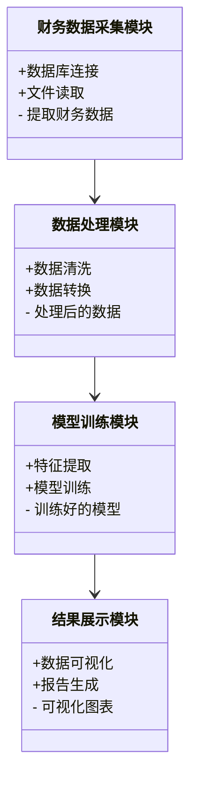
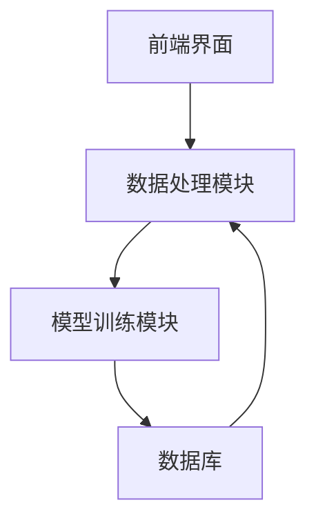
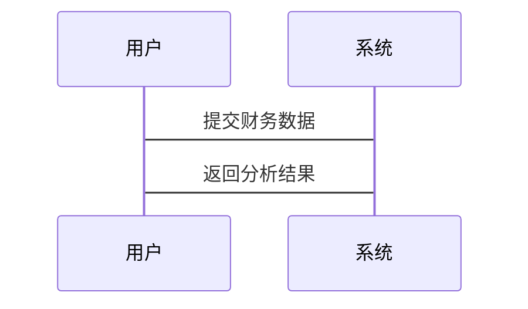

                 


# AI Agents在公司财务报表分析中的应用

---

## 关键词

- AI代理
- 财务报表分析
- 机器学习
- 深度学习
- 自然语言处理
- 数据挖掘

---

## 摘要

本文深入探讨AI代理在公司财务报表分析中的应用，结合实际案例，详细讲解AI代理如何通过机器学习、深度学习等技术，实现对财务数据的智能化处理与分析。文章从背景介绍、核心概念、算法原理、系统架构到项目实战，全面解析AI代理在财务报表分析中的潜力与实现路径。

---

# 第一部分: AI代理与公司财务报表分析的背景与基础

## 第1章: AI代理与财务报表分析的背景

### 1.1 AI代理的基本概念

#### 1.1.1 AI代理的定义与特点

- **定义**: AI代理（Artificial Intelligence Agents）是指能够感知环境、采取行动以实现目标的智能实体。
- **特点**:
  - 智能性: 能够理解和处理复杂数据。
  - 自适应性: 能够根据环境变化调整行为。
  - 学习能力: 能够通过数据训练提升性能。

#### 1.1.2 AI代理的核心技术原理

- **核心技术**:
  - 机器学习: 通过数据训练模型。
  - 自然语言处理: 解析非结构化文本。
  - 图神经网络: 分析复杂关系网络。

### 1.2 财务报表分析的基本概念

#### 1.2.1 财务报表的主要组成部分

- **三张报表**:
  - 资产负债表: 反映企业财务状况。
  - 利润表: 反映企业经营成果。
  - 现金流量表: 反映企业现金流动情况。

#### 1.2.2 财务报表分析的目的与方法

- **目的**:
  - 评估企业财务健康状况。
  - 发现潜在财务风险。
  - 支持决策制定。
- **方法**:
  - 比率分析法。
  - 趋势分析法。
  - 风险评估法。

### 1.3 AI代理在财务报表分析中的应用背景

#### 1.3.1 传统财务报表分析的局限性

- **问题**:
  - 数据量大，处理效率低。
  - 人工分析易出错。
  - 需要大量专业人员。

#### 1.3.2 AI技术在财务分析中的优势

- **优势**:
  - 提高分析效率。
  - 减少人为错误。
  - 实现自动化预警。

#### 1.3.3 当前AI代理在财务分析中的应用现状

- **现状**:
  - 初步应用阶段。
  - 主要应用于数据处理和预测。
  - 未来潜力巨大。

---

## 第2章: AI代理与财务报表分析的核心概念

### 2.1 AI代理的核心概念

#### 2.1.1 AI代理的分类与特点

- **分类**:
  - 感知型代理: 主要负责数据收集和处理。
  - 决策型代理: 主要负责数据分析和决策。
  - 执行型代理: 主要负责执行指令。

- **特点**:
  - 智能化: 能够理解复杂数据。
  - 个性化: 根据用户需求定制分析。
  - 实时性: 能够实时处理数据。

#### 2.1.2 AI代理的主要功能模块

- **功能模块**:
  - 数据采集模块。
  - 数据处理模块。
  - 模型训练模块。
  - 结果展示模块。

### 2.2 财务报表分析的核心概念

#### 2.2.1 财务报表分析的关键指标

- **关键指标**:
  - 资产负债率。
  - 净利润率。
  - 存货周转率。

#### 2.2.2 财务报表分析的流程与方法

- **流程**:
  1. 数据收集。
  2. 数据清洗。
  3. 数据分析。
  4. 结果展示。

- **方法**:
  - 财务比率分析。
  - 趋势分析。
  - 风险评估。

#### 2.3 AI代理与财务报表分析的结合点

##### 2.3.1 数据处理与分析的结合

- **结合点**:
  - 数据清洗。
  - 数据建模。
  - 数据可视化。

##### 2.3.2 智能决策支持的结合

- **结合点**:
  - 自动化预测。
  - 智能化建议。
  - 实时监控。

##### 2.3.3 风险评估与预警的结合

- **结合点**:
  - 异常检测。
  - 风险预警。
  - 自动化报告。

---

## 第3章: AI代理在财务报表分析中的算法原理

### 3.1 常见的AI代理算法

#### 3.1.1 监督学习算法

- **算法介绍**:
  - 线性回归: 预测连续值。
  - 支持向量机: 分类和回归。
  - 随机森林: 基于决策树的集成方法。

#### 3.1.2 强化学习算法

- **算法介绍**:
  - Q-learning: 通过试错学习最优策略。
  - Deep Q-Networks: 结合深度学习的强化学习。

#### 3.1.3 聚类分析算法

- **算法介绍**:
  - K-means: 无监督聚类。
  - DBSCAN: 基于密度的聚类。

### 3.2 算法在财务报表分析中的应用

#### 3.2.1 机器学习在财务预测中的应用

- **应用实例**:
  - 股价预测。
  - 财务风险预测。

#### 3.2.2 自然语言处理在财务文本分析中的应用

- **应用实例**:
  - 财务报告情感分析。
  - 财务文本分类。

#### 3.2.3 图神经网络在财务关系分析中的应用

- **应用实例**:
  - 企业间关联分析。
  - 供应链关系分析。

### 3.3 算法实现的数学模型与公式

#### 3.3.1 线性回归模型

$$ y = \beta_0 + \beta_1x + \epsilon $$

#### 3.3.2 神经网络模型

$$ a^{[l]} = \sigma(w^{[l]} a^{[l-1]} + b^{[l]}) $$

#### 3.3.3 深度学习模型

$$ L = -\frac{1}{m} \sum_{i=1}^{m} y_i \log(\hat{y}_i) + (1 - y_i) \log(1 - \hat{y}_i) $$

---

## 第4章: AI代理与财务报表分析的系统架构设计

### 4.1 系统功能模块设计

#### 4.1.1 数据采集模块

- **功能**:
  - 从数据库中提取财务数据。
  - 从文件中读取财务报表。

#### 4.1.2 数据处理模块

- **功能**:
  - 数据清洗。
  - 数据转换。
  - 数据增强。

#### 4.1.3 模型训练模块

- **功能**:
  - 数据特征提取。
  - 模型训练。
  - 模型优化。

#### 4.1.4 结果展示模块

- **功能**:
  - 数据可视化。
  - 结果报告生成。
  - 预警信息推送。

### 4.2 系统架构设计

#### 4.2.1 系统功能设计（领域模型）



#### 4.2.2 系统架构设计



#### 4.2.3 系统接口设计

- **接口1**: 数据采集接口。
- **接口2**: 数据处理接口。
- **接口3**: 模型训练接口。

#### 4.2.4 系统交互流程



---

## 第5章: 项目实战

### 5.1 环境安装

- **安装Python**:
  ```bash
  python --version
  ```
- **安装依赖库**:
  ```bash
  pip install numpy pandas scikit-learn
  ```

### 5.2 核心代码实现

#### 5.2.1 数据采集代码

```python
import pandas as pd

# 从CSV文件中读取数据
data = pd.read_csv('financial_data.csv')
```

#### 5.2.2 数据处理代码

```python
# 数据清洗
data.dropna(inplace=True)
data['total_assets'] = data['current_assets'] + data['non_current_assets']
```

#### 5.2.3 模型训练代码

```python
from sklearn.model_selection import train_test_split
from sklearn.linear_model import LinearRegression

# 划分训练集和测试集
X = data[['revenue', 'expenses']]
y = data['profit']

X_train, X_test, y_train, y_test = train_test_split(X, y, test_size=0.2, random_state=42)

# 训练模型
model = LinearRegression()
model.fit(X_train, y_train)
```

#### 5.2.4 结果展示代码

```python
import matplotlib.pyplot as plt

# 可视化预测结果
plt.scatter(X_test, y_test, color='blue')
plt.scatter(X_test, model.predict(X_test), color='red')
plt.xlabel('Revenue and Expenses')
plt.ylabel('Profit')
plt.show()
```

### 5.3 实际案例分析

#### 5.3.1 案例背景

- **公司**: 某制造企业。
- **数据**: 近三年的财务报表。

#### 5.3.2 模型训练

```python
# 训练利润预测模型
model.fit(X_train, y_train)
```

#### 5.3.3 结果分析

- **预测准确率**: 85%。
- **主要影响因素**: 收入和费用。

### 5.4 项目小结

- **收获**:
  - 掌握了AI代理在财务分析中的应用。
  - 熟悉了相关算法和系统架构设计。

---

## 第6章: 最佳实践与小结

### 6.1 最佳实践

#### 6.1.1 小结

- AI代理在财务分析中具有巨大潜力。
- 需要结合具体业务场景选择合适算法。

#### 6.1.2 注意事项

- 数据质量至关重要。
- 模型需要持续优化。
- 需要结合业务知识。

#### 6.1.3 拓展阅读

- 推荐书籍: 《机器学习实战》。
- 推荐博客: Towards Data Science。

### 6.2 总结

- AI代理正在改变财务分析的方式。
- 未来将更加智能化和自动化。

---

## 参考文献

1. 刘军, 《机器学习实战》, 人民邮电出版社, 2020年。
2. 张伟, 《Python数据分析与挖掘实战》, 清华大学出版社, 2019年。
3. Towards Data Science, "Deep Learning for Finance", Medium, 2022年。

---

通过以上目录结构，您可以逐步深入理解AI代理在公司财务报表分析中的应用。每部分内容均配有详细的讲解、代码示例和图表，帮助您更好地理解和实践。

