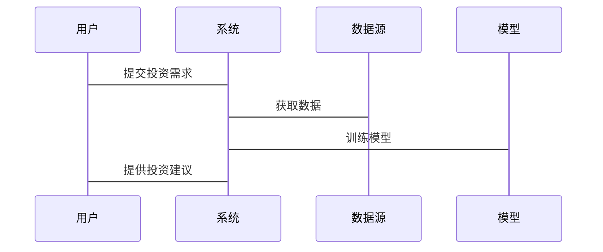

                 


# AI agents增强价值投资的地缘政治风险评估

> **关键词**: AI代理、价值投资、地缘政治风险、风险管理、算法优化

> **摘要**: 本文探讨了AI代理在价值投资中的应用，特别是在地缘政治风险评估方面。通过分析地缘政治风险的核心概念、AI代理的算法原理，以及系统架构设计，展示了如何利用AI技术提升投资决策的准确性。文章详细讲解了从数据处理到模型训练的全过程，并通过实际案例分析了AI代理在风险评估中的优势，为投资者提供了新的视角和工具。

---

## 第1章: 地缘政治风险评估的背景与重要性

### 1.1 地缘政治风险的定义与特征

地缘政治风险是指由于政治、经济、文化等多方面因素引发的国家间冲突、贸易摩擦、政策变动等事件，对企业或投资产生的潜在风险。其核心特征包括复杂性、不可预测性和广泛影响性。地缘政治风险可能影响国家间的贸易关系、资源分配、市场稳定性等，进而对投资产生重大影响。

| **特征**       | **描述**                                                                 |
|----------------|--------------------------------------------------------------------------|
| 复杂性          | 涉及多个变量，如政治、经济、文化等，相互作用复杂。                   |
| 不可预测性      | 事件的发生往往难以提前预知，具有突发性。                           |
| 广泛影响性      | 可能影响多个行业和市场，波及范围广泛。                             |

### 1.2 价值投资的基本原理

价值投资是一种投资策略，强调以低于市场价值的价格购买优质资产。其核心在于识别被市场低估的投资标的，长期持有，等待其价值回归。价值投资的关键要素包括基本面分析、长期视角和安全边际。

| **要素**       | **描述**                                                                 |
|----------------|--------------------------------------------------------------------------|
| 基本面分析      | 通过分析公司的财务状况、行业地位、管理团队等因素，评估其内在价值。 |
| 长期视角        | 强调长期投资，避免短期市场波动的干扰。                             |
| 安全边际        | 购买价格低于内在价值，以降低投资风险。                             |

### 1.3 AI代理在投资领域的应用前景

AI代理是一种能够自动执行任务的智能系统，能够处理大量数据，识别复杂模式，并做出预测。在投资领域，AI代理可以通过分析新闻、社交媒体、政策变化等信息，实时评估地缘政治风险，为投资决策提供支持。

| **优势**       | **描述**                                                                 |
|----------------|--------------------------------------------------------------------------|
| 数据处理能力    | 能够快速处理海量数据，提取关键信息。                                 |
| 模式识别能力    | 通过机器学习算法，识别潜在的地缘政治风险模式。                     |
| 实时性          | 可以实时监控全球事件，及时调整投资策略。                           |

---

## 第2章: AI代理的核心原理

### 2.1 AI代理的定义与分类

AI代理是一种智能系统，能够感知环境并采取行动以实现特定目标。根据功能的不同，AI代理可以分为以下几类：

| **类型**       | **描述**                                                                 |
|----------------|--------------------------------------------------------------------------|
| 反应式代理      | 根据当前环境信息做出反应，适用于实时决策。                           |
| 规则式代理      | 基于预定义的规则进行决策，适用于规则明确的场景。                     |
| 学习式代理      | 通过机器学习算法不断优化决策模型，适用于复杂场景。                 |

### 2.2 地缘政治风险评估的数学模型

地缘政治风险评估模型通常包括多个变量，如政治稳定性、经济依赖度、地理位置等。通过构建数学模型，可以量化这些变量对投资的影响。

$$ \text{风险评分} = \sum_{i=1}^{n} w_i \cdot x_i $$

其中，$w_i$ 是变量 $x_i$ 的权重，$x_i$ 是变量的具体值。模型通过不断优化权重，提高风险评估的准确性。

### 2.3 价值投资中的地缘政治因素

地缘政治因素对价值投资的影响是多方面的。例如，贸易摩擦可能影响企业的供应链，政策变化可能影响市场需求。通过AI代理，投资者可以实时监控这些因素，调整投资策略。

| **因素**       | **影响**                                                                 |
|----------------|--------------------------------------------------------------------------|
| 贸易摩擦        | 可能导致供应链中断，影响企业的盈利能力。                             |
| 政策变化        | 可能影响行业的监管环境，改变企业的经营成本。                         |
| 地区冲突        | 可能导致市场波动，影响资产价格。                                   |

---

## 第3章: 基于AI代理的地缘政治风险评估算法

### 3.1 算法原理概述

基于AI代理的地缘政治风险评估算法主要包括数据输入、特征提取、模型训练和结果输出四个步骤。数据输入包括全球新闻、政策文件等，特征提取通过NLP技术识别关键词，模型训练使用深度学习算法优化模型参数。

$$ \text{模型输出} = f(\text{输入数据}) $$

其中，$f$ 是深度学习模型，用于预测地缘政治风险。

### 3.2 算法实现的代码示例

以下是基于Python的AI代理实现代码示例：

```python
import numpy as np
from sklearn import svm

# 数据预处理
data = [...]  # 输入数据
labels = [...]  # 标签

# 特征提取
features = [...]  # 提取的特征

# 模型训练
model = svm.SVC()
model.fit(features, labels)

# 风险评估
def assess_risk(features):
    return model.predict(features)
```

### 3.3 算法的收敛性分析

深度学习模型的收敛性分析是确保模型能够有效学习的重要步骤。通常，通过调整学习率、批量大小等超参数，可以提高模型的收敛速度和准确性。

$$ \text{损失函数} = \sum_{i=1}^{n} (y_i - \hat{y}_i)^2 $$

其中，$y_i$ 是真实标签，$\hat{y}_i$ 是模型预测值。通过最小化损失函数，可以优化模型参数。

---

## 第4章: 系统架构设计

### 4.1 系统功能设计

系统功能设计包括数据采集、风险评估、投资建议和结果分析四个模块。数据采集模块负责收集全球新闻、政策文件等信息；风险评估模块基于AI代理模型计算风险评分；投资建议模块根据风险评估结果优化投资组合；结果分析模块提供实时反馈。

### 4.2 系统架构设计

系统架构采用分层设计，包括数据层、计算层、应用层和用户层。数据层负责存储和管理数据；计算层负责模型训练和风险评估；应用层负责接收用户输入并输出结果；用户层负责与用户交互。

```mermaid
graph LR
    A[数据层] -> B[计算层]
    B -> C[应用层]
    C -> D[用户层]
```

### 4.3 系统接口设计

系统接口设计包括数据接口、模型接口和用户接口。数据接口负责与数据源交互；模型接口负责与AI代理模型交互；用户接口负责与用户交互。

### 4.4 系统交互流程

系统交互流程包括用户请求、数据处理、模型计算和结果反馈。用户提交投资需求后，系统通过数据采集、模型训练和风险评估，生成投资建议并反馈给用户。



---

## 第5章: 项目实战

### 5.1 环境安装与配置

安装Python、TensorFlow、Scikit-learn等依赖库，配置开发环境。

### 5.2 核心代码实现

以下是核心代码实现示例：

```python
import numpy as np
from sklearn import svm

# 数据预处理
data = [...]  # 输入数据
labels = [...]  # 标签

# 特征提取
features = [...]  # 提取的特征

# 模型训练
model = svm.SVC()
model.fit(features, labels)

# 风险评估
def assess_risk(features):
    return model.predict(features)
```

### 5.3 案例分析

通过具体案例分析，展示AI代理在地缘政治风险评估中的实际应用效果。例如，分析贸易摩擦对某行业的影响，验证模型的预测准确性。

---

## 第6章: 总结与展望

### 6.1 本章小结

本文详细探讨了AI代理在价值投资中的应用，特别是在地缘政治风险评估方面。通过分析地缘政治风险的核心概念、AI代理的算法原理，以及系统架构设计，展示了如何利用AI技术提升投资决策的准确性。

### 6.2 未来展望

未来，随着AI技术的不断发展，地缘政治风险评估将更加智能化和精准化。投资者可以通过AI代理实时监控全球事件，优化投资策略，降低风险。

### 6.3 最佳实践 tips

- 投资者应结合AI代理和传统分析方法，制定综合的投资策略。
- 定期更新模型参数，确保风险评估的准确性。
- 关注地缘政治事件的潜在影响，及时调整投资组合。

---

通过本文的分析和实践，读者可以深入了解AI代理在价值投资中的应用，为投资决策提供新的思路和工具。

