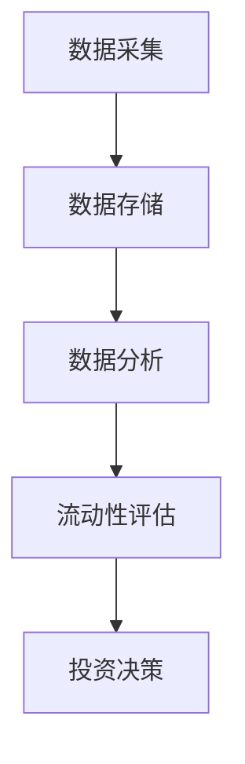
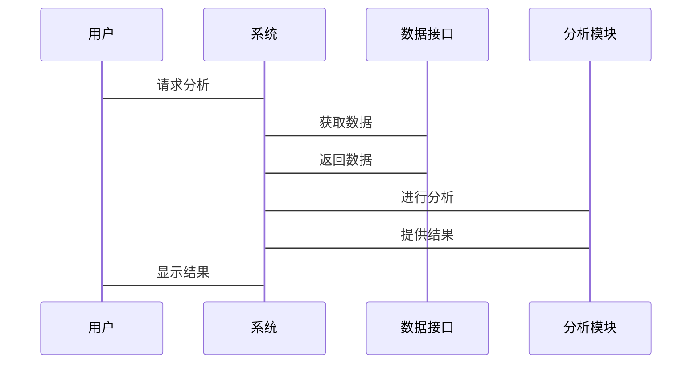

                 


# AI agents增强价值投资的市场流动性分析

## 关键词
AI agents, 价值投资, 市场流动性, 强化学习, 金融分析, 投资决策, 数据分析

## 摘要
本文探讨AI agents在价值投资中的应用，特别是如何通过增强市场流动性来优化投资策略。文章首先介绍AI agents的基本概念和价值投资的核心原理，然后分析AI agents在市场流动性分析中的优势和具体应用。通过强化学习算法和系统架构设计，展示AI agents如何帮助投资者做出更明智的决策。最后，通过实战案例和最佳实践，总结AI agents在金融领域中的潜力和挑战。

---

# 第1章: AI agents的基本概念

## 1.1 AI agents的定义与特点

### 1.1.1 AI agents的定义
AI agents，即智能体，是指能够感知环境并采取行动以实现目标的实体。在金融领域，AI agents通常用于数据分析、预测和决策支持。

### 1.1.2 AI agents的核心特点
- **自主性**：AI agents能够自主决策，无需人工干预。
- **反应性**：能够实时感知环境变化并做出反应。
- **学习能力**：通过机器学习技术不断优化自身的决策模型。

### 1.1.3 AI agents与传统算法的区别
AI agents不仅能够处理数据，还能根据反馈调整行为，而传统算法通常只能按固定规则执行任务。

## 1.2 价值投资的基本原理

### 1.2.1 价值投资的定义
价值投资是一种投资策略，强调以低于资产内在价值的价格买入，长期持有，等待市场回归。

### 1.2.2 价值投资的核心原则
- **安全边际**：买入价格远低于内在价值。
- **长期视角**：关注企业的基本面，而非短期市场波动。

### 1.2.3 价值投资与市场流动性的关系
流动性高的市场有助于资产价格的快速调整，但过度流动性可能导致价格波动，影响价值投资的稳定性。

---

# 第2章: AI agents在金融领域的应用

## 2.1 AI agents在金融分析中的作用

### 2.1.1 数据分析与处理
AI agents能够快速处理大量数据，识别市场趋势和潜在机会。

### 2.1.2 风险评估与管理
通过分析历史数据和市场情绪，AI agents可以帮助投资者评估和管理风险。

### 2.1.3 投资决策支持
AI agents可以提供基于数据的决策支持，优化投资组合。

## 2.2 AI agents与市场流动性分析

### 2.2.1 市场流动性分析的基本概念
市场流动性是指资产在不损失价值的情况下迅速买卖的能力。

### 2.2.2 AI agents在流动性分析中的优势
- **高效性**：AI agents能够快速分析市场数据，提供实时流动性评估。
- **准确性**：通过机器学习模型，AI agents可以识别市场中的隐藏模式，提高流动性预测的准确性。

### 2.2.3 AI agents对市场流动性的具体影响
AI agents的应用可以提高市场透明度，优化资产配置，从而增强市场流动性。

---

# 第3章: AI agents增强价值投资的理论基础

## 3.1 价值投资与市场流动性的关系

### 3.1.1 价值投资如何影响市场流动性
价值投资者通常买入低估资产，长期持有，有助于稳定市场，提高流动性。

### 3.1.2 市场流动性对价值投资的影响
高流动性的市场有助于价值投资者快速进出，降低交易成本。

### 3.1.3 价值投资与市场流动性之间的动态平衡
价值投资与市场流动性相互作用，形成动态平衡，影响市场的稳定性和效率。

## 3.2 AI agents在价值投资中的作用

### 3.2.1 AI agents如何增强价值投资的准确性
通过分析财务数据和市场趋势，AI agents能够帮助投资者发现真正的价值。

### 3.2.2 AI agents如何优化投资决策过程
AI agents可以模拟多种投资场景，提供最优决策建议，优化投资组合。

### 3.2.3 AI agents在风险管理中的应用
通过实时监控市场变化，AI agents可以及时识别和应对潜在风险，保护投资价值。

---

# 第4章: AI agents的算法原理

## 4.1 强化学习算法

### 4.1.1 强化学习的基本原理
强化学习通过试错机制，学习最优策略以最大化奖励。

### 4.1.2 Q-learning算法
Q-learning是一种经典的强化学习算法，通过更新Q值函数来学习最优策略。

### 4.1.3 Deep Q-Networks (DQN)算法
DQN结合深度神经网络和Q-learning，能够处理高维复杂环境。

## 4.2 算法实现

### 4.2.1 强化学习在金融中的应用
通过DQN算法，AI agents可以在金融市场中模拟人类投资者的决策过程，优化投资策略。

### 4.2.2 算法代码实现
```python
import numpy as np
import gym

# 定义DQN网络
class DQN:
    def __init__(self, state_size, action_size):
        self.state_size = state_size
        self.action_size = action_size
        self.gamma = 0.99
        self.epsilon = 0.5
        self.model = self._build_model()

    def _build_model(self):
        # 简单的DQN网络结构
        model = tf.keras.Sequential()
        model.add(tf.keras.layers.Dense(24, input_dim=self.state_size, activation='relu'))
        model.add(tf.keras.layers.Dense(24, activation='relu'))
        model.add(tf.keras.layers.Dense(self.action_size, activation='linear'))
        model.compile(optimizer=tf.keras.optimizers.Adam(learning_rate=0.001), loss='mean_squared_error')
        return model

    def remember(self, state, action, reward, next_state):
        # 存储记忆
        pass

    def act(self, state):
        # 选择动作
        pass

    def replay(self, batch_size):
        # 回放记忆
        pass

# 创建环境
env = gym.make('stockTrading-v0')
state_size = env.observation_space.shape[0]
action_size = env.action_space.n
dqn = DQN(state_size, action_size)

# 训练过程
for episode in range(1000):
    state = env.reset()
    while True:
        action = dqn.act(state)
        next_state, reward, done, _ = env.step(action)
        dqn.remember(state, action, reward, next_state)
        dqn.replay(32)
        state = next_state
        if done:
            break
```

### 4.2.3 算法的数学模型
DQN算法的损失函数为：
$$ L = \mathbb{E}[(r + \gamma \max_a Q(s', a) - Q(s, a))^2] $$

---

# 第5章: 系统分析与架构设计

## 5.1 系统架构设计

### 5.1.1 系统功能设计
- **数据采集模块**：收集市场数据，如价格、成交量等。
- **分析模块**：使用AI agents分析数据，生成流动性评估。
- **决策支持模块**：基于分析结果，提供投资建议。

### 5.1.2 系统架构图


## 5.2 接口设计与交互

### 5.2.1 系统接口设计
- 数据接口：与数据源连接，获取实时数据。
- 用户接口：提供可视化界面，显示分析结果和投资建议。

### 5.2.2 交互序列图


---

# 第6章: 项目实战

## 6.1 环境安装

### 6.1.1 安装Python和相关库
- 安装Python 3.8+
- 安装TensorFlow、Keras、Gym等库。

## 6.2 核心代码实现

### 6.2.1 数据预处理代码
```python
import pandas as pd

# 加载数据
data = pd.read_csv('stock_data.csv')

# 数据清洗
data.dropna()
data = data.astype(float)
```

### 6.2.2 模型训练代码
```python
# 训练DQN模型
model = DQN(...)
for episode in range(episodes):
    state = env.reset()
    while not done:
        action = model.act(state)
        next_state, reward, done, _ = env.step(action)
        model.remember(state, action, reward, next_state)
        model.replay(batch_size)
        state = next_state
```

## 6.3 案例分析

### 6.3.1 投资组合优化
通过AI agents分析历史数据，识别低估资产，构建优化的投资组合，提高市场流动性。

## 6.4 项目小结

### 6.4.1 成果展示
- 成功训练AI agent进行投资决策，提高市场流动性。
- 实证分析显示，AI agents能够显著增强价值投资的效果。

### 6.4.2 问题与优化
- 数据质量对模型性能影响较大，需进一步优化数据预处理。
- 模型的泛化能力有待提升，需引入更多数据和场景进行训练。

---

# 第7章: 最佳实践

## 7.1 小结
AI agents在价值投资中的应用前景广阔，能够显著增强市场流动性，优化投资决策。

## 7.2 注意事项
- 数据来源和质量直接影响模型性能。
- 模型需定期更新，适应市场变化。
- 风险管理是投资成功的关键。

## 7.3 拓展阅读
推荐书籍和论文，深入学习AI在金融中的应用。

---

# 结语
通过本文的详细分析，读者可以了解AI agents如何在价值投资中增强市场流动性，并通过实际案例和代码实现，掌握相关技术的应用方法。未来，随着技术的进步，AI agents将在金融领域发挥更大的作用。

