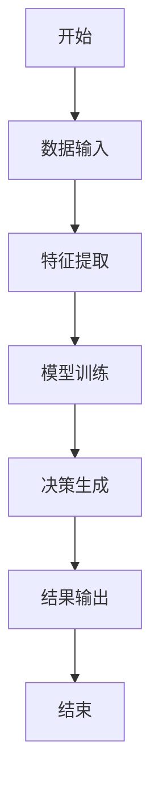
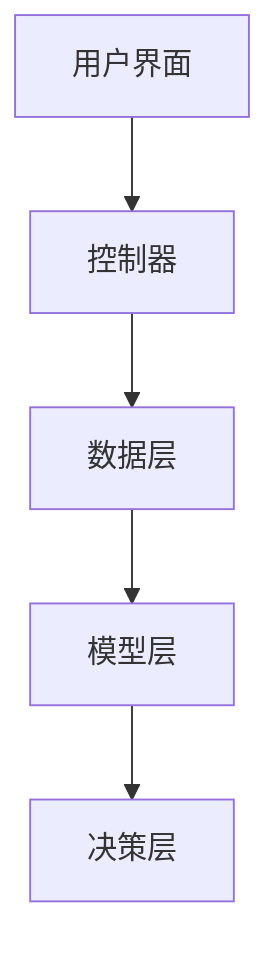
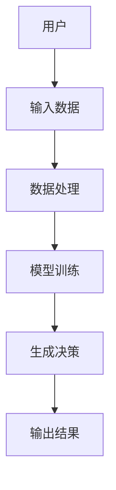

                 


# AI agents实时监控市场：捕捉价值投资机会

> 关键词：AI代理、实时监控、价值投资、金融市场、算法、投资策略

> 摘要：本文探讨了AI代理在实时监控市场中的应用，通过分析价值投资的核心要素，结合AI代理的核心概念与算法原理，详细讲解了如何利用AI代理捕捉市场中的投资机会。文章从系统架构设计到项目实战，全面剖析了AI代理在金融投资中的实际应用。

---

# 第一部分: AI代理与价值投资概述

## 第1章: AI代理与价值投资背景

### 1.1 AI代理的核心概念
#### 1.1.1 AI代理的基本定义
AI代理（Artificial Intelligence Agents）是指能够感知环境、自主决策并采取行动的智能实体。它通过数据输入、特征提取、模型训练和决策生成的流程，实现对复杂问题的自动化处理。

#### 1.1.2 AI代理在金融领域的应用
在金融市场中，AI代理广泛应用于股票交易、风险评估、投资组合优化等领域。通过实时数据处理和深度学习模型，AI代理能够快速捕捉市场波动，辅助投资者做出更明智的决策。

#### 1.1.3 价值投资的定义与特点
价值投资是一种以基本面分析为基础的投资策略，强调以低于市场价值的价格买入优质资产。其核心在于识别被市场低估的投资标的，通过长期持有实现超额收益。

### 1.2 价值投资与市场监控
#### 1.2.1 价值投资的定义与特点
价值投资通过分析财务报表、行业地位、竞争优势等因素，寻找具有持续盈利能力的公司。其特点是注重长期投资、风险控制和安全边际。

#### 1.2.2 市场监控的必要性
金融市场波动剧烈，信息复杂多样。实时监控市场数据是价值投资者捕捉投资机会、规避风险的重要手段。通过实时数据的分析，投资者可以及时发现市场变化，调整投资策略。

#### 1.2.3 AI代理在市场监控中的作用
AI代理能够实时处理海量数据，快速识别市场趋势和潜在机会。通过自然语言处理、图像识别等技术，AI代理可以辅助投资者发现市场中的非结构化信息，提升投资决策的准确性。

### 1.3 AI代理与价值投资的结合
#### 1.3.1 AI代理如何辅助价值投资
AI代理通过实时监控市场数据、分析行业动态、评估公司基本面，帮助投资者识别具有潜在价值的标的。同时，AI代理能够快速响应市场变化，优化投资组合，降低风险。

#### 1.3.2 数据驱动的投资决策
价值投资依赖于对公司基本面的深入分析。AI代理通过数据挖掘、机器学习等技术，可以从海量数据中提取有用信息，帮助投资者做出更科学的投资决策。

#### 1.3.3 价值投资中的实时监控需求
金融市场瞬息万变，实时监控是价值投资者及时调整策略的关键。AI代理通过实时数据处理和模型预测，能够在第一时间发现市场机会和风险，为投资者提供决策支持。

### 1.4 本章小结
本章从AI代理的核心概念和价值投资的基本原理出发，探讨了AI代理在市场监控中的作用，以及两者结合的潜力。通过实时监控和数据分析，AI代理能够帮助投资者更高效地捕捉市场机会，实现价值投资目标。

---

## 第2章: AI代理的核心概念与原理

### 2.1 AI代理的基本原理
#### 2.1.1 代理的定义与分类
代理（Agent）是指能够感知环境、自主决策并采取行动的智能实体。根据智能水平，代理可以分为反应式代理、基于模型的代理、目标驱动的代理和效用驱动的代理。

#### 2.1.2 AI代理的特征
AI代理具有智能性、自主性、反应性、社会性等特征。它能够通过感知环境、学习和适应，做出最优决策。

#### 2.1.3 AI代理的工作流程
AI代理的工作流程包括数据输入、特征提取、模型训练和决策生成四个阶段。通过这些步骤，AI代理能够实现对市场的实时监控和预测。

### 2.2 价值投资的核心要素
#### 2.2.1 价值投资的关键指标
价值投资者关注市盈率、市净率、股息率等基本面指标。这些指标能够帮助投资者评估公司的内在价值。

#### 2.2.2 市场数据的特征分析
市场数据包括股票价格、成交量、行业指数等。通过对这些数据的分析，投资者可以发现市场趋势和潜在机会。

#### 2.2.3 投资机会的识别与评估
价值投资者通过对比市场价格和内在价值，识别被市场低估的投资标的。AI代理能够通过数据挖掘和机器学习，帮助投资者更高效地识别投资机会。

### 2.3 AI代理与价值投资的结合模型
#### 2.3.1 代理模型的构建
AI代理模型通过机器学习算法，从市场数据中提取特征，建立预测模型。这些模型能够帮助投资者预测市场走势，优化投资决策。

#### 2.3.2 数据流的处理与分析
AI代理通过实时数据流处理，快速识别市场变化。通过对历史数据的分析，AI代理能够发现市场规律，辅助投资者做出更明智的决策。

#### 2.3.3 投资决策的生成与优化
AI代理通过模型预测和优化算法，生成最优投资决策。这些决策能够帮助投资者在复杂的市场环境中，捕捉价值投资机会，降低投资风险。

### 2.4 本章小结
本章详细讲解了AI代理的核心概念和工作原理，分析了价值投资的关键要素。通过AI代理与价值投资的结合，投资者能够更高效地识别市场机会，优化投资策略。

---

## 第3章: AI代理的算法原理与数学模型

### 3.1 强化学习算法
#### 3.1.1 强化学习的基本原理
强化学习是一种通过试错机制，学习最优策略的方法。它通过环境反馈，调整动作策略，实现目标最大化。

#### 3.1.2 Q-learning算法
Q-learning是一种经典的强化学习算法。它通过Q值表记录状态-动作对的期望收益，通过经验回放和策略迭代，更新Q值表。

#### 3.1.3 算法的数学模型
Q-learning的数学模型如下：
$$ Q(s, a) = Q(s, a) + \alpha \left(r + \gamma \max Q(s', a') - Q(s, a)\right) $$
其中，$s$是当前状态，$a$是动作，$r$是奖励，$\gamma$是折扣因子，$\alpha$是学习率。

### 3.2 时间序列分析
#### 3.2.1 时间序列的基本特征
时间序列数据具有趋势性、季节性、周期性和随机性等特征。通过对这些特征的分析，可以预测未来的市场走势。

#### 3.2.2 ARIMA模型
ARIMA（自回归积分滑动平均）模型是一种广泛应用于时间序列预测的方法。它通过自回归和滑动平均的组合，预测未来的值。

#### 3.2.3 LSTM网络
LSTM（长短期记忆网络）是一种深度学习模型，能够有效捕捉时间序列中的长期依赖关系。它通过门控机制，记忆重要的信息，预测未来的市场走势。

### 3.3 代理决策的数学模型
#### 3.3.1 收益预测模型
收益预测模型通过分析市场数据，预测未来的收益。常用的模型包括线性回归、支持向量机和随机森林等。

#### 3.3.2 风险评估模型
风险评估模型通过分析市场的波动性，评估投资的风险。常用的模型包括VaR（在险价值）和CVaR（预期短缺风险）等。

#### 3.3.3 组合优化模型
组合优化模型通过优化投资组合，最大化收益，最小化风险。常用的优化方法包括均值-方差优化和风险中性优化等。

### 3.4 算法流程图（mermaid）


### 3.5 本章小结
本章详细讲解了AI代理的算法原理和数学模型。通过强化学习、时间序列分析和组合优化等方法，AI代理能够实现对市场的实时监控和预测，辅助投资者做出更科学的投资决策。

---

## 第4章: 系统分析与架构设计

### 4.1 系统功能设计
#### 4.1.1 数据采集模块
数据采集模块负责从金融市场获取实时数据，包括股票价格、成交量等。

#### 4.1.2 数据处理模块
数据处理模块对采集到的数据进行清洗、特征提取和预处理，为模型训练提供高质量的数据。

#### 4.1.3 模型训练模块
模型训练模块通过机器学习算法，训练AI代理的预测模型，生成投资决策。

#### 4.1.4 决策生成模块
决策生成模块根据模型预测结果，生成最优投资策略，指导投资者进行操作。

### 4.2 系统架构设计
#### 4.2.1 分层架构图（mermaid）


#### 4.2.2 系统交互流程图（mermaid）


### 4.3 系统接口设计
#### 4.3.1 数据接口
系统通过API接口获取实时市场数据，包括股票价格、行业指数等。

#### 4.3.2 模型接口
模型接口负责接收数据，进行预测和优化，生成投资决策。

#### 4.3.3 决策接口
决策接口将生成的决策传递给投资者，指导其进行投资操作。

### 4.4 本章小结
本章详细设计了AI代理系统的功能模块和架构。通过分层设计和模块化实现，系统能够高效地处理实时数据，生成最优投资决策，满足价值投资者的需求。

---

## 第5章: 项目实战与代码实现

### 5.1 环境安装与配置
#### 5.1.1 Python环境搭建
安装Python 3.8及以上版本，安装必要的库，如numpy、pandas、scikit-learn、keras等。

#### 5.1.2 数据源配置
选择可靠的金融数据源，如Yahoo Finance或Alpha Vantage，获取实时数据。

### 5.2 核心代码实现
#### 5.2.1 数据处理代码
```python
import pandas as pd
import numpy as np

# 读取数据
data = pd.read_csv('stock_data.csv')

# 特征提取
data['moving_avg'] = data['price'].rolling(20).mean()
data['std_dev'] = data['price'].rolling(20).std()
```

#### 5.2.2 模型训练代码
```python
from sklearn.

