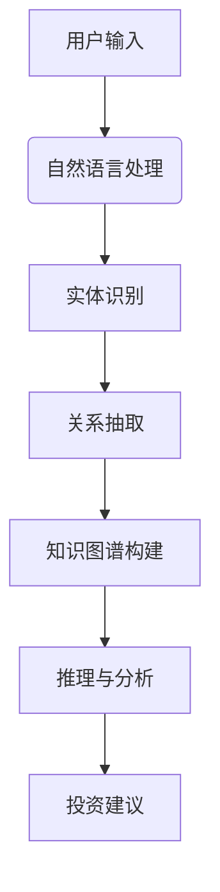
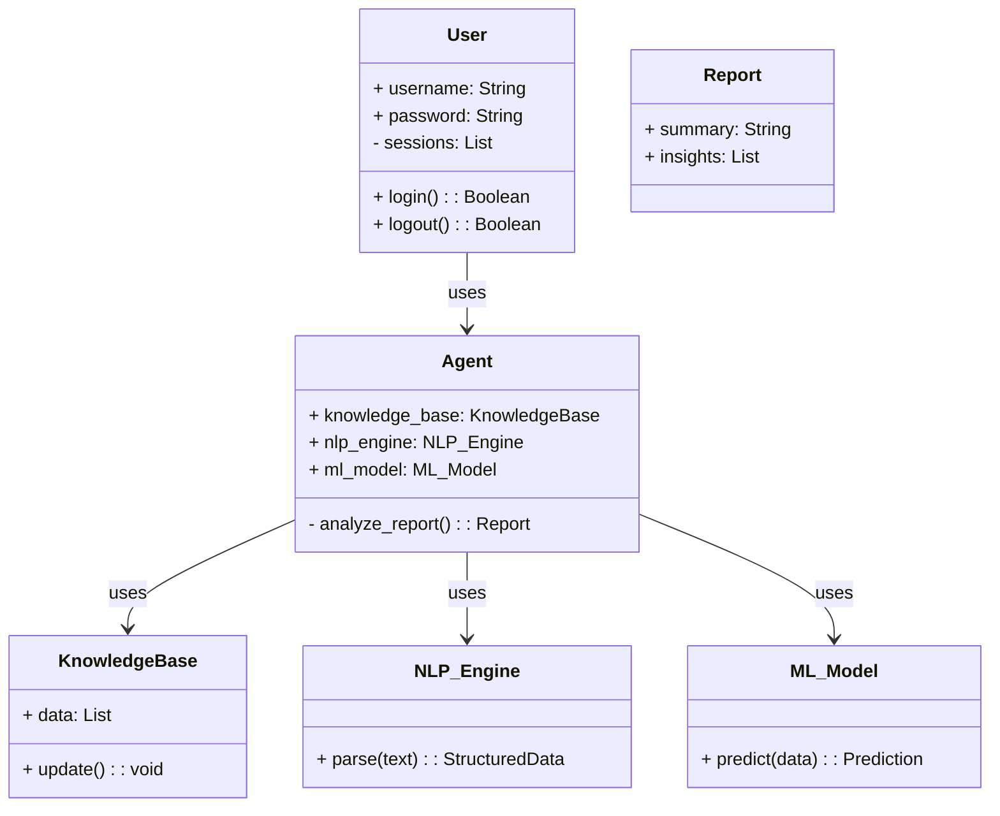
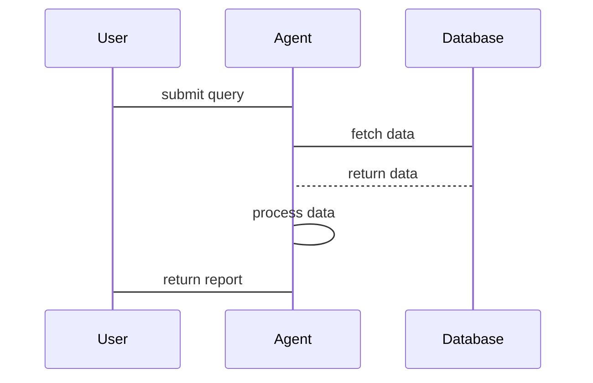

                 


```markdown
# AI agents辅助价值投资者解读复杂的财务脚注

> 关键词：AI代理，价值投资，财务脚注，自然语言处理，机器学习，财务分析

> 摘要：本文详细探讨了如何利用AI代理帮助价值投资者解读复杂的财务脚注。通过分析AI代理的核心概念、算法原理和系统架构，结合实际案例，展示了AI代理在财务分析中的应用价值。文章旨在为投资者提供一种高效、准确的工具，以辅助他们做出明智的投资决策。

---

## 第一部分: 背景介绍

### 第1章: AI代理与价值投资的背景

#### 1.1 AI代理的定义与核心概念
##### 1.1.1 AI代理的基本定义
AI代理是一种能够感知环境并采取行动以实现特定目标的智能体。在财务分析领域，AI代理可以用来处理大量复杂的财务数据，帮助投资者快速获取关键信息。

##### 1.1.2 价值投资者的核心需求
价值投资者关注企业的内在价值，通常需要深入分析财务报表、行业趋势和公司基本面。然而，复杂的财务脚注和非结构化数据往往增加了分析的难度。

##### 1.1.3 AI代理与财务分析的结合
AI代理通过自然语言处理（NLP）和机器学习技术，能够从财务报告和脚注中提取关键信息，为投资者提供更精准的分析。

#### 1.2 价值投资中的财务脚注分析
##### 1.2.1 财务脚注的定义与重要性
财务脚注是财务报表的重要组成部分，提供了对财务数据的详细解释和补充信息。对于价值投资者来说，这些信息是评估企业财务健康状况的关键。

##### 1.2.2 价值投资者对财务脚注的需求
投资者需要从财务脚注中获取如会计政策、潜在负债、或有事项等信息，以全面评估企业的财务状况。

##### 1.2.3 财务脚注分析的复杂性与挑战
财务脚注通常包含大量非结构化数据，且表述方式多样，这使得手动分析变得复杂和耗时。

#### 1.3 AI代理在财务分析中的技术背景
##### 1.3.1 自然语言处理（NLP）技术
NLP技术能够处理和理解财务报告中的文本信息，提取关键数据点和趋势。

##### 1.3.2 机器学习在财务分析中的应用
机器学习算法可以识别财务数据中的模式和异常，帮助投资者发现潜在的风险和机会。

##### 1.3.3 大数据技术与财务数据处理
大数据技术能够处理海量的财务数据，为AI代理提供丰富的数据来源，支持更准确的分析。

#### 1.4 本书的技术路线与目标
##### 1.4.1 技术路线概述
本文将从AI代理的基本概念入手，逐步深入探讨其在财务分析中的应用，结合实际案例展示其价值。

##### 1.4.2 目标与预期成果
通过本文，读者将了解如何利用AI代理解读复杂的财务脚注，提升财务分析的效率和准确性。

##### 1.4.3 本书的结构安排
本文将分为多个章节，逐步展开AI代理在财务分析中的应用，从基础概念到实际案例，全面解析其价值。

---

## 第二部分: AI代理的核心概念与原理

### 第2章: AI代理的核心概念与原理

#### 2.1 AI代理的核心概念
##### 2.1.1 知识表示与推理
知识表示是将财务数据转化为结构化信息的过程，推理则是通过逻辑分析得出结论。

##### 2.1.2 自然语言处理（NLP）在代理中的应用
NLP技术能够解析财务报告中的文本信息，提取关键数据点。

##### 2.1.3 代理的决策机制
AI代理通过分析财务数据，生成投资建议，帮助投资者做出决策。

#### 2.2 价值投资者需求与AI代理的结合
##### 2.2.1 价值投资者的核心需求分析
投资者需要从财务数据中获取关键信息，评估企业的内在价值。

##### 2.2.2 AI代理如何满足这些需求
AI代理能够快速处理大量数据，提取关键信息，满足投资者的需求。

##### 2.2.3 代理在财务分析中的具体应用场景
如识别财务风险、预测企业业绩等。

#### 2.3 AI代理的算法原理与流程
##### 2.3.1 知识图谱构建
通过构建知识图谱，将分散的财务数据整合，形成结构化的知识网络。

##### 2.3.2 自然语言处理流程
包括文本清洗、分词、实体识别、句法分析和语义理解。

##### 2.3.3 代理的决策机制
通过机器学习模型，代理能够根据分析结果生成投资建议。

---

## 第三部分: 算法流程图



---

## 第四部分: 数学模型与公式

#### 2.4.1 线性回归模型
用于预测企业业绩，公式如下：
$$ y = \beta_0 + \beta_1x_1 + \beta_2x_2 + ... + \beta_nx_n + \epsilon $$

#### 2.4.2 聚类分析
用于识别财务数据中的相似模式，公式如下：
$$ d(x_i, x_j) = \sqrt{(x_i - x_j)^T(x_i - x_j)} $$

---

## 第五部分: 系统分析与架构设计

### 第3章: 系统分析与架构设计

#### 3.1 问题场景介绍
价值投资者需要快速解读复杂的财务脚注，AI代理能够提供高效的支持。

#### 3.2 项目介绍
本项目旨在开发一个基于AI代理的财务分析系统，帮助投资者解读财务脚注。

#### 3.3 系统功能设计
##### 3.3.1 领域模型（Mermaid类图）


#### 3.4 系统架构设计（Mermaid架构图）


#### 3.5 系统接口设计
- 用户接口：允许用户输入查询并接收分析结果。
- API接口：供其他系统调用AI代理的分析功能。

#### 3.6 系统交互流程（Mermaid序列图）


---

## 第六部分: 项目实战

### 第4章: 项目实战

#### 4.1 环境安装
- 安装Python和相关库（如spaCy、Scikit-learn、TensorFlow）。

#### 4.2 核心代码实现
```python
import spacy
from sklearn import linear_model

# 加载英文模型
nlp = spacy.load("en_core_web_sm")

# 文本处理
text = "The company has a revenue of $100 million."
doc = nlp(text)

# 实体识别
entities = [(ent.text, ent.label_) for ent in doc.ents]
print(entities)

# 线性回归模型
model = linear_model.LinearRegression()
model.fit(X, y)
```

#### 4.3 案例分析
分析某公司的财务报告，识别潜在风险因素。

#### 4.4 详细解读
解释代码实现和模型应用，展示如何从文本中提取关键数据点。

---

## 第七部分: 总结与展望

### 第5章: 总结与展望

#### 5.1 最佳实践
- 使用预训练的NLP模型提高处理效率。
- 结合多种机器学习算法提升分析准确性。

#### 5.2 小结
AI代理在解读财务脚注方面具有巨大潜力，能够显著提升价值投资者的分析效率。

#### 5.3 注意事项
- 数据质量和模型训练数据的准确性至关重要。
- 需要结合具体行业特点进行定制化开发。

#### 5.4 拓展阅读
推荐相关书籍和论文，进一步深入学习AI代理和财务分析的知识。

---

## 附录

### 附录A: 术语表
- AI代理：能够感知环境并采取行动的智能体。
- 自然语言处理（NLP）：处理人类语言的计算机技术。
- 知识图谱：结构化的知识网络。

### 附录B: 参考文献
- [1] 维基百科：人工智能代理
- [2] TensorFlow官方文档
- [3] spaCy中文文档

---

通过以上步骤，您可以系统地理解并实施AI代理辅助价值投资者解读复杂财务脚注的方法。希望这篇文章能为您提供有价值的见解和实用的技术指导。
```

