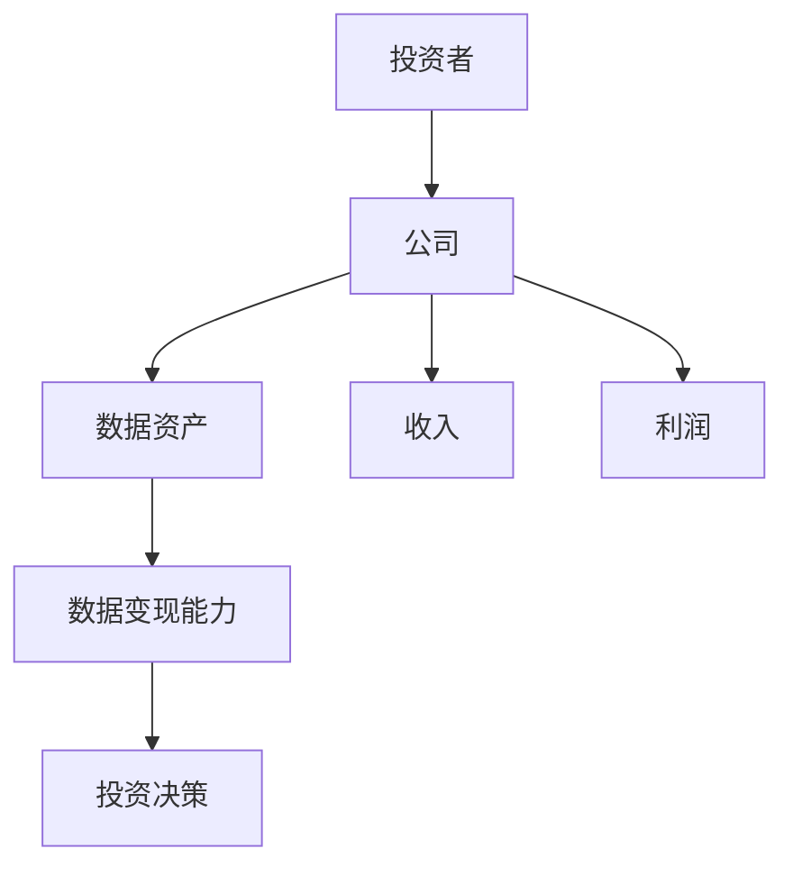

                 

<think>
好的，我将按照您的要求，逐步思考并构建《AI agents辅助价值投资者评估公司的数据变现能力》这篇文章的目录大纲。为了确保内容的完整性和逻辑性，我会分步骤进行，确保每一部分都细化到三级目录。

---

# AI agents辅助价值投资者评估公司的数据变现能力

---

## 关键词：
- AI agents
- 数据变现能力
- 价值投资者
- 投资决策
- 数据分析
- 企业价值评估

---

## 摘要：
本文探讨AI agents如何辅助价值投资者评估公司的数据变现能力。通过分析数据变现能力的核心要素、价值投资者的决策逻辑，结合AI agents的算法原理和系统架构，提出一种基于AI的评估方法。文章从背景介绍、核心概念、算法实现、系统设计、项目实战到最佳实践，全面解析AI在投资决策中的应用。

---

## 目录大纲：

### 第1章: 背景介绍
#### 1.1 问题背景
- 1.1.1 价值投资者的决策挑战
- 1.1.2 数据变现能力的核心要素
- 1.1.3 AI agents在投资决策中的作用

#### 1.2 问题描述
- 1.2.1 数据变现能力的定义
- 1.2.2 价值投资者的需求分析
- 1.2.3 AI agents如何辅助投资决策

#### 1.3 问题解决
- 1.3.1 数据驱动的投资决策方法
- 1.3.2 AI agents在数据处理中的优势
- 1.3.3 数据变现能力的评估模型

#### 1.4 边界与外延
- 1.4.1 数据变现能力的评估范围
- 1.4.2 价值投资者的决策边界
- 1.4.3 AI agents的适用场景与限制

#### 1.5 概念结构与核心要素
- 1.5.1 数据变现能力的核心要素
- 1.5.2 价值投资者的决策模型
- 1.5.3 AI agents的系统架构

#### 1.6 本章小结

---

### 第2章: 核心概念与联系
#### 2.1 核心概念原理
- 2.1.1 AI agents的定义与功能
- 2.1.2 数据变现能力的评估指标
- 2.1.3 价值投资者的决策逻辑

#### 2.2 概念属性特征对比
- 2.2.1 AI agents与传统数据分析工具的对比
- 2.2.2 数据变现能力与企业价值的关系
- 2.2.3 价值投资者与机构投资者的决策差异

#### 2.3 ER实体关系图

#### 2.4 本章小结

---

### 第3章: 算法原理讲解
#### 3.1 算法原理
- 3.1.1 强化学习在投资决策中的应用
- 3.1.2 数据处理与特征提取
- 3.1.3 模型训练与优化

#### 3.2 算法实现
- 3.2.1 使用Python实现数据处理
- 3.2.2 算法流程图
- 3.2.3 数学模型与公式

#### 3.3 代码实现
- 3.3.1 环境安装与配置
- 3.3.2 核心算法代码
- 3.3.3 代码解读与分析

#### 3.4 本章小结

---

### 第4章: 系统分析与架构设计
#### 4.1 系统分析
- 4.1.1 项目背景与目标
- 4.1.2 需求分析
- 4.1.3 功能模块划分

#### 4.2 系统架构设计
- 4.2.1 领域模型类图
- 4.2.2 系统架构图

#### 4.3 系统接口设计
- 4.3.1 API设计
- 4.3.2 接口交互流程

#### 4.4 系统交互流程
- 4.4.1 序列图

#### 4.5 本章小结

---

### 第5章: 项目实战
#### 5.1 环境安装
- 5.1.1 Python环境配置
- 5.1.2 依赖库安装

#### 5.2 核心功能实现
- 5.2.1 数据收集与处理
- 5.2.2 模型训练与部署
- 5.2.3 界面设计与交互

#### 5.3 代码解读与分析
- 5.3.1 数据处理代码
- 5.3.2 模型训练代码
- 5.3.3 界面实现代码

#### 5.4 案例分析
- 5.4.1 数据变现能力评估案例
- 5.4.2 投资决策分析

#### 5.5 本章小结

---

### 第6章: 最佳实践与小结
#### 6.1 最佳实践
- 6.1.1 数据处理的注意事项
- 6.1.2 模型优化的技巧
- 6.1.3 系统设计的建议

#### 6.2 小结
- 6.2.1 本文的主要内容
- 6.2.2 研究的局限性
- 6.2.3 未来研究方向

#### 6.3 注意事项
- 6.3.1 数据隐私与安全
- 6.3.2 系统稳定性的保障
- 6.3.3 投资风险的控制

#### 6.4 拓展阅读
- 6.4.1 AI在金融领域的应用
- 6.4.2 数据驱动的投资策略
- 6.4.3 价值投资的现代发展

---

## 附录
- 附录A: 术语表
- 附录B: 工具安装指南
- 附录C: 参考文献

---

以上是文章的完整目录大纲，涵盖了从背景介绍到项目实战，再到最佳实践的各个部分。每一章都有详细的三级目录，确保内容丰富具体，符合技术博客的专业性和深度要求。

