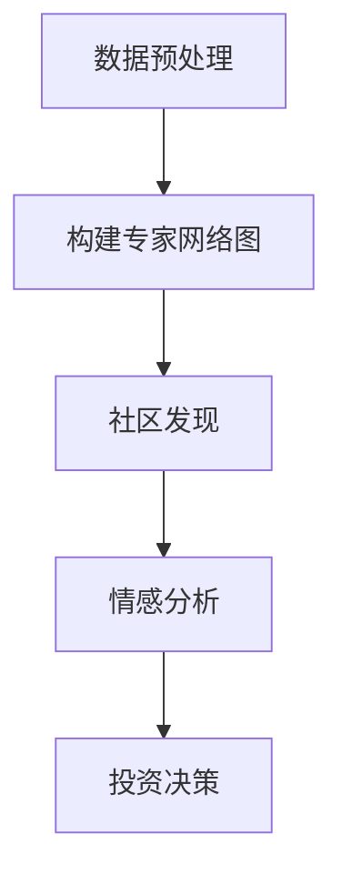
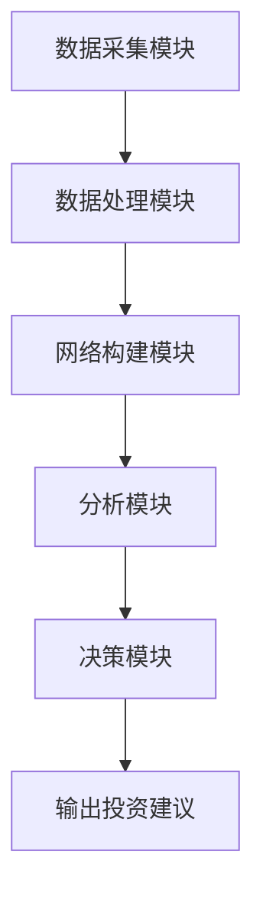

                 


# AI agents辅助价值投资者进行专家网络分析

**关键词**：AI代理, 价值投资, 专家网络分析, 数据挖掘, 投资决策

**摘要**：  
本文探讨了如何利用AI代理（AI agents）辅助价值投资者进行专家网络分析。通过结合AI代理的智能化分析能力与专家网络的深度数据挖掘，本文提出了一个创新的方法，帮助投资者更高效地识别市场机会和风险。文章从问题背景、核心概念、算法原理、系统设计、项目实战等多个维度展开，详细阐述了AI代理在价值投资中的应用，并通过实际案例展示了其在专家网络分析中的优势。

---

## 第一部分: 背景介绍

### 第1章: AI代理与专家网络分析的核心概念

#### 1.1 AI代理的定义与特点
AI代理是一种能够感知环境、自主决策并执行任务的智能实体。其核心特点包括：  
- **自主性**：能够在没有外部干预的情况下独立运行。  
- **反应性**：能够根据环境输入实时调整行为。  
- **目标导向**：通过设定目标来优化决策过程。  

#### 1.2 专家网络分析的基本原理
专家网络分析是指通过对专家（如行业分析师、投资专家）的网络关系进行建模，挖掘其中的隐含信息，以辅助投资决策。其主要步骤包括：  
1. 数据收集：获取专家的言行数据、市场观点等。  
2. 网络构建：通过图论方法构建专家关系图。  
3. 数据挖掘：分析网络中的关键节点、社区结构等。  

#### 1.3 AI代理与专家网络分析的结合意义
AI代理能够通过自然语言处理、机器学习等技术，从海量专家数据中提取有价值的信息，帮助投资者快速识别市场趋势和投资机会。

---

### 第2章: 价值投资与专家网络分析的结合

#### 2.1 价值投资的基本理念
价值投资是一种投资策略，强调通过分析企业的基本面，寻找市场价格低于内在价值的投资机会。其核心在于“买入被市场低估的优秀企业”。

#### 2.2 专家网络分析在投资决策中的作用
专家网络分析能够帮助投资者：  
- **发现市场共识**：通过分析专家观点，识别市场主流看法。  
- **挖掘潜在机会**：发现专家网络中的新兴趋势或未被市场充分认知的机会。  
- **风险预警**：通过专家观点的异动，提前发现潜在风险。  

#### 2.3 AI代理在专家网络分析中的具体作用
AI代理可以通过以下方式辅助价值投资者：  
- **实时监控专家观点**：通过新闻、社交媒体等多渠道实时抓取专家观点，构建动态的专家网络。  
- **情感分析与主题挖掘**：利用自然语言处理技术，分析专家观点的情感倾向和主题分布。  
- **预测市场走势**：基于专家网络的数据，预测市场的潜在波动。  

---

## 第二部分: 核心概念与联系

### 第3章: 核心概念的原理与联系

#### 3.1 核心概念原理
- **AI代理**：通过感知环境和自主决策，帮助投资者分析专家网络数据。  
- **专家网络分析**：基于图论和数据挖掘，构建专家网络并提取有价值的信息。  

#### 3.2 概念属性对比表
| 概念       | 定义                                                                 | 特点                     |
|------------|----------------------------------------------------------------------|--------------------------|
| AI代理     | 具备感知、决策和执行能力的智能实体                                 | 自主性、目标导向、反应性 |
| 专家网络分析 | 基于专家关系的网络分析，挖掘隐含信息                             | 数据驱动、动态性、可扩展性 |

#### 3.3 ER实体关系图
```mermaid
er
actor: 专家网络数据
agent: AI代理
investment_decision: 投资决策
```

---

## 第三部分: 算法原理与实现

### 第4章: 算法原理

#### 4.1 算法概述
本文提出的算法基于图论和机器学习，主要包括以下步骤：  
1. 数据预处理：清洗和结构化专家网络数据。  
2. 图构建：基于专家观点相似度构建专家网络图。  
3. 社区发现：利用社区发现算法（如Louvain算法）识别专家网络中的社区结构。  
4. 情感分析：对专家观点进行情感分析，识别潜在投资机会。  

#### 4.2 算法流程图


#### 4.3 数学模型与公式
- **相似度计算**：使用余弦相似度计算专家观点的相似度：  
  $$ \text{similarity}(i,j) = \frac{\sum_{k} w_{i,k} \cdot w_{j,k}}{\sqrt{\sum_{k} w_{i,k}^2} \cdot \sqrt{\sum_{k} w_{j,k}^2}}} $$
- **社区发现**：Louvain算法的目标是最化模块度：  
  $$ Q = \sum_{i} \sum_{j} (a_{ij} - p_{ij}) $$  
  其中，$a_{ij}$ 是边的存在性，$p_{ij}$ 是随机概率。

#### 4.4 代码实现
```python
import networkx as nx
from sklearn.feature_extraction.text import TfidfVectorizer

# 数据预处理
def preprocess_data(expert_comments):
    vectorizer = TfidfVectorizer()
    tfidf = vectorizer.fit_transform(expert_comments)
    return tfidf

# 图构建
def build_graph(tfidf_matrix):
    G = nx.Graph()
    for i in range(tfidf_matrix.shape[0]):
        for j in range(i+1, tfidf_matrix.shape[0]):
            similarity = cosine_similarity(tfidf_matrix[i], tfidf_matrix[j])
            if similarity > 0.5:
                G.add_edge(i, j, weight=similarity)
    return G

# 社区发现
def find_communities(G):
    communities = nx.community.louvain(G)
    return communities
```

---

## 第四部分: 系统分析与架构设计

### 第5章: 系统架构设计

#### 5.1 系统功能设计
- **数据采集模块**：实时采集专家观点数据。  
- **数据处理模块**：清洗和结构化数据。  
- **网络构建模块**：基于数据构建专家网络图。  
- **分析模块**：进行社区发现和情感分析。  
- **决策模块**：输出投资建议。  

#### 5.2 系统架构图


#### 5.3 接口设计与交互流程
- **输入接口**：专家观点数据输入。  
- **输出接口**：投资建议输出。  
- **交互流程**：用户输入数据，系统处理后输出结果。

---

## 第五部分: 项目实战与案例分析

### 第6章: 项目实战

#### 6.1 环境安装与配置
```bash
pip install networkx
pip install sklearn
pip install matplotlib
```

#### 6.2 核心代码实现
```python
import networkx as nx
from sklearn.metrics.pairwise import cosine_similarity

def main():
    expert_comments = ["Positive outlook for tech sector", "Recommend buying healthcare stocks", ...]
    tfidf_matrix = preprocess_data(expert_comments)
    G = build_graph(tfidf_matrix)
    communities = find_communities(G)
    visualize_communities(G, communities)

if __name__ == "__main__":
    main()
```

#### 6.3 案例分析
通过分析某行业专家网络，发现潜在的投资机会。例如，通过情感分析发现某行业专家观点偏向积极，建议投资者关注该行业。

---

## 第六部分: 总结与展望

### 第7章: 总结与展望

#### 7.1 总结
本文提出了利用AI代理辅助价值投资者进行专家网络分析的方法，通过图论和机器学习技术，帮助投资者更高效地进行投资决策。

#### 7.2 展望
未来的研究方向包括：  
- 提升AI代理的自主性和智能性。  
- 拓展更多领域的专家网络分析。  
- 结合更多数据源（如社交媒体、新闻等）进行更全面的分析。

---

**摘要**：  
本文探讨了AI代理在价值投资中的应用，通过专家网络分析帮助投资者识别投资机会和风险。文章详细介绍了AI代理的核心概念、算法原理和系统设计，并通过实际案例展示了其在投资决策中的优势。

--- 

**结语**：  
随着AI技术的不断发展，AI代理在金融领域的应用前景广阔。通过本文的分析，读者可以更好地理解如何利用AI代理进行专家网络分析，从而在价值投资中获得更好的收益。

