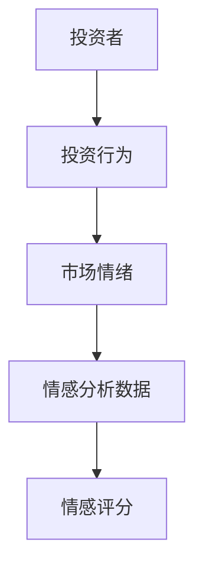
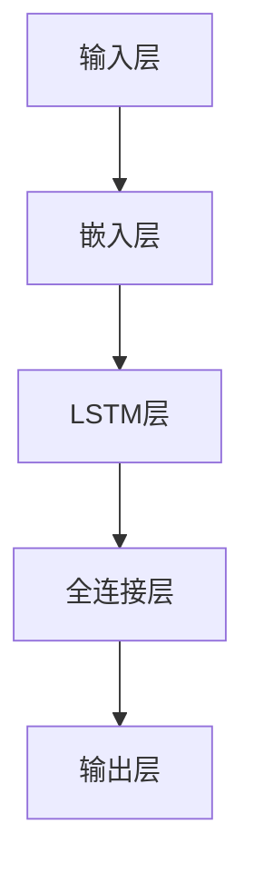
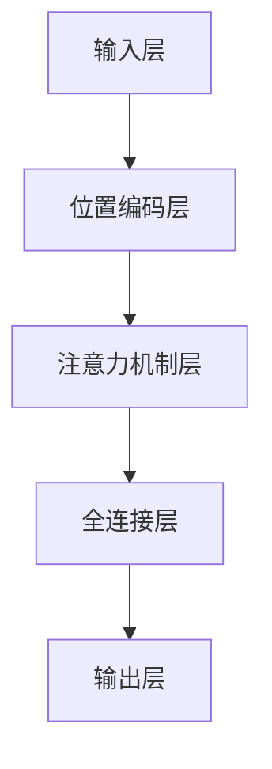
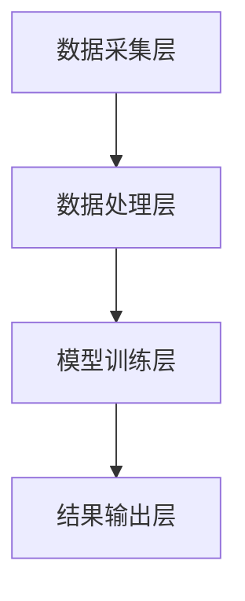

                 


# AI agents辅助价值投资者进行情绪分析

## 关键词：AI agents, 价值投资, 情绪分析, 深度学习, 金融数据, 自然语言处理

## 摘要：  
本文详细探讨了AI agents如何辅助价值投资者进行情绪分析。通过分析市场情绪、投资者行为和相关金融数据，AI agents能够为价值投资者提供实时、精准的情绪评分，帮助其做出更明智的投资决策。文章从AI agents的基本概念、情绪分析的原理、算法实现、系统架构设计以及项目实战等方面展开，结合具体案例和数学模型，全面解析了AI agents在价值投资中的应用。

---

## 第1章: AI agents与价值投资概述

### 1.1 AI agents的基本概念
#### 1.1.1 AI agents的定义  
AI agents（人工智能代理）是指能够感知环境、自主决策并执行任务的智能实体。它们能够通过数据输入、模型推理和反馈优化，实现特定目标。

#### 1.1.2 AI agents的核心特征  
AI agents具有以下核心特征：  
1. **自主性**：能够在无外部干预的情况下运行。  
2. **反应性**：能够实时感知环境变化并做出响应。  
3. **目标导向**：以实现特定目标为导向进行决策。  
4. **学习能力**：通过数据和反馈不断优化性能。

#### 1.1.3 AI agents与传统算法的区别  
AI agents与传统算法的区别主要体现在以下几个方面：  
1. **自主性**：AI agents具有自主决策能力，而传统算法通常是被动执行任务。  
2. **适应性**：AI agents能够根据环境变化自适应调整策略，而传统算法则需要手动调整。  
3. **学习能力**：AI agents能够通过学习提升性能，而传统算法通常不具备学习能力。

### 1.2 价值投资的基本原理  
#### 1.2.1 价值投资的定义  
价值投资是一种以基本面分析为基础的投资策略，旨在通过识别市场中被低估的资产进行长期投资。

#### 1.2.2 价值投资的核心策略  
价值投资的核心策略包括：  
1. **基本面分析**：通过分析公司的财务报表、行业地位等指标评估其内在价值。  
2. **长期投资**：避免短期市场波动，关注企业的长期增长潜力。  
3. **安全边际**：以低于内在价值的价格买入资产，降低投资风险。

#### 1.2.3 价值投资与情绪分析的关系  
情绪分析在价值投资中起到辅助作用，帮助投资者识别市场情绪波动对资产价格的影响。通过分析投资者情绪，价值投资者可以更好地把握市场的非理性波动，优化投资决策。

### 1.3 情绪分析在投资中的作用  
#### 1.3.1 情绪分析的定义  
情绪分析是指通过自然语言处理技术，从文本数据中提取情感倾向和强度的过程。

#### 1.3.2 情绪分析在投资中的应用场景  
1. **社交媒体分析**：通过分析社交媒体上的投资者情绪，预测市场走势。  
2. **新闻媒体分析**：通过分析新闻标题和正文的情绪倾向，评估市场情绪。  
3. **投资者行为分析**：通过分析投资者的行为数据，识别情绪波动对投资决策的影响。

#### 1.3.3 情绪分析的挑战与局限性  
1. **数据噪声**：社交媒体和新闻数据中存在大量噪声，影响情绪分析的准确性。  
2. **模型泛化能力**：情绪分析模型在不同语境下的泛化能力有限，可能影响分析结果。  
3. **市场复杂性**：金融市场的复杂性使得情绪分析难以完全捕捉市场波动。

### 1.4 本章小结  
本章主要介绍了AI agents和价值投资的基本概念，分析了情绪分析在投资中的作用及其面临的挑战。通过理解这些内容，读者可以为后续章节的学习打下基础。

---

## 第2章: 情绪分析的核心概念与联系

### 2.1 情绪分析的核心原理  
#### 2.1.1 文本预处理流程  
文本预处理是情绪分析的基础，主要包括以下步骤：  
1. **分词**：将文本分割成词语或短语。  
2. **去停用词**：去除对情感分析无意义的词语，如“的”、“是”等。  
3. **词干提取**：将词语转换为词干，便于后续处理。  
4. **向量表示**：将词语映射为向量表示，如词袋模型、词嵌模型等。

#### 2.1.2 情感特征提取方法  
情感特征提取是情绪分析的关键步骤，常用方法包括：  
1. **词袋模型**：基于词频统计提取特征。  
2. **TF-IDF**：通过计算词频和反向文档频率提取重要特征。  
3. **词嵌模型**：如Word2Vec、GloVe等，通过上下文关系生成词向量。

#### 2.1.3 情感分类算法选择  
常用的情感分类算法包括：  
1. **支持向量机（SVM）**：适用于小规模数据的情感分类。  
2. **随机森林**：适用于特征维度较高的数据。  
3. **深度学习模型**：如LSTM、Transformer等，适用于大规模复杂数据。

### 2.2 情绪分析与价值投资的关系  
#### 2.2.1 情感数据对投资决策的影响  
情感数据可以通过反映市场的乐观或悲观情绪，帮助投资者识别市场趋势和潜在机会。  

#### 2.2.2 情绪分析在市场预测中的应用  
1. **市场情绪预测**：通过分析社交媒体和新闻数据，预测市场短期走势。  
2. **风险预警**：识别市场恐慌情绪，提前预警潜在风险。  
3. **投资组合优化**：根据市场情绪调整投资组合，降低风险。

#### 2.2.3 情感分析的量化评估指标  
常用的量化评估指标包括：  
1. **准确率**：模型正确预测的比例。  
2. **召回率**：模型识别出的正样本比例。  
3. **F1分数**：综合准确率和召回率的调和平均数。  

### 2.3 情绪分析系统的ER实体关系图  


### 2.4 本章小结  
本章重点讲解了情绪分析的核心原理及其与价值投资的关系，通过ER实体关系图展示了系统的整体架构。读者可以理解情绪分析在投资中的具体应用和实现方式。

---

## 第3章: 情绪分析算法原理

### 3.1 基于深度学习的情绪分析模型  
#### 3.1.1 LSTM网络结构  
LSTM（长短期记忆网络）是一种特殊的RNN结构，能够有效处理序列数据中的长程依赖关系。其网络结构如下：



#### 3.1.2 Transformer模型原理  
Transformer是一种基于注意力机制的深度学习模型，其核心思想是通过全局上下文信息进行序列编码。其结构如下：



### 3.2 情绪分析的数学模型  
#### 3.2.1 情感评分计算公式  
情感评分是通过将情感特征向量与权重向量相乘得到的：

$$ \text{情感评分} = \sum_{i=1}^{n} w_i \cdot x_i $$

其中，\( w_i \) 是第\( i \)个特征的权重，\( x_i \) 是第\( i \)个特征的值。

#### 3.2.2 情感分类的损失函数  
常用的情感分类损失函数是交叉熵损失函数：

$$ \text{损失函数} = -\sum_{i=1}^{m} y_i \log(p_i) + (1-y_i)\log(1-p_i) $$

其中，\( y_i \) 是真实标签，\( p_i \) 是预测概率。

### 3.3 算法实现与案例分析  
#### 3.3.1 算法实现步骤  
1. 数据预处理：清洗、分词、去停用词。  
2. 特征提取：使用词嵌模型生成词向量。  
3. 模型训练：基于深度学习模型进行训练，优化损失函数。  
4. 模型评估：计算准确率、召回率等指标。  

#### 3.3.2 案例分析：社交媒体情绪分析  
假设我们有一个社交媒体数据集，包含 millions of tweets。我们可以通过以下步骤进行情绪分析：  
1. 数据预处理：提取文本、用户信息等。  
2. 特征提取：使用Twitter上的预训练词嵌模型（如GloVe）。  
3. 模型训练：使用LSTM或Transformer进行分类。  
4. 结果分析：统计不同情绪的分布，识别市场情绪趋势。

### 3.4 本章小结  
本章详细讲解了深度学习模型在情绪分析中的应用，通过具体案例展示了算法的实现过程和效果评估方法。

---

## 第4章: 情绪分析系统架构设计

### 4.1 系统整体架构  
系统整体架构包括以下四个层次：  
1. **数据采集层**：负责采集社交媒体、新闻等数据。  
2. **数据处理层**：进行数据清洗、分词、特征提取等预处理。  
3. **模型训练层**：基于深度学习模型进行情绪分类。  
4. **结果输出层**：将情感评分输出给投资者。



### 4.2 系统功能模块  
#### 4.2.1 数据采集模块  
负责从社交媒体、新闻网站等渠道采集相关数据。  

#### 4.2.2 特征提取模块  
对采集的数据进行预处理和特征提取，生成可用于模型训练的特征向量。  

#### 4.2.3 模型训练模块  
基于深度学习模型进行训练，优化模型参数，提升分类性能。  

#### 4.2.4 结果输出模块  
将模型输出的情感评分返回给投资者，辅助其进行投资决策。  

### 4.3 系统接口设计  
#### 4.3.1 数据接口  
定义数据输入格式和数据结构，确保数据处理模块能够正确解析数据。  

#### 4.3.2 模型接口  
定义模型输入和输出接口，确保模型训练模块能够与数据处理模块无缝对接。  

### 4.4 本章小结  
本章重点讲解了情绪分析系统的整体架构和功能模块，展示了系统如何通过模块化设计实现高效的情绪分析。

---

## 第5章: 项目实战

### 5.1 环境安装与配置  
1. **安装Python**：确保安装了Python 3.8及以上版本。  
2. **安装依赖库**：使用pip安装numpy、pandas、tensorflow、transformers等库。  

### 5.2 系统核心实现  
#### 5.2.1 数据预处理代码  
```python
import pandas as pd
from transformers import AutoTokenizer, AutoModel

# 加载预训练模型
tokenizer = AutoTokenizer.from_pretrained('bert-base-uncased')
model = AutoModel.from_pretrained('bert-base-uncased')

# 数据预处理
def preprocess(text):
    tokens = tokenizer(text, return_tensors='np', padding=True, truncation=True)
    return tokens

# 示例数据
text = "This is a positive sentiment."
processed = preprocess(text)
print(processed)
```

#### 5.2.2 情感分类模型实现  
```python
import torch
from torch import nn

class SentimentClassifier(nn.Module):
    def __init__(self, bert_model, num_classes):
        super(SentimentClassifier, self).__init__()
        self.bert = bert_model
        self.dropout = nn.Dropout(0.1)
        self.classifier = nn.Linear(bert_model.config.hidden_size, num_classes)
    
    def forward(self, input_ids, attention_mask):
        outputs = self.bert(input_ids=input_ids, attention_mask=attention_mask)
        pooled_output = outputs.last_hidden_state[:, 0, :]
        pooled_output = self.dropout(pooled_output)
        logits = self.classifier(pooled_output)
        return logits

# 初始化模型
classifier = SentimentClassifier(model, num_classes=2)
```

#### 5.2.3 模型训练与评估  
```python
import torch.optim as optim

# 定义损失函数和优化器
criterion = nn.CrossEntropyLoss()
optimizer = optim.Adam(classifier.parameters(), lr=2e-5)

# 训练循环
for epoch in range(num_epochs):
    for batch in dataloader:
        optimizer.zero_grad()
        input_ids, attention_mask, labels = batch
        outputs = classifier(input_ids, attention_mask)
        loss = criterion(outputs, labels)
        loss.backward()
        optimizer.step()

# 模型评估
def evaluate(model, dataloader):
    model.eval()
    total_loss = 0
    correct = 0
    with torch.no_grad():
        for batch in dataloader:
            input_ids, attention_mask, labels = batch
            outputs = model(input_ids, attention_mask)
            loss = criterion(outputs, labels)
            total_loss += loss.item()
            _, predicted = torch.max(outputs.data, 1)
            correct += (predicted == labels).sum().item()
    accuracy = correct / len(dataloader.dataset)
    return total_loss / len(dataloader), accuracy

loss, accuracy = evaluate(classifier, val_dataloader)
print(f'Val Loss: {loss}, Val Accuracy: {accuracy}')
```

### 5.3 案例分析与结果解读  
通过具体案例分析，展示系统如何从社交媒体数据中提取情绪评分，并帮助投资者做出投资决策。例如，假设某社交媒体上的情绪评分显示市场乐观情绪高涨，投资者可以根据此信息调整其投资策略。

### 5.4 项目小结  
本章通过具体代码实现和案例分析，展示了AI agents如何辅助价值投资者进行情绪分析。读者可以参考本章内容，快速搭建一个基于深度学习的情绪分析系统。

---

## 第6章: 总结与展望

### 6.1 本章总结  
本文详细探讨了AI agents辅助价值投资者进行情绪分析的实现方法和应用价值。通过结合深度学习技术和自然语言处理技术，我们可以有效提取市场情绪信息，为投资者提供决策支持。

### 6.2 未来展望  
未来，随着AI技术的不断发展，情绪分析在投资中的应用将更加广泛和深入。以下是一些可能的研究方向：  
1. **多模态情绪分析**：结合文本、图像等多种模态信息进行情绪分析。  
2. **实时情绪监控**：开发实时情绪监控系统，帮助投资者快速响应市场变化。  
3. **个性化情绪分析**：针对不同投资者的情绪特征，提供个性化的情绪分析服务。

### 6.3 最佳实践 Tips  
1. **数据质量**：确保数据来源可靠，避免噪声干扰。  
2. **模型优化**：根据实际需求调整模型参数，提升分类性能。  
3. **持续学习**：定期更新模型，适应市场变化。

### 6.4 本章小结  
本文总结了AI agents辅助价值投资者进行情绪分析的核心内容，并展望了未来的研究方向，为读者提供了进一步学习和实践的参考。

---

## 关键词索引  
- AI agents  
- 价值投资  
- 情绪分析  
- 深度学习  
- 金融数据  
- 自然语言处理

