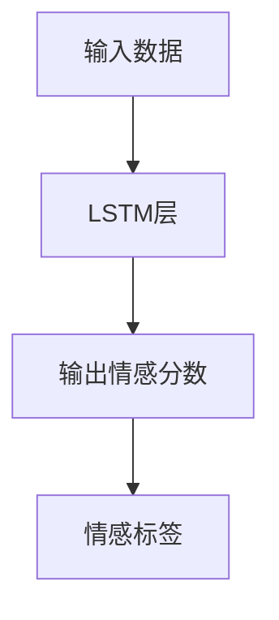
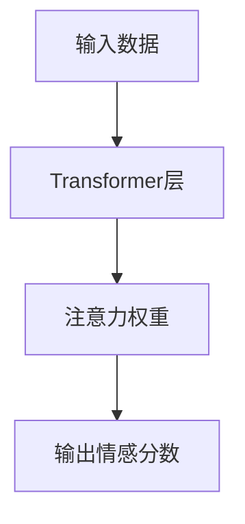
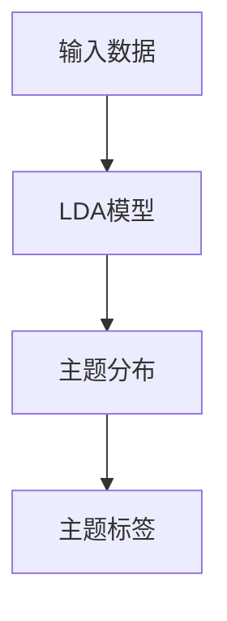
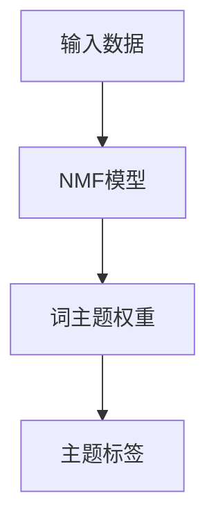
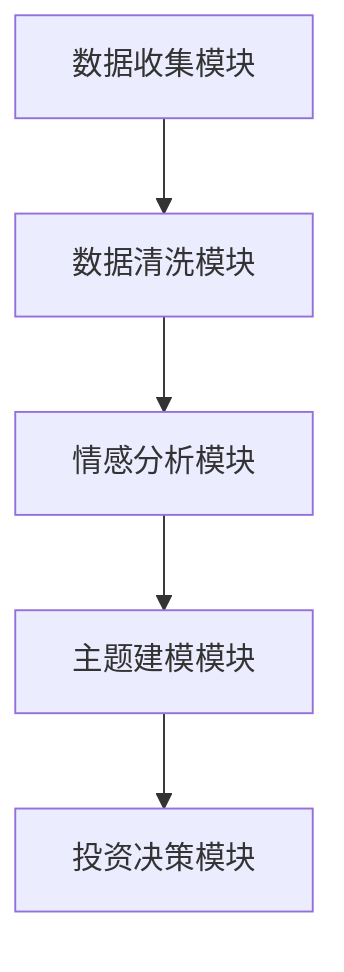

                 


# AI agents辅助价值投资者进行社交媒体分析

## 关键词：
AI agents, 价值投资, 社交媒体分析, 自然语言处理, 情感分析, 深度学习, 金融数据分析

## 摘要：
随着社交媒体在金融分析中的重要性日益增加，AI agents（人工智能代理）在辅助价值投资者进行社交媒体分析方面展现出巨大潜力。本文探讨了如何利用AI agents来分析社交媒体数据，提取有价值的信息，帮助投资者做出更明智的投资决策。通过介绍AI agents的基本原理、情感分析和主题建模算法，以及实际应用案例，本文为价值投资者提供了一种高效的数据分析方法。

---

## 第四章：AI agents的核心概念与原理

### 4.1 AI agents的基本概念
AI agents（人工智能代理）是指能够感知环境、自主决策并执行任务的智能实体。它们通过自然语言处理（NLP）、机器学习（ML）和大数据分析等技术，帮助投资者从社交媒体数据中提取有价值的信息。

**价值投资的核心理念**：
- 价值投资强调通过分析企业的基本面（如财务状况、行业地位等）来判断其内在价值。
- 传统方法依赖于财务报表和市场数据，但社交媒体数据的引入为投资者提供了新的视角。

**AI agents在金融领域的应用前景**：
- AI agents能够实时分析社交媒体上的海量数据，捕捉市场情绪、识别行业趋势，为投资者提供实时的决策支持。

### 4.2 AI agents的感知与决策机制
AI agents通过以下步骤进行感知和决策：
1. **数据收集**：从社交媒体平台（如Twitter、Reddit）获取文本数据。
2. **数据清洗**：去除噪声数据（如无关内容、重复信息）。
3. **情感分析**：判断文本的情感倾向（如正面、负面、中性）。
4. **主题建模**：识别文本中的主要主题和关键词。
5. **决策支持**：基于分析结果，为投资者提供投资建议。

**自然语言处理在AI agents中的应用**：
- **词嵌入**：使用Word2Vec或GloVe将文本转换为向量表示。
- **句法分析**：分析句子结构，理解文本的语法关系。
- **语义理解**：通过上下文理解文本的含义。

### 4.3 自然语言处理在AI agents中的应用
自然语言处理（NLP）技术是AI agents的核心工具之一。以下是NLP在社交媒体分析中的几个关键应用：

#### 4.3.1 情感分析
情感分析是判断文本情感倾向的过程。例如，投资者可以通过分析社交媒体上的评论，了解市场对某只股票的总体情绪。

**案例分析**：
假设某社交媒体平台上有关于科技公司的大量评论，AI agents可以通过情感分析判断市场情绪是正面、负面还是中性，并将结果反馈给投资者。

#### 4.3.2 主题建模
主题建模是识别文本中主要主题的过程。例如，投资者可以通过主题建模了解社交媒体上的主要讨论话题，从而识别行业趋势。

**案例分析**：
通过分析社交媒体上的讨论，AI agents可以识别出科技行业的热门话题，如人工智能、5G技术等，并为投资者提供相关的行业分析报告。

---

## 第五章：AI agents的算法原理与数学模型

### 5.1 情感分析算法
情感分析是AI agents的重要功能之一。以下是几种常用的情感分析算法：

#### 5.1.1 基于LSTM的情感分析模型
长短时记忆网络（LSTM）是一种深度学习模型，适用于处理序列数据。以下是LSTM模型的数学公式：

$$
f(x) = \text{LSTM}(x, h_{t-1}, c_{t-1})
$$

其中，\( x \) 是输入数据，\( h_{t-1} \) 是前一时刻的隐藏状态，\( c_{t-1} \) 是前一时刻的细胞状态。

**流程图**：


#### 5.1.2 基于Transformer的情感分析模型
Transformer模型是一种基于注意力机制的深度学习模型，适用于处理大规模文本数据。以下是Transformer模型的注意力机制公式：

$$
\text{Attention}(Q, K, V) = \text{softmax}\left(\frac{QK^T}{\sqrt{d_k}}\right)V
$$

其中，\( Q \) 是查询向量，\( K \) 是键向量，\( V \) 是值向量，\( d_k \) 是键的维度。

**流程图**：


### 5.2 主题建模与文本挖掘
主题建模是识别文本中主要主题的过程。以下是几种常用的主题建模算法：

#### 5.2.1 基于LDA的主题建模
Latent Dirichlet Allocation（LDA）是一种常用的主题建模算法。以下是LDA模型的数学公式：

$$
p(\theta_i | \alpha) = \text{Dirichlet}(\alpha)
$$

$$
p(w_{ij} | \theta_i, \beta) = \text{Multinomial}(\theta_i, \beta)
$$

其中，\( \theta_i \) 是第i个文档的主题分布，\( \alpha \) 是主题分布的先验参数，\( \beta \) 是词分布的先验参数。

**流程图**：


#### 5.2.2 基于NMF的主题建模
Non-negative Matrix Factorization（NMF）是一种无监督学习算法，适用于主题建模。以下是NMF模型的数学公式：

$$
X = W \cdot H
$$

其中，\( X \) 是输入数据矩阵，\( W \) 是词主题权重矩阵，\( H \) 是主题词权重矩阵。

**流程图**：


---

## 第六章：AI agents在社交媒体分析中的应用

### 6.1 投资决策支持系统的设计与实现
AI agents可以辅助投资者进行投资决策。以下是投资决策支持系统的架构设计：

**功能模块**：
- **数据收集模块**：从社交媒体平台获取数据。
- **数据清洗模块**：去除噪声数据。
- **情感分析模块**：判断文本情感倾向。
- **主题建模模块**：识别文本中的主要主题。
- **投资决策模块**：基于分析结果，提供投资建议。

**系统架构图**：


### 6.2 项目实战：环境安装与代码实现
以下是投资决策支持系统的环境安装和代码实现：

**环境安装**：
- Python 3.8及以上
- PyTorch 1.9及以上
- Transformers库
- Scikit-learn库

**代码实现**：
```python
import torch
from transformers import AutoTokenizer, AutoModelForMaskedLM
from sklearn.decomposition import NMF

# 定义情感分析模型
class SentimentAnalyzer:
    def __init__(self):
        self.tokenizer = AutoTokenizer.from_pretrained('bert-base-uncased')
        self.model = AutoModelForMaskedLM.from_pretrained('bert-base-uncased')

    def analyze_sentiment(self, text):
        inputs = self.tokenizer(text, return_tensors='pt')
        outputs = self.model(**inputs)
        # 获取情感分数
        sentiment_score = outputs.logits[0, -1].item()
        return 'positive' if sentiment_score > 0 else 'negative'

# 定义主题建模模块
class TopicModeler:
    def __init__(self, num_topics=5):
        self.nmf = NMF(n_components=num_topics)

    def extract_topics(self, corpus):
        # 将文本数据转换为词袋表示
        from sklearn.feature_extraction.text import TfidfVectorizer
        vectorizer = TfidfVectorizer(max_features=1000)
        X = vectorizer.fit_transform(corpus)
        # 进行主题建模
        self.nmf.fit(X)
        # 获取主题关键词
        self.topic_words = self._get_topic_words(vectorizer)

    def _get_topic_words(self, vectorizer):
        topic_words = []
        for topic_idx, topic in enumerate(self.nmf.components_):
            top_features_idx = topic.argsort()[::-1][:5]
            top_features = [vectorizer.get_feature_names()[i] for i in top_features_idx]
            topic_words.append(top_features)
        return topic_words

# 使用示例
if __name__ == '__main__':
    analyzer = SentimentAnalyzer()
    modeler = TopicModeler()
    
    # 示例文本
    texts = [
        "This company is leading the way in AI innovation.",
        "The financial performance of this company has been declining.",
        "The future of this industry looks promising."
    ]
    
    # 情感分析
    sentiments = [analyzer.analyze_sentiment(text) for text in texts]
    print("Sentiments:", sentiments)
    
    # 主题建模
    modeler.extract_topics(texts)
    print("Topic words:", modeler.topic_words)
```

**代码解读**：
- **SentimentAnalyzer类**：用于情感分析，使用BERT模型进行情感分类。
- **TopicModeler类**：用于主题建模，使用NMF算法提取主题关键词。
- **主程序**：从社交媒体获取文本数据，进行情感分析和主题建模，并输出结果。

---

## 第七章：挑战与解决方案

### 7.1 数据噪声与虚假信息的处理
社交媒体数据中存在大量噪声和虚假信息，这会影响AI agents的分析结果。以下是解决方法：

- **数据清洗**：去除无关内容、重复信息和噪声数据。
- **特征提取**：提取关键特征（如情感强度、关键词）以提高模型的鲁棒性。
- **鲁棒模型**：使用鲁棒的机器学习模型（如集成学习、对抗训练）来减少噪声的影响。

### 7.2 模型解释性问题
AI agents的决策过程往往缺乏可解释性，这会影响投资者的信任。以下是解决方法：

- **可视化工具**：通过可视化工具展示模型的决策过程。
- **可解释性模型**：使用可解释的机器学习模型（如线性回归、决策树）进行分析。
- **解释性报告**：生成解释性报告，帮助投资者理解模型的决策依据。

---

## 第八章：未来发展方向与总结

### 8.1 未来研究方向
- **多模态数据融合**：结合文本、图像、视频等多种数据源，提升分析精度。
- **强化学习应用**：研究强化学习在投资决策中的应用。
- **实时分析技术**：提升AI agents的实时分析能力，满足快速变化的市场需求。

### 8.2 总结
AI agents在辅助价值投资者进行社交媒体分析方面具有巨大的潜力。通过结合自然语言处理、深度学习和大数据分析技术，AI agents能够帮助投资者从社交媒体数据中提取有价值的信息，做出更明智的投资决策。未来，随着技术的不断发展，AI agents将在金融领域发挥越来越重要的作用。

---

**结束语**：
通过本文的介绍，读者可以全面了解AI agents在社交媒体分析中的应用及其核心算法。希望本文能够为价值投资者提供新的思路和工具，帮助他们在复杂多变的金融市场中获取竞争优势。

