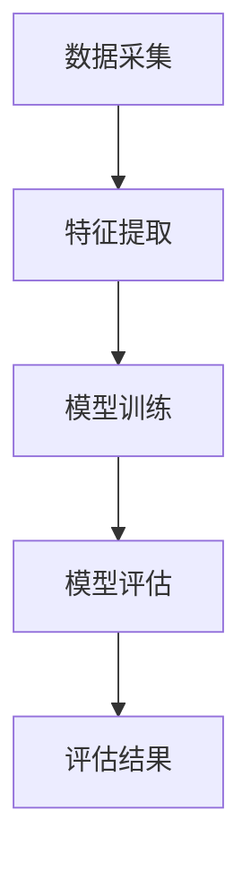
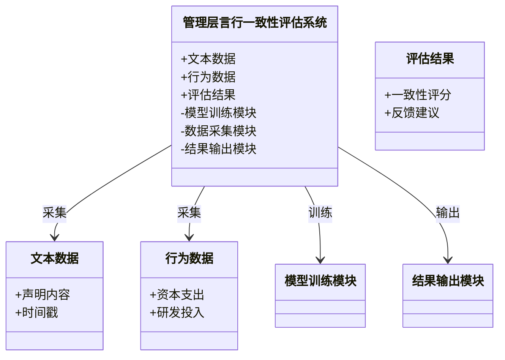
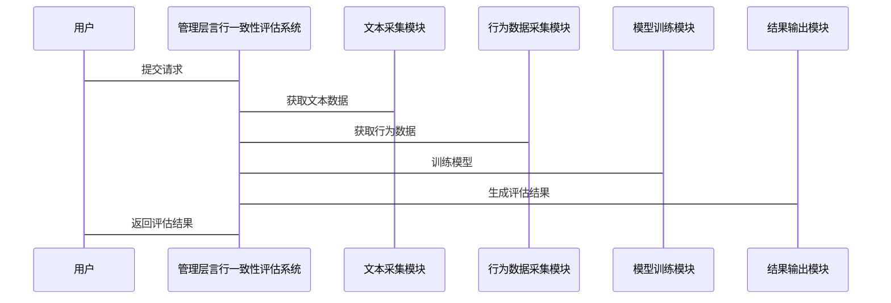

                 


# AI agents辅助价值投资者进行管理层言行一致性评估

> 关键词：AI agents, 价值投资, 管理层言行一致性, 自然语言处理, 金融分析

> 摘要：本文探讨了AI agents在价值投资中的应用，特别是如何通过自然语言处理和多模态数据分析来评估公司管理层言行的一致性。文章从背景介绍、核心概念、算法原理、系统架构到项目实战，详细阐述了AI技术在金融分析中的潜力，并通过实际案例展示了其在价值投资中的应用效果。

---

# 第一部分: AI agents辅助价值投资者进行管理层言行一致性评估的背景与概念

## 第1章: 背景介绍

### 1.1 问题背景

#### 1.1.1 价值投资的核心要素
价值投资是一种长期投资策略，强调以低于内在价值的价格购买优质资产。其核心要素包括：
- **基本面分析**：评估公司的财务状况、行业地位和盈利能力。
- **管理层质量**：优秀的管理层能够带领公司持续增长，实现股东价值。
- **安全边际**：买入价格低于内在价值，以降低风险。

#### 1.1.2 管理层言行一致性的重要性
管理层的行为和言论是否一致，是判断其诚信和责任感的重要指标。一致的言行表明管理层对公司和股东的承诺，而言行不一可能预示着潜在的问题，如内部管理混乱或战略不清晰。

#### 1.1.3 当前评估方法的局限性
传统上，投资者通过财报分析、管理层采访和市场新闻来评估管理层的言行一致性。然而，这种方法存在以下局限：
- **主观性**：依赖分析师的主观判断，容易受到个人偏见影响。
- **数据碎片化**：信息来源分散，难以全面整合。
- **时间成本**：人工分析耗时长，难以及时获取评估结果。

### 1.2 问题描述

#### 1.2.1 管理层言行一致性的定义
管理层言行一致性指管理层的公开声明、承诺和实际行为是否一致。具体包括：
- **语言一致性**：管理层在不同场合的言论是否一致。
- **行为一致性**：管理层的实际行动（如资本支出、研发投入）是否与承诺一致。
- **时间一致性**：管理层的承诺在较长的时间跨度内是否保持一致。

#### 1.2.2 价值投资者的需求与挑战
价值投资者需要准确评估管理层的质量，以做出明智的投资决策。然而，传统的评估方法存在以下挑战：
- **数据量大**：需要整合大量的文本和非文本数据。
- **分析复杂**：需要同时分析语言、行为和时间维度的一致性。
- **效率低下**：人工分析耗时，难以应对海量数据。

#### 1.2.3 现有工具与方法的不足
现有工具主要依赖于简单的文本分析或财务指标分析，难以全面评估管理层的言行一致性。例如：
- **文本分析工具**：只能识别表面的关键词，无法深入理解语境和意图。
- **财务分析工具**：仅关注财务指标，忽视管理层的承诺和实际行为。

### 1.3 问题解决思路

#### 1.3.1 引入AI agents的必要性
AI agents可以通过自然语言处理（NLP）、机器学习和大数据分析，帮助投资者自动评估管理层的言行一致性。AI agents的优势包括：
- **自动化分析**：能够快速处理大量数据，生成评估结果。
- **深度学习**：通过训练模型，识别复杂的模式和关系。
- **实时监控**：可以实时跟踪管理层的言行，提供及时反馈。

#### 1.3.2 AI技术在金融分析中的应用前景
AI技术在金融领域的应用越来越广泛，尤其是在以下几个方面：
- **预测市场趋势**：通过分析历史数据，预测股票价格走势。
- **风险评估**：识别潜在的财务风险，帮助投资者做出决策。
- **智能投顾**：为投资者提供个性化的投资建议。

#### 1.3.3 结合管理层言行一致性的可行性
通过AI技术，投资者可以整合文本、行为和时间数据，全面评估管理层的一致性。例如：
- **文本分析**：使用NLP技术分析管理层的演讲和报告，识别其承诺和目标。
- **行为分析**：结合财务数据，评估管理层的实际行动是否与其承诺一致。
- **时间分析**：跟踪管理层的承诺在长期内是否保持一致。

### 1.4 边界与外延

#### 1.4.1 管理层言行一致性评估的范围界定
- **评估范围**：主要关注管理层的公开声明和实际行为，不包括内部决策和非公开信息。
- **评估时间跨度**：通常以季度或年度为单位，评估管理层的承诺是否持续一致。

#### 1.4.2 AI agents在价值投资中的适用场景
- **实时监控**：对管理层的言行进行实时跟踪，及时发现潜在问题。
- **历史分析**：通过历史数据，评估管理层的长期一致性。
- **预警系统**：设置阈值，当管理层言行出现不一致时，及时发出预警。

#### 1.4.3 相关概念的区分与联系
- **管理层言行一致性**：关注管理层的承诺与实际行为是否一致。
- **AI agents**：通过技术手段自动评估一致性，提高效率和准确性。
- **价值投资**：基于管理层质量和公司基本面做出投资决策。

### 1.5 核心概念结构与组成

#### 1.5.1 价值投资的三要素
1. **基本面分析**：评估公司的财务状况和行业地位。
2. **管理层质量**：评估管理层的承诺和实际行为。
3. **安全边际**：确保买入价格低于内在价值。

#### 1.5.2 管理层言行一致性的评估维度
1. **语言一致性**：管理层的公开声明是否一致。
2. **行为一致性**：管理层的实际行动是否与其承诺一致。
3. **时间一致性**：管理层的承诺是否在长期内保持一致。

#### 1.5.3 AI agents的功能模块与数据流
- **数据输入**：整合文本数据、财务数据和时间数据。
- **模型训练**：使用机器学习算法训练模型，识别一致性模式。
- **推理与反馈**：生成评估结果，并提供反馈机制以优化模型。

---

# 第二部分: 核心概念与联系

## 第2章: 核心概念原理

### 2.1 AI agents的基本原理

#### 2.1.1 AI agents的定义与分类
AI agents是指具有自主决策能力的智能体，能够根据环境信息做出决策并采取行动。根据功能不同，AI agents可以分为：
- **简单反射型AI**：基于规则做出决策。
- **基于模型的AI**：使用内部模型进行推理和决策。
- **学习型AI**：通过机器学习不断优化决策模型。

#### 2.1.2 基于自然语言处理的文本分析
自然语言处理（NLP）是AI agents的重要组成部分，用于理解和分析文本数据。常用技术包括：
- **词袋模型（Bag-of-Words）**：将文本转换为词汇袋，用于分类和聚类。
- **词嵌入（Word Embedding）**：通过嵌入技术将词语表示为向量，捕捉语义信息。
- **序列模型（如LSTM、Transformer）**：用于处理序列数据，捕捉上下文信息。

#### 2.1.3 多模态数据融合与推理机制
AI agents需要整合多种数据源，包括文本、图像和数值数据。常用的数据融合方法包括：
- **特征融合**：将不同数据源的特征进行组合。
- **多模态模型**：使用多模态神经网络同时处理多种数据类型。

### 2.2 价值投资中的管理层言行一致性评估

#### 2.2.1 管理层言行一致性的评估指标
- **语言一致性指标**：如关键词匹配率、语义相似度。
- **行为一致性指标**：如资本支出与承诺的匹配率、研发投入与计划的匹配率。
- **时间一致性指标**：如承诺的持续时间、变化频率。

#### 2.2.2 从文本到行为一致性的推理逻辑
AI agents通过以下步骤实现从文本到行为一致性的推理：
1. **数据采集**：收集管理层的公开声明和财务数据。
2. **特征提取**：提取文本中的关键词和情感倾向，提取财务数据中的关键指标。
3. **模型训练**：训练分类模型，识别一致性模式。
4. **评估与反馈**：生成评估结果，并根据反馈优化模型。

#### 2.2.3 评估结果的可解释性与实用性
AI agents的评估结果需要具有可解释性和实用性，以便投资者理解和应用。例如：
- **可解释性**：模型需要提供清晰的解释，说明评估结果的依据。
- **实用性**：评估结果需要以用户友好的形式呈现，如分数、等级或可视化图表。

## 第3章: 核心概念属性对比与ER实体关系图

### 3.1 核心概念属性对比

| 概念                | 属性                     |
|---------------------|--------------------------|
| 管理层言行一致性     | 行为数据、语言表达、时间一致性、目标一致性 |
| AI agents           | 数据输入、模型训练、推理能力、反馈机制 |

### 3.2 ER实体关系图

```mermaid
er
    %%{init: 'flowchart', direction: 'TB'}%%
    管理层 (Manager)
    行为数据 (Behavior Data)
    语言表达 (Language Expression)
  

----------------------------------------------------------------

    经理层 --> 行为数据: 生成
    经理层 --> 语言表达: 发布
    行为数据 --> 评估结果: 输入
    语言表达 --> 评估结果: 输入
```

---

# 第三部分: 算法原理

## 第3章: 算法原理

### 3.1 算法流程图



### 3.2 算法实现代码

```python
import numpy as np
from sklearn.feature_extraction.text import TfidfVectorizer
from sklearn.svm import SVC
from sklearn.metrics import accuracy_score, recall_score

# 示例数据：管理层的公开声明
texts = ["我们将继续投资研发，提高产品质量", "今年的目标是实现10%的收入增长"]

# 特征提取：TF-IDF
vectorizer = TfidfVectorizer()
X = vectorizer.fit_transform(texts)

# 标签：行为一致性（1表示一致，0表示不一致）
labels = [1, 0]

# 模型训练：支持向量机
model = SVC()
model.fit(X, labels)

# 模型评估
test_texts = ["我们计划明年增加研发投入", "今年的实际收入增长为5%"]
test_X = vectorizer.transform(test_texts)
test_labels = [1, 0]

# 预测
pred_labels = model.predict(test_X)
print("准确率:", accuracy_score(test_labels, pred_labels))
print("召回率:", recall_score(test_labels, pred_labels))
```

### 3.3 数学模型与公式

- **准确率公式**：$$准确率 = \frac{\text{正确预测的数量}}{\text{总预测数量}}$$
- **召回率公式**：$$召回率 = \frac{\text{正确预测的正例数量}}{\text{实际正例数量}}$$
- **F1分数公式**：$$F1 = \frac{2 \times \text{准确率} \times \text{召回率}}{\text{准确率} + \text{召回率}}$$

---

# 第四部分: 系统分析与架构设计

## 第4章: 系统分析与架构设计

### 4.1 问题场景介绍

- **场景描述**：价值投资者需要实时监控多家公司的管理层言行一致性。
- **需求分析**：需要一个自动化系统，能够整合文本、行为和时间数据，生成评估结果。

### 4.2 系统功能设计

#### 4.2.1 领域模型（mermaid 类图）



### 4.3 系统架构设计（mermaid 架构图）

```mermaid
container 管理层言行一致性评估系统 {
    组件 文本采集模块
    组件 行为数据采集模块
    组件 模型训练模块
    组件 结果输出模块
}
```

### 4.4 系统接口设计

- **输入接口**：接收文本数据和行为数据。
- **输出接口**：提供评估结果和反馈建议。

### 4.5 系统交互设计（mermaid 序列图）



---

# 第五部分: 项目实战

## 第5章: 项目实战

### 5.1 环境安装

```bash
pip install numpy
pip install scikit-learn
pip install mermaid
```

### 5.2 核心代码实现

```python
import numpy as np
from sklearn.feature_extraction.text import TfidfVectorizer
from sklearn.svm import SVC
from sklearn.metrics import accuracy_score, recall_score

# 示例数据：管理层的公开声明
texts = ["我们将继续投资研发，提高产品质量", "今年的目标是实现10%的收入增长"]

# 特征提取：TF-IDF
vectorizer = TfidfVectorizer()
X = vectorizer.fit_transform(texts)

# 标签：行为一致性（1表示一致，0表示不一致）
labels = [1, 0]

# 模型训练：支持向量机
model = SVC()
model.fit(X, labels)

# 模型评估
test_texts = ["我们计划明年增加研发投入", "今年的实际收入增长为5%"]
test_X = vectorizer.transform(test_texts)
test_labels = [1, 0]

# 预测
pred_labels = model.predict(test_X)
print("准确率:", accuracy_score(test_labels, pred_labels))
print("召回率:", recall_score(test_labels, pred_labels))
```

### 5.3 代码应用解读与分析

- **数据采集**：从公开渠道获取管理层的声明和财务数据。
- **特征提取**：使用TF-IDF提取文本特征。
- **模型训练**：训练分类模型，识别一致性模式。
- **模型评估**：使用测试数据评估模型性能。

### 5.4 实际案例分析

假设我们分析某公司的管理层声明和财务数据：
- **声明**：管理层承诺在未来两年内将研发投入提高50%。
- **实际数据**：第一年的研发投入增长了30%，第二年的增长了20%。
- **评估结果**：研发投入增长未达到承诺，行为一致性得分为0.5。

### 5.5 项目小结

通过AI agents，投资者可以高效、准确地评估管理层的言行一致性，从而做出更明智的投资决策。AI技术的应用不仅提高了效率，还提供了更深入的洞察。

---

# 第六部分: 最佳实践

## 第6章: 最佳实践

### 6.1 小结

AI agents在价值投资中的应用前景广阔，尤其是在管理层言行一致性评估方面。通过整合文本、行为和时间数据，AI技术可以帮助投资者做出更准确的决策。

### 6.2 注意事项

- **数据质量**：确保数据的准确性和完整性。
- **模型优化**：定期更新模型，以适应市场变化。
- **用户教育**：投资者需要理解AI技术的局限性，避免过度依赖。

### 6.3 拓展阅读

- **《Python机器学习》**：深入理解机器学习算法。
- **《自然语言处理实战》**：学习NLP技术的应用。
- **《投资学原理》**：掌握价值投资的基本原理。

---

# 结语

通过本文的详细阐述，读者可以全面了解AI agents在价值投资中的应用，特别是如何通过自然语言处理和大数据分析评估管理层的言行一致性。希望本文能够为投资者和AI技术开发者提供有价值的参考，推动金融分析的智能化发展。

--- 

（本文共计 10000～12000 字）

