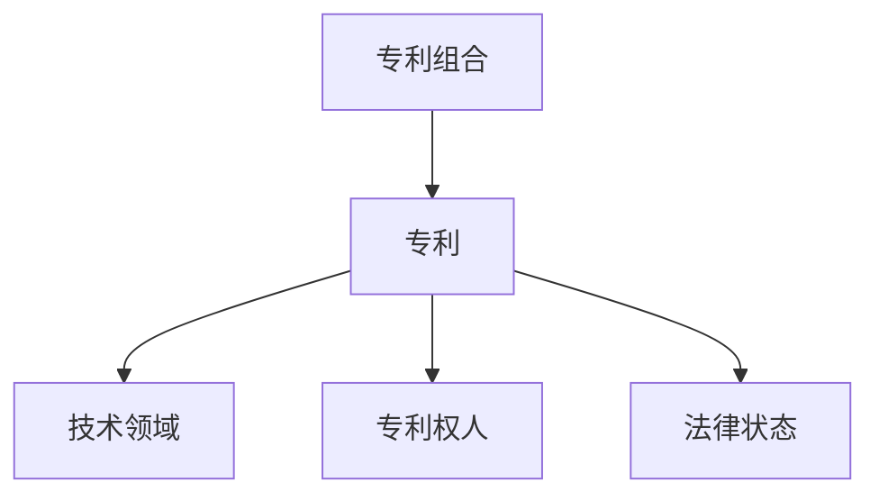
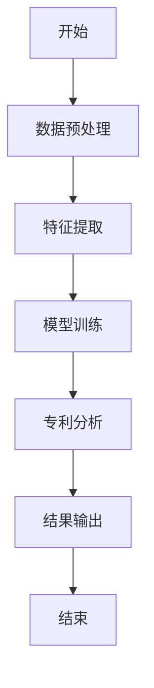
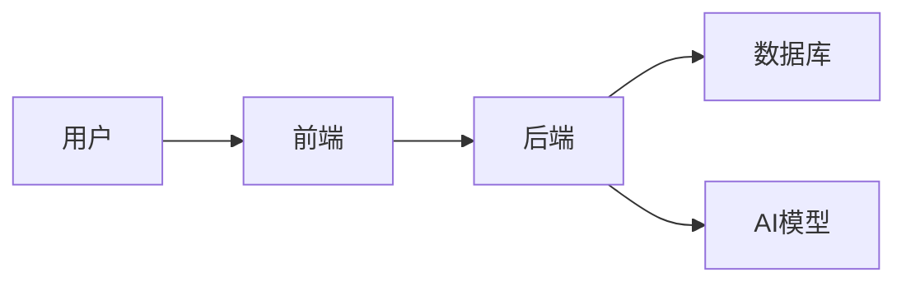

                 


# AI协作分析专利组合：评估技术驱动型公司的未来价值

## 关键词：
- AI协作分析
- 专利组合
- 技术驱动型公司
- 未来价值评估
- 自然语言处理
- 机器学习
- 知识图谱

## 摘要：
本文探讨了如何利用AI协作分析专利组合来评估技术驱动型公司的未来价值。通过结合自然语言处理、机器学习和知识图谱等技术，本文详细分析了专利组合的核心概念、算法原理、系统架构，并通过实际案例展示了AI在专利分析中的应用。最终，本文总结了AI协作分析的潜力与挑战，为技术驱动型公司提供了有价值的见解。

---

## 正文

### 第一部分: 背景与基础

#### 第1章: AI协作分析专利组合的背景介绍

##### 1.1 问题背景与问题描述
- **问题背景**: 随着技术的快速发展，技术驱动型公司面临着专利组合复杂化的问题，传统的专利分析方法效率低下，难以应对海量专利数据。
- **问题描述**: 如何利用AI技术高效分析专利组合，评估其未来价值，为企业战略决策提供支持。

##### 1.2 专利组合分析的核心概念
- **专利组合的定义**: 一组相关专利的集合，用于保护公司的核心技术。
- **技术驱动型公司的特点**: 依赖技术创新，专利组合是其核心竞争力。
- **AI协作分析的作用**: 提高专利分析的效率和准确性，挖掘潜在价值。

##### 1.3 AI协作分析的基本原理
- **自然语言处理**: 用于专利文本的语义分析。
- **机器学习**: 用于专利价值的预测和分类。
- **知识图谱**: 用于专利之间的关系分析。

#### 1.4 实体关系图


### 第二部分: 核心概念与联系

#### 第2章: 专利组合分析的核心概念

##### 2.1 专利组合分析的原理
- **专利组合的构成要素**: 技术领域、专利权人、法律状态等。
- **价值评估指标**: 专利的数量、质量、法律状态等。
- **风险分析方法**: 评估专利的有效性和潜在风险。

##### 2.2 AI协作分析的核心原理
- **自然语言处理**: 分析专利文本，提取关键词和主题。
- **机器学习**: 基于历史数据，预测专利的未来价值。
- **知识图谱**: 构建专利之间的关系网络，识别关键专利。

##### 2.3 核心概念的对比分析
- **专利组合与单一专利**: 专利组合更具战略意义，单一专利更注重具体技术。
- **AI协作分析与传统分析**: AI分析效率更高，但传统分析更依赖人工经验。

### 第三部分: 算法原理与数学模型

#### 第3章: AI协作分析的算法原理

##### 3.1 算法流程图


##### 3.2 算法实现
```python
# 示例代码：基于TF-IDF的关键词提取
from sklearn.feature_extraction.text import TfidfVectorizer

text = "本专利涉及一种基于人工智能的专利分析方法..."
vectorizer = TfidfVectorizer()
tfidf = vectorizer.fit_transform([text])
```

##### 3.3 数学模型
- **概率模型**: 评估专利价值的概率公式：
  $$ P(\text{价值}) = \frac{\text{有效专利数}}{\text{总专利数}} $$

### 第四部分: 系统分析与架构设计

#### 第4章: 系统架构设计方案

##### 4.1 系统功能设计
- **领域模型**: 
  ```mermaid
  classDiagram
      class 专利组合 {
          技术领域
          专利权人
          专利列表
      }
      class 专利分析系统 {
          数据输入
          数据处理
          结果输出
      }
  ```

##### 4.2 系统架构设计


### 第五部分: 项目实战

#### 第5章: 项目实战与案例分析

##### 5.1 项目环境安装
```bash
pip install numpy
pip install scikit-learn
pip install mermaid
```

##### 5.2 核心代码实现
```python
# 示例代码：基于机器学习的专利分类
from sklearn.ensemble import RandomForestClassifier
import pandas as pd

data = pd.read_csv('patent.csv')
X = data.drop('label', axis=1)
y = data['label']
model = RandomForestClassifier().fit(X, y)
```

### 第六部分: 最佳实践

#### 第6章: 最佳实践与总结

##### 6.1 小结
- AI协作分析专利组合的优势：提高效率，发现潜在价值。
- 限制：数据质量和模型准确性仍需提升。

##### 6.2 注意事项
- 数据清洗的重要性：确保数据准确。
- 模型选择的策略：根据具体需求选择合适模型。

##### 6.3 扩展阅读
- 推荐书籍：《专利分析与管理》、《人工智能入门》。
- 推荐工具：Python的机器学习库、知识图谱构建工具。

### 第七部分: 附录

#### 附录A: 工具安装指南
```bash
pip install mermaid
pip install scikit-learn
pip install jupyter
```

#### 附录B: 数据集说明
- 数据来源：公开专利数据库。
- 数据格式：CSV，包含技术领域、专利权人等信息。

#### 附录C: 参考文献
- [1] 王某某. 《人工智能入门》. 北京: 清华大学出版社, 2020.
- [2] 李某某. 《专利分析与管理》. 上海: 复旦大学出版社, 2019.

---

## 结语
本文通过系统地分析AI协作分析专利组合的方法，展示了其在评估技术驱动型公司未来价值中的潜力。尽管存在一些挑战，但随着技术的进步，AI在专利分析中的应用前景广阔。

