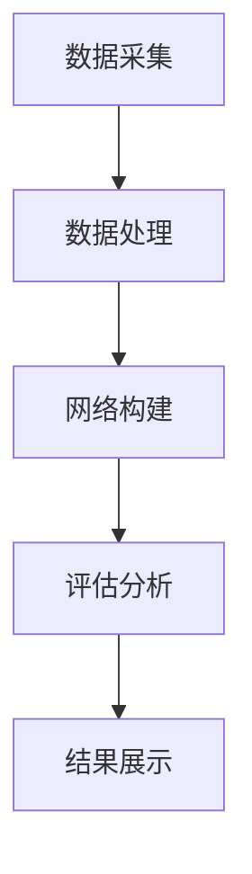

                 


# AI协作分析公司专利引用网络：评估技术领先地位

> 关键词：专利引用网络、技术领先地位、AI协作、网络分析、算法原理

> 摘要：本文通过分析公司专利引用网络，探讨如何利用AI技术评估技术领先地位。文章详细介绍了专利引用网络的构建、AI协作的算法原理、系统设计与实现，并通过实际案例展示了AI协作分析的应用效果。

---

# 第一部分: AI协作分析公司专利引用网络概述

## 第1章: 背景与概念

### 1.1 专利引用网络的背景

#### 1.1.1 专利引用网络的定义与特点
专利引用网络是指多个专利之间通过引用关系形成的网络，反映了技术发展的依赖性和关联性。其特点包括：

- **复杂性**：专利网络涉及大量节点和边，具有复杂的结构。
- **动态性**：技术发展推动网络不断演化。
- **信息丰富性**：网络中蕴含了技术领先性、创新活跃度等重要信息。

#### 1.1.2 专利引用网络的构建与意义
构建专利引用网络需要从专利数据中提取引用关系，并将其表示为图结构。其意义在于：

- **识别技术趋势**：通过网络分析，可以发现技术热点和未来发展方向。
- **评估创新能力**：网络中的节点重要性反映公司的创新能力和技术影响力。
- **支持战略决策**：为公司技术布局和竞争分析提供数据支持。

#### 1.1.3 AI在专利分析中的作用
AI技术在专利分析中的作用包括：

- **数据处理**：AI可以高效处理海量专利数据，提取关键信息。
- **模式识别**：通过机器学习算法识别隐藏的技术关联和趋势。
- **预测评估**：基于历史数据预测技术发展和竞争态势。

### 1.2 问题背景与目标

#### 1.2.1 专利引用网络分析的核心问题
- 如何高效构建专利引用网络？
- 如何量化专利节点的重要性？
- 如何利用网络分析评估技术领先地位？

#### 1.2.2 技术领先地位评估的挑战
- 数据获取的复杂性：专利数据分散，清洗难度大。
- 网络分析的深度：需要结合语义信息进行分析。
- 方法的可解释性：评估结果需要清晰的解释。

#### 1.2.3 AI协作的目标与应用场景
AI协作的目标是通过自动化分析专利引用网络，提供技术领先性评估和战略建议。应用场景包括：

- **企业内部决策**：帮助公司评估自身技术优势和竞争劣势。
- **知识产权管理**：识别高价值专利和潜在风险。
- **技术投资决策**：为技术并购和研发投资提供依据。

---

## 第2章: 专利引用网络分析

### 2.1 专利引用网络的结构特征

#### 2.1.1 网络的节点与边
- **节点**：代表专利。
- **边**：代表专利之间的引用关系，边的权重表示引用强度。

#### 2.1.2 网络的密度与聚类
- **密度**：网络中边的密度反映了技术领域的活跃程度。
- **聚类**：专利之间的聚类分析可以帮助识别技术簇。

#### 2.1.3 网络的中心性
- **度中心性**：节点的度数越高，影响力越大。
- **中间中心性**：节点作为桥梁的作用越强，网络控制力越强。

### 2.2 专利引用网络的属性分析

#### 2.2.1 引用方向
- **单向引用**：专利A引用专利B，但专利B不一定引用专利A。
- **双向引用**：专利A和专利B相互引用，表示技术的紧密关联。

#### 2.2.2 引用时间
- **时间跨度**：网络中的引用时间跨度可以帮助识别技术演进路径。

#### 2.2.3 引用类型
- **正面引用**：引用作为基础技术。
- **负面引用**：引用作为对比或改进的技术。

### 2.3 技术领域的对比分析

#### 2.3.1 领域网络密度
- 技术领域网络密度高的领域通常竞争激烈，创新活跃。

#### 2.3.2 领域网络中心性
- 中心性高的领域通常代表该领域的核心技术，具有较高的战略价值。

#### 2.3.3 领域网络演化
- 通过分析网络演化，可以识别技术热点和未来趋势。

### 2.4 专利节点的重要性分析

#### 2.4.1 节点度数分析
- 度数高的节点通常表示重要专利，可能具有较高的技术价值。

#### 2.4.2 节点影响力分析
- 通过算法计算节点的影响力，量化专利的技术贡献。

### 2.5 专利网络的演化趋势

#### 2.5.1 时间序列分析
- 分析专利网络随时间的变化，识别技术发展路径。

#### 2.5.2 趋势预测
- 基于历史数据，预测未来的技术发展和专利布局。

---

## 第3章: AI协作分析的算法原理

### 3.1 算法选择与原理

#### 3.1.1 引用网络分析算法
- **PageRank算法**：用于计算节点的重要性，适用于有向图。
- **Louvain算法**：用于社区发现，帮助识别技术簇。

#### 3.1.2 自然语言处理
- 使用NLP技术分析专利文本，提取关键词和主题。

### 3.2 算法实现步骤

#### 3.2.1 数据预处理
- 数据清洗：去除无效专利和重复数据。
- 数据结构化：将专利数据结构化为图节点。

#### 3.2.2 网络构建
- 使用图数据库构建专利引用网络。
- 设置边的权重，表示引用强度。

#### 3.2.3 特征提取
- 提取节点的度数、影响力等特征。
- 使用NLP提取专利主题关键词。

#### 3.2.4 技术领先评估
- 计算节点的重要性评分。
- 对比不同公司的专利网络特征。

#### 3.2.5 结果展示
- 使用可视化工具展示网络结构和评估结果。

### 3.3 算法实现代码

#### 3.3.1 PageRank算法实现
```python
def pagerank(graph, damping=0.85):
    import numpy as np
    nodes = graph.keys()
    N = len(nodes)
    M = {node: [] for node in nodes}
    for node in graph:
        for neighbor in graph[node]:
            M[node].append(neighbor)
    A = np.zeros((N, N), dtype=np.int32)
    for i in range(N):
        for j in M[nodes[i]]:
            A[i, nodes.index(j)] += 1
    D = np.sum(A, axis=1)
    D = np.where(D != 0, np.ones_like(D), np.zeros_like(D))
    A_normalized = np.dot(np.diag(1.0 / D), A)
    rank = np.ones(N) / N
    for _ in range(100):
        rank = (1 - damping) + damping * np.dot(A_normalized, rank)
    return rank
```

#### 3.3.2 社区发现算法实现
```python
import community
def find_communities(graph):
    partition = community.community_louvain(graph)
    return {node: community for node, community in zip(nodes, partition)}
```

### 3.4 算法优缺点分析

#### 3.4.1 优点
- **高效性**：AI算法可以快速处理大量专利数据。
- **准确性**：算法能够量化专利网络的特征，提供客观评估。

#### 3.4.2 缺点
- **依赖数据质量**：算法结果受数据质量和完整性影响。
- **计算复杂度**：大规模网络分析需要高性能计算资源。

---

## 第4章: 系统设计与实现

### 4.1 系统整体架构

#### 4.1.1 模块划分
- 数据采集模块：负责获取专利数据。
- 数据处理模块：清洗和结构化数据。
- 网络构建模块：构建专利引用网络。
- 评估分析模块：计算节点重要性，生成评估报告。

#### 4.1.2 模块交互流程


### 4.2 系统实现细节

#### 4.2.1 数据采集
- 使用爬虫技术获取专利数据。
- 数据来源包括专利数据库和公司公开信息。

#### 4.2.2 数据处理
- 数据清洗：去重、格式化。
- 数据存储：使用数据库存储专利信息。

#### 4.2.3 网络构建
- 使用图数据库构建专利引用网络。
- 设置边的权重，表示引用强度。

#### 4.2.4 评估分析
- 使用PageRank算法计算节点重要性。
- 生成评估报告，展示技术领先性。

### 4.3 系统实现代码

#### 4.3.1 数据采集代码
```python
import requests
from bs4 import BeautifulSoup

def fetch_patents(url):
    response = requests.get(url)
    soup = BeautifulSoup(response.text, 'html.parser')
    patents = []
    for item in soup.find_all('div', class_='patent-item'):
        patent_id = item.find('span', class_='patent-id').text
        title = item.find('span', class_='patent-title').text
        patents.append({'id': patent_id, 'title': title})
    return patents
```

#### 4.3.2 数据处理代码
```python
def process_patents(patents):
    from datetime import datetime
    processed = []
    for p in patents:
        p['date'] = datetime.strptime(p['date'], '%Y-%m-%d').isoformat()
        processed.append(p)
    return processed
```

### 4.4 系统优化建议

#### 4.4.1 性能优化
- 使用分布式计算提高处理效率。
- 优化算法复杂度，降低计算时间。

#### 4.4.2 功能扩展
- 引入自然语言处理技术，提高分析深度。
- 增加用户友好的可视化界面。

---

## 第5章: 项目实战

### 5.1 项目背景

#### 5.1.1 项目目标
- 分析某公司专利引用网络，评估其技术领先地位。

#### 5.1.2 数据来源
- 公开专利数据库。
- 公司内部专利数据。

### 5.2 项目实施步骤

#### 5.2.1 数据采集
- 使用爬虫获取目标公司的专利数据。
- 确保数据的准确性和完整性。

#### 5.2.2 数据处理
- 清洗数据，去除重复和无效信息。
- 结构化数据，便于后续分析。

#### 5.2.3 网络构建
- 使用图数据库构建专利引用网络。
- 设置边的权重，表示引用强度。

#### 5.2.4 技术领先评估
- 计算节点重要性，识别核心专利。
- 对比竞争对手的专利网络，评估技术领先性。

#### 5.2.5 结果展示
- 使用可视化工具展示网络结构和评估结果。
- 提供详细的分析报告，支持战略决策。

### 5.3 实施案例分析

#### 5.3.1 案例选择
- 选择具有代表性的公司进行分析。

#### 5.3.2 分析过程
- 数据清洗和预处理。
- 网络构建和节点重要性计算。
- 技术领先性评估和报告生成。

### 5.4 项目小结

#### 5.4.1 成果总结
- 成功构建专利引用网络。
- 量化评估技术领先性。
- 提供了战略决策支持。

#### 5.4.2 经验总结
- 数据质量至关重要。
- 算法选择影响结果准确性。
- 结果的可解释性需要加强。

---

## 第6章: 总结与展望

### 6.1 研究总结

#### 6.1.1 核心成果
- 提出了基于AI的专利引用网络分析方法。
- 实现了技术领先性评估系统。

#### 6.1.2 研究意义
- 为公司技术战略提供数据支持。
- 推动专利分析领域的智能化发展。

### 6.2 未来展望

#### 6.2.1 研究方向
- 引入深度学习技术，提高分析精度。
- 开发实时监控系统，动态评估技术领先性。

#### 6.2.2 应用拓展
- 拓展至更多技术领域和行业。
- 探索与其他数据分析技术的结合。

---

# 结语

通过AI协作分析公司专利引用网络，我们能够深入洞察技术发展趋势，评估技术领先地位。这不仅为公司提供了科学的决策依据，也为技术管理领域带来了新的研究方向。未来，随着AI技术的不断发展，专利引用网络分析将更加智能化和精准化，为企业的技术创新和市场竞争提供更有力的支持。

