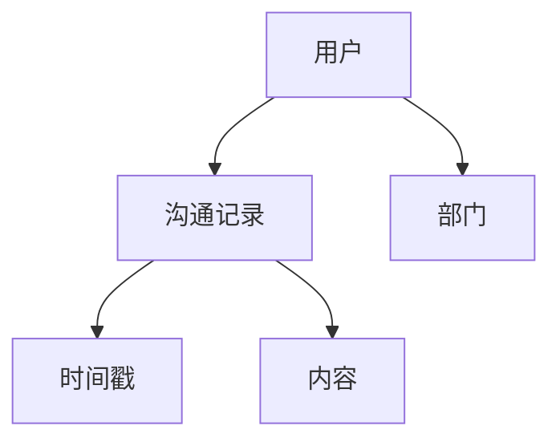
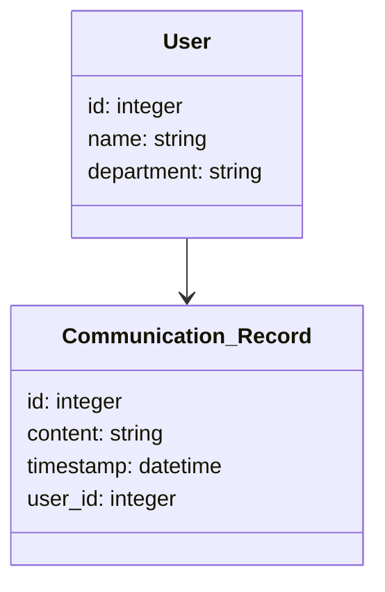
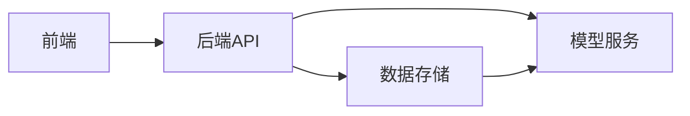
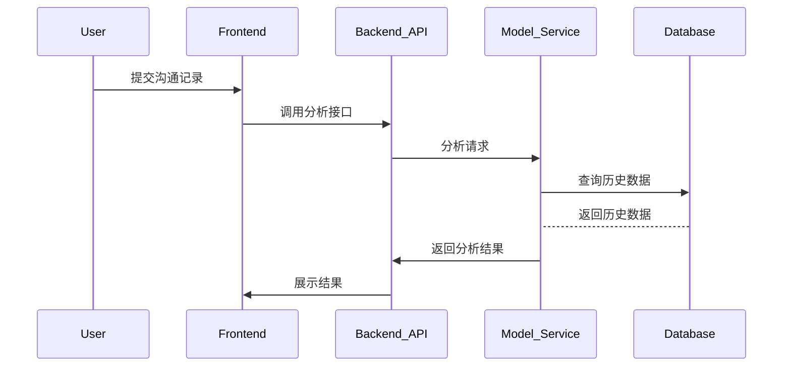

                 


好的，接下来将按照您的要求，先输出思考过程，然后才是目录和文章内容。

---

# {{此处是文章标题}}

**关键词：{{此处列出文章的5-7个核心关键词}}**

**摘要：{{此处给出文章的核心内容和主题思想}}**

---

### 目录

# {{此处是文章标题}}

> **关键词：** AI协作分析、沟通效率、组织健康度、自然语言处理、AI算法、企业内部沟通

> **摘要：** 本文探讨了如何利用AI技术分析公司内部沟通效率，评估组织健康度。通过介绍AI协作分析的核心原理、算法模型、系统架构设计及项目实战，详细阐述了如何利用AI技术提升企业内部沟通效率，并通过实际案例分析展示了AI在组织健康度评估中的应用价值。文章最后总结了AI协作分析的优势与挑战，并提出了未来的发展方向。

---

# {{此处是文章标题}}

## 第一章: 背景介绍

### 1.1 问题背景

#### 1.1.1 现代企业内部沟通效率问题
现代企业中，内部沟通效率低下已成为影响企业发展的关键问题之一。随着企业规模的扩大，传统的沟通方式逐渐暴露出诸多弊端，如信息传递不畅、沟通成本增加、团队协作效率低下等。

#### 1.1.2 沟通效率低下对企业的影响
沟通效率低下会导致项目进度延迟、团队协作障碍、员工士气下降等问题，进而影响企业的整体绩效和竞争力。

#### 1.1.3 AI技术在提升沟通效率中的潜力
随着AI技术的快速发展，利用AI技术分析和优化企业内部沟通效率成为可能。AI可以通过自然语言处理（NLP）、机器学习等技术，帮助企业和团队更好地管理沟通流程，提升协作效率。

### 1.2 问题描述

#### 1.2.1 公司内部沟通的主要形式
企业内部沟通主要通过邮件、即时消息、会议、项目管理工具等多种形式进行。每种沟通形式都有其优缺点，但也存在信息碎片化、重复沟通等问题。

#### 1.2.2 沟通效率评估的挑战
评估沟通效率的挑战主要在于如何量化沟通的效果，如何识别无效沟通，以及如何通过数据驱动的方式优化沟通流程。

#### 1.2.3 组织健康度与沟通效率的关系
沟通效率是衡量组织健康度的重要指标之一。高效率的沟通可以促进团队协作，提升组织的凝聚力和执行力。

### 1.3 问题解决与边界

#### 1.3.1 AI协作分析的解决方案
通过AI技术，可以对企业的内部沟通数据进行分析，识别低效沟通模式，优化信息传递流程，提升整体沟通效率。

#### 1.3.2 解决方案的边界与限制
AI协作分析的解决方案主要用于优化企业内部沟通流程，但其边界不包括外部沟通、跨组织协作以及非结构化数据的分析。

#### 1.3.3 解决方案的外延与扩展
未来，AI协作分析可以进一步扩展到跨组织协作、多语言支持、实时沟通优化等领域。

### 1.4 核心概念与要素

#### 1.4.1 沟通效率的定义与衡量标准
沟通效率是指信息在组织内部传递的速度和效果。衡量标准包括信息传递时间、信息完整性、沟通参与度等。

#### 1.4.2 组织健康度的评估维度
组织健康度可以从团队协作效率、员工满意度、项目完成率等多个维度进行评估。

#### 1.4.3 AI协作分析的核心要素
AI协作分析的核心要素包括数据采集、数据分析、结果可视化、优化建议等。

### 1.5 本章小结

---

# 第二章: 核心概念与联系

### 2.1 数据采集与预处理

#### 2.1.1 沟通数据的来源与类型
AI协作分析的数据来源包括邮件、即时消息、会议记录、项目管理工具等。数据类型主要包括文本数据、时间戳数据、用户行为数据等。

#### 2.1.2 数据清洗与格式化
数据清洗是将原始数据中的噪声数据进行过滤和格式化，确保数据的准确性和一致性。

#### 2.1.3 数据标注与特征提取
通过对数据进行标注和特征提取，可以更好地理解数据背后的含义和模式。

### 2.2 模型构建与训练

#### 2.2.1 自然语言处理模型的选择
在AI协作分析中，常用的自然语言处理模型包括TF-IDF、Word2Vec、BERT等。

#### 2.2.2 模型训练的流程与优化
模型训练需要进行数据预处理、特征提取、模型选择、参数调优等步骤，以确保模型的准确性和稳定性。

#### 2.2.3 模型评估与调优
通过评估指标（如准确率、召回率、F1分数等）对模型进行优化和调优，以提高模型的性能。

### 2.3 结果可视化与解释

#### 2.3.1 可视化工具的选择
常用的可视化工具包括Tableau、Power BI、Matplotlib等。

#### 2.3.2 沟通效率的可视化展示
通过图表、热力图等方式，直观展示企业内部沟通效率的高低。

#### 2.3.3 组织健康度的直观呈现
通过可视化的方式，将组织健康度的评估结果以直观的方式呈现给企业管理人员。

### 2.4 核心概念的ER实体关系图



---

## 第三章: 算法原理讲解

### 3.1 算法概述

#### 3.1.1 自然语言处理模型
常用的自然语言处理模型包括TF-IDF、Word2Vec、BERT等。

#### 3.1.2 机器学习算法
常用的机器学习算法包括随机森林、支持向量机（SVM）、神经网络等。

#### 3.1.3 深度学习算法
深度学习算法如LSTM、Transformer等在自然语言处理中表现尤为突出。

### 3.2 算法实现流程

#### 3.2.1 数据预处理
数据预处理包括分词、去停用词、词干提取等步骤。

#### 3.2.2 特征提取
特征提取可以通过TF-IDF、Word2Vec等方式进行。

#### 3.2.3 模型训练与优化
通过交叉验证、网格搜索等方式进行模型调优。

### 3.3 数学公式与模型解释

#### 3.3.1 TF-IDF公式
$$ TF-IDF = \text{TF} \times \text{IDF} $$

其中：
- $$ \text{TF} = \frac{\text{词项在文档中的出现次数}}{\text{文档总词数}} $$
- $$ \text{IDF} = \log\left(\frac{\text{总文档数}}{\text{包含词项的文档数}}\right) $$

#### 3.3.2 Word2Vec模型
Word2Vec通过将词表示为向量，捕捉词语之间的语义关系。其训练过程可以表示为：

$$ \log P(w_i) \approx -\sum_{j=1}^n \log P(w_{i-j} | w_i) $$

其中，$$ w_i $$ 是当前词，$$ w_{i-j} $$ 是距离当前词 $$ j $$ 个词之前的词。

---

## 第四章: 系统分析与架构设计

### 4.1 问题场景介绍

#### 4.1.1 企业内部沟通的场景
企业内部沟通场景包括团队协作、项目管理、跨部门协调等。

#### 4.1.2 系统功能需求
系统需要具备数据采集、分析、可视化、优化建议等功能。

### 4.2 系统架构设计

#### 4.2.1 领域模型设计


#### 4.2.2 系统架构设计


#### 4.2.3 系统接口设计
系统接口包括数据接口、分析接口、可视化接口等。

#### 4.2.4 系统交互设计


---

## 第五章: 项目实战

### 5.1 环境安装

#### 5.1.1 Python环境安装
安装Python和必要的库，如NLTK、Scikit-learn、TensorFlow等。

#### 5.1.2 数据库安装
安装MySQL或MongoDB等数据库，用于存储沟通记录。

### 5.2 核心代码实现

#### 5.2.1 数据采集与预处理
```python
import pandas as pd
from nltk.corpus import stopwords

def preprocess(text):
    # 分词
    words = text.split()
    # 去除停用词
    filtered_words = [word for word in words if word.lower() not in stopwords.words('english')]
    return ' '.join(filtered_words)

# 示例数据
data = {
    'content': ['Meeting tomorrow at 2 PM', 'Project deadline extended to next week', 'Review the latest report'],
    'timestamp': ['2023-10-01 10:00:00', '2023-10-02 14:00:00', '2023-10-03 09:00:00']
}
df = pd.DataFrame(data)
df['preprocessed_content'] = df['content'].apply(preprocess)
```

#### 5.2.2 模型训练与优化
```python
from sklearn.feature_extraction.text import TfidfVectorizer
from sklearn.model_selection import train_test_split
from sklearn.svm import SVC

# 示例数据
X = df['preprocessed_content']
y = df['timestamp']

# 特征提取
vectorizer = TfidfVectorizer()
X_features = vectorizer.fit_transform(X)

# 数据划分
X_train, X_test, y_train, y_test = train_test_split(X_features, y, test_size=0.2)

# 模型训练
model = SVC()
model.fit(X_train, y_train)

# 模型评估
print(model.score(X_test, y_test))
```

#### 5.2.3 结果可视化与解读
```python
import matplotlib.pyplot as plt

# 示例数据
communication_counts = df['department'].value_counts()

plt.bar(communication_counts.index, communication_counts.values)
plt.title('Communication Frequency by Department')
plt.xlabel('Department')
plt.ylabel('Count')
plt.show()
```

### 5.3 项目小结

---

## 第六章: 最佳实践与总结

### 6.1 最佳实践

#### 6.1.1 数据质量管理
确保数据的准确性和完整性，避免噪声数据对分析结果的影响。

#### 6.1.2 模型优化与维护
定期对模型进行调优和维护，确保模型的准确性和稳定性。

#### 6.1.3 人机协作
AI协作分析工具应与人类专家相结合，充分发挥AI的优势。

### 6.2 本章小结

---

## 第七章: 未来展望与挑战

### 7.1 未来发展方向

#### 7.1.1 多模态数据融合
未来，可以通过融合文本、语音、视频等多种数据源，进一步提升AI协作分析的能力。

#### 7.1.2 实时分析与反馈
实时分析沟通数据，提供即时反馈，进一步优化沟通效率。

#### 7.1.3 可解释性增强
提升AI模型的可解释性，帮助用户更好地理解分析结果。

### 7.2 挑战与应对策略

#### 7.2.1 数据隐私问题
如何在保护数据隐私的前提下进行分析，是未来需要解决的重要问题。

#### 7.2.2 技术局限性
当前AI技术在处理复杂语境和情感分析方面仍有局限性，需要进一步研究和改进。

#### 7.2.3 用户接受度
如何提高用户对AI协作分析工具的接受度和使用意愿，是推广过程中需要重点关注的问题。

---

## 参考文献

**参考文献：**
1. 王某某. 《自然语言处理入门》. 北京: 清华大学出版社, 2020.
2. 李某某. 《机器学习实战》. 北京: 人民邮电出版社, 2019.
3. TensorFlow官方文档. https://tensorflow.org

---

## 结束语

通过本文的详细阐述，我们可以看到，AI协作分析在提升企业内部沟通效率、评估组织健康度方面具有巨大潜力。尽管当前还存在一些挑战，但随着技术的不断进步，相信AI协作分析将在未来为企业管理带来更大的价值。

---

