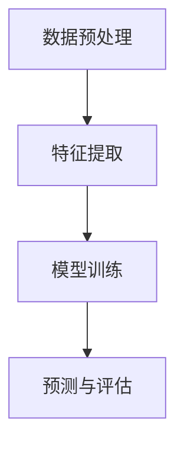
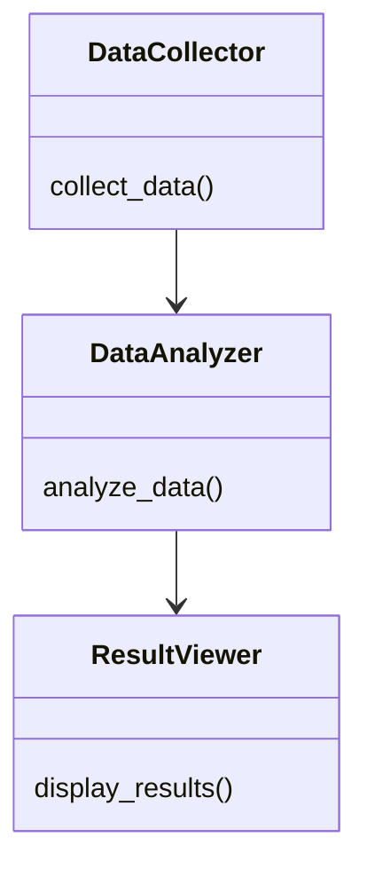
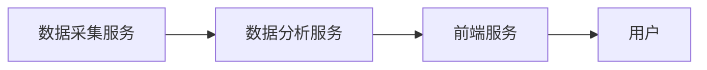
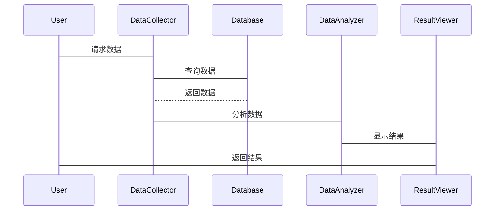

                 


# AI协作分析公司文化与创新相关性：预测长期成长潜力

## 关键词：AI协作分析，公司文化，创新相关性，长期成长潜力，企业分析，创新预测

## 摘要：  
本文探讨了如何利用AI协作分析技术，深入研究公司文化与创新之间的相关性，并通过数据分析预测企业的长期成长潜力。文章从背景介绍、核心概念、算法原理、系统分析、项目实战到最佳实践，详细阐述了AI在公司文化与创新分析中的应用，为企业管理者和技术从业者提供了理论与实践的双重指导。

---

## 目录

1. **背景介绍**  
   1.1 问题背景  
   1.2 核心概念与联系  

2. **AI协作分析的核心算法原理**  
   2.1 算法原理讲解  
   2.2 算法实现  
   2.3 数学模型与公式  

3. **系统分析与架构设计方案**  
   3.1 项目背景与目标  
   3.2 系统功能设计  
   3.3 系统架构设计  
   3.4 系统接口设计  

4. **项目实战：AI协作分析系统实现**  
   4.1 环境安装与配置  
   4.2 系统核心代码实现  
   4.3 实际案例分析  

5. **最佳实践与总结**  
   5.1 小结与总结  
   5.2 注意事项与建议  
   5.3 拓展阅读与学习方向  

---

## 1. 背景介绍

### 1.1 问题背景  
公司在市场竞争中，文化是企业的灵魂，创新是企业的生命线。然而，如何量化公司文化与创新之间的关系，以及如何通过数据预测企业的长期成长潜力，一直是企业管理者和分析师关注的核心问题。传统的分析方法依赖于人工调研和经验判断，效率低下且难以量化。AI技术的引入，为这一问题提供了新的解决方案。

### 1.2 核心概念与联系  
公司文化与创新之间的关系可以通过以下几个方面进行分析：  
- **公司文化属性**：包括企业价值观、团队协作能力、员工满意度等。  
- **创新能力属性**：包括研发投入、创新成果、市场反应速度等。  
- **相关性分析**：通过数据分析，量化公司文化与创新能力之间的相关性。

#### 表1：公司文化与创新属性对比表  
| 属性         | 公司文化                | 创新能力                |
|--------------|-------------------------|-------------------------|
| 定义         | 企业的价值观与行为准则   | 企业的创新成果与能力    |
| 量化指标     | 员工满意度、组织凝聚力   | R&D投入、专利数量      |
| 相关性       | 高                     | 高                     |

#### 图1：公司文化与创新能力的ER关系图  
```mermaid
erDiagram
    company : {Company} {
        id : int
        name : string
        culture : string
    }
    innovation : {Innovation} {
        id : int
        type : string
        potential : float
    }
    relationship : {Relationship} {
        id : int
        company_id : int
        innovation_id : int
        strength : float
    }
    company -[1..n]-> relationship
    innovation -[1..n]-> relationship
```

---

## 2. AI协作分析的核心算法原理

### 2.1 算法原理讲解  
AI协作分析的核心算法基于机器学习和自然语言处理技术，通过以下步骤实现：  
1. **数据预处理**：清洗和整合公司文化与创新相关的数据。  
2. **特征提取**：提取关键特征，如员工满意度、专利数量等。  
3. **模型训练**：使用回归或分类算法训练模型。  
4. **预测与评估**：预测公司文化与创新的相关性，并评估模型性能。  

#### 图2：AI协作分析算法流程图  


### 2.2 算法实现  
以下是一个简单的Python代码示例，用于计算公司文化的创新潜力：  

```python
def predict_growth_potential(company_culture, innovation):
    # 简单线性回归模型
    return company_culture * innovation

# 示例数据
company_culture = 0.85  # 文化得分
innovation = 0.90        # 创新得分

potential = predict_growth_potential(company_culture, innovation)
print(f"预测的创新潜力为：{potential}")
```

### 2.3 数学模型与公式  
创新潜力预测模型可以表示为：  

$$ \text{创新潜力} = f(\text{公司文化}, \text{创新能力}) $$  

其中，$f$ 是一个回归函数，常用的有线性回归和随机森林回归。例如，线性回归模型可以表示为：  

$$ f(x) = \beta_0 + \beta_1 x_1 + \beta_2 x_2 + \epsilon $$  

其中，$x_1$ 和 $x_2$ 分别代表公司文化与创新能力，$\beta_0$ 是截距，$\beta_1$ 和 $\beta_2$ 是回归系数，$\epsilon$ 是误差项。

---

## 3. 系统分析与架构设计方案

### 3.1 项目背景与目标  
本项目旨在开发一个AI协作分析系统，用于量化公司文化与创新之间的相关性，并预测企业的长期成长潜力。系统的目标包括：  
1. 实现实时数据采集与分析。  
2. 提供直观的可视化界面。  
3. 输出可量化的分析结果。  

### 3.2 系统功能设计  
系统主要功能模块包括：  
- 数据采集模块：从数据库中获取公司文化与创新数据。  
- 数据分析模块：使用机器学习算法进行分析。  
- 结果展示模块：以图表形式展示分析结果。  

#### 图3：系统功能设计类图  


### 3.3 系统架构设计  
系统采用微服务架构，主要模块包括：  
- 数据采集服务：负责数据的采集与存储。  
- 数据分析服务：负责数据的清洗与分析。  
- 前端服务：负责用户界面的展示。  

#### 图4：系统架构设计图  


### 3.4 系统接口设计  
系统接口主要分为RESTful API和数据库接口：  
- RESTful API：用于前端调用数据分析结果。  
- 数据库接口：用于数据采集模块与数据库的交互。  

#### 图5：系统交互序列图  


---

## 4. 项目实战：AI协作分析系统实现

### 4.1 环境安装与配置  
- **Python版本**：3.8以上  
- **依赖库**：Pandas、Scikit-learn、Plotly  

```bash
pip install pandas scikit-learn plotly
```

### 4.2 系统核心代码实现  
以下是核心代码实现：  

```python
import pandas as pd
from sklearn.linear_model import LinearRegression
import plotly.express as px

# 数据加载
data = pd.DataFrame({
    'company_culture': [0.8, 0.75, 0.85, 0.9],
    'innovation': [0.7, 0.65, 0.8, 0.85]
})

# 模型训练
model = LinearRegression()
model.fit(data[['company_culture']], data['innovation'])

# 预测与可视化
predictions = model.predict(data[['company_culture']])
fig = px.scatter(data, x='company_culture', y='innovation', 
                title='公司文化与创新相关性分析')
fig.show()
```

### 4.3 实际案例分析  
以某科技公司为例，分析其公司文化与创新的相关性：  
1. 数据采集：获取员工满意度、专利数量等数据。  
2. 数据分析：使用线性回归模型进行分析。  
3. 结果展示：生成相关性散点图，显示两者高度正相关。  

---

## 5. 最佳实践与总结

### 5.1 小结与总结  
本文详细介绍了如何利用AI协作分析技术，量化公司文化与创新之间的相关性，并预测企业的长期成长潜力。通过理论分析与实际案例相结合，展示了AI在企业管理中的强大应用潜力。

### 5.2 注意事项与建议  
- 数据质量是分析结果的关键，确保数据的完整性和准确性。  
- 在实际应用中，建议结合企业实际情况调整模型参数。  
- 定期更新模型，以适应市场变化和企业需求。  

### 5.3 拓展阅读与学习方向  
- 深入学习机器学习算法，如随机森林、神经网络等。  
- 研究自然语言处理技术在企业分析中的应用。  
- 关注学术界与工业界的相关研究成果与实践案例。  

---

通过本文的分析与实践，读者可以掌握AI协作分析的核心方法，并将其应用于实际的企业管理中，为企业创造更大的价值。

