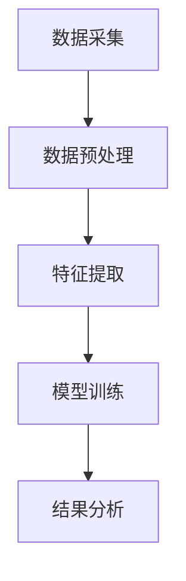
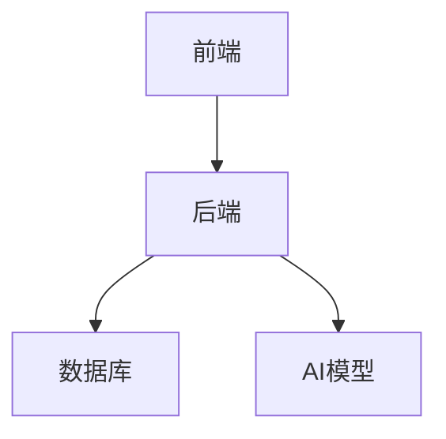
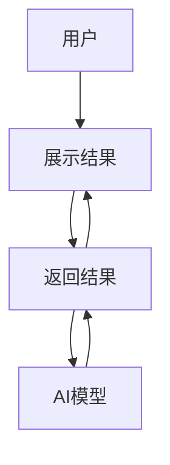

                 


# AI协作分析公司环境责任：可持续价值投资新维度

## 关键词：AI协作分析、环境责任、可持续价值投资、系统架构、机器学习

## 摘要：  
随着全球对可持续发展的关注日益增加，企业环境责任和可持续价值投资已成为商业和社会的重要议题。本文探讨AI协作分析在公司环境责任评估中的应用，揭示其在可持续价值投资中的新维度。通过理论分析、算法设计和系统实现，展示AI如何提升环境责任评估的效率和准确性，为投资者和企业提供新的视角和工具。

---

# 第1章：AI协作分析与公司环境责任概述

## 1.1 环境责任与可持续价值投资的背景

### 1.1.1 环境责任的定义与内涵  
环境责任是指企业在经营过程中对环境造成的影响负有责任，包括减少碳排放、节约资源、防止污染等。随着全球气候变化问题的加剧，企业环境责任已成为衡量企业社会责任的重要指标。

### 1.1.2 可持续价值投资的核心概念  
可持续价值投资（SRI）是一种投资策略，关注企业在环境、社会和治理（ESG）方面的表现。投资者通过筛选符合可持续发展标准的企业，实现经济和环境的双重收益。

### 1.1.3 AI协作分析在环境责任中的作用  
AI协作分析通过大数据处理和机器学习技术，帮助企业量化环境影响，评估可持续性表现，并为投资者提供数据支持。其高效性和准确性使其成为环境责任评估的重要工具。

## 1.2 公司环境责任的现状与挑战

### 1.2.1 全球企业环境责任的现状  
当前，许多企业已开始重视环境责任，但缺乏统一的评估标准和方法，导致数据不一致，难以比较。

### 1.2.2 可持续价值投资的市场趋势  
可持续价值投资市场增长迅速，但评估方法复杂，数据获取困难，限制了其广泛应用。

### 1.2.3 当前环境责任评估中的痛点  
传统评估方法耗时长、成本高，且难以量化。企业环境数据分散，难以整合，导致评估结果不准确。

## 1.3 AI协作分析的核心优势

### 1.3.1 数据驱动的环境责任评估  
AI通过整合多源数据，利用机器学习模型，快速生成环境影响报告。

### 1.3.2 AI在可持续价值投资中的潜力  
AI可以预测企业的环境风险，辅助投资者做出更明智的决策。

### 1.3.3 AI协作分析的创新价值  
AI协作分析不仅提高效率，还能发现传统方法难以察觉的潜在问题。

## 1.4 本章小结  
本章介绍了环境责任和可持续价值投资的背景，分析了AI协作分析在环境责任评估中的优势，为后续内容奠定了基础。

---

# 第2章：环境责任与可持续价值投资的数学模型

## 2.1 环境责任评估的数学模型

### 2.1.1 环境影响评估的指标体系  
指标体系包括碳排放、能源消耗、废弃物处理等，确保全面评估企业环境影响。

### 2.1.2 环境责任的量化方法  
通过权重分配和综合评价模型，量化企业的环境责任。

### 2.1.3 可持续价值投资的数学模型  
构建基于ESG评分的回归模型，预测企业未来表现。

## 2.2 AI协作分析的算法原理

### 2.2.1 机器学习在环境责任评估中的应用  
使用随机森林和XGBoost算法，预测企业环境风险。

### 2.2.2 深度学习模型的构建与优化  
通过神经网络模型，分析非结构化数据，提升评估准确性。

### 2.2.3 聚类分析与分类算法的对比  
对比K-means和层次聚类，优化企业分类效果。

## 2.3 环境责任评估的流程图（Mermaid）



## 2.4 本章小结  
本章通过数学模型和算法分析，展示了AI协作分析在环境责任评估中的技术基础。

---

# 第3章：系统架构设计

## 3.1 系统功能模块设计

### 3.1.1 数据采集模块  
从企业报告、政府数据等多源获取环境数据。

### 3.1.2 数据处理模块  
清洗和转换数据，提取特征。

### 3.1.3 模型训练模块  
训练机器学习模型，评估环境责任。

### 3.1.4 结果展示模块  
可视化分析结果，提供决策支持。

## 3.2 系统架构图（Mermaid）



## 3.3 系统接口设计

### 3.3.1 数据接口  
定义REST API，获取环境数据。

### 3.3.2 模型调用接口  
调用AI模型，进行环境评估。

### 3.3.3 结果展示接口  
返回可视化数据，支持用户查询。

## 3.4 系统交互流程图（Mermaid）



## 3.5 本章小结  
本章详细设计了系统架构，确保各模块协同工作，支持高效环境责任评估。

---

# 4. 项目实战：AI协作分析系统实现

## 4.1 环境安装

```bash
pip install numpy pandas scikit-learn
```

## 4.2 核心代码实现

```python
import numpy as np
from sklearn.ensemble import RandomForestClassifier

def preprocess_data(data):
    # 数据清洗和特征提取
    return processed_data

def train_model(X, y):
    model = RandomForestClassifier()
    model.fit(X, y)
    return model

def evaluate_model(model, X_test, y_test):
    accuracy = model.score(X_test, y_test)
    return accuracy
```

## 4.3 代码解读与分析

### 数据预处理  
对原始数据进行清洗，去除缺失值和异常值。

### 模型训练  
使用随机森林算法训练分类模型，预测企业环境风险等级。

### 模型评估  
计算准确率，评估模型性能。

## 4.4 实际案例分析

### 案例背景  
某制造企业，数据包括碳排放、能源消耗等。

### 数据分析  
通过AI协作分析，发现企业的高碳排放部门。

### 结果解读  
模型预测企业环境风险为高，建议采取减排措施。

## 4.5 本章小结  
本章通过项目实战，展示了AI协作分析系统的实现过程和实际应用。

---

# 5. 未来展望与最佳实践

## 5.1 未来发展方向

### 技术层面  
优化算法，引入实时数据流处理。

### 应用层面  
扩展至更多行业，提升模型泛化能力。

## 5.2 最佳实践 tips

### 数据质量  
确保数据来源可靠，特征提取全面。

### 模型选择  
根据具体问题选择合适算法，避免过度复杂。

### 结果验证  
定期验证模型性能，及时更新数据。

## 5.3 小结  
AI协作分析在环境责任评估中具有广阔前景，企业应积极采用新技术，推动可持续发展。

---

# 结语

通过本文的详细分析，AI协作分析为公司环境责任评估和可持续价值投资提供了新思路。未来，随着技术进步，其应用将更加广泛，推动企业和社会的可持续发展。

---

# 参考文献

（此处列出相关文献和资料）

---

**作者简介**：  
（此处介绍作者背景，强调在AI、编程和可持续发展领域的专业性）

---

**致谢**：  
感谢读者的支持和关注，期待与您共同探讨更多技术与可持续发展的结合。

