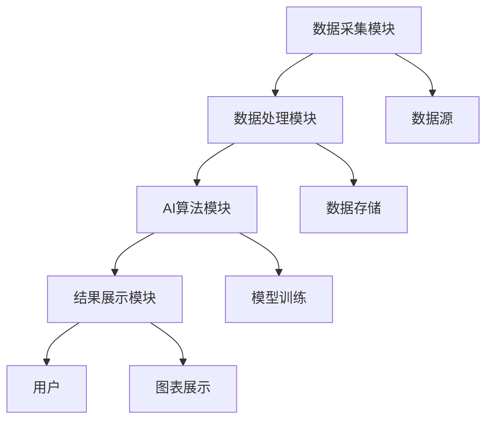

                 


# AI协作分析公司环境足迹：评估长期可持续发展能力

## 关键词：AI协作分析、公司环境足迹、可持续发展、环境数据分析、人工智能

## 摘要：随着全球对可持续发展的关注不断增加，公司环境足迹的分析变得至关重要。本文探讨了如何利用AI技术协作分析公司环境足迹，评估其长期可持续发展能力。通过详细的技术分析和案例研究，文章揭示了AI在环境数据分析中的应用，及其在帮助企业实现可持续发展目标中的潜力。

---

# 第1章: 公司环境足迹与可持续发展概述

## 1.1 公司环境足迹的定义与重要性

### 1.1.1 环境足迹的定义
公司环境足迹是指企业在整个生命周期中对环境的影响，包括能源消耗、碳排放、资源使用和废弃物产生等。这些影响可以转化为具体的环境指标，帮助企业评估其对环境的负担。

### 1.1.2 公司环境足迹的重要性
环境足迹分析对企业实现可持续发展目标至关重要。通过了解其环境影响，企业可以制定有效的环保策略，减少资源浪费，降低成本，并提升品牌形象。

### 1.1.3 可持续发展的核心目标
可持续发展的核心目标是满足当前需求，同时不损害后代满足其需求的能力。公司环境足迹分析是实现这一目标的关键工具。

## 1.2 AI在环境数据分析中的作用

### 1.2.1 AI技术在环境数据分析中的优势
AI能够快速处理大量数据，识别模式，并提供预测性见解。这些能力使其成为环境数据分析的理想工具。

### 1.2.2 AI在公司环境足迹分析中的应用前景
AI可以帮助企业实时监控环境数据，优化资源使用，并预测未来环境影响，从而制定更有效的环保策略。

### 1.2.3 AI协作分析的核心价值
通过AI协作分析，企业可以更高效地识别和减少环境影响，实现可持续发展目标。

## 1.3 本章小结
本章介绍了公司环境足迹的定义及其重要性，探讨了AI在环境数据分析中的作用，以及其在公司环境足迹分析中的应用前景和核心价值。

---

# 第2章: AI协作分析的基本原理

## 2.1 AI协作分析的核心概念

### 2.1.1 数据采集与处理
AI协作分析的第一步是数据采集，包括从企业运营中收集环境数据。数据处理阶段涉及数据清洗和标准化。

### 2.1.2 AI算法的基本原理
AI算法通过学习数据模式，生成预测模型，以评估环境影响。常用算法包括机器学习和深度学习模型。

### 2.1.3 结果可视化与反馈机制
通过可视化工具，AI分析结果以图表形式展示，帮助决策者理解数据。反馈机制允许模型根据新数据进行优化。

## 2.2 AI协作分析的流程

### 2.2.1 数据预处理
数据预处理包括数据清洗、特征提取和数据增强，以确保数据质量。

### 2.2.2 算法选择与优化
选择合适的AI算法，并通过参数调优和模型优化来提高分析准确度。

### 2.2.3 结果分析与反馈
分析AI生成的结果，识别潜在问题，并根据反馈机制优化模型。

## 2.3 本章小结
本章详细讲解了AI协作分析的基本原理，包括数据采集与处理、算法选择与优化，以及结果分析与反馈的流程。

---

# 第3章: AI协作分析的数学模型与算法

## 3.1 数据预处理方法

### 3.1.1 数据清洗与标准化
数据清洗涉及去除噪声和异常值，标准化确保不同数据源的数据具有可比性。

### 3.1.2 数据特征提取
特征提取是从数据中提取关键特征，用于构建预测模型。

### 3.1.3 数据增强技术
数据增强通过增加数据多样性，提高模型的泛化能力。

## 3.2 常见AI算法及其应用

### 3.2.1 回归分析
回归分析用于预测环境影响，如能源消耗预测。

### 3.2.2 支持向量机
支持向量机用于分类环境数据，如区分高排放和低排放区域。

### 3.2.3 神经网络模型
神经网络模型用于复杂环境数据的深度学习，如图像识别中的废弃物分类。

## 3.3 算法实现与优化

### 3.3.1 算法实现步骤
从数据预处理到模型训练，再到结果分析，详细讲解实现步骤。

### 3.3.2 算法优化策略
包括参数调整、模型结构优化和集成学习等策略，以提高算法性能。

### 3.3.3 算法评估与对比
通过准确率、召回率和F1分数等指标，评估不同算法的性能。

## 3.4 本章小结
本章介绍了AI协作分析中的数学模型与算法，包括数据预处理方法、常见算法及其应用，以及算法实现与优化的策略。

---

# 第4章: 系统架构与设计

## 4.1 系统功能设计

### 4.1.1 数据采集模块
负责从企业运营中收集环境数据，如能源消耗和碳排放。

### 4.1.2 数据处理模块
进行数据清洗和特征提取，确保数据质量。

### 4.1.3 AI算法模块
选择并训练AI模型，生成环境影响预测结果。

### 4.1.4 结果展示模块
以可视化形式展示分析结果，帮助用户理解数据。

## 4.2 系统架构设计

### 4.2.1 分层架构设计
将系统分为数据层、业务逻辑层和用户界面层，确保模块化设计。

### 4.2.2 微服务架构设计
采用微服务架构，提高系统的可扩展性和灵活性。

### 4.2.3 可扩展性设计
设计系统时考虑未来的扩展需求，如增加新的数据源或算法。

## 4.3 系统接口设计

### 4.3.1 数据接口设计
定义数据输入和输出接口，确保数据流畅传输。

### 4.3.2 API接口设计
设计RESTful API，允许其他系统调用AI分析结果。

### 4.3.3 用户接口设计
设计直观的用户界面，方便用户交互和数据查看。

## 4.4 系统交互流程

### 4.4.1 用户操作流程
从数据输入到结果展示，详细描述用户操作流程。

### 4.4.2 后台处理流程
从数据接收、处理到结果生成，详细描述后台处理流程。

## 4.5 本章小结
本章详细讲解了AI协作分析系统的架构与设计，包括功能设计、架构设计、接口设计和交互流程。

---

# 第5章: 项目实战

## 5.1 环境安装与配置

### 5.1.1 安装Python和必要的库
安装Python和如NumPy、Pandas、Scikit-learn等库，为AI分析提供基础环境。

### 5.1.2 安装机器学习框架
安装TensorFlow或PyTorch等框架，用于构建和训练AI模型。

### 5.1.3 安装数据可视化工具
安装Matplotlib或Seaborn，用于数据结果的可视化展示。

## 5.2 核心代码实现

### 5.2.1 数据预处理代码
```python
import pandas as pd
import numpy as np

# 数据加载
data = pd.read_csv('environment_data.csv')

# 数据清洗
data = data.dropna()
data = data.drop_duplicates()

# 特征提取
features = data[['energy_consumption', 'carbon_emission']]
labels = data['impact_score']

# 数据标准化
from sklearn.preprocessing import StandardScaler
scaler = StandardScaler()
features_scaled = scaler.fit_transform(features)
```

### 5.2.2 AI算法实现代码
```python
from sklearn.svm import SVC
from sklearn.model_selection import train_test_split
from sklearn.metrics import accuracy_score

# 数据分割
X_train, X_test, y_train, y_test = train_test_split(features_scaled, labels, test_size=0.2)

# 模型训练
model = SVC()
model.fit(X_train, y_train)

# 模型预测
y_pred = model.predict(X_test)
print('准确率:', accuracy_score(y_test, y_pred))
```

### 5.2.3 结果可视化代码
```python
import matplotlib.pyplot as plt

# 绘制混淆矩阵
from sklearn.metrics import confusion_matrix
cm = confusion_matrix(y_test, y_pred)
plt.imshow(cm, cmap='Blues')
plt.title('Confusion Matrix')
plt.colorbar()
plt.show()
```

## 5.3 项目案例分析

### 5.3.1 案例背景
某制造企业希望通过AI分析减少碳排放，优化能源使用。

### 5.3.2 数据分析与结果解读
AI模型预测出高排放区域，并建议优化措施，如更换节能设备。

### 5.3.3 成果展示
通过可视化图表展示分析结果，帮助企业制定环保策略。

## 5.4 本章小结
本章通过实际项目案例，详细讲解了AI协作分析的实现过程，包括环境安装、核心代码实现、结果可视化和案例分析。

---

# 第6章: 最佳实践与注意事项

## 6.1 小结

### 6.1.1 核心知识点回顾
回顾AI协作分析的核心知识点，包括数据处理、算法选择和系统设计。

### 6.1.2 实践中的关键点
强调数据质量、算法选择和结果解读的重要性。

## 6.2 注意事项

### 6.2.1 数据隐私与安全
确保环境数据的安全，遵守相关隐私法规。

### 6.2.2 算法选择与模型解释性
选择具有良好解释性的算法，便于结果分析和优化。

### 6.2.3 系统维护与更新
定期更新模型，适应新的数据和业务需求。

## 6.3 拓展阅读

### 6.3.1 AI与可持续发展
探讨AI在其他可持续发展目标中的应用，如水资源管理和废物减少。

### 6.3.2 环境数据分析工具
介绍其他环境数据分析工具和平台，如Google Earth Engine和ArcGIS。

## 6.4 本章小结
本章总结了AI协作分析的最佳实践，提供了注意事项和拓展阅读内容，帮助读者进一步理解和应用AI技术。

---

# 附录: AI协作分析系统架构图（Mermaid）



---

# 结语

通过本文的详细讲解，读者可以深入了解AI协作分析公司环境足迹的方法和技巧，评估企业的可持续发展能力。未来，随着AI技术的不断发展，其在环境数据分析中的应用将更加广泛和深入，为企业的可持续发展提供更有力的支持。

