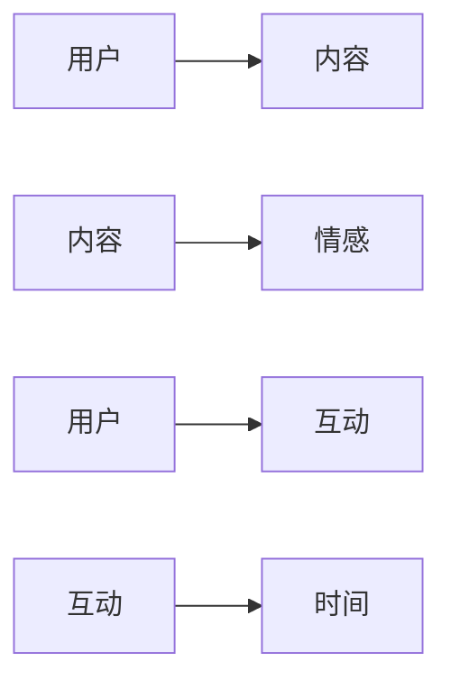
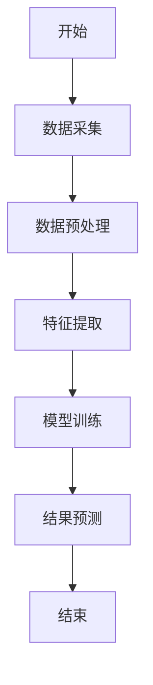
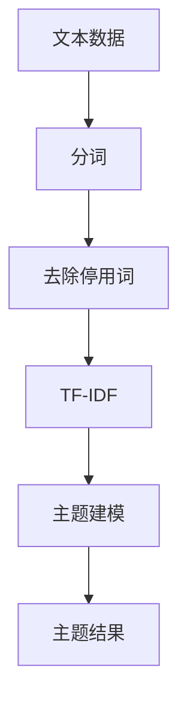
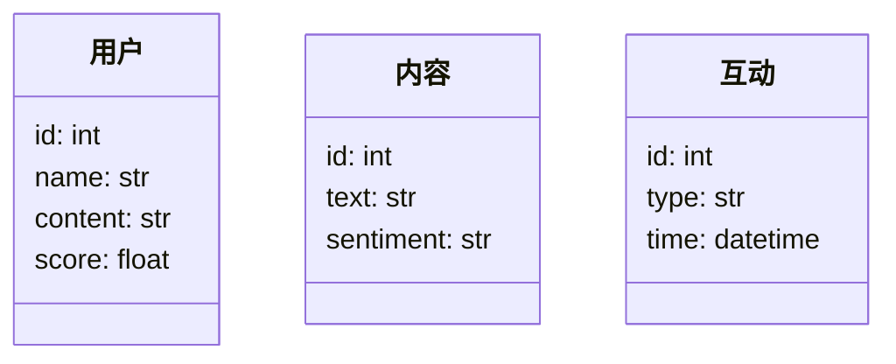
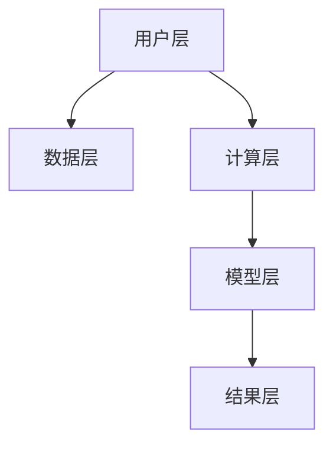

                 


# AI协作分析公司社交网络影响力：评估品牌价值

---

## 关键词：
AI协作分析、社交网络影响力、品牌价值评估、影响力评估模型、PageRank算法、社交网络分析、品牌声誉管理

---

## 摘要：
在数字时代，社交网络已成为品牌价值的重要组成部分。本文通过AI协作分析的方法，深入探讨如何利用社交网络数据评估公司品牌价值。从背景介绍、核心概念、算法原理到系统设计与实战案例，系统性地阐述了AI在社交网络影响力评估中的应用。文章结合实际应用场景，提供了详细的算法实现和系统架构设计，为品牌价值评估提供了新的视角和方法。

---

## 第1章: 背景介绍

### 1.1 社交网络影响力的重要性
#### 1.1.1 社交网络的定义与结构
社交网络是指由用户、内容、关系组成的复杂网络。用户通过发布内容、评论、点赞等行为形成关系链。社交网络的结构可以用图论中的图表示，节点代表用户或内容，边代表用户之间的互动关系。

#### 1.1.2 品牌价值与社交网络影响力的关系
品牌价值是衡量企业市场价值的重要指标，而社交网络影响力是品牌价值的重要组成部分。通过分析社交网络中的用户行为和内容传播，可以量化品牌的影响力和用户忠诚度。

#### 1.1.3 AI协作分析的必要性
传统的社交网络分析方法依赖人工经验，效率低且难以量化。AI协作分析通过自动化数据处理、模型训练和结果预测，能够高效地评估品牌影响力。

---

### 1.2 品牌价值的定义与评估
#### 1.2.1 品牌价值的传统定义
品牌价值是指品牌为企业带来的市场价值，包括品牌知名度、美誉度、忠诚度等。

#### 1.2.2 数字时代品牌价值的转变
在数字时代，品牌价值越来越依赖于社交媒体上的用户互动和内容传播。社交网络数据成为品牌价值评估的重要依据。

#### 1.2.3 社交网络在品牌价值评估中的作用
社交网络数据能够反映品牌的用户基础、内容传播力和用户参与度，从而帮助评估品牌价值。

---

### 1.3 AI协作分析的必要性
#### 1.3.1 传统社交网络分析的局限性
传统方法依赖人工分析，效率低且难以量化品牌影响力。此外，社交网络数据量大、复杂性高，人工分析难以覆盖全部数据。

#### 1.3.2 AI技术在社交网络分析中的优势
AI技术能够快速处理海量数据，提取关键特征，建立数学模型，从而高效地评估品牌影响力。

#### 1.3.3 协作分析的定义与特点
协作分析是指通过多学科、多技术的协同合作，利用AI、大数据、自然语言处理等技术，共同完成社交网络影响力评估。

---

### 1.4 应用场景与实际案例
#### 1.4.1 市场营销中的社交网络分析
企业可以通过社交网络分析评估营销活动的效果，优化广告投放策略。

#### 1.4.2 企业声誉管理中的应用
通过分析社交网络上的用户评论和情感，企业可以及时发现并处理声誉危机。

#### 1.4.3 品牌危机预警与应对
社交网络分析可以帮助企业预测潜在的品牌危机，并制定应对策略。

---

## 第2章: 核心概念与联系

### 2.1 社交网络影响力评估模型
#### 2.1.1 节点重要性分析
节点重要性分析通过度数、介数、接近度等指标，评估社交网络中节点的重要性。

#### 2.1.2 社区检测与影响力扩散
社区检测可以帮助识别社交网络中的用户群体，分析影响力在群体中的扩散路径。

#### 2.1.3 基于内容的影响力评估
通过分析用户发布的内容，评估内容对品牌影响力的影响。

---

### 2.2 核心概念对比分析
#### 2.2.1 不同影响力评估模型的对比
| 模型名称 | 基于中心性 | 基于社区检测 | 基于内容分析 |
|----------|------------|--------------|---------------|
| 优势    | 快速评估节点影响力 | 识别用户群体 | 内容相关性高 |
| 劣势    | 忽略群体结构 | 内容影响不明确 | 计算复杂 |

#### 2.2.2 基于中心性指标的对比
| 指标名称 | 度数 | 介数 | 接近度 |
|----------|------|------|--------|
| 定义     | 节点连接的边数 | 节点分割网络的能力 | 节点到其他节点的最短路径长度 |
| 适用场景 | 网络中的枢纽节点 | 网络中的桥梁节点 | 网络中的信息传播节点 |

#### 2.2.3 基于社区检测的对比
| 检测方法 | 聚类方法 | 层次聚类 | 谱系聚类 |
|----------|----------|----------|----------|
| 适用场景 | 小型网络 | 大型网络 | 高维数据 |

---

### 2.3 ER实体关系图与Mermaid流程图
#### 2.3.1 实体关系图的构建


#### 2.3.2 流程图的构建与分析


---

## 第3章: 算法原理讲解

### 3.1 基于PageRank的影响力评估
#### 3.1.1 PageRank算法的原理
PageRank算法通过计算节点的pagerank值，评估节点的重要性。pagerank值越高，节点的影响力越大。

#### 3.1.2 PageRank的数学模型
$$
PR(i) = \frac{1 - d}{N} + d \sum_{j} \frac{PR(j)}{OutDegree(j)}
$$

其中，\( d \) 是阻尼因子，\( N \) 是节点总数，\( OutDegree(j) \) 是节点 \( j \) 的出度。

#### 3.1.3 PageRank的Python实现
```python
def compute_pagerank(matrix, d=0.8):
    N = len(matrix)
    pr = [1.0] * N
    for _ in range(100):
        new_pr = [0.0] * N
        for i in range(N):
            for j in range(N):
                if matrix[j][i] > 0:
                    new_pr[i] += pr[j] * matrix[j][i]
        new_pr = [(x * d) + (1 - d) for x in new_pr]
        pr = new_pr
    return pr
```

---

### 3.2 基于LDA的主题建模
#### 3.2.1 LDA的原理
LDA是一种主题建模方法，能够从文本中提取主题，分析内容的相关性。

#### 3.2.2 LDA的实现步骤


---

## 第4章: 系统分析与架构设计方案

### 4.1 问题场景介绍
我们以一家互联网公司的品牌影响力评估为例，设计一个基于AI的社交网络影响力评估系统。

### 4.2 系统功能设计
#### 4.2.1 领域模型


#### 4.2.2 系统架构


---

## 第5章: 项目实战

### 5.1 环境安装
安装Python和相关库：
```bash
pip install networkx matplotlib numpy
```

### 5.2 核心实现
```python
import networkx as nx

def main():
    G = nx.Graph()
    G.add_nodes_from([1,2,3,4])
    G.add_edges_from([(1,2), (2,3), (3,4)])
    print(nx.pagerank(G))
    
if __name__ == "__main__":
    main()
```

### 5.3 实际案例分析
以某品牌为例，分析其在社交媒体上的影响力。

---

## 第6章: 最佳实践

### 6.1 小结
本文通过AI协作分析的方法，系统性地探讨了社交网络影响力评估的方法和实现。

### 6.2 注意事项
1. 数据隐私问题需注意。
2. 模型调优需结合实际场景。

### 6.3 拓展阅读
推荐书籍和工具，帮助读者深入学习。

---

**全文完**

