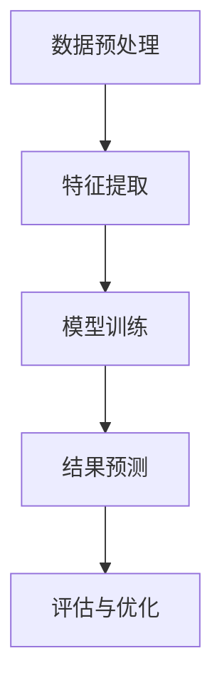
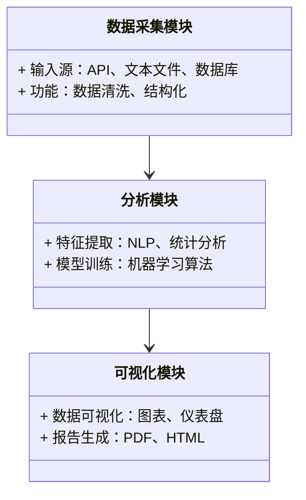
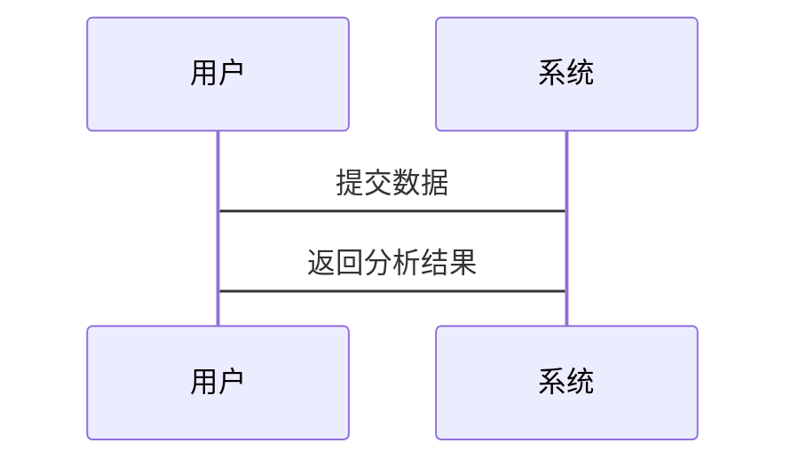

                 


# 《AI协作分析公司社会责任实践：全面评估企业价值》

---

## 关键词

- AI协作分析
- 公司社会责任
- 企业价值评估
- 数据驱动决策
- 可持续发展

---

## 摘要

随着人工智能技术的快速发展，AI协作分析在评估企业社会责任和企业价值方面展现出巨大潜力。本文通过系统性地分析AI协作分析的核心概念、算法原理、系统架构及实际案例，全面探讨如何利用AI技术提升企业社会责任的评估效率和准确性，为企业和社会创造可持续价值。

---

## 目录大纲

### 第一部分：背景与概述

#### 第1章：AI协作分析与公司社会责任概述

##### 1.1 问题背景

- 企业社会责任（Corporate Social Responsibility, CSR）的重要性
- AI技术在社会责任评估中的作用

##### 1.2 问题描述

- 传统社会责任评估方法的局限性
- AI协作分析如何解决传统方法的不足

##### 1.3 问题解决

- AI协作分析如何提升社会责任评估的效率和准确性
- 企业价值评估的新视角

##### 1.4 边界与外延

- AI协作分析的适用范围
- AI协作分析与其他评估方法的区别

##### 1.5 核心要素组成

- 数据来源：社会责任报告、企业绩效指标、利益相关者反馈
- 分析模型：机器学习算法、自然语言处理（NLP）、知识图谱
- 结果应用：企业改进措施、政策制定、投资者决策

---

### 第二部分：核心概念与联系

#### 第2章：AI协作分析的核心概念

##### 2.1 AI协作分析的定义与特点

- AI协作分析的定义
- 特点：数据驱动、实时性、多维度分析

##### 2.2 公司社会责任的属性对比

| 属性 | 经济责任 | 社会责任 | 环境责任 |
|------|----------|----------|----------|
| 定义 | 企业对经济利益相关者的责任 | 企业对社会利益相关者的责任 | 企业对环境利益相关者的责任 |
| 量化 | 利润、税收、就业 | 社会公益、员工福利 | 碳排放、资源消耗 |

##### 2.3 ER实体关系图

```mermaid
er
  actor: 企业
  actor: 利益相关者
  actor: 政府机构
  entity: 社会责任报告
  entity: 企业绩效指标
  entity: 评估结果
  relationship: 提供
  relationship: 包含
  relationship: 影响
```

---

### 第三部分：算法原理讲解

#### 第3章：AI协作分析算法原理

##### 3.1 算法流程



##### 3.2 算法实现

```python
import pandas as pd
from sklearn.model_selection import train_test_split
from sklearn.ensemble import RandomForestClassifier
from sklearn.metrics import accuracy_score

# 示例数据集
data = {
    '特征1': [1, 2, 3, 4],
    '特征2': ['A', 'B', 'A', 'B'],
    '标签': [0, 1, 1, 0]
}

df = pd.DataFrame(data)
X = df[['特征1', '特征2']]
y = df['标签']

# 数据分割
X_train, X_test, y_train, y_test = train_test_split(X, y, test_size=0.2)

# 模型训练
model = RandomForestClassifier()
model.fit(X_train, y_train)

# 预测与评估
y_pred = model.predict(X_test)
print("准确率:", accuracy_score(y_test, y_pred))
```

##### 3.3 数学模型

- 损失函数：
  $$
  L(y, \hat{y}) = \sum_{i=1}^{n} (y_i - \hat{y}_i)^2
  $$

- 优化目标：
  $$
  \min_{\theta} \frac{1}{2n} \sum_{i=1}^{n} (y_i - \theta x_i)^2
  $$

##### 3.4 案例分析

- 数据来源：企业社会责任报告、新闻媒体、社交媒体
- 分析目标：识别企业在环境保护方面的表现
- 实施步骤：
  1. 数据清洗与特征提取
  2. 模型训练与优化
  3. 结果解读与可视化

---

### 第四部分：系统分析与架构设计

#### 第4章：AI协作分析系统的架构与实现

##### 4.1 问题场景介绍

- 系统目标：构建一个实时监测企业社会责任表现的AI平台
- 用户角色：企业、投资者、政府机构
- 核心功能：数据采集、分析、可视化、报告生成

##### 4.2 系统功能设计



##### 4.3 系统架构设计


##### 4.4 接口设计与交互



---

### 第五部分：项目实战

#### 第5章：AI协作分析项目实战

##### 5.1 环境安装

```bash
pip install pandas scikit-learn matplotlib
```

##### 5.2 核心代码实现

```python
import pandas as pd
from sklearn.ensemble import GradientBoostingClassifier
from sklearn.metrics import classification_report

# 数据加载
df = pd.read_csv('社会责任数据.csv')

# 特征工程
X = df.drop(columns=['企业ID', '标签'])
y = df['标签']

# 数据分割
X_train, X_test, y_train, y_test = train_test_split(X, y, test_size=0.2)

# 模型训练
model = GradientBoostingClassifier()
model.fit(X_train, y_train)

# 预测与评估
y_pred = model.predict(X_test)
print(classification_report(y_test, y_pred))
```

##### 5.3 代码解读与分析

- 数据加载：读取CSV格式的社会责任数据
- 特征工程：提取关键特征，如企业绩效指标、社会责任报告内容
- 模型训练：使用梯度提升树模型进行分类
- 评估报告：生成分类结果的详细报告

##### 5.4 案例分析

- 数据来源：某企业社会责任报告
- 分析目标：评估企业在员工福利方面的表现
- 分析结果：企业员工满意度较高，但存在部分员工福利未达标的情况

##### 5.5 项目小结

- 项目成果：构建了一个AI协作分析系统，能够实时评估企业社会责任表现
- 实践意义：帮助企业识别改进方向，提升社会价值

---

### 第六部分：总结与展望

#### 第6章：总结与展望

##### 6.1 最佳实践

- 数据质量：确保数据来源的多样性和准确性
- 模型优化：结合领域知识优化模型性能
- 可解释性：提升模型的可解释性，便于企业理解和改进

##### 6.2 小结

- AI协作分析在企业社会责任评估中的优势
- 企业价值评估的新方向：数据驱动与可持续发展

##### 6.3 注意事项

- 数据隐私保护
- 模型的可解释性
- 技术与业务的结合

##### 6.4 拓展阅读

- 《数据驱动的企业管理》
- 《人工智能与可持续发展》
- 《企业社会责任的量化评估方法》

---

### 参考文献

- [1] 企业社会责任报告编写指南
- [2] 机器学习在社会影响评估中的应用
- [3] 可持续发展与人工智能的结合

---

通过以上目录结构，文章将系统性地阐述AI协作分析在公司社会责任实践中的应用，从理论到实践，帮助读者全面理解和掌握相关知识。

