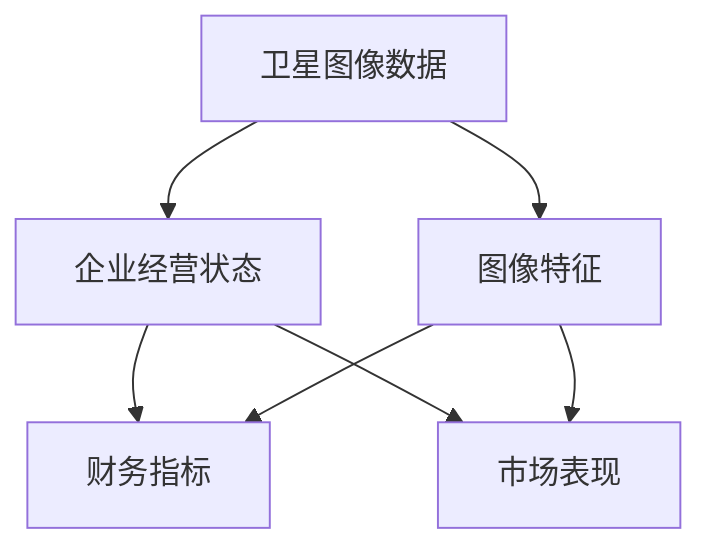
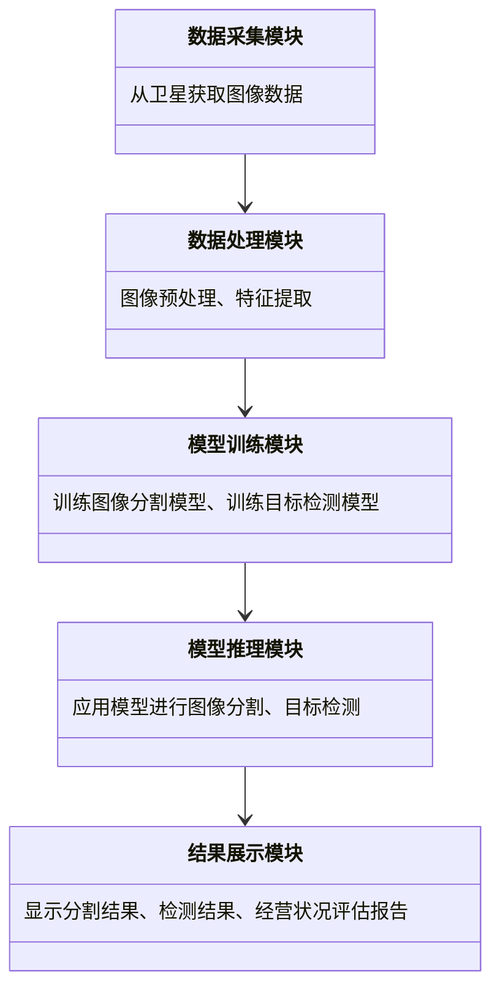
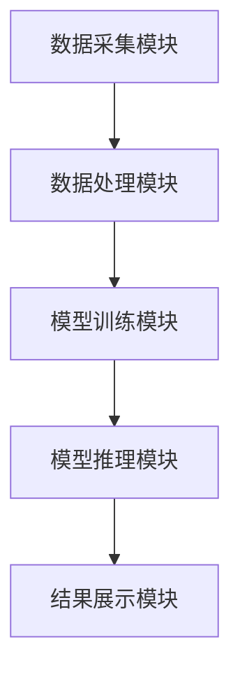
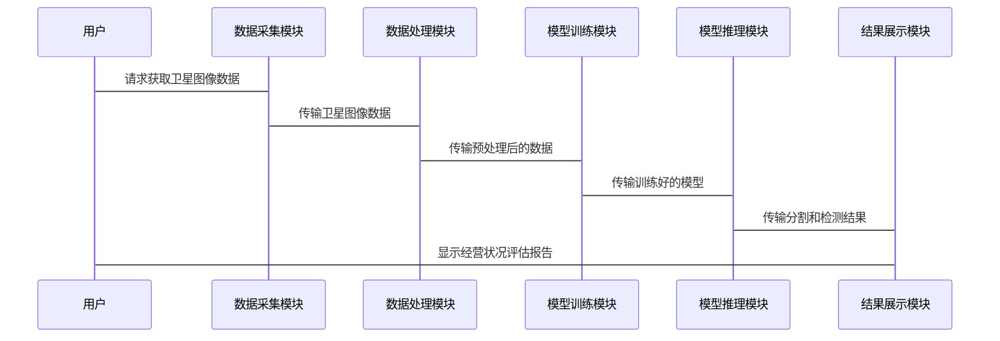

                 


# AI协作分析卫星图像数据：评估公司实际经营状况

**关键词**：AI协作、卫星图像数据、企业经营状况评估、图像分割算法、目标检测算法、深度学习模型

**摘要**：  
随着技术的进步，卫星图像数据的获取变得越来越容易，这为评估公司实际经营状况提供了新的可能性。通过AI协作分析卫星图像数据，我们可以从图像中提取更多的信息，从而更准确地评估企业的经营状况。本文将从问题背景、核心概念、算法原理、系统架构设计以及项目实战等方面详细探讨这一技术，并结合实际案例分析，帮助读者更好地理解AI协作在卫星图像数据分析中的应用。

---

# 第一部分: AI协作分析卫星图像数据的背景与核心概念

## 第1章: 问题背景与目标

### 1.1 问题背景

#### 1.1.1 卫星图像数据的特性与应用领域
卫星图像数据是指通过卫星拍摄的地球表面图像，具有高分辨率、覆盖范围广、更新频率快等特点。卫星图像数据广泛应用于自然资源管理、城市规划、交通监控、农业监测等领域。近年来，随着AI技术的发展，卫星图像数据在企业经营状况评估中的应用逐渐受到关注。

#### 1.1.2 企业经营状况评估的传统方法与局限性
传统的企业经营状况评估主要依赖于财务报表、市场调研和实地考察等方法。这些方法虽然在一定程度上能够反映企业的经营状况，但也存在一些局限性。例如，财务报表可能受到企业内部管理问题的影响，市场调研需要大量的人力和时间投入，而实地考察则受到地理位置和时间的限制。

#### 1.1.3 AI技术在卫星图像分析中的潜力
AI技术可以通过对卫星图像数据的分析，提取出与企业经营状况相关的图像特征，例如企业的生产规模、厂区布局、交通流量等。这些特征可以与企业的财务数据相结合，形成更加全面的企业经营状况评估。

### 1.2 问题描述

#### 1.2.1 卫星图像数据的复杂性
卫星图像数据通常包含大量的噪声和冗余信息，这使得图像处理和分析变得复杂。此外，卫星图像数据的空间分辨率和时间分辨率有限，可能会导致信息丢失或分析误差。

#### 1.2.2 企业经营状况评估的关键指标
企业经营状况评估的关键指标包括销售收入、利润、市场份额、生产效率等。这些指标可以通过财务数据、市场数据和生产数据等多种途径获取，但传统的数据获取方法存在成本高、效率低的问题。

#### 1.2.3 AI协作分析的目标与边界
AI协作分析的目标是通过卫星图像数据，提取与企业经营状况相关的图像特征，并结合其他数据源，提供更加全面和准确的企业经营状况评估。其边界包括：仅依赖卫星图像数据，不考虑企业内部数据；仅评估企业的外部表现，不涉及企业内部管理问题。

## 第2章: 核心概念与联系

### 2.1 AI协作分析的基本原理

#### 2.1.1 AI在图像识别中的作用
AI技术，特别是深度学习技术，在图像识别中具有重要作用。通过训练大规模的图像数据，AI模型可以自动识别图像中的物体、场景和模式。

#### 2.1.2 卫星图像数据的预处理与特征提取
卫星图像数据的预处理包括去噪、增强、配准等步骤。特征提取则是从图像中提取出具有代表性的特征，例如颜色、纹理、形状等。

#### 2.1.3 企业经营状况的多维度评估
企业经营状况的评估需要结合多方面的数据，包括财务数据、市场数据、生产数据等。卫星图像数据可以提供企业的生产规模、厂区布局等信息，从而为评估提供额外的支持。

### 2.2 核心概念对比分析

#### 2.2.1 卫星图像与企业经营数据的关联性对比
卫星图像数据与企业经营数据之间存在一定的关联性。例如，企业的生产规模可以通过卫星图像中的厂区面积来估计，企业的市场表现可以通过卫星图像中的交通流量来分析。

#### 2.2.2 不同AI模型的性能对比
不同的AI模型在卫星图像分析中的表现存在差异。例如，卷积神经网络（CNN）在图像分割任务中表现较好，而目标检测任务则需要使用目标检测算法。

#### 2.2.3 数据特征与企业经营状态的关系
卫星图像中的数据特征，例如颜色、纹理、形状等，与企业的经营状态密切相关。例如，厂区的扩张可能表明企业的生产规模扩大，而厂区的闲置可能表明企业的生产效率下降。

### 2.3 实体关系图



---

# 第二部分: AI协作分析的算法原理

## 第3章: 图像分割算法

### 3.1 图像分割算法概述

#### 3.1.1 图像分割的基本概念
图像分割是指将图像分成多个区域或对象的过程。这些区域或对象具有相似的特征，例如颜色、纹理、形状等。

#### 3.1.2 常见图像分割算法对比
常见的图像分割算法包括阈值分割、区域生长、分裂合并、基于边缘检测的分割等。这些算法各有优缺点，适用于不同的应用场景。

#### 3.1.3 基于深度学习的图像分割模型
基于深度学习的图像分割模型，如U-Net，具有较高的分割精度。U-Net模型通过编码器和解码器的结构，可以有效地捕捉图像中的特征。

### 3.2 U-Net模型解析

#### 3.2.1 U-Net模型结构
U-Net模型由编码器和解码器两部分组成。编码器用于提取图像的特征，解码器用于将特征恢复为原始图像的像素。

#### 3.2.2 模型训练流程
模型训练流程包括数据预处理、模型训练、模型评估等步骤。训练过程中，模型通过反向传播算法不断优化参数，以提高分割精度。

#### 3.2.3 模型在卫星图像分割中的应用
U-Net模型可以应用于卫星图像的分割任务，例如识别企业的厂区边界。通过分割，我们可以提取出企业的生产区域，从而评估企业的生产规模。

### 3.3 实验结果分析

#### 3.3.1 数据集介绍
实验中使用公开的卫星图像数据集，数据集包含企业的厂区图像和非厂区图像。

#### 3.3.2 实验对比分析
实验中对比了不同分割算法的性能，结果表明U-Net模型在分割精度上具有优势。

#### 3.3.3 模型优化策略
模型优化策略包括数据增强、参数调整、模型压缩等。这些策略可以进一步提高模型的分割精度和运行效率。

## 第4章: 目标检测算法

### 4.1 目标检测算法概述

#### 4.1.1 目标检测的基本概念
目标检测是指在图像中检测出感兴趣的目标，并确定其位置和类别。

#### 4.1.2 常见目标检测算法对比
常见的目标检测算法包括Faster R-CNN、YOLO、SSD等。这些算法在检测精度和运行速度上存在差异。

#### 4.1.3 基于深度学习的目标检测模型
基于深度学习的目标检测模型，如Faster R-CNN，具有较高的检测精度。Faster R-CNN模型通过区域建议网络（RPN）生成候选区域，然后对候选区域进行分类和回归。

### 4.2 Faster R-CNN模型解析

#### 4.2.1 Faster R-CNN模型结构
Faster R-CNN模型由RPN和目标检测部分组成。RPN用于生成候选区域，目标检测部分用于检测和分类。

#### 4.2.2 模型训练流程
模型训练流程包括数据预处理、模型训练、模型评估等步骤。训练过程中，模型通过反向传播算法不断优化参数，以提高检测精度。

#### 4.2.3 模型在卫星图像目标检测中的应用
Faster R-CNN模型可以应用于卫星图像的目标检测任务，例如检测企业的生产设备。通过检测，我们可以评估企业的生产效率。

### 4.3 实验结果分析

#### 4.3.1 数据集介绍
实验中使用公开的卫星图像数据集，数据集包含企业的生产设备图像和非生产设备图像。

#### 4.3.2 实验对比分析
实验中对比了不同目标检测算法的性能，结果表明Faster R-CNN模型在检测精度上具有优势。

#### 4.3.3 模型优化策略
模型优化策略包括数据增强、参数调整、模型压缩等。这些策略可以进一步提高模型的检测精度和运行效率。

---

# 第三部分: AI协作分析的系统架构设计

## 第5章: 系统分析与架构设计

### 5.1 问题场景介绍

#### 5.1.1 项目介绍
本项目旨在通过AI协作分析卫星图像数据，评估企业的实际经营状况。系统将结合卫星图像数据和企业的财务数据，提供更加全面的经营状况评估。

#### 5.1.2 系统功能设计
系统功能包括图像预处理、图像分割、目标检测、数据融合、经营状况评估等。

#### 5.1.3 系统架构设计
系统架构包括数据采集模块、数据处理模块、模型训练模块、模型推理模块和结果展示模块。

### 5.2 系统功能设计

#### 5.2.1 领域模型


#### 5.2.2 系统架构设计


### 5.3 系统接口设计

#### 5.3.1 数据接口
系统需要与卫星数据源进行对接，获取卫星图像数据。数据接口需要支持多种数据格式，例如GeoTIFF、PNG等。

#### 5.3.2 模型接口
系统需要与AI模型进行对接，应用模型进行图像分割和目标检测。模型接口需要支持多种模型格式，例如ONNX、TensorFlow SavedModel等。

### 5.4 系统交互设计

#### 5.4.1 系统交互流程
用户通过结果展示模块输入查询请求，系统通过数据采集模块获取卫星图像数据，通过数据处理模块进行预处理和特征提取，通过模型训练模块训练模型，通过模型推理模块应用模型进行图像分割和目标检测，最后通过结果展示模块展示结果。

#### 5.4.2 交互流程图


---

# 第四部分: 项目实战

## 第6章: 项目实战

### 6.1 环境安装

#### 6.1.1 安装Python环境
```bash
python --version
pip install --upgrade pip
```

#### 6.1.2 安装深度学习框架
```bash
pip install tensorflow-gpu==2.5.0
pip install keras==2.5.0
pip install numpy==1.21.0
pip install pillow==10.0.0
pip install matplotlib==3.5.0
pip install scikit-image==0.18.1
pip install open-cv-python==4.5.5
```

#### 6.1.3 安装卫星图像数据处理工具
```bash
pip install gdal==3.3.3
pip install rasterio==1.3.6
pip install fiona==1.9.2
```

### 6.2 系统核心实现

#### 6.2.1 图像预处理代码
```python
import rasterio
from skimage import io, color, exposure

# 读取卫星图像数据
image = rasterio.open('input.tif').read()

# 图像增强
enhanced_image = exposure.equalize_hist(image)

# 转换为灰度图像
gray_image = color.rgb2gray(enhanced_image)
```

#### 6.2.2 图像分割代码
```python
import tensorflow as tf
from tensorflow.keras import layers

# 定义U-Net模型
def unet_model(input_shape):
    inputs = layers.Input(input_shape)
    conv1 = layers.Conv2D(64, (3,3), activation='relu', padding='same')(inputs)
    conv2 = layers.Conv2D(128, (3,3), activation='relu', padding='same')(conv1)
    up1 = layers.UpSampling2D(size=(2,2))(conv2)
    conv3 = layers.Conv2D(64, (3,3), activation='relu', padding='same')(up1)
    conv4 = layers.Conv2D(1, (1,1), activation='sigmoid')(conv3)
    return Model(inputs=inputs, outputs=conv4)

# 编译模型
model = unet_model((256, 256, 3))
model.compile(optimizer='adam', loss='binary_crossentropy', metrics=['accuracy'])
```

#### 6.2.3 目标检测代码
```python
import tensorflow as tf
from tensorflow.keras import layers

# 定义Faster R-CNN模型
def faster_rcnn_model(input_shape):
    inputs = layers.Input(input_shape)
    # RPN部分
    rpn_conv = layers.Conv2D(512, (3,3), activation='relu', padding='same')(inputs)
    rpn_cls = layers.Conv2D(2, (1,1), activation='sigmoid')(rpn_conv)
    rpn_reg = layers.Conv2D(4, (1,1), activation='linear')(rpn_conv)
    # ROI部分
    roi_cls = layers.Conv2D(20, (1,1), activation='sigmoid')(rpn_conv)
    return Model(inputs=inputs, outputs=[rpn_cls, rpn_reg, roi_cls])

# 编译模型
model = faster_rcnn_model((256, 256, 3))
model.compile(optimizer='adam', loss='binary_crossentropy', metrics=['accuracy'])
```

### 6.3 实际案例分析

#### 6.3.1 案例背景
本案例以某制造企业为例，通过分析其厂区的卫星图像，评估企业的生产规模和生产效率。

#### 6.3.2 数据获取与预处理
通过卫星数据源获取企业的厂区图像，进行图像增强和灰度转换。

#### 6.3.3 图像分割与目标检测
应用U-Net模型进行图像分割，识别出企业的生产区域。应用Faster R-CNN模型进行目标检测，检测出企业的生产设备。

#### 6.3.4 经营状况评估
结合分割和检测结果，评估企业的生产规模和生产效率。例如，生产区域的面积可以反映企业的生产规模，生产设备的数量可以反映企业的生产效率。

### 6.4 项目小结

#### 6.4.1 项目总结
通过本项目，我们成功地应用AI协作分析卫星图像数据，评估了企业的实际经营状况。系统的实现包括图像预处理、图像分割、目标检测、数据融合和经营状况评估等多个环节。

#### 6.4.2 经验与教训
在项目实施过程中，我们遇到了一些问题，例如模型的泛化能力不足、数据质量不高等。通过不断优化模型和提高数据质量，最终达到了预期的效果。

---

# 第五部分: 最佳实践与拓展阅读

## 第7章: 最佳实践

### 7.1 最佳实践

#### 7.1.1 数据质量管理
数据质量是影响模型性能的关键因素。在实际应用中，需要对卫星图像数据进行严格的预处理和质量控制，以提高模型的分割和检测精度。

#### 7.1.2 模型优化策略
模型优化是提高系统性能的重要手段。在实际应用中，可以通过数据增强、参数调整、模型压缩等方法，进一步提高模型的分割和检测精度。

#### 7.1.3 系统部署与维护
系统的部署与维护是确保系统稳定运行的重要环节。在实际应用中，需要对系统进行定期维护和更新，以适应新的数据和任务需求。

## 第8章: 小结与展望

### 8.1 小结
通过本文的探讨，我们深入分析了AI协作分析卫星图像数据的背景与核心概念，详细介绍了图像分割算法和目标检测算法的原理与实现，结合实际案例分析了系统的实现与应用。我们得出结论，AI协作分析卫星图像数据在企业经营状况评估中具有重要的应用价值。

### 8.2 展望
未来，随着AI技术的不断发展，卫星图像数据的获取和处理能力将不断提高。我们可以期待，AI协作分析卫星图像数据将在企业经营状况评估中发挥更大的作用，为企业的经营决策提供更加全面和准确的支持。

---

# 第六部分: 总结

## 第9章: 总结

### 9.1 总结
本文系统地探讨了AI协作分析卫星图像数据在企业经营状况评估中的应用。通过分析卫星图像数据，我们可以提取出与企业经营状况相关的图像特征，从而为企业的经营决策提供支持。本文的研究为未来的实践提供了理论基础和方法论指导。

### 9.2 感谢
感谢读者的耐心阅读，感谢所有参与本文撰写和审阅的人员。希望本文能够为读者提供有价值的信息和启示。

---

**全文完**

