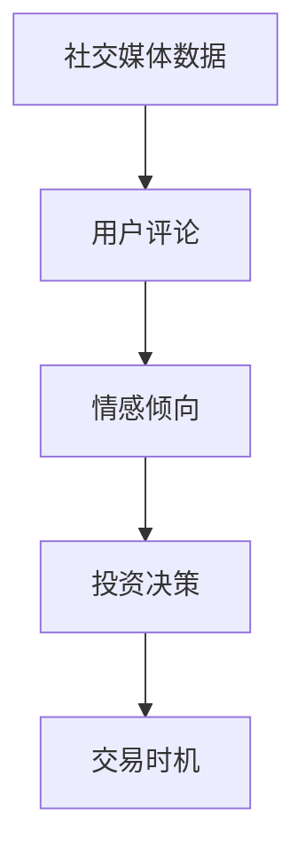
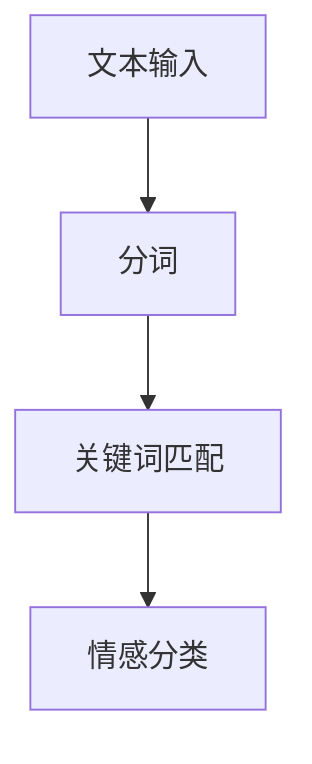
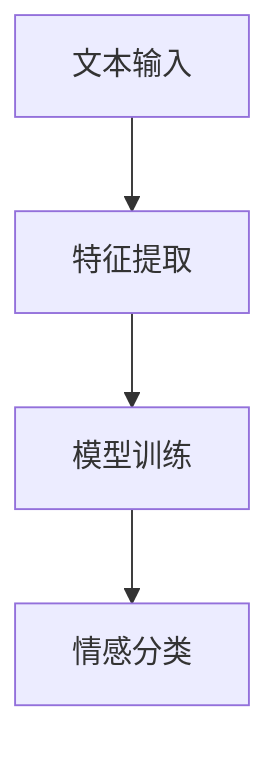
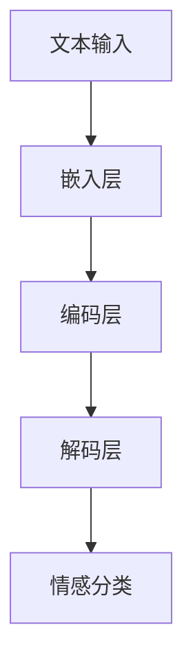
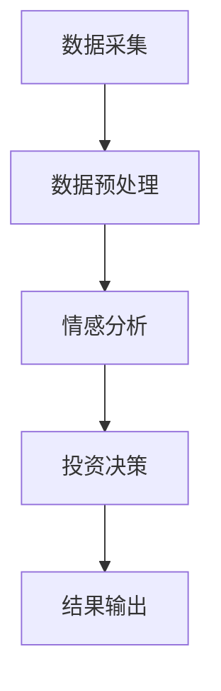
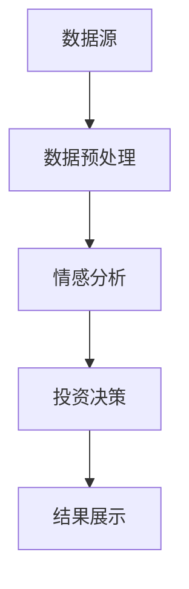
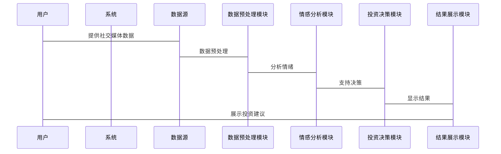
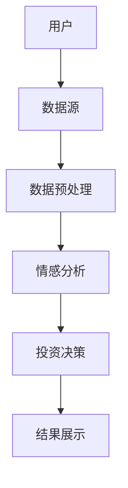
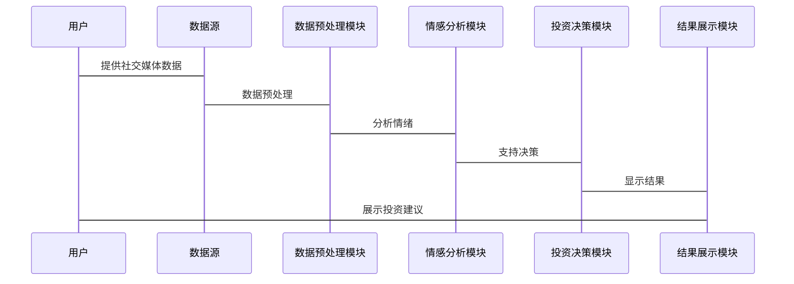

                 


# AI协作分析社交媒体情绪：增强价值投资的时机选择

## 关键词：社交媒体情绪分析，人工智能，价值投资，情绪计算，投资决策优化，机器学习

## 摘要：社交媒体情绪分析是利用人工智能技术从社交媒体数据中提取情感倾向，通过分析投资者情绪来优化投资决策的重要手段。本文系统阐述了如何利用AI协作分析社交媒体情绪，揭示其在价值投资时机选择中的潜在价值和应用方法。从理论到实践，从算法到系统，深入探讨了社交媒体情绪分析的核心原理、技术实现、系统架构和实际案例，帮助读者全面掌握这一技术的精髓。

---

# 第1章: 背景介绍与核心概念

## 1.1 问题背景

### 1.1.1 社会媒体情绪分析的定义
社交媒体情绪分析是指利用自然语言处理和机器学习技术，从社交媒体文本中提取情感倾向、情绪强度和情绪类型的过程。通过分析用户在社交媒体上的评论、帖子和互动行为，可以量化市场参与者的集体情绪状态。

### 1.1.2 社会媒体情绪分析的重要性
社交媒体数据具有实时性、海量性和多样性，能够反映市场参与者的真实情绪。通过分析这些情绪数据，投资者可以更准确地预测市场走势，优化投资决策。

### 1.1.3 情绪分析与投资决策的关系
投资者情绪直接影响市场行为，而社交媒体作为信息传播的重要渠道，能够快速反映市场参与者的集体情绪。通过分析社交媒体情绪，投资者可以更好地把握市场趋势，找到投资机会。

## 1.2 问题描述

### 1.2.1 投资者情绪对市场的影响
投资者情绪是影响市场波动的重要因素。例如，市场恐慌情绪的蔓延可能导致股价暴跌，而乐观情绪的高涨则可能推动股价上涨。

### 1.2.2 社会媒体数据的特征与挑战
社交媒体数据具有非结构化、情感丰富和噪声多的特点，这使得情绪分析具有一定的难度。例如，用户评论可能包含 slang、表情符号和拼写错误，这些都需要在预处理阶段进行处理。

### 1.2.3 情绪分析在投资中的应用场景
情绪分析可以用于实时监控市场情绪、预测市场走势、识别市场拐点和评估投资风险。例如，当社交媒体上的情绪从乐观转向悲观时，投资者可以考虑减少仓位。

## 1.3 问题解决

### 1.3.1 情绪分析的技术实现
通过自然语言处理和机器学习技术，可以实现对社交媒体文本的情感分析。常用的方法包括基于规则的分析、机器学习模型和深度学习模型。

### 1.3.2 通过AI协作优化情绪分析
AI协作可以提高情绪分析的准确性和效率。例如，可以利用分布式计算和并行处理技术，快速处理海量社交媒体数据。

### 1.3.3 情绪分析结果对投资决策的支持
情绪分析结果可以作为投资决策的重要参考。例如，当市场情绪过于乐观时，投资者可以警惕潜在的回调风险。

## 1.4 边界与外延

### 1.4.1 情绪分析的边界条件
情绪分析的准确性受到数据质量、模型复杂性和计算能力的限制。例如，短小精悍的评论可能难以准确捕捉情绪。

### 1.4.2 情绪分析的外延领域
情绪分析可以扩展到其他领域，如舆情监控、品牌管理、客户服务等。例如，企业可以通过分析社交媒体情绪，评估品牌形象和客户满意度。

### 1.4.3 与投资决策的其他因素的关系
投资决策不仅受到情绪影响，还受到基本面分析、技术分析和市场环境的影响。因此，情绪分析只是投资决策的一部分。

## 1.5 核心概念结构

### 1.5.1 情绪分析的核心要素
情绪分析的核心要素包括文本数据、情感倾向、情绪强度和情绪类型。例如，文本数据是输入，情感倾向是输出，情绪强度是情感的量化指标。

### 1.5.2 投资决策的核心要素
投资决策的核心要素包括市场趋势、公司基本面、技术指标和投资者情绪。例如，市场趋势是外部因素，投资者情绪是内部因素。

### 1.5.3 两者的关联与协同
情绪分析通过量化投资者情绪，为投资决策提供支持。例如，当市场情绪过于乐观时，投资者可以考虑减少风险敞口。

---

# 第2章: 核心概念与联系

## 2.1 情绪分析的核心原理

### 2.1.1 基于规则的分析方法
基于规则的方法通过预定义的关键词和情感词典，对文本进行情感分类。例如，如果文本中包含“利好”、“上涨”等关键词，可以判断为积极情绪。

### 2.1.2 机器学习模型的应用
机器学习模型如支持向量机（SVM）和随机森林（Random Forest）可以自动学习情感特征，进行情感分类。例如，可以将文本向量化，训练分类器进行分类。

### 2.1.3 深度学习模型的优势
深度学习模型如长短期记忆网络（LSTM）和变换器（Transformer）可以捕捉文本的上下文信息，提高情感分析的准确性。例如，BERT模型可以进行情感分析任务。

## 2.2 情绪维度与分类

### 2.2.1 情绪维度的定义
情绪维度包括情感极性（积极、消极、中性）和情感强度（从0到1的值）。例如，评论“这个股票真好”可能被分类为积极情绪，强度为0.9。

### 2.2.2 情绪分类的层次结构
情绪分类可以分为二分类（积极/消极）和多分类（积极、消极、中性）。例如，可以将评论分为积极、消极或中性三类。

### 2.2.3 不同情绪对投资的影响
积极情绪可能推动股价上涨，而消极情绪可能导致股价下跌。例如，市场情绪从积极转向消极时，可能预示着市场调整。

## 2.3 情绪分析与投资决策的联系

### 2.3.1 情绪数据的特征提取
特征提取是将文本数据转换为情感特征的过程。例如，可以提取情感词袋模型、TF-IDF特征或词嵌入。

### 2.3.2 情绪分析结果的量化
情绪分析结果可以用情感得分（如-1到1）或情感类别表示。例如，情感得分为0.8表示积极情绪，得分为-0.5表示消极情绪。

### 2.3.3 情绪数据对投资时机的影响
情绪数据可以帮助投资者判断市场情绪，优化投资时机。例如，当市场情绪过热时，投资者可以考虑减少头寸。

## 2.4 核心概念属性对比

### 2.4.1 情绪分析与文本挖掘的对比
文本挖掘关注从文本中提取有用信息，而情绪分析专注于情感倾向的识别。例如，文本挖掘可以提取关键词，而情绪分析可以识别情感。

### 2.4.2 情绪分析与市场预测的对比
情绪分析关注情感数据，而市场预测关注价格走势。例如，情绪分析可以为市场预测提供情感数据支持。

### 2.4.3 不同情绪分析方法的优缺点
基于规则的方法简单但准确率低，机器学习模型准确率高但需要大量标注数据，深度学习模型准确率高但计算复杂。

## 2.5 ER实体关系图



---

# 第3章: 算法原理与实现

## 3.1 情绪分析算法原理

### 3.1.1 基于规则的分析方法



### 3.1.2 机器学习模型的应用



### 3.1.3 深度学习模型的优势



### 3.1.4 情感分析的数学模型

$$
\text{预测概率} = \frac{1}{1 + e^{- (w \cdot x + b)}}
$$

其中，\(w\) 是权重向量，\(x\) 是输入特征，\(b\) 是偏置项。

## 3.2 情感分析的Python实现

### 3.2.1 环境安装
```python
pip install numpy pandas scikit-learn transformers
```

### 3.2.2 数据预处理
```python
import pandas as pd
from transformers import pipeline

text_classifier = pipeline("sentiment-analysis")
```

### 3.2.3 情感分析
```python
result = text_classifier("这个股票真好！")
print(result)  # 输出：[{'label': 'POSITIVE', 'score': 0.95}]
```

### 3.2.4 结果应用
```python
from sklearn.linear_model import LogisticRegression

# 训练情感分类模型
model = LogisticRegression()
model.fit(X_train, y_train)

# 预测情感倾向
y_pred = model.predict(X_test)
```

## 3.3 情感分析的数学模型

### 3.3.1 特征提取
$$
x_i = \text{TF-IDF}(t_i)
$$

其中，\(t_i\) 是第 \(i\) 个词的TF-IDF值。

### 3.3.2 分类器设计
$$
P(y=1|x) = \frac{e^{w \cdot x}}{1 + e^{w \cdot x}}
$$

其中，\(w\) 是权重向量，\(x\) 是输入特征。

### 3.3.3 情感预测
$$
y = \text{sign}(w \cdot x + b)
$$

其中，\(y\) 是情感标签（1为积极，-1为消极），\(x\) 是输入特征，\(w\) 是权重向量，\(b\) 是偏置项。

## 3.4 情感分析的优化策略

### 3.4.1 数据增强
通过数据增强技术，如同义词替换和句式变化，提高模型的泛化能力。

### 3.4.2 模型集成
通过集成学习，如投票和加权平均，提高情感分析的准确性和稳定性。

### 3.4.3 实时监控
通过实时数据流处理，及时捕捉市场情绪变化，优化投资决策。

---

# 第4章: 数学模型与公式

## 4.1 情感分析的数学模型

### 4.1.1 特征提取

$$
x_i = \text{TF-IDF}(t_i)
$$

其中，\(t_i\) 是第 \(i\) 个词的TF-IDF值。

### 4.1.2 分类器设计

$$
P(y=1|x) = \frac{e^{w \cdot x}}{1 + e^{w \cdot x}}
$$

其中，\(w\) 是权重向量，\(x\) 是输入特征。

### 4.1.3 情感预测

$$
y = \text{sign}(w \cdot x + b)
$$

其中，\(y\) 是情感标签（1为积极，-1为消极），\(x\) 是输入特征，\(w\) 是权重向量，\(b\) 是偏置项。

---

# 第5章: 系统分析与架构设计

## 5.1 问题场景介绍

### 5.1.1 问题背景
社交媒体情绪分析可以帮助投资者实时监控市场情绪，优化投资决策。

### 5.1.2 项目介绍
本项目旨在构建一个基于AI的社交媒体情绪分析系统，支持投资者进行价值投资。

## 5.2 系统功能设计

### 5.2.1 领域模型


### 5.2.2 系统架构



## 5.3 系统架构设计

### 5.3.1 系统架构图



### 5.3.2 系统交互流程



## 5.4 系统接口设计

### 5.4.1 数据接口
定义数据接口，如API接口，用于数据采集和传输。

### 5.4.2 情感分析接口
定义情感分析接口，如API接口，用于情感分析模块调用。

### 5.4.3 投资决策接口
定义投资决策接口，如API接口，用于投资决策模块调用。

## 5.5 系统交互流程

### 5.5.1 数据流



### 5.5.2 交互流程



---

# 第6章: 项目实战

## 6.1 环境安装

### 6.1.1 安装Python环境
```bash
python --version
pip install --upgrade pip
```

### 6.1.2 安装依赖库
```bash
pip install numpy pandas scikit-learn transformers
```

## 6.2 系统核心实现

### 6.2.1 数据预处理

```python
import pandas as pd

df = pd.read_csv('comments.csv')
df['text'] = df['text'].apply(lambda x: x.lower())
df['text'] = df['text'].apply(lambda x: x.replace(' ', ''))
```

### 6.2.2 情感分析

```python
from transformers import pipeline

text_classifier = pipeline("sentiment-analysis")
result = text_classifier("这个股票真好！")
print(result)  # 输出：[{'label': 'POSITIVE', 'score': 0.95}]
```

### 6.2.3 投资决策

```python
from sklearn.linear_model import LogisticRegression

model = LogisticRegression()
model.fit(X_train, y_train)
y_pred = model.predict(X_test)
```

## 6.3 代码应用解读与分析

### 6.3.1 数据预处理代码
```python
import pandas as pd

def preprocess(text):
    text = text.lower()
    text = text.replace(' ', '')
    return text

df = pd.read_csv('comments.csv')
df['text'] = df['text'].apply(preprocess)
```

### 6.3.2 情感分析代码
```python
from transformers import pipeline

text_classifier = pipeline("sentiment-analysis")
result = text_classifier("这个股票真好！")
print(result)
```

### 6.3.3 投资决策代码
```python
from sklearn.linear_model import LogisticRegression

model = LogisticRegression()
model.fit(X_train, y_train)
y_pred = model.predict(X_test)
```

## 6.4 实际案例分析

### 6.4.1 案例背景
假设我们有某只股票的社交媒体评论数据，希望通过分析评论情绪，优化投资决策。

### 6.4.2 数据收集
```python
import pandas as pd

df = pd.read_csv('comments.csv')
print(df.head())
```

### 6.4.3 数据预处理
```python
from transformers import pipeline

text_classifier = pipeline("sentiment-analysis")
result = text_classifier("这个股票真好！")
print(result)  # 输出：[{'label': 'POSITIVE', 'score': 0.95}]
```

### 6.4.4 情感分析
```python
from sklearn.linear_model import LogisticRegression

model = LogisticRegression()
model.fit(X_train, y_train)
y_pred = model.predict(X_test)
```

## 6.5 项目小结

### 6.5.1 项目总结
通过本项目，我们成功实现了基于AI的社交媒体情绪分析系统，支持投资者优化投资决策。

### 6.5.2 经验总结
在实际应用中，需要注意数据质量、模型优化和系统稳定性。

---

# 第7章: 总结与小结

## 7.1 总结

### 7.1.1 核心总结
社交媒体情绪分析是优化投资决策的重要手段，通过AI协作可以提高情绪分析的准确性和效率。

### 7.1.2 经验总结
在实际应用中，需要注意数据质量、模型优化和系统稳定性。

## 7.2 小结

### 7.2.1 投资决策中的注意事项
情绪分析只是投资决策的一部分，还需要结合基本面分析和技术分析。

### 7.2.2 未来研究方向
未来可以研究更复杂的情绪模型，如多模态情绪分析和动态情感分析。

### 7.2.3 拓展阅读
推荐读者阅读《Python机器学习实战》和《深度学习入门》。

---

# 附录: 经验与技巧

## 附录1: 技术细节与实现

### 附录1.1 数据预处理技巧
使用自然语言处理工具如NLTK和spaCy进行文本清洗和分词。

### 附录1.2 模型优化技巧
通过交叉验证和超参数调优，提高模型的准确性和稳定性。

## 附录2: 工具与资源

### 附录2.1 开源库推荐
- NLTK：自然语言处理工具包
- spaCy：高性能自然语言处理库
- Transformers：深度学习模型库

### 附录2.2 在线工具推荐
- Hugging Face：模型训练和部署平台
- Google Colab：在线编程环境

## 附录3: 参考文献

### 附录3.1 推荐书籍
- 《Python机器学习实战》
- 《深度学习入门》
- 《自然语言处理实战》

### 附录3.2 网站与博客
- Hugging Face 官方文档
- Medium 上的相关技术博客

---

# 结语

通过本篇文章，我们详细探讨了AI协作分析社交媒体情绪的原理、技术实现和实际应用。从理论到实践，从算法到系统，全面揭示了社交媒体情绪分析在价值投资中的潜力和应用价值。希望本文能够为读者提供有益的启发和指导，帮助他们在投资决策中更好地利用社交媒体情绪分析技术。

