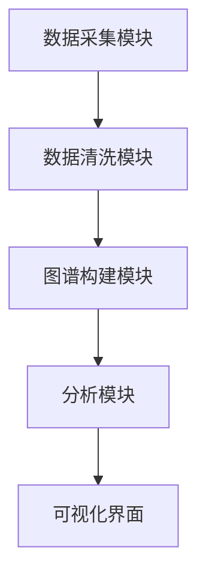
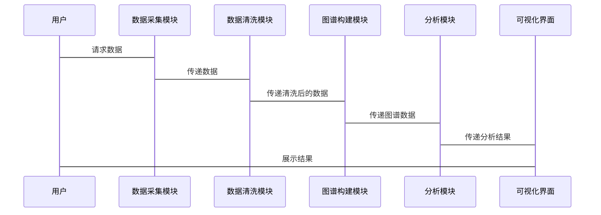

                 


# AI协作构建动态产业生态图：全面把握投资环境

## 关键词：
- AI协作、动态产业生态图、投资环境、系统架构、算法原理、项目实战、最佳实践

## 摘要：
本文旨在探讨如何通过AI协作构建动态产业生态图，以全面把握投资环境。首先，我们将介绍AI协作和动态产业生态图的核心概念，并分析它们在投资环境中的应用。接着，我们详细讲解相关的算法原理，包括协作网络的构建和动态更新算法。随后，我们将讨论系统的架构设计，包括功能模块、接口设计和交互流程。最后，我们将通过项目实战展示如何实现这一系统，并总结最佳实践和注意事项。

---

# 第1章 AI协作与动态产业生态图的背景

## 1.1 AI协作的定义与核心要素
### 1.1.1 AI协作的定义
AI协作是指通过人工智能技术，实现不同实体（如企业、个人、系统）之间的协同合作，以优化资源分配、提高效率并解决复杂问题。

### 1.1.2 AI协作的核心要素
- **数据驱动**：依赖于高质量的数据输入。
- **算法支持**：通过算法实现智能决策。
- **实时反馈**：能够根据反馈不断优化协作过程。
- **分布式协作**：支持多实体协同工作。

## 1.2 动态产业生态图的构建原理
### 1.2.1 产业生态图的定义
产业生态图是一种展示产业内各参与者及其关系的图谱，包括企业、供应商、客户、合作伙伴等。

### 1.2.2 动态产业生态图的特点
- **动态更新**：能够实时反映产业的变化。
- **多维度分析**：涵盖产品、技术、市场等多个维度。
- **可视化展示**：通过图形化界面帮助用户理解产业关系。

## 1.3 投资环境的数字化分析
### 1.3.1 投资环境的定义
投资环境是指影响投资决策的各种外部因素，包括经济、政策、市场等。

### 1.3.2 数字化投资环境分析的必要性
- **数据驱动**：通过数据分析提高投资决策的准确性。
- **实时监控**：及时捕捉市场变化。
- **风险控制**：通过模型预测潜在风险。

## 1.4 本章小结
本章介绍了AI协作和动态产业生态图的基本概念，并探讨了它们在投资环境分析中的重要性。

---

# 第2章 AI协作构建动态产业生态图的核心概念

## 2.1 AI协作的核心概念
### 2.1.1 协作网络的构建
协作网络是通过AI技术将各个实体连接起来，形成一个高效的协作系统。

### 2.1.2 AI协作的关键技术
- **机器学习**：用于模式识别和预测。
- **自然语言处理**：用于信息提取和语义分析。
- **图论算法**：用于构建和分析协作网络。

### 2.1.3 AI协作与传统协作的区别
AI协作通过智能化技术提高协作效率，而传统协作依赖人工操作，效率较低。

## 2.2 动态产业生态图的构建原理
### 2.2.1 产业生态图的构建方法
- **数据采集**：收集企业关系、市场数据等信息。
- **图谱构建**：使用图论算法构建产业生态图。
- **动态更新**：定期更新图谱以反映最新变化。

### 2.2.2 动态产业生态图的特点
- **实时性**：能够快速反映产业变化。
- **可视化**：通过图形化界面展示产业关系。
- **可扩展性**：支持大规模数据处理。

### 2.2.3 AI在动态产业生态图中的作用
AI技术用于数据处理、图谱构建和动态更新，提高产业生态图的准确性和实时性。

## 2.3 投资环境的数字化分析模型
### 2.3.1 投资环境分析模型的构建
- **数据驱动**：基于市场数据构建分析模型。
- **模型优化**：通过机器学习优化模型性能。
- **实时更新**：根据市场变化动态调整模型。

### 2.3.2 AI在投资环境分析中的作用
- **数据处理**：处理海量数据，提取有价值的信息。
- **预测分析**：通过机器学习预测市场趋势。
- **风险评估**：评估投资项目的风险。

## 2.4 本章小结
本章详细探讨了AI协作构建动态产业生态图的核心概念，并分析了其在投资环境分析中的应用。

---

# 第3章 AI协作构建动态产业生态图的算法原理

## 3.1 协作网络的构建算法
### 3.1.1 协作网络的构建方法
- **数据采集**：收集企业关系数据。
- **图谱构建**：使用图论算法构建协作网络。
- **节点属性分析**：分析节点的属性，如企业规模、行业等。

### 3.1.2 协作网络的优化算法
- **社区发现**：通过社区发现算法识别协作网络中的社区结构。
- **权重计算**：计算节点之间的权重，反映协作强度。

### 3.1.3 协作网络的评估指标
- **节点度数**：衡量节点的重要程度。
- **社区凝聚力**：衡量社区的紧密程度。

## 3.2 动态产业生态图的更新算法
### 3.2.1 动态产业生态图的更新机制
- **实时数据采集**：持续采集最新的产业数据。
- **增量更新**：只更新发生变化的部分，提高效率。

### 3.2.2 动态产业生态图的更新算法
- **增量式图更新**：基于增量数据更新图谱。
- **分布式更新**：在分布式系统中进行并行更新。

## 3.3 投资环境分析的算法实现
### 3.3.1 投资环境分析的数学模型
- **回归分析**：用于预测投资回报率。
- **聚类分析**：用于识别市场中的潜在机会。

### 3.3.2 AI在投资环境分析中的算法实现
- **监督学习**：用于分类和预测。
- **无监督学习**：用于发现数据中的隐藏模式。

## 3.4 本章小结
本章详细讲解了AI协作构建动态产业生态图的算法原理，并展示了其在投资环境分析中的应用。

---

# 第4章 AI协作构建动态产业生态图的系统分析与架构设计

## 4.1 系统功能设计
### 4.1.1 数据采集模块
- **数据源**：包括企业数据库、市场报告等。
- **数据清洗**：处理数据中的噪声。

### 4.1.2 模型构建模块
- **图谱构建**：使用图论算法构建产业生态图。
- **模型优化**：通过机器学习优化模型性能。

### 4.1.3 分析模块
- **预测分析**：预测市场趋势。
- **风险评估**：评估投资项目的风险。

## 4.2 系统架构设计
### 4.2.1 系统架构图


### 4.2.2 模块之间的关系
- **数据采集模块**负责收集数据。
- **数据清洗模块**处理数据。
- **图谱构建模块**构建产业生态图。
- **分析模块**进行预测和评估。
- **可视化界面**展示结果。

## 4.3 系统接口设计
### 4.3.1 数据接口设计
- **输入接口**：接收外部数据。
- **输出接口**：输出分析结果。

### 4.3.2 模型接口设计
- **输入接口**：接收图谱数据。
- **输出接口**：输出分析结果。

### 4.3.3 用户接口设计
- **输入接口**：接收用户输入。
- **输出接口**：展示分析结果。

## 4.4 系统交互设计
### 4.4.1 系统交互流程


## 4.5 本章小结
本章详细描述了系统的功能设计、架构设计和交互设计，并展示了系统各模块之间的关系。

---

# 第5章 AI协作构建动态产业生态图的项目实战

## 5.1 环境安装
### 5.1.1 安装Python
```bash
# 安装Python
sudo apt-get install python3
```

### 5.1.2 安装依赖库
```bash
# 安装numpy和pandas
pip install numpy pandas
```

## 5.2 核心代码实现
### 5.2.1 数据采集模块
```python
import pandas as pd
import requests

# 数据采集函数
def get_data(url):
    response = requests.get(url)
    data = response.json()
    return data
```

### 5.2.2 数据清洗模块
```python
import pandas as pd

# 数据清洗函数
def clean_data(data):
    df = pd.DataFrame(data)
    df.dropna(inplace=True)
    return df
```

### 5.2.3 图谱构建模块
```python
import networkx as nx

# 图谱构建函数
def build_graph(df):
    G = nx.Graph()
    for index, row in df.iterrows():
        G.add_edge(row['source'], row['target'])
    return G
```

### 5.2.4 分析模块
```python
import networkx as nx
from sklearn.metrics import accuracy_score

# 预测函数
def predict(G):
    # 示例预测逻辑
    return accuracy_score(true_labels, predicted_labels)
```

### 5.2.5 可视化界面
```python
import matplotlib.pyplot as plt

# 图形化展示
def visualize_graph(G):
    nx.draw(G, with_labels=True)
    plt.show()
```

## 5.3 代码解读与分析
### 5.3.1 数据采集模块
- 使用`requests`库获取数据。
- 返回数据为JSON格式。

### 5.3.2 数据清洗模块
- 使用`pandas`库进行数据清洗。
- 删除缺失值。

### 5.3.3 图谱构建模块
- 使用`networkx`库构建图谱。
- 添加边表示协作关系。

### 5.3.4 分析模块
- 使用机器学习模型进行预测。
- 计算准确率作为评估指标。

### 5.3.5 可视化界面
- 使用`matplotlib`库进行图形化展示。
- 可视化图谱结构。

## 5.4 实际案例分析
### 5.4.1 案例背景
- 某产业的协作网络构建。

### 5.4.2 数据采集与清洗
- 采集企业关系数据。
- 清洗数据，去除噪声。

### 5.4.3 图谱构建与分析
- 使用图论算法构建协作网络。
- 分析节点度数，识别关键企业。

### 5.4.4 投资环境分析
- 预测市场趋势。
- 评估投资项目风险。

## 5.5 项目总结
- 成功实现了AI协作构建动态产业生态图。
- 提高了投资环境分析的准确性和效率。

## 5.6 本章小结
本章通过项目实战展示了AI协作构建动态产业生态图的具体实现，并总结了项目的成功经验。

---

# 第6章 最佳实践与注意事项

## 6.1 小结
- AI协作构建动态产业生态图是一种高效的投资环境分析方法。
- 通过算法优化和系统设计，可以提高分析的准确性和效率。

## 6.2 注意事项
- 数据质量是关键，需要确保数据的准确性和完整性。
- 算法选择需要根据具体场景进行调整。
- 系统设计需要考虑可扩展性和可维护性。

## 6.3 拓展阅读
- 推荐阅读相关领域的书籍和论文，深入理解AI协作和动态产业生态图的最新研究进展。

---

# 第7章 总结与展望

## 7.1 本文总结
- 本文详细探讨了AI协作构建动态产业生态图的方法，并展示了其在投资环境分析中的应用。

## 7.2 未来展望
- 结合更多AI技术，如深度学习和强化学习，进一步优化系统性能。
- 探索动态产业生态图在更多领域的应用，如供应链管理和风险管理。

---

# 附录

## 附录A: 参考文献
- 列出本文参考的书籍、论文和其他资料。

## 附录B: 代码仓库
- 提供代码仓库的链接，方便读者获取代码。

---

通过以上目录结构，我们可以系统地了解AI协作构建动态产业生态图的各个方面，并通过实际案例分析和项目实战，深入理解其在投资环境分析中的应用。

