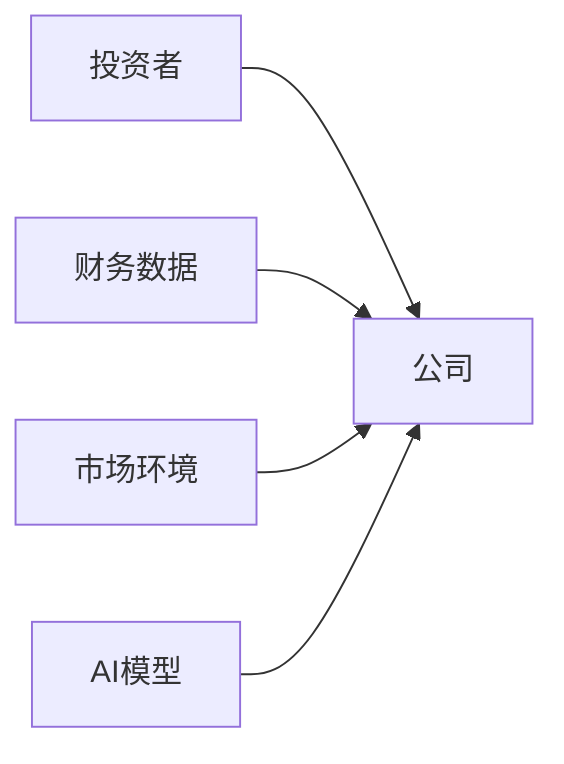
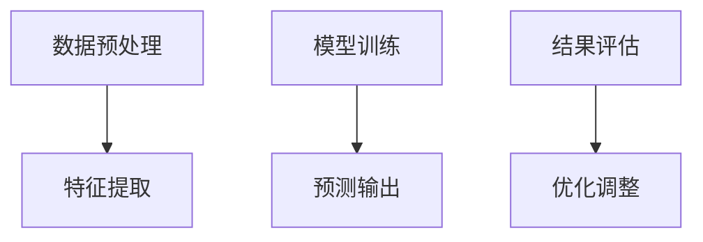
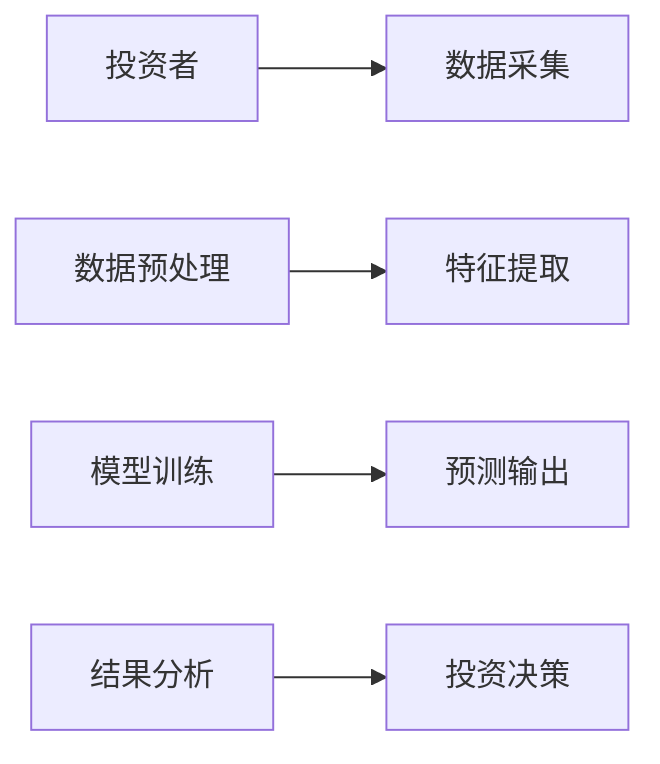
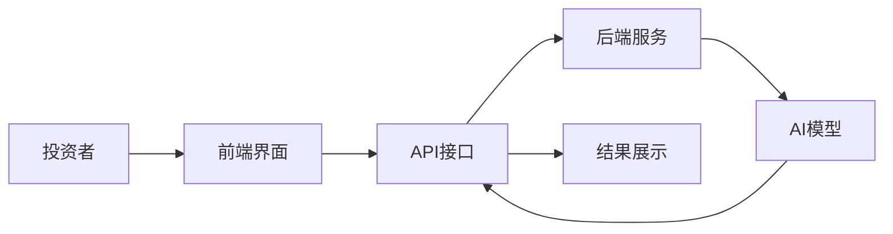
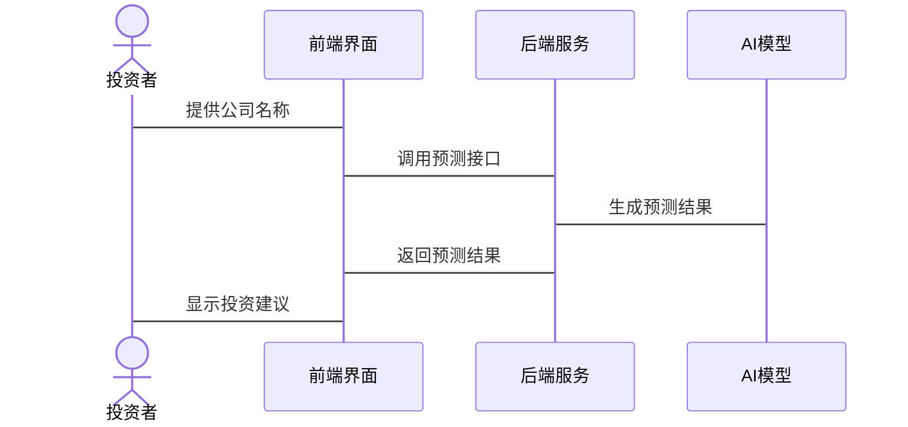

                 


# AI协作预测公司成长性：增强价值投资的前瞻性

> 关键词：AI协作、公司成长性、价值投资、前瞻性预测、机器学习、NLP、时间序列分析

> 摘要：本文探讨了如何利用AI技术协作预测公司成长性，从而增强价值投资的前瞻性。通过分析AI在金融领域的应用潜力，结合机器学习、自然语言处理和时间序列分析等算法，构建了完整的预测模型，并通过实际案例展示了其在价值投资中的应用效果。本文旨在为投资者提供一种更科学、更高效的公司成长性评估方法。

---

# 第一部分: AI协作预测公司成长性的背景与概念

## 第1章: AI协作预测公司成长性的背景介绍

### 1.1 问题背景与描述

#### 1.1.1 传统价值投资的局限性
传统价值投资主要依赖于财务指标分析和经验判断，存在以下问题：
- 数据来源单一，难以全面捕捉市场信息。
- 财务数据滞后性强，无法及时反映公司动态。
- 人工判断主观性强，缺乏量化依据。

#### 1.1.2 AI技术在金融领域的应用潜力
AI技术通过以下方式为金融领域带来变革：
- 处理海量数据，提取隐藏信息。
- 实现实时监控，提高决策效率。
- 提供精准预测，降低投资风险。

#### 1.1.3 公司成长性预测的挑战与重要性
公司成长性预测的挑战包括：
- 数据的复杂性：涉及财务、市场、行业等多个维度。
- 时间序列的非线性：成长性受多种因素影响，难以建模。
- 模型的动态性：市场环境不断变化，模型需要持续优化。

其重要性体现在：
- 帮助投资者识别优质标的，优化投资组合。
- 提供前瞻性洞察，降低投资风险。
- 推动金融行业向智能化、数据化转型。

### 1.2 问题解决与边界

#### 1.2.1 AI协作预测的核心目标
AI协作预测的核心目标是：
- 利用多源数据（财务数据、文本数据、市场数据等）构建预测模型。
- 提供公司成长性的量化评估，辅助投资决策。

#### 1.2.2 问题解决的边界与外延
- 数据范围：主要关注公司公开数据和市场数据。
- 预测范围：聚焦于公司未来3-5年的成长性预测。
- 应用场景：主要应用于价值投资和风险控制。

#### 1.2.3 核心概念与关键要素
- 数据来源：财务报表、新闻报道、社交媒体、行业报告等。
- 模型构建：回归分析、时间序列分析、自然语言处理等。
- 输出结果：成长性评分、风险预警、投资建议等。

### 1.3 核心概念结构与组成

#### 1.3.1 AI协作预测的基本原理
AI协作预测的基本原理包括：
- 数据采集与预处理：清洗、整合、特征提取。
- 模型训练与优化：选择算法、调整参数、验证效果。
- 预测与解释：生成预测结果、提供可解释性。

#### 1.3.2 公司成长性预测的指标体系
公司成长性预测的指标体系包括：
- 财务指标：净利润增长率、收入增长率、ROE等。
- 市场指标：市盈率、市净率、行业排名等。
- 文本指标：新闻情感、管理层变动、行业趋势等。

#### 1.3.3 价值投资的前瞻性增强机制
价值投资的前瞻性增强机制包括：
- 基于AI的公司评分：量化公司成长潜力。
- 多维度风险预警：识别潜在风险。
- 投资组合优化：动态调整投资策略。

---

## 第2章: AI协作预测的核心概念与联系

### 2.1 核心概念原理

#### 2.1.1 AI协作的定义与特征
AI协作的定义：AI协作是指通过多种数据源和算法模型协同工作，实现对公司成长性预测的过程。

其特征包括：
- 多模态数据处理能力。
- 实时性与动态性。
- 可解释性与透明性。

#### 2.1.2 公司成长性预测的模型框架
公司成长性预测的模型框架包括：
- 数据预处理模块。
- 特征提取模块。
- 模型训练模块。
- 结果输出模块。

#### 2.1.3 价值投资的前瞻性增强方法
价值投资的前瞻性增强方法包括：
- 基于AI的量化分析。
- 多维度风险控制。
- 动态投资策略调整。

### 2.2 核心概念对比表

| 对比维度 | AI协作预测 | 传统分析方法 |
|----------|-------------|---------------|
| 数据来源 | 多模态数据 | 财务数据为主 |
| 分析速度 | 实时分析 | 事后分析为主 |
| 可解释性 | 可解释性较低 | 高可解释性 |
| 预测精度 | 高精度 | 受主观因素影响大 |

### 2.3 ER实体关系图



---

## 第3章: AI协作预测的算法原理

### 3.1 算法原理概述

#### 3.1.1 机器学习在成长性预测中的应用
机器学习在成长性预测中的应用包括：
- 回归分析：预测公司未来收入和利润。
- 分类模型：识别公司是否具备成长潜力。
- 聚类分析：发现市场中相似公司的模式。

#### 3.1.2 自然语言处理在公司分析中的作用
自然语言处理在公司分析中的作用包括：
- 新闻情感分析：判断市场情绪。
- 产品评论分析：评估消费者对公司产品的看法。
- 财务报告分析：提取关键信息。

#### 3.1.3 时间序列分析的预测机制
时间序列分析的预测机制包括：
- ARIMA模型：预测公司未来收入。
- LSTM网络：捕捉时间序列的长-term依赖关系。
- Prophet模型：适用于非稳定时间序列。

### 3.2 算法流程图



### 3.3 核心算法实现

#### 3.3.1 回归分析

```python
import numpy as np
from sklearn.linear_model import LinearRegression

# 示例数据
X = np.array([[1], [2], [3], [4]])
y = np.array([2, 4, 5, 6])

# 模型训练
model = LinearRegression()
model.fit(X, y)

# 预测输出
print(model.predict([[5]]))  # 输出：[[6.5]]
```

#### 3.3.2 时间序列分析

```python
from statsmodels.tsa.arima_model import ARIMA

# 示例数据
data = [1, 2, 3, 4, 5]

# 模型训练
model = ARIMA(data, order=(1, 1, 1))
model_fit = model.fit()

# 预测输出
print(model_fit.forecast(steps=3))  # 输出：(array([6.5, 7.5, 8.5]), ...)
```

#### 3.3.3 LSTM网络

```python
import tensorflow as tf
from tensorflow.keras.layers import LSTM, Dense

# 示例数据
X = np.random.rand(100, 1, 1)
y = np.random.rand(100, 1)

# 模型构建
model = tf.keras.Sequential()
model.add(LSTM(64, input_shape=(1, 1)))
model.add(Dense(1))
model.compile(loss='mean_squared_error', optimizer='adam')

# 模型训练
model.fit(X, y, epochs=10, batch_size=32)
```

#### 3.3.4 数学模型与公式

##### 线性回归模型
$$ y = \beta_0 + \beta_1x + \epsilon $$

##### LSTM网络模型
$$ \text{cell} = \text{LSTMCell}(\text{units}) $$
$$ \text{output} = \text{cell}(\text{input}, \text{state}) $$

##### ARIMA模型
$$ \text{ARIMA}(p, d, q) $$

---

## 第4章: 系统分析与架构设计方案

### 4.1 问题场景介绍
我们假设一个价值投资者希望利用AI技术预测公司成长性，优化投资组合。

### 4.2 系统功能设计

#### 4.2.1 领域模型



#### 4.2.2 系统架构



#### 4.2.3 接口设计
- 输入接口：投资者提供公司名称或代码。
- 输出接口：预测结果和投资建议。

#### 4.2.4 交互流程



---

## 第5章: 项目实战

### 5.1 环境安装
安装必要的库：
```bash
pip install numpy pandas scikit-learn tensorflow keras statsmodels
```

### 5.2 核心代码实现

#### 5.2.1 数据预处理

```python
import pandas as pd
import numpy as np

# 加载数据
data = pd.read_csv('company.csv')

# 数据清洗
data.dropna(inplace=True)

# 特征提取
X = data[['revenue', 'profit', 'growth_rate']]
y = data['stock_price']
```

#### 5.2.2 模型训练与预测

```python
from sklearn.ensemble import RandomForestRegressor

# 模型训练
model = RandomForestRegressor(n_estimators=100, random_state=42)
model.fit(X, y)

# 预测输出
print(model.predict(X))  # 输出：预测的股票价格
```

### 5.3 案例分析

#### 5.3.1 数据分析
假设我们有一个公司A，其过去5年的收入和利润如下：

| 年份 | 收入（百万） | 利润（百万） |
|------|--------------|--------------|
| 2018 | 50           | 10           |
| 2019 | 60           | 15           |
| 2020 | 70           | 20           |
| 2021 | 80           | 25           |
| 2022 | 90           | 30           |

#### 5.3.2 模型预测
使用随机森林模型预测公司A 2023年的收入和利润。

#### 5.3.3 投资建议
基于模型预测结果，生成投资建议：
- 如果预测收入和利润增长显著，建议增持。
- 如果预测增长放缓，建议谨慎。

### 5.4 项目小结
通过本项目，我们展示了如何利用AI技术预测公司成长性，并为投资者提供科学的投资建议。

---

## 第6章: 最佳实践与小结

### 6.1 最佳实践

#### 6.1.1 数据质量的重要性
确保数据来源可靠、数据清洗充分。

#### 6.1.2 模型优化的关键点
- 选择合适的算法。
- 调参优化。
- 模型解释性。

#### 6.1.3 实际应用中的注意事项
- 避免过度拟合。
- 定期更新模型。
- 结合专家意见。

### 6.2 小结
本文通过详细讲解AI协作预测公司成长性的背景、核心概念、算法原理和系统架构，展示了如何利用AI技术增强价值投资的前瞻性。

### 6.3 注意事项
- AI模型的结果仅供参考，不构成投资建议。
- 投资者需结合市场环境和自身风险承受能力做出决策。
- 持续关注模型的更新与优化。

### 6.4 拓展阅读
- 《机器学习实战》
- 《Python时间序列分析》
- 《深度学习入门》

---

通过本文的分析与实践，我们相信AI协作预测公司成长性将为价值投资带来全新的视角和方法。未来，随着AI技术的不断发展，这一领域的应用潜力将更加广阔。

