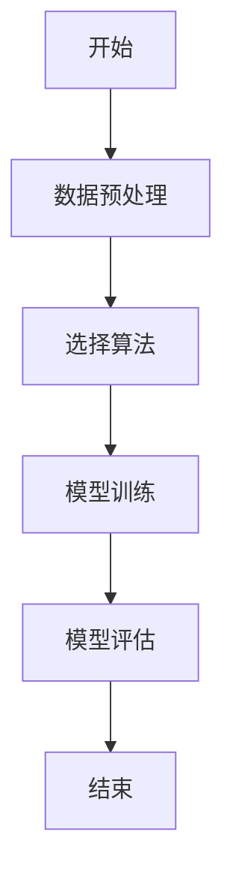
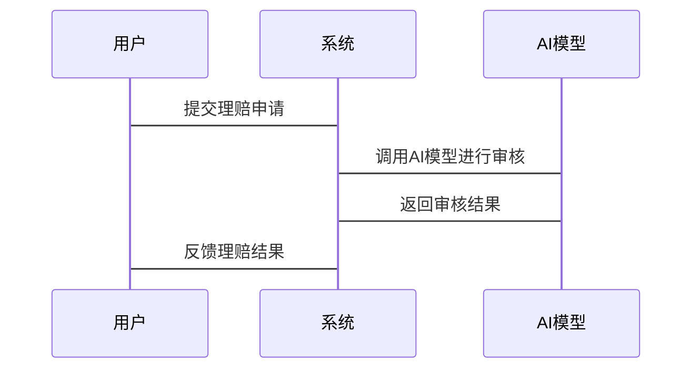

                 


# AI在保险理赔流程优化中的深度应用

## 关键词：人工智能、保险理赔、流程优化、机器学习、深度学习、自然语言处理

## 摘要：  
随着人工智能技术的快速发展，AI在保险行业的应用越来越广泛。本文将深入探讨AI技术在保险理赔流程优化中的具体应用，分析其核心概念、算法原理、系统架构以及实际案例，揭示AI如何提升保险理赔的效率和准确性，为保险行业带来深远的影响。

---

# 第1章: 保险行业的现状与挑战

## 1.1 保险行业的现状分析

### 1.1.1 保险行业的基本概念  
保险是一种风险管理工具，通过分散风险来保护个人或企业免受潜在损失的影响。保险行业涵盖寿险、财险、健康险等多个领域，其中理赔是保险业务的重要环节之一。

### 1.1.2 保险行业的痛点与挑战  
保险行业在快速发展的同时，也面临着诸多痛点：  
- **理赔流程复杂**：传统理赔流程涉及多个环节，包括申请、审核、赔付等，流程繁琐且耗时。  
- **人工审核低效**：传统理赔审核依赖人工操作，容易出现误差且效率低下。  
- **信息孤岛问题**：不同部门之间数据不通，导致信息重复录入和资源浪费。  

### 1.1.3 保险行业的未来发展趋势  
随着数字化和智能化的推进，保险行业正朝着以下方向发展：  
- **数字化转型**：通过互联网、大数据等技术实现保险业务的线上化。  
- **智能化升级**：利用AI技术优化保险流程，提升效率和客户体验。  

## 1.2 保险理赔流程的痛点与难点  

### 1.2.1 传统保险理赔流程的复杂性  
传统理赔流程通常包括以下步骤：  
1. 提交理赔申请。  
2. 收集相关资料（如医疗记录、事故报告等）。  
3. 人工审核资料。  
4. 确定赔付金额。  
5. 完成赔付。  
整个流程耗时长、效率低，容易让用户感到不满。

### 1.2.2 人工审核的低效性与误差  
人工审核不仅耗时，还容易出现以下问题：  
- **主观性**：人工审核依赖审核人员的经验，容易出现主观判断误差。  
- **效率低下**：人工审核需要逐个处理理赔申请，效率难以提升。  

### 1.2.3 理赔流程中的信息孤岛问题  
保险行业的信息孤岛问题主要体现在：  
- **数据分散**：不同部门、不同系统之间的数据无法有效共享。  
- **数据不一致**：同一数据在不同系统中可能存储不一致，导致信息混乱。  

## 1.3 AI技术在保险行业的应用价值  

### 1.3.1 AI技术如何提升保险行业的效率  
AI技术可以通过自动化处理和智能决策，显著提升保险行业的效率：  
- **自动化理赔申请**：通过AI技术自动解析用户提交的理赔申请，减少人工操作。  
- **智能审核**：利用机器学习模型自动审核理赔资料，提高审核效率和准确性。  

### 1.3.2 AI技术在保险理赔中的具体应用  
AI技术在保险理赔中的具体应用包括：  
- **智能客服**：通过自然语言处理技术，为用户提供24/7的智能理赔咨询服务。  
- **风险评估**：利用AI技术分析用户的历史数据，评估理赔风险。  

### 1.3.3 AI技术对保险行业的长期影响  
长远来看，AI技术将推动保险行业向更高效、更智能化的方向发展：  
- **个性化保险产品**：通过AI技术分析用户需求，定制个性化保险产品。  
- **实时风险监控**：利用AI技术实时监控风险，提前采取预防措施。  

---

# 第2章: AI在保险理赔流程优化中的核心概念

## 2.1 AI技术的核心概念与原理

### 2.1.1 人工智能的基本定义  
人工智能（AI）是指计算机系统模拟人类智能的能力，包括学习、推理、自我改进等。  

### 2.1.2 机器学习的定义与分类  
机器学习是一种AI技术，通过数据训练模型，使其能够自动学习和改进。常见的机器学习算法包括：  
- **监督学习**：通过标记数据训练模型，使其能够预测新数据的标签。  
- **无监督学习**：通过未标记数据训练模型，发现数据中的潜在结构。  
- **强化学习**：通过与环境交互，学习最优策略。  

### 2.1.3 深度学习的定义与特点  
深度学习是一种机器学习技术，通过多层神经网络模型提取数据特征。其特点包括：  
- **非线性特征提取**：能够处理复杂的非线性关系。  
- **端到端学习**：从原始数据到最终输出，整个过程由模型自动完成。  

## 2.2 保险理赔流程优化的关键技术

### 2.2.1 自然语言处理技术  
自然语言处理（NLP）技术用于理解和处理人类语言，常用于以下场景：  
- **文本分类**：将理赔申请文本分类为不同类别，如“理赔成功”、“需要补充资料”。  
- **信息抽取**：从理赔申请中提取关键信息，如事故时间、地点等。  

### 2.2.2 图像识别技术  
图像识别技术用于自动识别和分析图像内容，常见于以下场景：  
- **OCR识别**：从扫描件中提取文字信息。  
- **事故照片分析**：分析事故照片，判断事故责任。  

### 2.2.3 数据挖掘与分析技术  
数据挖掘技术用于从大量数据中提取有用信息，常用于以下场景：  
- **风险评估**：通过历史数据分析用户的风险等级。  
- **欺诈检测**：识别潜在的欺诈行为。  

## 2.3 AI在保险理赔中的应用场景

### 2.3.1 AI在理赔申请中的应用  
AI技术可以自动解析用户提交的理赔申请，提取关键信息并分类处理。  

### 2.3.2 AI在理赔审核中的应用  
AI技术可以自动审核理赔资料，减少人工审核的误差和时间。  

### 2.3.3 AI在理赔后续服务中的应用  
AI技术可以为用户提供个性化的后续服务，如自动跟踪理赔进度、智能推荐保险产品等。  

---

## 2.4 AI技术与传统技术的对比（表格）

| 技术对比维度 | AI技术                 | 传统技术               |
|---------------|------------------------|------------------------|
| 效率           | 高，自动化处理         | 低，依赖人工操作       |
| 准确性         | 高，基于数据模型       | 中等，依赖人工经验     |
| 可扩展性       | 高，适用于大规模数据   | 低，难以快速扩展       |
| 成本           | 低，自动化减少人力成本 | 高，需要大量人工投入   |

---

## 2.5 系统实体关系图（Mermaid）

```mermaid
erDiagram
    user --> insurant : 提交理赔申请
    user --> insurance_company : 提供资料
    insurance_company --> claims_department : 审核申请
    claims_department --> policy : 查阅保险合同
    claims_department --> claims_database : 更新理赔记录
    claims_database --> user : 反馈理赔结果
```

---

# 第3章: AI在保险理赔流程优化中的算法原理

## 3.1 机器学习算法在保险理赔中的应用

### 3.1.1 监督学习算法  
监督学习算法通过标记数据训练模型，预测新数据的标签。例如，可以使用决策树算法对理赔申请进行分类。  

### 3.1.2 无监督学习算法  
无监督学习算法用于发现数据中的潜在结构。例如，可以使用聚类算法将类似的历史理赔案例分组。  

### 3.1.3 强化学习算法  
强化学习算法通过与环境交互，学习最优策略。例如，可以使用强化学习算法优化理赔流程中的决策步骤。  

## 3.2 深度学习算法在保险理赔中的应用

### 3.2.1 卷积神经网络（CNN）  
CNN常用于图像识别任务，例如从事故照片中识别车辆损伤情况。  

### 3.2.2 循环神经网络（RNN）  
RNN常用于处理序列数据，例如从理赔文本中提取时间序列信息。  

### 3.2.3 Transformer模型  
Transformer模型常用于自然语言处理任务，例如从理赔申请中提取关键信息。  

## 3.3 自然语言处理算法在保险理赔中的应用

### 3.3.1 分词算法  
分词算法用于将文本分割为词语或短语。例如，可以使用jieba算法对中文理赔文本进行分词。  

### 3.3.2 词向量表示（如Word2Vec）  
Word2Vec算法用于将词语映射为向量表示，便于后续的文本分类任务。  

### 3.3.3 文本分类算法  
文本分类算法用于将理赔文本分类为不同类别。例如，可以使用支持向量机（SVM）算法对理赔申请进行分类。  

---

## 3.4 算法流程图（Mermaid）



---

## 3.5 机器学习模型的数学公式

### 3.5.1 线性回归模型  
线性回归模型用于预测连续型变量，其数学公式为：  
$$ y = \beta_0 + \beta_1x + \epsilon $$  

### 3.5.2 逻辑回归模型  
逻辑回归模型用于分类问题，其数学公式为：  
$$ P(y=1|x) = \frac{1}{1 + e^{- (\beta_0 + \beta_1x)}} $$  

---

# 第4章: AI在保险理赔流程优化中的系统架构

## 4.1 系统架构设计

### 4.1.1 系统整体架构  
AI理赔系统整体架构包括前端、后端、数据库和AI模型四个部分。  

### 4.1.2 各模块的功能描述  
- **前端模块**：用户通过前端提交理赔申请，查看理赔进度。  
- **后端模块**：接收用户请求，调用AI模型进行处理。  
- **数据库模块**：存储用户信息、理赔记录等数据。  
- **AI模型模块**：负责理赔申请的分类、审核和预测。  

### 4.1.3 系统的可扩展性设计  
系统采用模块化设计，便于后续功能的扩展和优化。  

## 4.2 系统功能设计

### 4.2.1 理赔申请模块  
用户可以通过网页或移动APP提交理赔申请，系统自动提取关键信息并分类处理。  

### 4.2.2 理赔审核模块  
AI模型自动审核理赔资料，减少人工审核的误差和时间。  

### 4.2.3 理赔后续服务模块  
系统为用户提供个性化的后续服务，如自动跟踪理赔进度、智能推荐保险产品等。  

## 4.3 系统接口设计

### 4.3.1 理赔申请接口  
API接口用于接收用户的理赔申请信息，格式为JSON。  

### 4.3.2 理赔审核接口  
API接口用于调用AI模型进行理赔审核，返回审核结果。  

### 4.3.3 理赔后续服务接口  
API接口用于更新用户的理赔进度，通知用户理赔结果。  

## 4.4 系统交互流程图（Mermaid）



---

## 4.5 系统功能实现代码示例

### 4.5.1 环境安装  
需要安装以下Python库：  
- `scikit-learn`：机器学习库  
- `jieba`：中文分词库  
- `tensorflow`：深度学习框架  

### 4.5.2 理赔申请分类代码

```python
from sklearn.feature_extraction.text import TfidfVectorizer
from sklearn.svm import SVC

# 数据预处理
texts = [...]  # 理赔申请文本
labels = [...]  # 理赔申请类别标签

# 特征提取
vectorizer = TfidfVectorizer()
X = vectorizer.fit_transform(texts)

# 模型训练
model = SVC()
model.fit(X, labels)

# 预测分类
new_text = [...]  # 新的理赔申请文本
new_X = vectorizer.transform([new_text])
predicted_label = model.predict(new_X)
```

---

## 4.6 系统实现细节解读

### 4.6.1 系统模块划分  
系统模块划分清晰，便于后续开发和维护。  

### 4.6.2 系统性能优化  
通过缓存技术和分布式计算优化系统性能，提升处理速度。  

### 4.6.3 系统安全性设计  
采用加密技术和访问控制，确保用户数据的安全性和隐私性。  

---

## 4.7 项目实战案例分析

### 4.7.1 环境安装与配置  
安装所需Python库：  
```bash
pip install scikit-learn jieba tensorflow
```

### 4.7.2 理赔申请分类代码实现  
```python
from sklearn.feature_extraction.text import TfidfVectorizer
from sklearn.svm import SVC

# 数据预处理
texts = [...]  # 理赔申请文本
labels = [...]  # 理赔申请类别标签

# 特征提取
vectorizer = TfidfVectorizer()
X = vectorizer.fit_transform(texts)

# 模型训练
model = SVC()
model.fit(X, labels)

# 预测分类
new_text = [...]  # 新的理赔申请文本
new_X = vectorizer.transform([new_text])
predicted_label = model.predict(new_X)
```

### 4.7.3 系统实现与测试  
通过单元测试和集成测试验证系统的功能和性能。  

### 4.7.4 项目总结与优化  
总结项目经验，提出改进建议，如优化模型性能、提升用户体验等。  

---

## 4.8 系统实现流程图（Mermaid）


---

# 第5章: 总结与展望

## 5.1 本文总结  
本文详细探讨了AI技术在保险理赔流程优化中的应用，分析了其核心概念、算法原理、系统架构以及实际案例。  

## 5.2 对AI技术的未来展望  
随着AI技术的不断发展，保险行业的理赔流程将更加智能化和自动化，用户体验也将得到进一步提升。  

## 5.3 未来研究方向  
未来可以进一步研究AI技术在保险理赔中的深度应用，如实时风险监控、个性化保险产品设计等。  

---

# 附录

## 附录A: 相关术语解释  
- **AI**：人工智能  
- **机器学习**：一种AI技术，通过数据训练模型，使其能够自动学习和改进。  
- **深度学习**：一种机器学习技术，通过多层神经网络模型提取数据特征。  

## 附录B: 参考文献  
1. 《机器学习实战》  
2. 《深度学习入门：基于Python的理论与实现》  
3. 《自然语言处理入门：基于Python的理论与实践》  

---

通过本文的深入分析，我们可以看到AI技术在保险理赔流程优化中的巨大潜力。未来，随着技术的进一步发展，AI将为保险行业带来更多的创新和变革。

