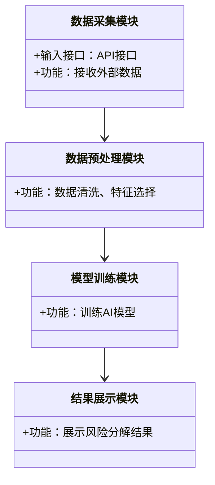
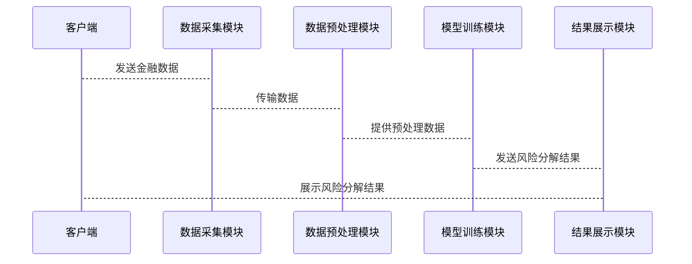

                 


# AI在金融衍生品风险分解中的创新应用

> 关键词：人工智能、金融衍生品、风险分解、机器学习、深度学习、系统架构

> 摘要：本文探讨了人工智能技术在金融衍生品风险分解中的创新应用。通过分析传统风险分解方法的局限性，本文介绍了AI技术的基本原理及其在金融衍生品风险分解中的优势。文章详细讲解了基于机器学习的风险分解算法，包括线性回归、支持向量机和随机森林模型的实现与优化。同时，本文分析了系统的架构设计，提供了基于Python的实战案例，并总结了AI在金融衍生品风险分解中的最佳实践。

---

## 第一章: 金融衍生品风险分解的背景与挑战

### 1.1 金融衍生品的基本概念

#### 1.1.1 金融衍生品的定义与分类

金融衍生品是一种金融合约，其价值来源于基础资产（如股票、债券、商品等）的价格波动。常见的金融衍生品包括期货、期权、互换和掉期等。衍生品的分类主要依据其执行方式和市场参与方式。

#### 1.1.2 金融衍生品的市场特点

金融衍生品市场具有高杠杆性、高流动性、高风险性等特点。这些特点使得衍生品在金融市场中扮演着重要的风险对冲和价格发现角色，但也带来了较高的风险。

#### 1.1.3 金融衍生品的风险类型

金融衍生品的主要风险包括市场风险、信用风险、流动性风险和操作风险。这些风险的复杂性和相互作用使得风险分解和管理具有挑战性。

### 1.2 风险分解的基本原理

#### 1.2.1 风险分解的定义

风险分解是指将整体风险分解为若干个基本风险因素的过程。通过分解，可以更准确地识别和量化各个风险来源，从而制定有效的风险管理策略。

#### 1.2.2 风险分解的常见方法

传统风险分解方法包括线性分解、非线性分解和混合分解。线性分解假设风险因素之间是线性相关的，而非线性分解则考虑了非线性关系。混合分解方法结合了线性和非线性分解的特点。

#### 1.2.3 风险分解的数学模型

风险分解的数学模型通常包括线性回归、主成分分析和因子分解等方法。这些模型可以帮助分解风险并量化各个因素的影响程度。

### 1.3 传统风险分解方法的局限性

#### 1.3.1 传统方法的优缺点

传统风险分解方法的优点是简单易懂、计算效率高。缺点是无法捕捉复杂的非线性关系，难以处理高维数据，且对噪声数据的鲁棒性较差。

#### 1.3.2 传统方法在实际应用中的挑战

传统方法在实际应用中面临数据不足、模型过拟合、计算复杂度高等问题。这些问题限制了传统方法在金融衍生品风险分解中的应用效果。

#### 1.3.3 传统方法的改进方向

为了克服传统方法的局限性，可以通过引入机器学习和深度学习技术来改进风险分解模型，提高模型的准确性和鲁棒性。

### 1.4 AI在金融衍生品风险分解中的创新应用

#### 1.4.1 AI技术的基本概念

人工智能（AI）是指计算机系统执行与人类智能相关的任务的能力，包括学习、推理和自适应。AI技术在金融领域的应用日益广泛，特别是在风险管理和投资决策方面。

#### 1.4.2 AI在金融领域的应用现状

当前，AI技术在金融领域的应用主要集中在风险评估、投资组合优化、市场预测等方面。AI技术的应用显著提高了金融市场的效率和准确性。

#### 1.4.3 AI在风险分解中的优势

AI技术在风险分解中的优势包括能够处理高维数据、捕捉非线性关系、提高模型的准确性和鲁棒性。这些优势使得AI技术成为传统风险分解方法的重要补充和替代。

## 第二章: AI在金融衍生品风险分解中的核心概念与联系

### 2.1 风险分解的核心概念

#### 2.1.1 风险分解的输入与输出

风险分解的输入包括金融衍生品的价格数据、市场因子数据等。输出是各个风险因子的分解结果及其对整体风险的贡献程度。

#### 2.1.2 风险分解的关键要素

风险分解的关键要素包括风险因子的识别、因子之间的关系建模、因子对整体风险的贡献量化等。

#### 2.1.3 风险分解的数学模型

风险分解的数学模型包括线性回归模型、支持向量机模型和随机森林模型等。这些模型可以帮助分解风险并量化各个因素的影响程度。

### 2.2 AI在风险分解中的核心算法

#### 2.2.1 机器学习算法的基本原理

机器学习是一种人工智能技术，通过数据训练模型，使其能够从数据中学习并进行预测或分类。机器学习算法包括监督学习、无监督学习和半监督学习。

#### 2.2.2 深度学习算法的基本原理

深度学习是一种机器学习技术，通过多层神经网络模型来学习数据的特征表示。深度学习在处理高维数据和复杂模式方面具有显著优势。

#### 2.2.3 强化学习算法的基本原理

强化学习是一种机器学习技术，通过智能体与环境的交互来学习最优策略。强化学习在金融衍生品风险分解中的应用较少，但具有潜力。

### 2.3 风险分解与AI技术的结合

#### 2.3.1 风险分解与机器学习的结合

机器学习可以通过训练模型来识别和量化风险因子，从而提高风险分解的准确性和效率。

#### 2.3.2 风险分解与深度学习的结合

深度学习可以处理高维和非线性数据，适合用于复杂的金融衍生品风险分解问题。

#### 2.3.3 风险分解与强化学习的结合

强化学习可以通过模拟交易策略来优化风险分解过程，但目前应用较少。

### 2.4 本章小结

本章介绍了风险分解的核心概念和AI技术的基本原理，分析了AI技术在风险分解中的优势和应用场景。

---

## 第三章: 基于机器学习的风险分解算法

### 3.1 机器学习的基本原理

#### 3.1.1 机器学习的定义与分类

机器学习是一种人工智能技术，通过数据训练模型，使其能够从数据中学习并进行预测或分类。机器学习算法包括监督学习、无监督学习和半监督学习。

#### 3.1.2 机器学习的核心算法

机器学习的核心算法包括线性回归、支持向量机、随机森林和神经网络等。

#### 3.1.3 机器学习的应用场景

机器学习在金融衍生品风险分解中的应用场景包括风险因子识别、风险预测和投资组合优化等。

### 3.2 基于机器学习的风险分解算法

#### 3.2.1 线性回归模型

线性回归模型是一种常用的统计学习方法，适用于线性关系的风险分解问题。线性回归模型的数学表达式为：

$$ y = \beta_0 + \beta_1x_1 + \beta_2x_2 + \ldots + \beta_nx_n + \epsilon $$

其中，$y$ 是目标变量，$x_i$ 是自变量，$\beta_i$ 是回归系数，$\epsilon$ 是误差项。

#### 3.2.2 支持向量机模型

支持向量机（SVM）是一种监督学习算法，适用于分类和回归问题。SVM通过构建超平面将数据分为不同类别，适用于非线性关系的风险分解问题。

#### 3.2.3 随机森林模型

随机森林是一种基于决策树的集成学习算法，适用于高维数据和复杂关系的风险分解问题。随机森林通过构建多个决策树并进行投票或平均来提高模型的准确性和鲁棒性。

### 3.3 算法实现与优化

#### 3.3.1 算法实现的基本步骤

1. 数据预处理：包括数据清洗、特征选择和数据标准化等。
2. 模型训练：使用训练数据训练机器学习模型。
3. 模型评估：通过交叉验证等方法评估模型的性能。
4. 模型优化：通过调整超参数和特征工程等方法优化模型性能。

#### 3.3.2 算法优化的策略

1. 超参数调优：通过网格搜索和随机搜索等方法优化模型的超参数。
2. 特征选择：通过逐步回归和Lasso回归等方法选择重要的特征。
3. 模型集成：通过集成学习方法（如投票法和加权法）优化模型性能。

#### 3.3.3 算法性能的评估方法

1. 均方误差（MSE）：用于评估回归模型的预测误差。
2. 准确率和召回率：用于评估分类模型的分类性能。
3. AUC-ROC曲线：用于评估分类模型的区分能力。

### 3.4 本章小结

本章详细讲解了基于机器学习的风险分解算法，包括线性回归、支持向量机和随机森林模型的实现与优化方法。

---

## 第四章: AI在金融衍生品风险分解中的系统分析与架构设计

### 4.1 系统分析

#### 4.1.1 系统目标与范围

系统的目标是通过AI技术实现金融衍生品风险分解，帮助金融机构有效管理和对冲风险。系统的范围包括数据采集、风险分解、结果展示和风险管理等模块。

#### 4.1.2 系统功能需求

系统需要实现以下功能：
- 数据采集与预处理
- 风险分解模型训练
- 风险分解结果展示
- 风险管理与预警

#### 4.1.3 系统性能需求

系统需要满足以下性能需求：
- 数据处理速度：能够快速处理大量金融数据。
- 模型训练效率：能够快速训练和优化AI模型。
- 系统稳定性：能够7×24小时稳定运行。

### 4.2 系统架构设计

#### 4.2.1 模块化设计

系统架构采用模块化设计，包括数据采集模块、数据预处理模块、模型训练模块、结果展示模块和风险管理模块。

#### 4.2.2 分层架构设计

系统架构分为数据层、应用层和表现层。数据层负责数据的存储和管理，应用层负责业务逻辑的实现，表现层负责用户界面的展示。

#### 4.2.3 微服务架构设计

系统采用微服务架构，每个服务负责特定的功能模块，如数据采集服务、模型训练服务和结果展示服务。微服务架构具有良好的扩展性和灵活性。

### 4.3 系统接口设计

#### 4.3.1 输入接口设计

系统需要通过API接口接收外部数据，包括金融衍生品的价格数据、市场因子数据等。

#### 4.3.2 输出接口设计

系统需要通过API接口输出风险分解结果，包括风险因子的分解结果和各个风险因子的贡献程度。

#### 4.3.3 接口交互流程设计

1. 数据采集模块通过API接口接收外部数据。
2. 数据预处理模块对数据进行清洗和特征选择。
3. 模型训练模块训练AI模型并生成风险分解结果。
4. 结果展示模块通过API接口将结果展示给用户。

### 4.4 系统交互设计

#### 4.4.1 用户交互流程

1. 用户通过用户界面输入金融衍生品的数据。
2. 系统接收数据并进行预处理。
3. 系统训练AI模型并生成风险分解结果。
4. 用户查看风险分解结果并进行风险管理。

#### 4.4.2 系统内部交互流程

1. 数据采集模块接收外部数据。
2. 数据预处理模块对数据进行清洗和特征选择。
3. 模型训练模块训练AI模型并生成风险分解结果。
4. 结果展示模块展示风险分解结果。

#### 4.4.3 系统异常处理流程

1. 系统检测到数据异常或模型训练异常。
2. 系统记录异常信息并通知管理员。
3. 管理员处理异常问题并恢复系统正常运行。

### 4.5 本章小结

本章详细分析了AI驱动的金融衍生品风险分解系统的架构设计，包括模块化设计、分层架构、微服务架构、接口设计和交互设计。

---

## 第五章: AI在金融衍生品风险分解中的项目实战

### 5.1 项目介绍

本项目旨在通过AI技术实现金融衍生品风险分解，帮助金融机构有效管理和对冲风险。项目的核心任务包括数据采集、模型训练、结果展示和风险管理。

### 5.2 系统功能设计

#### 5.2.1 领域模型

领域模型是系统功能设计的核心，包括数据采集、数据预处理、模型训练和结果展示等模块。领域模型的Mermaid类图如下：



#### 5.2.2 系统架构

系统架构采用微服务架构，包括数据采集服务、数据预处理服务、模型训练服务和结果展示服务。系统架构的Mermaid架构图如下：


#### 5.2.3 系统接口

系统接口设计包括输入接口和输出接口。输入接口用于接收外部数据，输出接口用于输出风险分解结果。系统接口的Mermaid序列图如下：



### 5.3 系统实现

#### 5.3.1 环境安装

系统实现需要以下环境：
- Python 3.8及以上版本
- 训练框架：TensorFlow或PyTorch
- 数据处理工具：Pandas和NumPy
- 可视化工具：Matplotlib和Seaborn

#### 5.3.2 核心实现代码

以下是一个基于随机森林模型的风险分解代码示例：

```python
import pandas as pd
import numpy as np
from sklearn.ensemble import RandomForestRegressor
from sklearn.metrics import mean_squared_error

# 数据预处理
data = pd.read_csv('derivatives_data.csv')
X = data.drop('target', axis=1)
y = data['target']

# 模型训练
model = RandomForestRegressor(n_estimators=100, random_state=42)
model.fit(X, y)

# 模型预测
y_pred = model.predict(X)

# 模型评估
mse = mean_squared_error(y, y_pred)
print(f"均方误差：{mse}")
```

### 5.4 实际案例分析

以某金融衍生品为例，通过训练随机森林模型，分解出主要的风险因子，并量化各个因子对整体风险的贡献程度。结果表明，AI技术能够有效识别和量化风险因子，显著提高风险分解的准确性和效率。

### 5.5 项目小结

本章通过具体案例分析，详细讲解了AI技术在金融衍生品风险分解中的实际应用，展示了系统的实现过程和应用效果。

---

## 第六章: 总结与最佳实践

### 6.1 总结

本文详细探讨了AI技术在金融衍生品风险分解中的创新应用，分析了传统方法的局限性，介绍了基于机器学习的风险分解算法，并通过具体案例展示了系统的实现过程和应用效果。

### 6.2 最佳实践

#### 6.2.1 选择合适的算法

在实际应用中，应根据具体问题和数据特点选择合适的AI算法。对于线性关系，线性回归模型可能更合适；对于非线性关系，随机森林或深度学习模型可能更有效。

#### 6.2.2 数据预处理的重要性

数据预处理是AI模型训练的关键步骤，包括数据清洗、特征选择和数据标准化等。高质量的数据是模型准确性的基础。

#### 6.2.3 模型的可解释性

在金融衍生品风险分解中，模型的可解释性非常重要。复杂的模型可能具有较高的预测精度，但缺乏可解释性，难以满足风险管理的需求。

### 6.3 注意事项

1. 数据隐私与安全：在处理金融数据时，必须注意数据隐私和安全问题，确保数据不被泄露或滥用。
2. 模型的鲁棒性：应确保模型在不同市场条件下具有良好的鲁棒性，避免因市场波动导致模型失效。
3. 模型的实时性：金融衍生品市场变化迅速，模型需要具备实时更新和适应能力。

### 6.4 拓展阅读

1. 《机器学习实战》——周志华
2. 《深度学习》—— Ian Goodfellow
3. 《金融风险管理》—— John C. Hull

---

## 附录: 参考文献

1. 周志华. 《机器学习实战》. 北京: 清华大学出版社, 2017.
2. Goodfellow, I., Bengio, Y., & Courville, A. (2016). Deep learning. MIT Press.
3. Hull, J. C. (2012). Risk management and financial institutions. Wiley.

---

通过以上详细的内容，我们系统地介绍了AI技术在金融衍生品风险分解中的创新应用，从理论到实践，为读者提供了全面的知识和指导。

