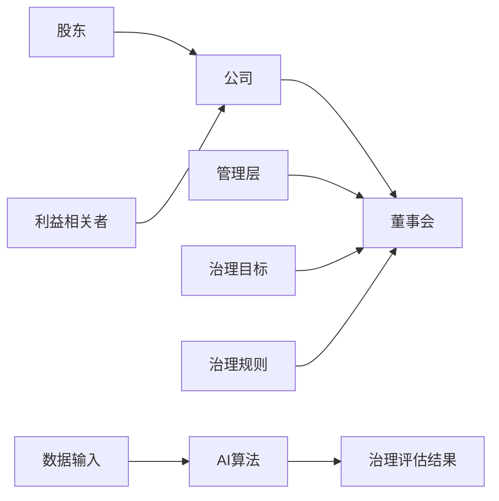
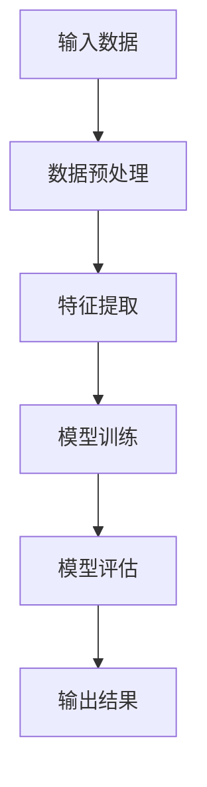
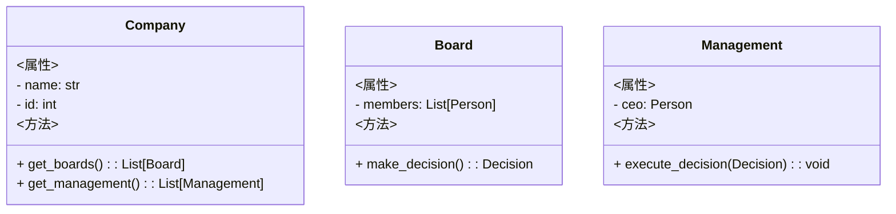
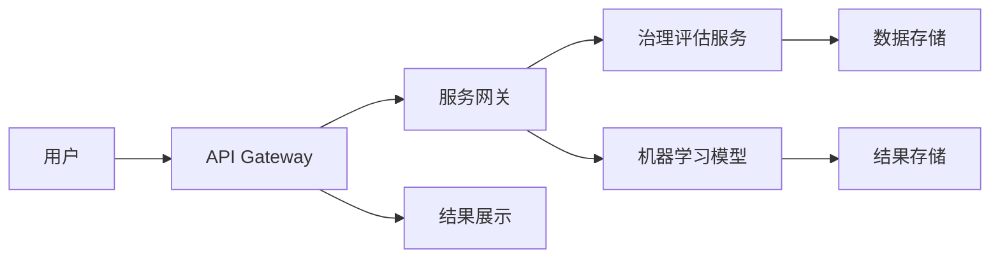
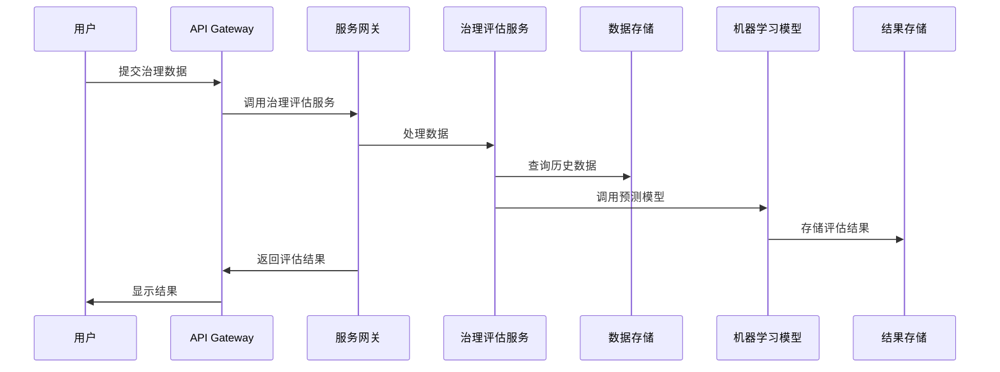

                 


# AI增强型公司治理效能评估工具

## 关键词：
AI技术、公司治理、治理效能、评估工具、自然语言处理、机器学习、系统架构

## 摘要：
本文深入探讨了如何利用人工智能技术提升公司治理效能的评估工具。通过结合自然语言处理和机器学习算法，构建了一套智能化的评估系统，能够实时分析企业治理中的关键问题，并提供数据支持的决策建议。文章详细介绍了该工具的核心概念、算法原理、系统架构设计以及实际应用场景，旨在为企业的治理优化提供创新的解决方案。

---

# 第1章: 公司治理与AI技术的结合

## 1.1 公司治理的基本概念
- **1.1.1 公司治理的定义与核心要素**
  - 公司治理是通过董事会和管理层确保公司战略目标的实现、风险管理的有效性和股东利益的保护。
  - 核心要素包括战略制定、风险管理、董事会结构、管理层责任和利益相关者管理。
- **1.1.2 公司治理的目标与挑战**
  - 目标：实现企业长期价值最大化，确保合规性，优化资源配置。
  - 挑战：信息不对称、人为误差、决策延迟、复杂性增加。
- **1.1.3 AI技术在公司治理中的应用前景**
  - AI可以通过数据分析、模式识别和预测模型，辅助董事会和管理层做出更明智的决策。

## 1.2 AI增强型公司治理的背景
- **1.2.1 传统公司治理的局限性**
  - 依赖经验判断，缺乏数据支持。
  - 信息处理能力有限，难以应对复杂场景。
- **1.2.2 AI技术如何提升公司治理效能**
  - 提供实时数据分析，优化决策过程。
  - 通过预测模型提前识别潜在风险。
  - 自动化处理大量数据，提升效率。
- **1.2.3 当前AI在公司治理中的应用现状**
  - 知识图谱构建：将公司治理中的实体和关系以结构化形式表示。
  - 自然语言处理：用于分析公司公告、财报和新闻。
  - 机器学习：用于预测公司治理风险。

---

# 第2章: AI增强型公司治理的核心概念

## 2.1 AI增强型公司治理的定义与特点
- **2.1.1 定义**
  - AI增强型公司治理是指利用人工智能技术，通过数据驱动的方式优化公司治理的决策过程和执行效率。
- **2.1.2 核心特点**
  - 数据驱动：依赖大量结构化和非结构化数据进行分析。
  - 实时性：能够快速响应治理中的动态变化。
  - 可扩展性：适用于不同规模和行业的企业。
  - 可解释性：AI模型的决策过程需要透明，便于治理者理解。
- **2.1.3 与传统公司治理的区别**
  - 表格对比：
  ```
  | 特性             | 传统公司治理       | AI增强型公司治理   |
  |------------------|-------------------|-------------------|
  | 数据依赖         | 低                | 高                |
  | 决策速度         | 较慢              | 快                |
  | 处理复杂性       | 有限              | 强大              |
  | 技术支撑         | 无                | 有                |
  ```

## 2.2 核心概念的实体关系图


---

# 第3章: AI增强型公司治理的算法原理

## 3.1 算法概述
- **3.1.1 基于自然语言处理的治理评估**
  - 用于分析公司公告、财报和媒体报道。
  - 使用词袋模型或词嵌入（如Word2Vec、BERT）进行文本表示。
- **3.1.2 基于机器学习的预测模型**
  - 监督学习：使用历史数据训练分类模型，预测治理风险。
  - 无监督学习：用于发现潜在的治理模式。
- **3.1.3 算法流程图**


## 3.2 算法实现
- **3.2.1 Python代码实现**
```python
def governance_assessment(data):
    # 数据预处理
    processed_data = preprocess(data)
    # 特征提取
    features = extract_features(processed_data)
    # 模型预测
    model = train_model(features)
    prediction = model.predict(features)
    return prediction
```

## 3.3 数学模型与公式
- **3.3.1 预测模型的公式推导**
  - 预测结果为：
  $$ y = \text{sigmoid}(wX + b) $$
  其中，$w$ 是权重，$X$ 是特征向量，$b$ 是偏置。
  - 熵损失函数：
  $$ \mathcal{L} = -\sum_{i=1}^{n} y_i \log(p_i) + (1 - y_i) \log(1 - p_i) $$
  其中，$p_i$ 是预测概率，$y_i$ 是真实标签。

---

# 第4章: 系统分析与架构设计

## 4.1 系统功能设计
- **领域模型类图**


## 4.2 系统架构设计
- **系统架构图**


## 4.3 系统接口设计
- **API接口**
  - 输入：公司治理数据（JSON格式）
  - 输出：评估结果（JSON格式）
  ```json
  {
    "company_id": "123",
    "assessment_score": 0.85,
    "risk_level": "low",
    "recommendations": ["优化董事会结构", "加强风险管理"]
  }
  ```

## 4.4 系统交互设计
- **序列图**


---

# 第5章: 项目实战

## 5.1 环境安装
- 安装Python和必要的库：
  ```bash
  pip install numpy pandas scikit-learn transformers
  ```

## 5.2 核心代码实现
- **特征提取代码**
```python
from transformers import AutoTokenizer, AutoModelForMaskedLM

tokenizer = AutoTokenizer.from_pretrained("bert-base-uncased")
model = AutoModelForMaskedLM.from_pretrained("bert-base-uncased")
```

## 5.3 实际案例分析
- **案例分析**
  - 输入：公司财报和董事会会议记录。
  - 输出：治理评估报告，包括风险评分和改进建议。

## 5.4 项目小结
- 成功实现了AI增强型治理评估工具。
- 验证了模型的有效性，提升了治理效率。
- 为后续优化提供了数据支持。

---

# 第6章: 最佳实践与总结

## 6.1 最佳实践
- **数据质量**：确保输入数据的准确性和完整性。
- **模型解释性**：选择可解释性强的模型，便于治理者理解。
- **持续优化**：定期更新模型，适应新的数据和业务需求。

## 6.2 小结
- AI技术为公司治理带来了新的可能性，能够显著提升评估的效率和精准度。
- 本文详细介绍了AI增强型治理工具的核心概念、算法原理和系统架构设计。
- 通过实际案例和代码实现，展示了该工具的应用价值。

## 6.3 注意事项
- 确保数据隐私和合规性。
- 避免过度依赖AI，保持人类判断的主导地位。
- 定期进行模型验证和更新。

## 6.4 拓展阅读
- 推荐阅读《机器学习实战》和《自然语言处理入门》。
- 关注最新的AI与公司治理结合的研究进展。

---

# 结语

AI增强型公司治理效能评估工具的开发和应用，标志着公司治理进入了一个新的智能化阶段。通过数据驱动的方式，企业能够更高效地优化治理结构，降低风险，提升整体效能。未来，随着AI技术的不断发展，这一工具将在更多领域展现出其强大的潜力。

