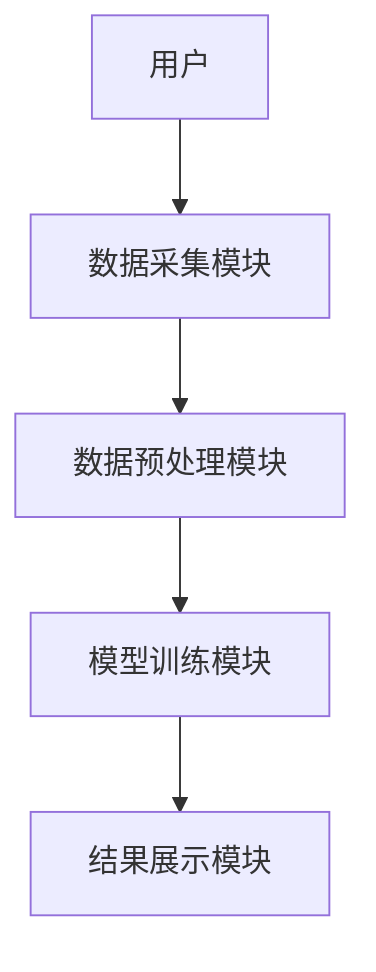
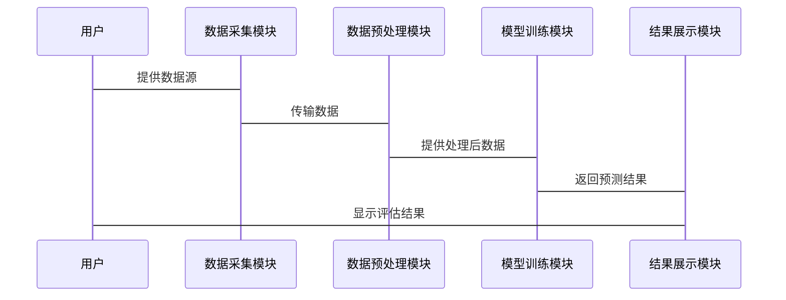

                 


# AI增强型公司治理风险评估工具

> **关键词**：AI技术、公司治理、风险评估、机器学习、自然语言处理、数据挖掘

> **摘要**：本文探讨了如何利用人工智能技术增强公司治理中的风险评估过程。通过分析AI技术的核心概念、算法原理、系统设计以及实际项目案例，本文详细阐述了AI在风险识别、预测和管理中的应用，旨在为企业提供一种高效、精准的风险评估工具。

---

## 第一部分：AI增强型公司治理风险评估工具的背景与基础

### 第1章：公司治理与风险评估概述

#### 1.1 公司治理的基本概念

- **1.1.1 公司治理的定义与核心要素**
  - 公司治理是指导和控制公司战略、运营和决策的系统。
  - 核心要素包括董事会结构、高管职责、股权结构、利益相关者关系等。

- **1.1.2 风险评估在公司治理中的重要性**
  - 风险评估是识别和管理可能影响公司目标实现的不确定性因素的过程。
  - 有效的风险评估有助于优化资源配置、降低损失、提升公司韧性。

- **1.1.3 传统风险评估方法的局限性**
  - 传统方法依赖人工分析，效率低，主观性强。
  - 难以处理大量非结构化数据，导致风险识别不全面。

#### 1.2 AI技术在公司治理中的应用前景

- **1.2.1 AI技术的基本概念与特点**
  - AI是一种模拟人类智能的技术，包括学习、推理、自我修正等功能。
  - 具有高效处理数据、发现隐藏模式、自适应优化的特点。

- **1.2.2 AI在风险评估中的优势与挑战**
  - **优势**：快速处理多源数据，发现潜在风险，提供实时监控。
  - **挑战**：数据隐私问题、模型可解释性、技术门槛高。

- **1.2.3 AI增强型风险评估工具的定义与目标**
  - 结合AI技术的风险评估工具，旨在提高评估效率和准确性。
  - 目标是帮助公司识别、预测和管理各类风险，优化决策过程。

#### 1.3 本书的核心目标与结构

- **1.3.1 本书的核心目标**
  - 探讨AI技术如何提升公司治理中的风险评估效率和准确性。
  - 提供理论知识和实践指导，帮助读者构建AI增强型风险评估工具。

- **1.3.2 本书的主要内容与结构**
  - 第一部分：背景与基础（本章）。
  - 第二部分：AI技术的核心概念与原理。
  - 第三部分：算法原理与系统设计。
  - 第四部分：项目实战与案例分析。
  - 第五部分：总结与展望。

- **1.3.3 本书的适用读者群体**
  - 公司治理领域的从业者、风险管理专家、IT技术人员。
  - 对AI技术感兴趣的学生和研究者。

---

## 第二部分：AI增强型风险评估的核心概念与原理

### 第2章：AI在公司治理风险评估中的核心概念

#### 2.1 风险评估的关键要素

- **2.1.1 风险来源与分类**
  - **风险来源**：市场风险、操作风险、信用风险、合规风险等。
  - **风险分类**：按影响范围分为系统性风险和非系统性风险。

- **2.1.2 风险评估的流程与方法**
  - **流程**：识别风险、量化风险、评估影响、制定应对策略。
  - **方法**：定性分析、定量分析、情景分析等。

- **2.1.3 风险评估的指标体系**
  - 风险概率、风险影响、风险评分等指标。

#### 2.2 AI技术在风险评估中的应用原理

- **2.2.1 机器学习在风险预测中的应用**
  - **监督学习**：用于分类任务，如预测违约风险。
  - **无监督学习**：用于聚类分析，发现潜在风险群体。

- **2.2.2 自然语言处理在风险文本分析中的应用**
  - 从公司报告、新闻中提取关键词，识别潜在风险信号。

- **2.2.3 数据挖掘在风险识别中的应用**
  - 发现数据中的异常模式，识别潜在风险因素。

#### 2.3 AI技术与传统方法的对比分析

- **2.3.1 数据处理能力**
  - AI能够处理结构化和非结构化数据，传统方法主要处理结构化数据。

- **2.3.2 分析效率**
  - AI分析速度快，传统方法效率较低。

- **2.3.3 模型复杂度**
  - AI模型复杂，但能够捕捉更多细节，传统方法简单直观。

---

## 第三部分：算法原理与系统设计

### 第3章：AI增强型风险评估工具的算法原理

#### 3.1 机器学习算法的选择与应用

- **3.1.1 监督学习算法**
  - **随机森林**：用于风险分类。
  - **逻辑回归**：用于风险预测。

- **3.1.2 无监督学习算法**
  - **K均值聚类**：用于风险分组。

#### 3.2 算法实现步骤

- **数据预处理**：清洗数据、处理缺失值、标准化。
- **特征选择**：提取关键特征，如财务指标、市场指标。
- **模型训练**：选择合适算法，调整参数。
- **风险预测**：基于模型预测风险等级。
- **结果解释**：分析模型输出，解释风险因素。

#### 3.3 算法原理的数学模型

- **随机森林算法**
  - 输入：训练数据集、测试数据集。
  - 输出：风险预测结果。
  - 内部原理：构建多棵决策树，投票决定最终结果。

#### 3.4 代码实现示例

```python
from sklearn.ensemble import RandomForestClassifier
from sklearn.metrics import accuracy_score

# 数据预处理
X = processed_data.drop('target', axis=1)
y = processed_data['target']

# 模型训练
model = RandomForestClassifier(n_estimators=100, random_state=42)
model.fit(X, y)

# 风险预测
predictions = model.predict(test_X)
print("准确率:", accuracy_score(test_y, predictions))
```

---

## 第四部分：系统分析与架构设计

### 第4章：AI增强型风险评估系统的架构设计

#### 4.1 系统功能设计

- **数据采集模块**：从数据库、API获取数据。
- **数据预处理模块**：清洗、转换数据。
- **模型训练模块**：训练AI模型，优化参数。
- **结果展示模块**：可视化风险评估结果。

#### 4.2 系统架构设计



#### 4.3 系统接口设计

- **数据接口**：与数据库或API交互。
- **用户接口**：提供友好的操作界面。
- **模型接口**：与其他系统集成。

#### 4.4 系统交互流程



---

## 第五部分：项目实战与案例分析

### 第5章：AI增强型风险评估工具的项目实战

#### 5.1 项目环境安装

- 安装Python、Jupyter Notebook、Pandas、Scikit-learn、NLTK。

#### 5.2 系统核心实现

- **数据预处理代码**
  ```python
  import pandas as pd
  data = pd.read_csv('风险数据.csv')
  data = data.dropna()
  ```

- **特征选择与模型训练**
  ```python
  from sklearn.ensemble import RandomForestClassifier
  features = data.drop('target', axis=1)
  target = data['target']
  model = RandomForestClassifier().fit(features, target)
  ```

- **风险预测与结果展示**
  ```python
  predictions = model.predict(test_features)
  print("预测结果:", predictions)
  ```

#### 5.3 实际案例分析

- **案例背景**：某公司面临市场风险和操作风险。
- **数据分析**：使用AI工具识别高风险部门和潜在风险点。
- **结果解读**：模型预测财务部门存在较高风险，建议加强内控制度。

#### 5.4 项目总结与优化

- **项目成功之处**：提高了风险识别效率，降低了潜在损失。
- **改进方向**：优化模型性能，增强结果的可解释性。

---

## 第六部分：总结与展望

### 第6章：AI增强型风险评估工具的总结与展望

#### 6.1 最佳实践 tips

- 确保数据质量，选择合适的AI模型。
- 定期更新模型，适应市场变化。

#### 6.2 小结

- AI技术显著提升了公司治理中的风险评估效率和准确性。
- 通过数据驱动的决策，帮助企业优化风险管理策略。

#### 6.3 注意事项

- 保护数据隐私，遵守相关法律法规。
- 注重模型的可解释性，避免“黑箱”操作。

#### 6.4 拓展阅读

- 推荐书籍：《机器学习实战》、《数据驱动的决策》。
- 推荐博客：技术博客、行业资讯网站。

---

## 附录

### 附录A：工具安装指南

- **Python安装**：访问Python官网下载安装包。
- **库安装**：使用pip命令安装所需库，如`pip install pandas`。

### 附录B：常用数据集介绍

- **公开数据集**：Kaggle平台、UCI机器学习仓库。
- **数据预处理**：处理缺失值、异常值，进行特征工程。

### 附录C：参考文献

- 列出本书中引用的所有文献和参考资料。

### 附录D：索引

- 按主题或关键词排列，方便读者查找相关内容。

---

通过以上详细的内容，您可以构建一个完整的AI增强型公司治理风险评估工具，帮助企业在复杂的商业环境中更好地识别和管理风险，确保持续稳健的发展。

