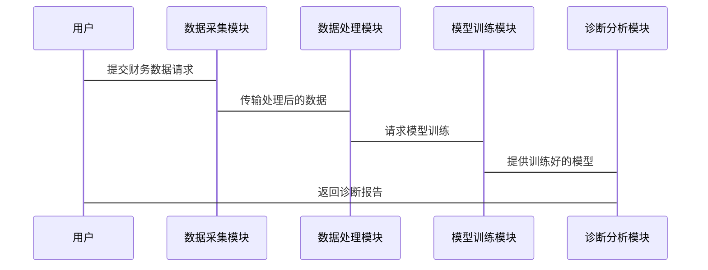

                 


# AI增强型公司财务健康诊断

## 关键词：人工智能、财务诊断、机器学习、数据处理、模型优化

## 摘要：本文探讨了如何利用人工智能技术增强公司财务健康诊断的效率和准确性。通过分析AI在财务诊断中的核心概念、算法原理、系统设计及实际应用，揭示了AI技术在财务领域中的巨大潜力，并提供了实践案例和最佳实践建议。

---

# 第三部分: 算法原理讲解

## 第4章: AI增强型财务诊断的核心算法

### 4.1 机器学习算法在财务诊断中的应用

#### 4.1.1 逻辑回归算法
##### 4.1.1.1 算法原理
$$ P(y=1|x) = \frac{e^{\beta_0 + \beta_1x}}{1 + e^{\beta_0 + \beta_1x}} $$
其中，$\beta_0$和$\beta_1$是模型参数，$x$是输入特征。

##### 4.1.1.2 算法实现

```python
from sklearn.linear_model import LogisticRegression

# 假设X_train和y_train是训练数据
model = LogisticRegression()
model.fit(X_train, y_train)
```

##### 4.1.1.3 案例分析
假设我们有财务数据，包括收入、利润、负债等特征，目标是预测公司是否健康。使用逻辑回归模型，输入特征矩阵$X$和标签$y$，训练后可以得到概率预测，并将其转化为二分类结果（健康或不健康）。

#### 4.1.2 随机森林算法
##### 4.1.2.1 算法原理
随机森林通过构建多个决策树并集成预测结果，具有较高的准确性和鲁棒性。

##### 4.1.2.2 算法实现

```python
from sklearn.ensemble import RandomForestClassifier

model = RandomForestClassifier(n_estimators=100)
model.fit(X_train, y_train)
```

#### 4.1.3 算法选择与优化
根据数据特征和业务需求选择合适的算法，并通过网格搜索进行调参优化。

---

## 第5章: 基于机器学习的财务健康诊断模型实现

### 5.1 数据预处理与特征工程

#### 5.1.1 数据清洗
处理缺失值、异常值和重复数据。

#### 5.1.2 特征提取与选择
使用主成分分析（PCA）或LASSO回归进行特征选择。

### 5.2 模型训练与评估

#### 5.2.1 训练过程

```python
# 训练逻辑回归模型
model = LogisticRegression()
model.fit(X_train, y_train)
```

#### 5.2.2 模型评估

```python
from sklearn.metrics import accuracy_score, precision_score, recall_score

y_pred = model.predict(X_test)
print(f"Accuracy: {accuracy_score(y_test, y_pred)}")
print(f"Precision: {precision_score(y_test, y_pred)}")
print(f"Recall: {recall_score(y_test, y_pred)}")
```

### 5.3 模型优化与部署

#### 5.3.1 超参数调优

```python
from sklearn.model_selection import GridSearchCV

param_grid = {'C': [0.1, 1, 10]}
grid_search = GridSearchCV(LogisticRegression(), param_grid)
grid_search.fit(X_train, y_train)
best_model = grid_search.best_estimator_
```

#### 5.3.2 模型部署与接口设计

```python
import joblib

joblib.dump(best_model, 'financial_health_model.pkl')
```

---

# 第四部分: 系统分析与架构设计

## 第6章: AI增强型财务诊断系统设计

### 6.1 需求分析

#### 6.1.1 业务需求
- 实时监控公司财务状况。
- 提供预测性诊断报告。

#### 6.1.2 技术需求
- 高效的数据处理能力。
- 可扩展的模型部署架构。

### 6.2 功能设计

#### 6.2.1 功能模块
- 数据采集模块：从ERP系统获取财务数据。
- 模型训练模块：定期训练和更新诊断模型。
- 诊断分析模块：生成诊断报告并提供改进建议。

### 6.3 系统架构设计


### 6.4 系统交互流程



---

## 第7章: 项目实战

### 7.1 环境安装与配置

```bash
pip install numpy pandas scikit-learn joblib
```

### 7.2 核心代码实现

#### 7.2.1 数据处理

```python
import pandas as pd

# 读取数据
df = pd.read_csv('financial_data.csv')

# 数据清洗
df.dropna(inplace=True)
```

#### 7.2.2 模型实现

```python
from sklearn.model_selection import train_test_split
from sklearn.metrics import classification_report

# 划分数据集
X_train, X_test, y_train, y_test = train_test_split(df.drop('health', axis=1), df['health'], test_size=0.2)

# 训练模型
model = LogisticRegression()
model.fit(X_train, y_train)

# 评估模型
print(classification_report(y_test, model.predict(X_test)))
```

### 7.3 案例分析与结果解读

假设我们有一个公司的财务数据，模型预测其财务状况为“不健康”。我们需要进一步分析原因，可能是负债率过高或收入下降。根据模型输出的概率，我们可以优先处理高负债问题。

---

## 第五部分: 最佳实践与总结

## 第8章: 最佳实践与总结

### 8.1 实践经验总结

- 数据质量至关重要。
- 模型需要定期更新。
- 结合业务知识优化特征。

### 8.2 小结

AI技术为公司财务健康诊断提供了新的思路，通过高效的数据处理和智能模型，显著提高了诊断效率和准确性。

### 8.3 注意事项

- 确保数据隐私和合规性。
- 定期监控模型性能。
- 结合多模型结果进行综合判断。

### 8.4 拓展阅读

- 《机器学习实战》
- 《深入浅出Python机器学习》

---

## 结语

AI增强型公司财务健康诊断不仅提升了诊断效率，还为企业提供了数据驱动的决策支持。随着技术的不断进步，未来将有更多创新应用，助力企业财务管理迈上新台阶。

